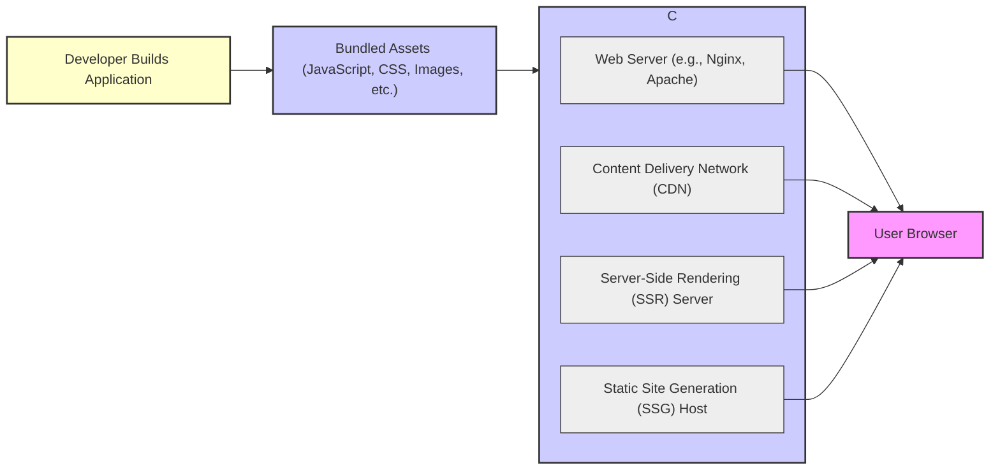

# Project Design Document: Ant Design UI Library

**Version:** 1.1
**Date:** October 26, 2023
**Author:** AI Architecture Expert

## 1. Introduction

This document provides an enhanced and more detailed design overview of the Ant Design UI library (available at [https://github.com/ant-design/ant-design](https://github.com/ant-design/ant-design)). This revised document aims to provide a stronger foundation for subsequent threat modeling activities by offering a deeper understanding of the system's architecture, key components, data flow, and interactions.

## 2. Project Overview

Ant Design is a widely adopted and mature React UI library that offers a comprehensive suite of meticulously crafted, customizable components for building enterprise-grade user interfaces. It emphasizes a consistent and aesthetically pleasing design language, significantly boosting developer efficiency and ensuring a cohesive user experience across applications.

## 3. Goals and Objectives

* Deliver a comprehensive and well-documented library of UI components adhering to a consistent design system and principles.
* Significantly enhance developer productivity by providing readily available, reusable, and thoroughly tested components, reducing development time and effort.
* Guarantee robust accessibility (WCAG compliance) and comprehensive internationalization (i18n) support to cater to a global and diverse user base.
* Maintain high performance and responsiveness across all components, ensuring a smooth and efficient user experience even under heavy load.
* Offer flexible and extensive theming capabilities, allowing for deep customization and seamless integration with various branding requirements.
* Foster a vibrant and active community, encouraging contributions and ensuring the library's continued evolution and improvement.

## 4. Target Audience

* Front-end developers specializing in building web applications using the React JavaScript library.
* UI/UX designers collaborating closely with development teams to create intuitive and visually appealing user interfaces.
* Product managers and other stakeholders involved in the software development lifecycle who need to understand the technical underpinnings of the user interface.
* Quality assurance engineers responsible for testing and validating the functionality and usability of applications built with Ant Design.

## 5. System Architecture

Ant Design operates primarily as a client-side library, seamlessly integrated into a web application's front-end. Its components are rendered directly within the user's web browser, leveraging React's virtual DOM for efficient updates.

```mermaid
graph LR
    subgraph "User Browser Environment"
        direction LR
        A["User Initiates Interaction (e.g., 'Mouse Click', 'Key Press')"] --> B("Ant Design Component Instance (Rendered in DOM)");
        B --> C("React Virtual DOM (State Management & Reconciliation)");
        C --> D("Browser DOM (Actual UI Rendering)");
        D --> A;
    end

    subgraph "Developer's Local Environment"
        direction LR
        E["Developer's React Codebase"] --> F("Imports Ant Design Components (e.g., 'import { Button } from 'antd';')");
        F --> G("Module Bundler (e.g., 'Webpack', 'Vite')");
        G --> H["Bundled JavaScript & CSS Assets (Delivered to Browser)"];
    end

    H --> A;

    style A fill:#f9f,stroke:#333,stroke-width:2px, title: 'User Actions'
    style B fill:#ccf,stroke:#333,stroke-width:2px, title: 'Interactive UI Element'
    style C fill:#ccf,stroke:#333,stroke-width:2px, title: 'Efficient Updates'
    style D fill:#ccf,stroke:#333,stroke-width:2px, title: 'Visible Interface'
    style E fill:#ffc,stroke:#333,stroke-width:2px, title: 'Application Logic'
    style F fill:#ffc,stroke:#333,stroke-width:2px, title: 'Library Integration'
    style G fill:#ffc,stroke:#333,stroke-width:2px, title: 'Optimization & Packaging'
    style H fill:#ffc,stroke:#333,stroke-width:2px, title: 'Client-Side Resources'
```

**Detailed Explanation of the Architecture:**

* **User Browser Environment:** Represents the user's web browser where the application and Ant Design components are rendered and interacted with.
    * **User Initiates Interaction:**  Any action taken by the user, such as clicking a button or typing in an input field.
    * **Ant Design Component Instance:** The specific UI element from the Ant Design library that is rendered in the browser's DOM. These components encapsulate their own logic and styling.
    * **React Virtual DOM:** React's core mechanism for efficiently updating the user interface. It maintains a virtual representation of the DOM and reconciles changes before updating the actual browser DOM.
    * **Browser DOM:** The actual Document Object Model that the browser uses to render the web page.
* **Developer's Local Environment:**  Represents the developer's workspace where the application code is written and built.
    * **Developer's React Codebase:** The source code of the web application, written using React.
    * **Imports Ant Design Components:** Developers explicitly import and utilize specific components from the Ant Design library within their React code.
    * **Module Bundler:** Tools like Webpack or Vite are used to bundle the developer's code, including the imported Ant Design components and their associated CSS and other assets, into optimized files for deployment.
    * **Bundled JavaScript & CSS Assets:** The final, optimized JavaScript and CSS files that are served to the user's browser. These files contain the necessary code for rendering and styling the Ant Design components.

## 6. Key Components

Ant Design offers a comprehensive and diverse set of UI components, categorized by their function and purpose:

* **General Components:** Fundamental building blocks for UI elements.
    * "Button": Interactive elements for triggering actions.
    * "Icon":  A library of vector icons for visual representation.
    * "Typography": Components for displaying and styling text content (e.g., headings, paragraphs).
* **Layout Components:**  Assist in structuring the overall page layout.
    * "Grid": A responsive grid system for arranging content.
    * "Layout": Components like "Sider", "Header", "Content", and "Footer" to define the main sections of a page.
    * "Space":  Provides consistent spacing between elements.
* **Navigation Components:** Facilitate user navigation within the application.
    * "Affix":  Allows elements to remain fixed to the viewport.
    * "Breadcrumb":  Displays the user's current location within the application hierarchy.
    * "Dropdown":  Presents a list of options when triggered.
    * "Menu":  Displays navigation options, often hierarchical.
    * "Pagination":  Allows users to navigate through large datasets.
    * "Steps":  Guides users through a multi-step process.
* **Data Entry Components:**  Enable users to input and manipulate data.
    * "AutoComplete":  Suggests options as the user types.
    * "Cascader":  Allows users to select values from a hierarchical list.
    * "Checkbox":  Allows users to select one or more options.
    * "DatePicker":  Enables users to select dates and times.
    * "Form":  Provides a structured way to collect user input with validation.
    * "Input":  Basic text input fields.
    * "InputNumber":  Input fields specifically for numeric values.
    * "Mentions":  Allows users to tag or mention other users or entities.
    * "Radio":  Allows users to select a single option from a list.
    * "Rate":  Allows users to provide a rating.
    * "Select":  Presents a dropdown list of options for selection.
    * "Slider":  Allows users to select a value within a range.
    * "Switch":  A toggle control for on/off states.
    * "TimePicker":  Enables users to select a specific time.
    * "Transfer":  Allows users to move items between two lists.
    * "TreeSelect":  Allows users to select values from a tree structure.
    * "Upload":  Enables users to upload files.
* **Data Display Components:**  Present information to the user in various formats.
    * "Avatar":  Displays user profile pictures or icons.
    * "Badge":  Displays status or notification indicators.
    * "Calendar":  Displays a calendar for date selection.
    * "Card":  A container for displaying related information.
    * "Carousel":  Displays a rotating set of content.
    * "Collapse":  Allows users to expand and collapse sections of content.
    * "Comment":  Displays user comments or feedback.
    * "Descriptions":  Presents data in a key-value format.
    * "Empty":  Displays a placeholder when no data is available.
    * "Image":  Displays images.
    * "List":  Displays a scrollable list of items.
    * "Popover":  Displays a small overlay when an element is hovered over or clicked.
    * "Statistic":  Displays numerical data in an engaging way.
    * "Table":  Displays data in a tabular format.
    * "Tabs":  Allows users to switch between different views or sections.
    * "Tag":  Displays labels or categories.
    * "Timeline":  Displays events in chronological order.
    * "Tooltip":  Displays helpful information on hover.
    * "Tree":  Displays data in a hierarchical tree structure.
* **Feedback Components:**  Provide users with feedback and notifications.
    * "Alert":  Displays important status messages.
    * "Drawer":  Slides in from the side of the screen to display additional content.
    * "Message":  Displays non-blocking, temporary notifications.
    * "Modal":  Displays a dialog box that requires user interaction.
    * "Notification":  Displays asynchronous notifications.
    * "Popconfirm":  Displays a confirmation dialog when an action is triggered.
    * "Progress":  Indicates the progress of a task.
    * "Result":  Displays the outcome of an operation (success, error, etc.).
    * "Skeleton":  Displays a placeholder while content is loading.
    * "Spin":  Displays a loading indicator.
* **Utility Components:** Components that provide configuration or utility functions.
    * "Divider":  Visually separates content.
    * "ConfigProvider":  Allows for global configuration of Ant Design components, including theming and internationalization settings.

## 7. Data Flow

The typical data flow within an application utilizing Ant Design components involves the following sequence of events:

1. **User Interaction:** A user interacts with an Ant Design component in the browser (e.g., entering text in an `<Input>`, selecting an option in a `<Select>`, clicking a `<Button>`).
2. **Browser Event Trigger:** The browser generates a corresponding DOM event based on the user interaction (e.g., `input`, `change`, `click`).
3. **React Event Handling:** React's synthetic event system intercepts the browser event.
4. **Ant Design Component Event Handler:** The specific Ant Design component has its own internal event handlers that are triggered by the React event system. These handlers manage the component's internal state and logic.
5. **Callback Function Execution (Optional):** If the developer has provided a callback function (e.g., via the `onChange` prop for an `<Input>` or the `onClick` prop for a `<Button>`), this function is executed.
6. **Application State Management:** Within the callback function (or directly within the component's logic for internal state changes), the application's state is updated. This might involve using React's `useState` hook, a state management library like Redux or Zustand, or other state management mechanisms.
7. **React Re-rendering:** When the application's state changes, React triggers a re-rendering process for the affected components, including the Ant Design component.
8. **Virtual DOM Update:** React updates its virtual DOM representation to reflect the changes in state.
9. **DOM Reconciliation and Update:** React compares the new virtual DOM with the previous one and efficiently updates the actual browser DOM with only the necessary changes.
10. **Visual Feedback:** The user observes the updated UI in the browser, reflecting the changes caused by their interaction.

```mermaid
graph LR
    A["User Interaction with Ant Design Component"] --> B["Browser Event (e.g., 'click', 'change')"];
    B --> C["React Event System"];
    C --> D["Ant Design Component's Internal Event Handler"];
    D --> E{"Developer-Provided Callback Function?"};
    E -- Yes --> F["Execute Callback Function"];
    E -- No --> G["Component State Update (Internal)"];
    F --> H["Application State Update"];
    G --> H;
    H --> I["React Re-rendering"];
    I --> J["Virtual DOM Update"];
    J --> K["Browser DOM Reconciliation & Update"];
    K --> L["User Observes Updated UI"];

    style A fill:#f9f,stroke:#333,stroke-width:2px, title: 'User Input'
    style B fill:#ccf,stroke:#333,stroke-width:2px, title: 'Browser's Reaction'
    style C fill:#ccf,stroke:#333,stroke-width:2px, title: 'React's Interception'
    style D fill:#ccf,stroke:#333,stroke-width:2px, title: 'Component Logic'
    style E fill:#ccf,stroke:#333,stroke-width:2px, title: 'Custom Logic?'
    style F fill:#ffc,stroke:#333,stroke-width:2px, title: 'Application-Specific Code'
    style G fill:#ccf,stroke:#333,stroke-width:2px, title: 'Internal Changes'
    style H fill:#ffc,stroke:#333,stroke-width:2px, title: 'Centralized Data'
    style I fill:#ccf,stroke:#333,stroke-width:2px, title: 'React's Update Cycle'
    style J fill:#ccf,stroke:#333,stroke-width:2px, title: 'Efficient Comparison'
    style K fill:#ccf,stroke:#333,stroke-width:2px, title: 'Minimal Changes'
    style L fill:#f9f,stroke:#333,stroke-width:2px, title: 'Updated Interface'
```



## 8. Security Considerations (For Threat Modeling)

When considering the security of applications using Ant Design, the following points are crucial for threat modeling:

* **Cross-Site Scripting (XSS) Vulnerabilities:**
    * **Input Handling:** If developers use Ant Design components (especially data entry components like `<Input>`, `<TextArea>`) to render user-provided data without proper sanitization (e.g., escaping HTML), it can lead to XSS attacks. Malicious scripts injected by attackers can then be executed in other users' browsers.
    * **Component Configuration:**  Care must be taken when dynamically setting component properties based on user input or external data, as this could potentially introduce XSS if not handled correctly.
* **Dependency Vulnerabilities:**
    * **Third-Party Libraries:** Ant Design relies on other JavaScript libraries (its dependencies). Vulnerabilities discovered in these dependencies could potentially be exploited in applications using Ant Design. Regularly updating dependencies is crucial. Tools like `npm audit` or `yarn audit` should be used to identify and address known vulnerabilities.
* **Accessibility and Security Trade-offs:**
    * **ARIA Attributes:** While ARIA attributes enhance accessibility, incorrect usage or manipulation of these attributes could potentially expose information or create unintended interactions that could be exploited.
* **Data Handling in Components:**
    * **Sensitive Data Exposure:** Components that handle sensitive data (e.g., `<Form>`, `<Input>` for passwords or personal information) require careful handling by developers to prevent accidental exposure (e.g., logging sensitive data on the client-side, storing it insecurely in the browser's local storage).
    * **Client-Side Validation:** Relying solely on client-side validation provided by Ant Design components is insufficient. Server-side validation is essential to ensure data integrity and prevent malicious input.
* **Supply Chain Security:**
    * **Package Integrity:**  The integrity of the Ant Design package itself is paramount. Developers should ensure they are using official and verified packages from trusted sources (e.g., npm registry). Using package lock files (`package-lock.json` or `yarn.lock`) helps ensure consistent dependency versions and reduces the risk of malicious package substitutions.
* **Client-Side Logic Manipulation:**
    * **Component Logic Override:** While less common, sophisticated attackers might attempt to manipulate the client-side logic of Ant Design components if the application code is not properly secured or obfuscated.
* **Server-Side Rendering (SSR) Considerations:**
    * **Hydration Issues:** When using SSR with Ant Design, potential hydration issues (mismatches between the server-rendered HTML and the client-side rendered DOM) could lead to unexpected behavior or security vulnerabilities if not handled correctly.

## 9. Technologies Used

* **React:** The foundational JavaScript library for building the UI components.
* **JavaScript/TypeScript:** The primary programming languages used for developing the library.
* **CSS-in-JS (e.g., Emotion, Styled Components):**  While Ant Design primarily uses Less, understanding CSS-in-JS concepts is relevant for customization and integration.
* **Less:**  The CSS pre-processor used for styling the components.
* **Webpack/Rollup/Parcel/Vite:** Module bundlers used for packaging the library for distribution.
* **Jest/Enzyme/React Testing Library/Playwright:** Frameworks and libraries used for testing the functionality and behavior of the components.
* **Git:** The version control system used for managing the project's codebase (as indicated by the GitHub repository).
* **npm/Yarn/pnpm:** Package managers used for managing dependencies.

## 10. Deployment

Ant Design components are deployed as an integral part of the front-end application. The bundled JavaScript and CSS assets, which include the Ant Design library code, are typically served to users' browsers via various methods:

* **Directly from a Web Server:** The bundled assets are hosted on a traditional web server (e.g., Nginx, Apache) and served directly to the client's browser upon request.
* **Content Delivery Network (CDN):** The bundled assets are hosted on a CDN, which provides geographically distributed servers for faster content delivery to users worldwide. This is a common approach for static assets like JavaScript and CSS.
* **Server-Side Rendering (SSR):** In SSR setups, the React components (including Ant Design components) are rendered on the server, and the initial HTML is sent to the client. The client-side JavaScript then "hydrates" the HTML to make it interactive. This approach can improve initial load times and SEO.
* **Static Site Generation (SSG):** Similar to SSR, but the HTML is generated at build time rather than on each request. Ant Design components can be used within statically generated sites.
* **Integration with Backend Frameworks:** Front-end applications built with Ant Design are often integrated with backend frameworks (e.g., Node.js with Express, Python with Django/Flask, Ruby on Rails) that handle API requests and data management.



## 11. Future Considerations

* **Enhancements to Theming and Customization:** Providing even more granular control over component styling and the ability to create custom design tokens.
* **Improved Performance and Optimization:** Continuously working on optimizing component rendering and reducing bundle sizes.
* **Further Accessibility Improvements:** Staying up-to-date with the latest accessibility standards and implementing new features to enhance inclusivity.
* **Exploration of Web Components:** Investigating the potential of leveraging web components for greater interoperability with other frameworks.
* **Enhanced Internationalization (i18n) Capabilities:**  Adding more advanced features for handling complex localization scenarios.
* **New Component Development:**  Expanding the library with new components to address evolving UI patterns and user needs.
* **Better Integration with Design Tools:**  Improving workflows for designers and developers through better integration with design tools like Figma.
* **Continued Community Engagement:** Fostering a strong and active community to contribute to the library's growth and address user needs.

This revised document provides a more in-depth and comprehensive design overview of the Ant Design UI library. It aims to be a valuable and informative resource for understanding the system's architecture, components, and potential security considerations, making it a solid foundation for conducting thorough threat modeling activities.