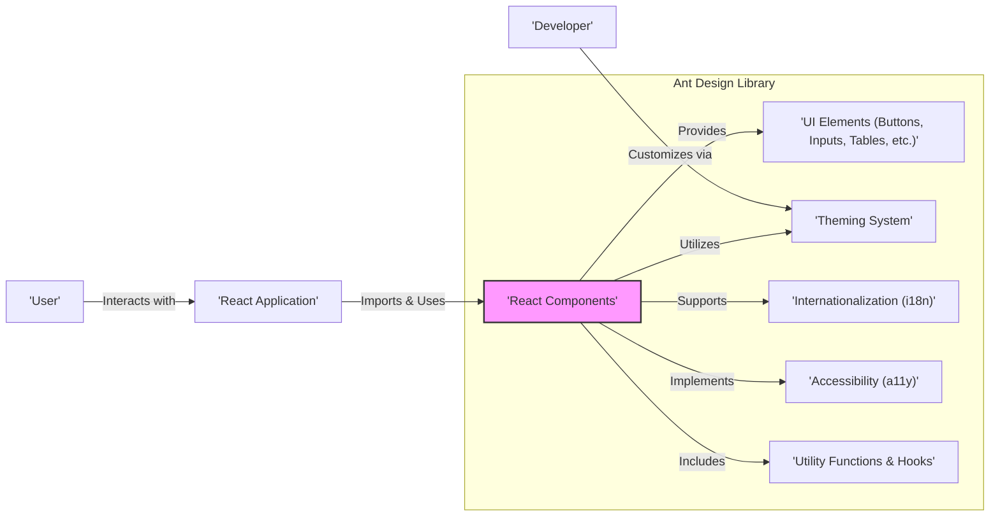
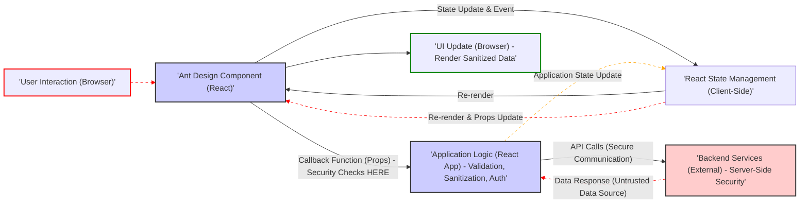

# Improved Project Design Document: Ant Design UI Library for Threat Modeling

## 1. Project Overview

*   **Project Name:** Ant Design
*   **Project Repository:** [https://github.com/ant-design/ant-design](https://github.com/ant-design/ant-design)
*   **Project Description:** Ant Design is a React UI library providing a comprehensive suite of UI components and design guidelines for building enterprise-grade web applications. It prioritizes user experience, accessibility, and internationalization. Ant Design aims to accelerate development by offering ready-to-use, customizable, and well-documented UI building blocks. It is an actively maintained open-source project with a large and supportive community.
*   **Purpose of this Document:** This document details the design of the Ant Design library to facilitate thorough threat modeling. It presents a high-level architectural overview, key component descriptions, data flow analysis, and technology stack details, specifically focusing on aspects relevant to security. This document will serve as the foundation for identifying potential threats and vulnerabilities inherent in the Ant Design library and in applications that integrate it. The goal is to enable proactive security measures during development and deployment.

## 2. Architecture Overview

Ant Design is built upon React's component-based architecture and is primarily a front-end library focused on UI presentation and user interaction within web applications. Its core architectural elements are:

*   **Component Library:** The central element is a rich library of React components, ranging from basic UI elements (buttons, inputs) to complex layouts and data visualization components (tables, forms, charts).
*   **Theming System:** A flexible theming system allows extensive customization of the visual appearance of components, including color schemes, typography, and component-specific styles, enabling brand alignment and visual consistency.
*   **Internationalization (i18n) Support:** Built-in internationalization capabilities enable developers to easily adapt applications for diverse languages and regional settings, enhancing global reach and user experience.
*   **Accessibility (a11y) Compliance:** Accessibility is a core design principle, ensuring components are built to meet accessibility standards, promoting inclusivity and usability for users with disabilities.
*   **Utility Functions and React Hooks:**  Beyond UI components, Ant Design provides a collection of utility functions and React Hooks to simplify common UI development tasks, promoting code reusability and efficiency.
*   **Comprehensive Documentation and Examples:** Extensive documentation, including API references, usage guides, and practical examples, is provided to facilitate effective library adoption and usage by developers.

## 3. Component Breakdown (Security Relevant Aspects)

Ant Design components handle user interactions and data presentation. From a security perspective, the following component categories are particularly relevant for threat modeling:

*   **Form Components (e.g., `Input`, `Select`, `Checkbox`, `Form`, `DatePicker`):**
    *   **Description:** Used for collecting user input, forming the interface for data submission and user interaction.
    *   **Security Relevance:** These are direct entry points for user-supplied data, making them critical for security. Vulnerabilities can arise from:
        *   **Client-side Validation Bypass:**  Attackers can bypass client-side validation (even if provided by Ant Design's Form component) by manipulating browser requests directly. Applications MUST implement server-side validation.
        *   **Injection Attacks (XSS, Command Injection, SQL Injection - Indirect):** Improper handling of user input can lead to XSS if input is rendered without sanitization. While Ant Design itself doesn't directly cause SQL or Command Injection, vulnerabilities in backend systems can be triggered if unsanitized input from Ant Design forms is passed to backend queries or commands.
        *   **Example XSS Scenario:** An attacker could input `` into an `Input` field. If the application then renders this input directly onto the page without sanitization, the script will execute.
        *   **Data Leakage through Form Fields and Error Messages:** Sensitive information should not be exposed in form field placeholders, default values, or error messages. Verbose error messages can sometimes reveal information useful to attackers.
        *   **Recommendations:**
            *   Always implement robust server-side validation for all form inputs.
            *   Sanitize and encode user input before rendering it in the UI to prevent XSS. Use appropriate escaping functions provided by your framework or libraries.
            *   Avoid displaying sensitive information in form field hints or error messages.
            *   Consider using Content Security Policy (CSP) to mitigate XSS risks.

*   **Data Display Components (e.g., `Table`, `List`, `Card`, `Descriptions`, `Tree`):**
    *   **Description:** Used to present data to users in various formats.
    *   **Security Relevance:** If the data source for these components is untrusted or user-controlled, they become potential vectors for XSS.
        *   **XSS through Rendered Data:** If applications render unsanitized user-provided data within these components, especially in columns of tables or list items, malicious scripts can be injected and executed in the user's browser.
        *   **Example XSS Scenario:** If a `Table` component displays data from an API response that includes user-generated content, and this content is not sanitized, an attacker could inject malicious JavaScript into the data, which would then be executed when the table is rendered.
        *   **Data Exposure:** Ensure that sensitive data is not inadvertently displayed to unauthorized users through these components. Implement proper authorization checks before displaying data.
        *   **Recommendations:**
            *   Sanitize and encode all data before rendering it in data display components, especially if the data originates from untrusted sources or user input.
            *   Implement proper authorization and access control to ensure sensitive data is only displayed to authorized users.
            *   Use templating engines or UI frameworks that provide automatic escaping of output by default.

*   **Modal and Drawer Components (e.g., `Modal`, `Drawer`):**
    *   **Description:** Used to display content in overlays or side panels, often dynamically loaded or generated.
    *   **Security Relevance:** Dynamically displayed content in modals and drawers requires careful security consideration, as the content source might be vulnerable.
        *   **Injection through Dynamic Content:** If the content displayed in modals or drawers is dynamically fetched from external sources or generated from user input without sanitization, it can lead to XSS vulnerabilities.
        *   **Example XSS Scenario:** If a modal displays content fetched from an API endpoint that returns user-generated HTML, and this HTML is directly injected into the modal without sanitization, XSS is possible.
        *   **Clickjacking Potential (Indirect):** While less directly a component vulnerability, applications using modals and drawers should be aware of potential clickjacking risks if they are not implemented correctly within the application's security context. Ensure modals are properly positioned and layered to prevent clickjacking attacks that might trick users into unintended actions.
        *   **Recommendations:**
            *   Sanitize and validate any dynamic content loaded into modals and drawers, especially if it originates from external sources or user input.
            *   Implement appropriate frame busting or frame options (like `X-Frame-Options` header or CSP `frame-ancestors` directive) to mitigate clickjacking risks for applications using modals and drawers.

*   **Menu and Navigation Components (e.g., `Menu`, `Dropdown`, `Breadcrumb`, `Pagination`):**
    *   **Description:** Used for application navigation and user flow control.
    *   **Security Relevance:** While generally less directly vulnerable, improper use can lead to security issues in application navigation and authorization logic.
        *   **Authorization Bypass through URL Manipulation:** Applications MUST NOT rely solely on client-side menu structures for authorization. Attackers can bypass client-side menu restrictions by directly manipulating URLs. Server-side route protection and authorization checks are essential.
        *   **Information Disclosure through Menu Structure:**  Carefully consider what information is exposed in menus and navigation elements. Avoid revealing sensitive information or administrative functionalities in menus accessible to unauthorized users.
        *   **Recommendations:**
            *   Implement robust server-side authorization and route protection. Do not rely on client-side menu structures for security.
            *   Carefully design menu structures to avoid information disclosure. Only display menu items and navigation options appropriate for the user's roles and permissions.
            *   Regularly review and audit menu structures and navigation logic for potential security misconfigurations.

*   **ConfigProvider:**
    *   **Description:**  A component for globally configuring Ant Design components (locale, theme, direction, etc.).
    *   **Security Relevance:**  While primarily for configuration, incorrect configuration could have indirect security implications.
        *   **Misconfiguration Leading to Unexpected Behavior:**  Incorrect configuration, although unlikely to be a direct vulnerability in Ant Design itself, could lead to unexpected application behavior that might have security consequences. For example, misconfiguring locale settings might indirectly affect input validation in some edge cases (though less likely in modern browsers).
        *   **Recommendations:**
            *   Review and understand all configuration options provided by `ConfigProvider`.
            *   Ensure configurations are set appropriately for the intended environment and security context.
            *   Test application behavior with different configurations to identify any unexpected or potentially insecure outcomes.

## 4. Data Flow (Detailed Security Perspective)

Data flow within Ant Design components is primarily client-side within the React application. Ant Design itself does not handle backend data persistence or server-side logic. The data flow, with a focus on security implications, is as follows:

1.  **User Interaction (Potential Threat Source):** User interaction with Ant Design components (e.g., inputting data, clicking buttons) is the initial point where potentially malicious data can enter the system.
2.  **Ant Design Component (Client-Side Handling):** The component handles the interaction, updating its internal state or triggering event handlers. **Security Note:** Ant Design components themselves provide basic client-side validation or formatting, but these are NOT security measures and can be bypassed.
3.  **React State Management (Client-Side):** React manages component state changes and triggers re-renders. **Security Note:** Client-side state management is inherently insecure for sensitive data or critical logic. Do not store sensitive information solely in client-side state.
4.  **Application Logic Execution (Developer Responsibility - Crucial Security Point):** Callback functions (passed as props to Ant Design components) execute application-specific logic. **This is where security measures MUST be implemented.** This includes:
    *   **Input Validation:** Validate user input received from Ant Design components on the client-side (for user experience) AND, critically, on the server-side.
    *   **Sanitization and Encoding:** Sanitize and encode user input before rendering it in the UI to prevent XSS.
    *   **Authorization Checks:** Implement authorization checks to control access to data and functionalities based on user roles and permissions.
    *   **API Calls:** Make API calls to backend services to process data, retrieve information, and perform server-side operations.
5.  **Backend Services (External Security Perimeter):** Backend services process data, interact with databases, and enforce server-side security policies. **Security Note:** The security of backend services is paramount. Secure coding practices, input validation, output encoding, and robust authentication and authorization mechanisms are essential in the backend.
6.  **Data Response (Potential Threat Source - Untrusted Data):** Data received from backend services can be untrusted and potentially malicious.
7.  **Application State Update (Client-Side):** Application state is updated based on backend responses.
8.  **React Re-render & UI Update (Client-Side Rendering):** React re-renders Ant Design components based on updated state, displaying data in the user's browser. **Security Note:** Ensure data rendered in Ant Design components is properly sanitized and encoded to prevent XSS, especially data originating from backend responses or untrusted sources.

**Key Data Flow Points for Security:**

*   **User Input is Untrusted:** Treat all user input received through Ant Design components as potentially malicious and untrusted.
*   **Client-Side is Insecure:** Client-side logic and validation are for user experience only and are not security measures. Security MUST be enforced server-side.
*   **Application Logic is the Security Gateway:** The application logic (code within the React application that uses Ant Design) is the crucial point for implementing security measures: input validation, sanitization, encoding, and authorization.
*   **Backend Security is Essential:** The security of backend services is paramount. Ant Design relies on secure backend systems for data integrity and application security.
*   **Data from Backend can be Untrusted (Indirectly):** Data received from backend services, especially if it originates from user-generated content or external sources, should also be treated with caution and sanitized before rendering in the UI to prevent XSS.

## 5. Technology Stack

*   **Core Library:**
    *   **React:**  Fundamental JavaScript library for building user interfaces, providing the component model and rendering engine.
    *   **JavaScript/TypeScript:** Primarily developed in TypeScript for enhanced code maintainability and type safety, compiled to JavaScript for browser compatibility.
    *   **CSS/Less/Styled-components:** Styling is achieved using CSS, with Less preprocessor used internally for maintainability. Developers can customize styles using CSS-in-JS solutions like styled-components or traditional CSS preprocessors.
*   **Development and Build Tools:**
    *   **Node.js and npm/yarn:**  Node.js runtime environment and npm/yarn package managers for dependency management and build scripting.
    *   **Webpack/Rollup:** Module bundlers used to package the library and applications using it for efficient browser delivery.
    *   **Babel:** JavaScript compiler for ensuring cross-browser compatibility by transpiling modern JavaScript features to older standards.
    *   **Jest/Testing Library:**  Testing frameworks for unit and integration testing, ensuring component functionality and code quality.
    *   **Git:** Distributed version control system (GitHub repository) for collaborative development and code management.
*   **Documentation:**
    *   **Markdown:** Lightweight markup language used for writing documentation files in a readable and structured format.
    *   **dumi:** Documentation site generator specifically designed for React component libraries, used to create Ant Design's documentation website.

## 6. Deployment Model

Ant Design is a client-side UI library integrated into React web applications. Deployment involves:

1.  **Installation as Dependency:** Developers install Ant Design into their React project using npm or yarn, adding it to the project's dependencies.
2.  **Component Import and Usage:** Components from Ant Design are imported and utilized within the React application's components, composing the UI structure.
3.  **Application Build Process:** During the application's build process (using tools like Webpack, Create React App, or similar), Ant Design's code is bundled together with the application's code and assets into static files (JavaScript, CSS, HTML).
4.  **Deployment to Web Server/CDN:** The bundled static assets are deployed to a web server (e.g., Nginx, Apache, cloud platforms like AWS S3, Google Cloud Storage) or a Content Delivery Network (CDN) for efficient content delivery.
5.  **Client-Side Execution in Browser:** When a user accesses the web application, their browser downloads and executes the JavaScript code, including Ant Design components, rendering the user interface within the browser.

**Deployment Context for Security:**

*   **Client-Side Execution Environment:** Ant Design operates entirely within the user's browser, making client-side security considerations paramount. Applications must be designed to be secure in a potentially hostile client-side environment.
*   **Dependency Chain Security:** The security of Ant Design is also dependent on the security of its dependencies (React, other libraries). Regularly updating Ant Design and its dependencies is crucial to address potential vulnerabilities in the dependency chain.
*   **Application Security Responsibility:** The security of applications using Ant Design is ultimately the responsibility of the application developers. Ant Design provides UI components, but secure application development practices, input validation, output encoding, authorization, and other security measures are the application developer's responsibility. Ant Design cannot enforce application-level security.

## 7. Security Considerations for Threat Modeling (STRIDE Focused)

This section outlines security considerations for threat modeling Ant Design and applications using it, implicitly structured around the STRIDE model:

*   **Spoofing (Identity Misrepresentation):**
    *   **Consideration:**  While Ant Design itself doesn't directly handle authentication, applications using it must implement secure authentication mechanisms. Spoofing threats are relevant at the application level, not directly within Ant Design.
    *   **Example Threat:** An attacker could attempt to impersonate a legitimate user to gain unauthorized access to application functionalities exposed through Ant Design UI.
    *   **Mitigation:** Implement robust server-side authentication and session management in the application using Ant Design.

*   **Tampering (Data Modification):**
    *   **Consideration:** Client-side tampering is always possible. Applications must not rely on client-side controls for security. Data integrity must be enforced server-side.
    *   **Example Threat:** An attacker could tamper with client-side JavaScript code or browser requests to bypass client-side validation or manipulate data submitted through Ant Design forms.
    *   **Mitigation:** Implement server-side validation and data integrity checks. Never trust data received from the client. Use secure communication channels (HTTPS) to protect data in transit.

*   **Repudiation (Action Denial):**
    *   **Consideration:**  Ant Design doesn't directly handle audit logging or non-repudiation. Applications requiring audit trails must implement logging mechanisms at the application and backend levels.
    *   **Example Threat:** A user might perform a malicious action through the Ant Design UI and then deny having done so if there is no proper audit logging.
    *   **Mitigation:** Implement comprehensive audit logging at the application and backend levels to track user actions performed through the Ant Design UI.

*   **Information Disclosure (Data Breach):**
    *   **Consideration:** XSS vulnerabilities are the primary information disclosure threat related to Ant Design usage. Improper handling of user input and data rendering can lead to XSS.
    *   **Example Threat:** XSS vulnerabilities in Ant Design components or applications using them could allow attackers to steal user session cookies, access sensitive data displayed in the UI, or redirect users to malicious websites.
    *   **Mitigation:**  Strictly sanitize and encode all user input and data rendered in Ant Design components. Implement Content Security Policy (CSP) to further mitigate XSS risks. Avoid displaying sensitive information unnecessarily in the UI. Implement proper authorization to control data access.

*   **Denial of Service (Service Disruption):**
    *   **Consideration:**  Client-side DoS attacks are possible, but less likely to originate directly from Ant Design itself. Application-level vulnerabilities or resource exhaustion could be exploited.
    *   **Example Threat:** An attacker might attempt to overload the client-side application with excessive requests or malicious input through Ant Design forms, causing performance degradation or application crashes.
    *   **Mitigation:** Implement rate limiting and input validation to prevent abuse. Optimize application performance to handle expected loads. Server-side DoS protection mechanisms are more relevant for backend services.

*   **Elevation of Privilege (Unauthorized Access):**
    *   **Consideration:**  Ant Design itself doesn't handle authorization. Elevation of privilege vulnerabilities are application-level issues arising from improper authorization logic.
    *   **Example Threat:** An attacker might exploit vulnerabilities in the application's authorization logic (exposed through the Ant Design UI) to gain access to functionalities or data they are not authorized to access (e.g., accessing admin panels through manipulated URLs).
    *   **Mitigation:** Implement robust server-side authorization checks for all functionalities and data access points exposed through the Ant Design UI. Follow the principle of least privilege. Do not rely on client-side controls for authorization.

This improved design document provides a more detailed and security-focused foundation for threat modeling Ant Design and applications that utilize it. It emphasizes application developer responsibility for security and highlights key areas to consider during threat modeling exercises. The next step is to use this document to conduct a structured threat modeling session, identifying specific threats, vulnerabilities, and corresponding mitigation strategies.