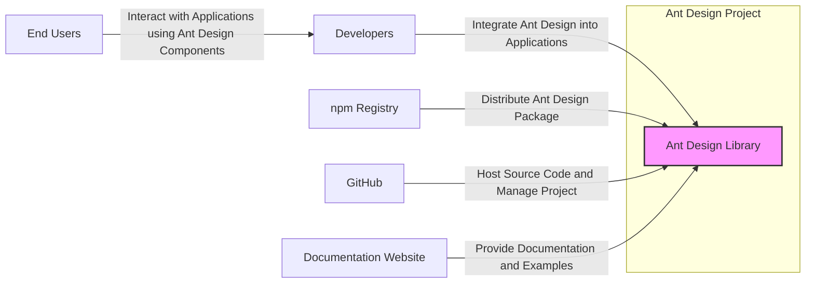
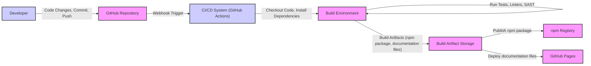

# BUSINESS POSTURE

- Business Priorities and Goals:
 - Provide a high-quality, comprehensive, and user-friendly UI component library for React applications.
 - Enable developers to build consistent and efficient user interfaces, accelerating development cycles.
 - Foster a strong open-source community around the library, encouraging contributions and wider adoption.
 - Maintain the library's reputation for stability, performance, and accessibility.

- Business Risks:
 - Security vulnerabilities in the UI components could be exploited in applications using Ant Design, leading to data breaches or other security incidents.
 - Supply chain attacks targeting dependencies or the build process could compromise the integrity of the library.
 - Reputational damage due to security flaws or lack of responsiveness to security issues could erode user trust and adoption.
 - Lack of security awareness among contributors could lead to the introduction of vulnerabilities.

# SECURITY POSTURE

- Existing Security Controls:
 - security control: GitHub repository access control to manage who can contribute and modify the codebase. Implemented in GitHub repository settings.
 - security control: Code review process for pull requests to ensure code quality and identify potential issues. Implemented via GitHub pull request workflow.
 - security control: Issue tracking system on GitHub to report and manage bugs and feature requests, including security vulnerabilities. Implemented via GitHub Issues.
 - accepted risk: Reliance on community contributions, which may introduce security vulnerabilities if not properly vetted.
 - accepted risk: Open-source nature of the project, making the codebase publicly accessible for vulnerability research (both by security researchers and malicious actors).

- Recommended Security Controls:
 - recommended security control: Implement automated dependency scanning to detect known vulnerabilities in third-party libraries used by Ant Design.
 - recommended security control: Integrate static application security testing (SAST) tools into the CI/CD pipeline to automatically identify potential code-level vulnerabilities.
 - recommended security control: Conduct regular security audits and penetration testing to proactively identify and address security weaknesses.
 - recommended security control: Establish a clear vulnerability disclosure policy and incident response plan to handle security issues effectively.
 - recommended security control: Provide security training and awareness programs for core contributors and maintainers.

- Security Requirements:
 - Authentication:
  - Requirement: Secure authentication mechanisms for maintainers and administrators accessing project settings and publishing packages.
  - Requirement: Consider multi-factor authentication for maintainer accounts to enhance security.
 - Authorization:
  - Requirement: Role-based access control within the GitHub repository to manage permissions for different contributors (e.g., read-only, write, admin).
  - Requirement: Authorization controls for publishing packages to npm or other distribution channels, ensuring only authorized individuals can release new versions.
 - Input Validation:
  - Requirement: While Ant Design is a UI library, components should be designed to handle potentially malicious input from developers using the library. Ensure components do not introduce vulnerabilities in applications due to improper handling of props or user-provided data.
  - Requirement: Validate data received from external sources during the build process (e.g., dependencies, assets) to prevent injection attacks or supply chain compromises.
 - Cryptography:
  - Requirement: If Ant Design components handle sensitive data or implement features requiring encryption (though less likely for a UI library itself), ensure proper and secure cryptographic practices are followed.
  - Requirement: Securely store and manage any cryptographic keys or secrets used in the build or deployment processes.

# DESIGN

## C4 CONTEXT



- Context Diagram Elements:
 - - Name: Ant Design Library
   - Type: Software System
   - Description: A React UI component library providing a set of reusable components for building user interfaces.
   - Responsibilities: Provide a comprehensive and well-documented set of UI components, ensure components are performant, accessible, and secure, maintain compatibility and stability across versions.
   - Security controls: Code review, dependency scanning, SAST, security audits.
 - - Name: Developers
   - Type: Person
   - Description: Software developers who use Ant Design to build web applications.
   - Responsibilities: Integrate Ant Design components correctly into their applications, follow best practices for secure coding when using UI components, report any issues or vulnerabilities they find in Ant Design.
   - Security controls: Secure coding practices, input validation in their applications, dependency management.
 - - Name: End Users
   - Type: Person
   - Description: Users who interact with web applications built using Ant Design components.
   - Responsibilities: Use applications responsibly, report any suspicious behavior or security issues they encounter.
   - Security controls: Browser security features, application-level security controls.
 - - Name: npm Registry
   - Type: External System
   - Description: A public registry for JavaScript packages, used to distribute the Ant Design library.
   - Responsibilities: Host and distribute the Ant Design package securely, ensure package integrity and availability.
   - Security controls: npm registry security measures, package signing (if implemented).
 - - Name: GitHub
   - Type: External System
   - Description: A web-based platform for version control and collaboration, hosting the Ant Design source code repository.
   - Responsibilities: Securely host the source code, manage access control, provide issue tracking and pull request workflows.
   - Security controls: GitHub security features, access control, vulnerability scanning, audit logs.
 - - Name: Documentation Website
   - Type: External System
   - Description: A website providing documentation, examples, and guides for using Ant Design.
   - Responsibilities: Provide accurate and up-to-date documentation, ensure website security and availability.
   - Security controls: Web server security, content security policy, regular security updates.

## C4 CONTAINER

```mermaid
graph LR
    subgraph "Ant Design Project"
        A["GitHub Repository" <br> Type: Code Repository <br> Technology: Git"]
        B["npm Package" <br> Type: Package Registry <br> Technology: npm"]
        C["Documentation Website" <br> Type: Web Application <br> Technology: Static Site Generator (e.g., Docusaurus)"]
    end
    D["Developers"] -- "Contribute Code" --> A
    D -- "Download Package" --> B
    D -- "Access Documentation" --> C
    E["CI/CD System" <br> Type: Automation <br> Technology: GitHub Actions"] -- "Build, Test, Publish" --> A
    E -- "Publish Package" --> B
    E -- "Deploy Documentation" --> C
    style A fill:#f9f,stroke:#333,stroke-width:2px
    style B fill:#f9f,stroke:#333,stroke-width:2px
    style C fill:#f9f,stroke:#333,stroke-width:2px
    style E fill:#ccf,stroke:#333,stroke-width:2px
```

- Container Diagram Elements:
 - - Name: GitHub Repository
   - Type: Code Repository
   - Description: Git repository hosted on GitHub, containing the source code, history, and project management resources for Ant Design.
   - Responsibilities: Version control, source code management, collaboration platform, issue tracking, pull request management.
   - Security controls: GitHub access control, branch protection rules, code review process, vulnerability scanning (GitHub Dependabot, CodeQL).
 - - Name: npm Package
   - Type: Package Registry
   - Description: npm package distributed through the npm registry, containing the compiled and packaged Ant Design library.
   - Responsibilities: Distribution of the library to developers, versioning, package integrity.
   - Security controls: npm registry security, package signing (if implemented), integrity checks during installation.
 - - Name: Documentation Website
   - Type: Web Application
   - Description: Static website generated from markdown files, providing documentation, examples, and guides for Ant Design.
   - Responsibilities: Provide comprehensive and up-to-date documentation, ensure website availability and performance, user-friendly access to information.
   - Security controls: Web server security, HTTPS, content security policy, regular security updates for website dependencies.
 - - Name: CI/CD System
   - Type: Automation System
   - Description: Automated system (likely GitHub Actions) for building, testing, and publishing the Ant Design library and documentation.
   - Responsibilities: Automate build process, run tests, perform static analysis, publish npm package, deploy documentation website.
   - Security controls: Secure CI/CD pipeline configuration, secrets management, build artifact integrity checks, SAST integration, dependency scanning integration.

## DEPLOYMENT

- Deployment Architecture Options:
 - Option 1: npm Registry for package distribution, GitHub Pages for documentation website hosting.
 - Option 2: npm Registry for package distribution, Vercel/Netlify for documentation website hosting.
 - Option 3: Self-hosted npm registry (less likely for an open-source project), self-hosted documentation website.

- Selected Deployment Architecture: Option 1 (npm Registry and GitHub Pages)

```mermaid
graph LR
    subgraph "npm Registry Environment"
        A["npm Registry Server" <br> Type: Server <br> Technology: npm Registry Infrastructure"]
    end
    subgraph "GitHub Pages Environment"
        B["GitHub Pages Server" <br> Type: Server <br> Technology: GitHub Pages Infrastructure"]
        C["CDN" <br> Type: CDN <br> Technology: GitHub Pages CDN"]
    end
    D["CI/CD System"] -- "Publish npm Package" --> A
    D -- "Deploy Documentation Files" --> B
    B -- "Serve Documentation Website" --> C
    style A fill:#f9f,stroke:#333,stroke-width:2px
    style B fill:#f9f,stroke:#333,stroke-width:2px
    style C fill:#f9f,stroke:#333,stroke-width:2px
    style D fill:#ccf,stroke:#333,stroke-width:2px
```

- Deployment Diagram Elements:
 - - Name: npm Registry Server
   - Type: Server
   - Description: Servers managed by npm, Inc. that host the npm registry and distribute packages.
   - Responsibilities: Host and serve npm packages, manage package metadata, ensure package availability and integrity.
   - Security controls: npm registry security infrastructure, access controls, security audits, package signing (if implemented).
 - - Name: GitHub Pages Server
   - Type: Server
   - Description: Servers managed by GitHub that host static websites directly from GitHub repositories.
   - Responsibilities: Host and serve static website files for the documentation, ensure website availability and performance.
   - Security controls: GitHub Pages security infrastructure, HTTPS, CDN, access controls.
 - - Name: CDN
   - Type: CDN (Content Delivery Network)
   - Description: Content Delivery Network used by GitHub Pages to distribute website content globally for faster access.
   - Responsibilities: Cache and serve website content from geographically distributed locations, improve website performance and availability.
   - Security controls: CDN security features, DDoS protection, secure content delivery.
 - - Name: CI/CD System
   - Type: Automation System
   - Description: CI/CD system (GitHub Actions) responsible for deploying the npm package and documentation website.
   - Responsibilities: Automate deployment process, publish npm package to npm registry, deploy documentation files to GitHub Pages.
   - Security controls: Secure CI/CD pipeline configuration, secrets management, deployment process monitoring.

## BUILD



- Build Process Description:
 - Developer makes code changes, commits them, and pushes to the GitHub repository.
 - GitHub repository triggers a webhook event upon code push.
 - CI/CD system (GitHub Actions) is triggered by the webhook.
 - CI/CD system checks out the code from the repository into a build environment.
 - CI/CD system installs project dependencies.
 - CI/CD system runs automated tests, linters, and static application security testing (SAST) tools to check code quality and security.
 - CI/CD system builds the npm package and documentation files.
 - Build artifacts are stored temporarily in build artifact storage within the CI/CD environment.
 - CI/CD system publishes the npm package to the npm registry.
 - CI/CD system deploys the documentation files to GitHub Pages.

- Build Process Security Controls:
 - security control: Secure CI/CD pipeline configuration to prevent unauthorized modifications.
 - security control: Secrets management to securely store and access credentials for publishing to npm and deploying documentation.
 - security control: Dependency scanning to detect vulnerabilities in dependencies during the build process.
 - security control: Static Application Security Testing (SAST) to identify potential code-level vulnerabilities before deployment.
 - security control: Code linting and formatting to enforce code quality and consistency.
 - security control: Automated tests (unit, integration, etc.) to ensure code functionality and prevent regressions.
 - security control: Build artifact integrity checks to ensure artifacts are not tampered with during the build and deployment process.
 - security control: Use of signed commits to verify the authenticity of code contributions.

# RISK ASSESSMENT

- Critical Business Processes:
 - Maintaining the integrity and availability of the Ant Design UI library.
 - Ensuring the security of the UI components to prevent vulnerabilities in applications using the library.
 - Maintaining the reputation and trust of the Ant Design project within the developer community.
 - Smooth and secure release process for new versions and updates.

- Data to Protect and Sensitivity:
 - Source code: Publicly available, but integrity and confidentiality of development process are important.
  - Sensitivity: Medium (public, but modifications by unauthorized parties would be high impact).
 - npm package: Publicly available, but integrity is critical.
  - Sensitivity: High (public, but compromised package would have wide impact).
 - Documentation website content: Publicly available, integrity and availability are important.
  - Sensitivity: Medium (public, but defacement or unavailability would impact user experience).
 - CI/CD pipeline secrets (npm token, deployment keys): Confidential.
  - Sensitivity: High (compromise would allow unauthorized package publishing and website modification).

# QUESTIONS & ASSUMPTIONS

- Questions:
 - What specific SAST and dependency scanning tools are currently used in the CI/CD pipeline?
 - Is there a formal vulnerability disclosure policy and incident response plan in place?
 - Are there regular security audits or penetration testing conducted for Ant Design?
 - What are the specific access control policies for the GitHub repository and npm package publishing?
 - Is multi-factor authentication enforced for maintainer accounts?
 - Are there any security training programs for contributors and maintainers?

- Assumptions:
 - BUSINESS POSTURE: The primary business goal is to provide a secure and reliable UI library for the open-source community. Security is a high priority for the project's long-term success and adoption.
 - SECURITY POSTURE: The project currently relies on standard GitHub security features and code review processes. There is room for improvement in implementing more proactive security measures like automated security scanning and formal security policies.
 - DESIGN: The project uses a standard open-source development and distribution model, leveraging GitHub for source code management and npm for package distribution. The documentation website is likely a static site hosted on GitHub Pages or a similar platform. The CI/CD pipeline is likely based on GitHub Actions.