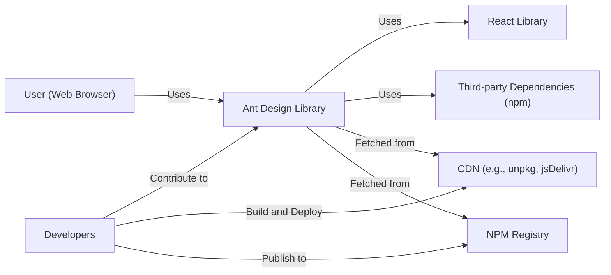
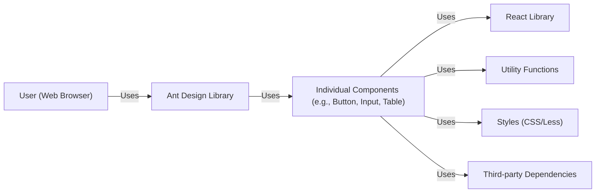
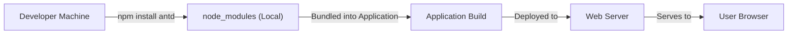
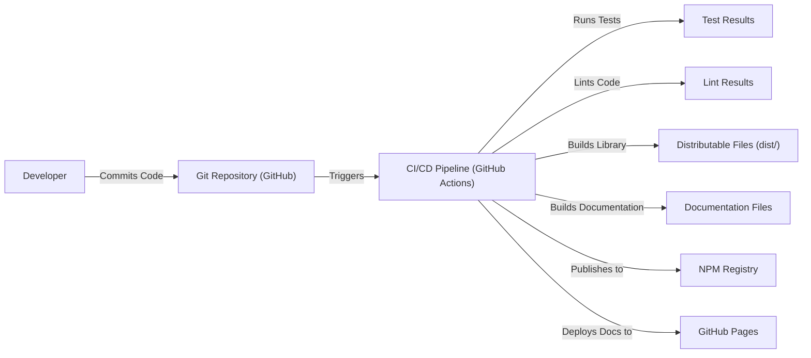

Okay, let's create a design document for the Ant Design project, focusing on aspects relevant for threat modeling.

# BUSINESS POSTURE

Ant Design is a React UI library that provides a comprehensive set of enterprise-class UI components.  It's used by numerous companies, likely including startups and established enterprises, to build web applications.  The primary business goals are:

*   Provide a consistent and aesthetically pleasing user interface.
*   Accelerate development by offering pre-built, reusable components.
*   Ensure accessibility and internationalization for a broad user base.
*   Maintain a strong reputation for quality and reliability.
*   Foster a vibrant open-source community.

The most important business risks that need to be addressed are:

*   **Compromise of the library:** Malicious code injected into the Ant Design library (e.g., through a supply chain attack) could impact a vast number of applications and users.
*   **Vulnerabilities in components:**  Security flaws in individual components could be exploited in applications using those components, leading to data breaches or other security incidents.
*   **Loss of developer trust:**  Security incidents or a perceived lack of security focus could damage the library's reputation and lead to developers choosing alternative solutions.
*   **Legal and compliance issues:**  Failure to meet accessibility standards or data privacy regulations (if applicable, depending on how the library is used) could result in legal action.
*   **Denial of Service:** Vulnerabilities that allow attackers to crash applications using Ant Design.

# SECURITY POSTURE

Based on the provided GitHub repository, the following security controls and accepted risks are identified.  Note that this is an assessment based on the *library itself*, not on applications *using* the library.  Applications using Ant Design will have their own, separate security posture.

*   security control: Code reviews: The project uses pull requests, implying code review before merging changes. (Visible in the GitHub repository's contribution guidelines and pull request process).
*   security control: Testing: The project includes unit and integration tests. (Visible in the `tests` directory and CI configuration).
*   security control: Static analysis: Likely used, although the specific tools are not explicitly mentioned in the top-level repository structure.  Linters are used. (Visible in configuration files like `.eslintrc.js`).
*   security control: Dependency management: Dependencies are managed using `npm` or `yarn`. (Visible in `package.json`).
*   security control: Issue tracking: Security vulnerabilities can be reported and tracked. (Visible in the GitHub Issues section).
*   security control: Internationalization (i18n): Ant Design supports multiple languages, reducing the risk of localization-related vulnerabilities. (Visible in documentation and code).
*   security control: Accessibility (a11y): Ant Design emphasizes accessibility, reducing the risk of exclusion and potential legal issues. (Visible in documentation and component design).
*   accepted risk: The library itself does not handle sensitive data directly. It's a UI component library, so data handling is the responsibility of the applications using it.
*   accepted risk: The library does not perform authentication or authorization. These are application-level concerns.
*   accepted risk: The library relies on the security of its dependencies. While dependency management is used, vulnerabilities in dependencies are a potential risk.

Recommended security controls (high priority):

*   Implement a formal Software Bill of Materials (SBOM) generation process. This will improve supply chain security visibility.
*   Integrate Static Application Security Testing (SAST) tools into the CI/CD pipeline to automatically scan for vulnerabilities.
*   Integrate Dynamic Application Security Testing (DAST) for runtime security checks.
*   Perform regular penetration testing, focusing on common web application vulnerabilities (even though it's a UI library, injection flaws are still possible).
*   Establish a clear security vulnerability disclosure policy and a dedicated security contact.
*   Consider using a Software Composition Analysis (SCA) tool to actively monitor for vulnerabilities in dependencies.

Security Requirements:

*   Authentication: Not directly applicable to the library itself. Applications using Ant Design must implement their own authentication mechanisms.
*   Authorization: Not directly applicable to the library itself. Applications using Ant Design must implement their own authorization mechanisms.
*   Input Validation:
    *   Components that accept user input (e.g., forms, input fields) must validate that input on the client-side to prevent common web vulnerabilities like Cross-Site Scripting (XSS).
    *   Server-side validation is the responsibility of the application using Ant Design, but client-side validation provides defense-in-depth.
*   Cryptography:
    *   The library itself should not handle sensitive cryptographic operations. These are the responsibility of the application.
    *   If any cryptographic functions are used internally (e.g., for generating unique IDs), they must use well-established and secure libraries.

# DESIGN

## C4 CONTEXT

Element Descriptions:

*   Element:
    *   Name: User (Web Browser)
    *   Type: Person
    *   Description: End-users interacting with web applications built using Ant Design.
    *   Responsibilities: Interacts with the UI, provides input, views output.
    *   Security controls: Browser security settings, safe browsing practices.

*   Element:
    *   Name: Ant Design Library
    *   Type: Software System
    *   Description: The core React UI component library.
    *   Responsibilities: Provides UI components, handles user interactions within components, manages component state.
    *   Security controls: Input validation, code reviews, testing, dependency management.

*   Element:
    *   Name: React Library
    *   Type: Software System
    *   Description: The underlying JavaScript library for building user interfaces.
    *   Responsibilities: Manages the DOM, handles component rendering, provides component lifecycle methods.
    *   Security controls: Relies on React's security features and best practices.

*   Element:
    *   Name: Third-party Dependencies (npm)
    *   Type: Software System
    *   Description: External libraries used by Ant Design.
    *   Responsibilities: Provide specific functionalities used by Ant Design components.
    *   Security controls: Dependency management, vulnerability scanning (recommended).

*   Element:
    *   Name: Developers
    *   Type: Person
    *   Description: Individuals contributing to the Ant Design project.
    *   Responsibilities: Write code, review code, manage releases, maintain the project.
    *   Security controls: Secure coding practices, access controls to the repository.

*   Element:
    *   Name: CDN (e.g., unpkg, jsDelivr)
    *   Type: Software System
    *   Description: Content Delivery Networks that host Ant Design releases.
    *   Responsibilities: Serve Ant Design files to users' browsers.
    *   Security controls: CDN provider's security measures, Subresource Integrity (SRI) (recommended).

*   Element:
    *   Name: NPM Registry
    *   Type: Software System
    *   Description: The public registry for Node.js packages.
    *   Responsibilities: Stores and distributes Ant Design packages.
    *   Security controls: NPM's security measures, two-factor authentication for package maintainers (recommended).

## C4 CONTAINER

Since Ant Design is a library, the "container" level is essentially an extension of the context diagram.  It's not a deployable application with multiple containers in the traditional sense.

Element Descriptions:

*   Element:
    *   Name: User (Web Browser)
    *   Type: Person
    *   Description: Same as in the Context diagram.
    *   Responsibilities: Same as in the Context diagram.
    *   Security controls: Same as in the Context diagram.

*   Element:
    *   Name: Ant Design Library
    *   Type: Software System
    *   Description: Same as in the Context diagram.
    *   Responsibilities: Same as in the Context diagram.
    *   Security controls: Same as in the Context diagram.

*   Element:
    *   Name: Individual Components (e.g., Button, Input, Table)
    *   Type: Container (Component)
    *   Description: The individual UI components provided by Ant Design.
    *   Responsibilities: Render specific UI elements, handle user interactions within those elements.
    *   Security controls: Input validation (for components that accept input), adherence to accessibility guidelines.

*   Element:
    *   Name: React Library
    *   Type: Software System
    *   Description: Same as in the Context diagram.
    *   Responsibilities: Same as in the Context diagram.
    *   Security controls: Same as in the Context diagram.

*   Element:
    *   Name: Utility Functions
    *   Type: Container (Code)
    *   Description: Internal helper functions used by the components.
    *   Responsibilities: Provide common functionalities used across components.
    *   Security controls: Code reviews, testing.

*   Element:
    *   Name: Styles (CSS/Less)
    *   Type: Container (Static Content)
    *   Description: Stylesheets that define the appearance of the components.
    *   Responsibilities: Control the visual presentation of the components.
    *   Security controls:  Ensure styles do not introduce vulnerabilities (e.g., CSS injection).

*   Element:
    *   Name: Third-party Dependencies
    *   Type: Software System
    *   Description: Same as Context diagram.
    *   Responsibilities: Same as Context diagram.
    *   Security controls: Same as Context diagram.

## DEPLOYMENT

Ant Design, as a library, is not "deployed" in the traditional sense of a server-side application.  It's *distributed* and then *integrated* into other applications.  Here are the common distribution methods:

1.  **npm/yarn:** Developers install Ant Design as a dependency using npm or yarn.  The library code is then bundled into the application's build process.
2.  **CDN:** Developers include a `<script>` tag that references Ant Design files hosted on a CDN (e.g., unpkg, jsDelivr).

We'll describe the npm/yarn method, as it's the most common and allows for better control over versions and dependencies.

Element Descriptions:

*   Element:
    *   Name: Developer Machine
    *   Type: Infrastructure Node
    *   Description: The developer's local development environment.
    *   Responsibilities: Writing code, running builds, managing dependencies.
    *   Security controls: Secure coding practices, local security software.

*   Element:
    *   Name: node_modules (Local)
    *   Type: Directory
    *   Description: Local directory containing installed npm packages, including Ant Design.
    *   Responsibilities: Stores the library code and its dependencies.
    *   Security controls:  Regularly updating dependencies, using a package-lock file.

*   Element:
    *   Name: Application Build
    *   Type: Artifact
    *   Description: The final build output of the application using Ant Design.
    *   Responsibilities: Contains the bundled application code, including Ant Design components.
    *   Security controls:  Build process security, code signing (optional).

*   Element:
    *   Name: Web Server
    *   Type: Infrastructure Node
    *   Description: The server that hosts the application.
    *   Responsibilities: Serves the application files to users' browsers.
    *   Security controls:  Server security hardening, web application firewall (WAF).

*   Element:
    *   Name: User Browser
    *   Type: Infrastructure Node
    *   Description: The user's web browser.
    *   Responsibilities: Renders the application, executes JavaScript code.
    *   Security controls: Browser security settings, safe browsing practices.

## BUILD

The Ant Design build process involves several steps, transforming source code into distributable files. The repository uses tools like `father-build`, `dumi` (for documentation), and likely other internal scripts.

Security Controls in the Build Process:

*   **Source Code Management:** GitHub provides access control and version history.
*   **CI/CD Pipeline:** GitHub Actions automates the build, test, and release process.
*   **Testing:** Unit and integration tests are run as part of the CI pipeline.
*   **Linting:** Linters (e.g., ESLint) enforce code style and identify potential issues.
*   **Dependency Management:** `npm` or `yarn` manage dependencies, and a lockfile ensures consistent builds.
*   **Publishing:** The `npm publish` command (likely automated in the CI pipeline) publishes the library to the NPM registry.

Recommended additions:

*   **SAST:** Integrate a Static Application Security Testing tool into the CI pipeline.
*   **SCA:** Use a Software Composition Analysis tool to track dependencies and vulnerabilities.
*   **SBOM:** Generate a Software Bill of Materials during the build process.

# RISK ASSESSMENT

*   **Critical Business Processes:**
    *   Providing a reliable and secure UI component library.
    *   Maintaining the trust of the developer community.
    *   Ensuring the continuous development and improvement of the library.

*   **Data Protection:**
    *   Ant Design itself does not handle sensitive data directly. This is the responsibility of applications *using* the library.
    *   However, vulnerabilities in Ant Design components (e.g., XSS) could indirectly lead to data breaches in applications that use those components. Therefore, the *integrity* of the library's code is paramount.
    *   Data Sensitivity: Low (for the library itself), but potentially High for applications using the library.

# QUESTIONS & ASSUMPTIONS

*   **Questions:**
    *   What specific SAST/SCA tools are currently used, if any?
    *   Is there a formal vulnerability disclosure policy?
    *   Are there any code signing procedures in place for releases?
    *   What is the process for handling security vulnerabilities reported by external researchers?
    *   Are there any specific security audits or penetration tests performed on the library?
    *   Is Subresource Integrity (SRI) used when referencing Ant Design from CDNs?

*   **Assumptions:**
    *   BUSINESS POSTURE: Assumes that Ant Design aims to be a widely used and trusted library, with a focus on quality and developer experience.
    *   SECURITY POSTURE: Assumes that basic security practices (code reviews, testing) are followed, but there's room for improvement in areas like supply chain security and vulnerability management.
    *   DESIGN: Assumes that the primary distribution method is via npm/yarn, and that developers are responsible for securely integrating Ant Design into their applications. Assumes that the build process is automated via CI/CD.