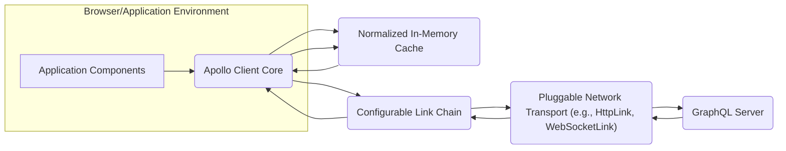
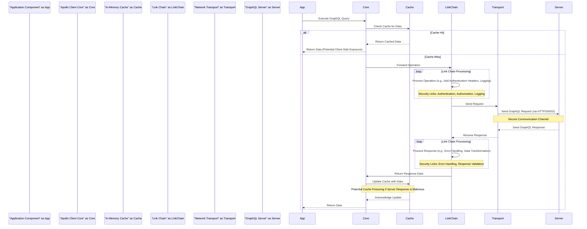

# Project Design Document: Apollo Client

**Version:** 1.1
**Date:** October 26, 2023
**Author:** AI Software Architect

## 1. Introduction

This document provides an enhanced and detailed design overview of the Apollo Client, a comprehensive state management library for JavaScript that enables you to manage both local and remote data with GraphQL. This document is specifically intended to serve as a robust foundation for threat modeling activities, providing a clear and in-depth understanding of the system's architecture, components, data flow, and potential security vulnerabilities.

## 2. Goals

*   Provide a comprehensive and security-focused architectural overview of Apollo Client.
*   Clearly identify key components, their functionalities, and their interactions with a focus on security implications.
*   Describe the complete data flow within the client, highlighting potential interception and manipulation points.
*   Thoroughly outline potential areas of security concern and specific threat vectors for subsequent threat modeling exercises.

## 3. Target Audience

This document is intended for:

*   Security engineers and architects responsible for threat modeling, security assessments, and penetration testing of applications using Apollo Client.
*   Development teams working with or extending Apollo Client who need to understand its security architecture.
*   Anyone requiring a detailed and security-conscious understanding of Apollo Client's internal workings and potential vulnerabilities.

## 4. System Overview

Apollo Client is a JavaScript library that empowers developers to interact efficiently and effectively with GraphQL APIs. It offers a rich set of features for fetching, caching, and managing application state, simplifying the process of building data-driven applications. Its flexible design allows seamless integration with various popular UI frameworks such as React, Vue, and Angular.

## 5. Architectural Design

### 5.1. High-Level Architecture

### 5.2. Detailed Component Description

*   **Application Components:** These represent the user interface elements and the application's business logic that utilize Apollo Client to fetch and manage GraphQL data. They initiate GraphQL operations and consume the results.
*   **Apollo Client Core:** This is the central orchestrator within the library. It manages the lifecycle of GraphQL operations, interacts with the cache, and coordinates the link chain. It exposes the primary APIs (`useQuery`, `useMutation`, `useSubscription`) for application interaction.
*   **Normalized In-Memory Cache:** This component stores the results of GraphQL queries in a normalized format, keyed by unique identifiers. This enables efficient data retrieval and reduces redundant network requests. Security considerations include the potential exposure of sensitive data if the client-side environment is compromised.
*   **Configurable Link Chain:** This is a sequence of middleware functions (Links) that process GraphQL operations. Each Link can intercept and modify the operation or the response. This is a critical area for security, as Links can implement authentication, authorization, logging, error handling, and other security-related logic. Malicious or poorly implemented custom Links can introduce vulnerabilities.
*   **Pluggable Network Transport:** This component is responsible for the actual communication with the GraphQL server. `HttpLink` uses HTTP for queries and mutations, while `WebSocketLink` handles persistent connections for subscriptions. The security of this layer depends on the underlying transport protocol (HTTPS, WSS) and the proper handling of authentication credentials.
*   **GraphQL Server:** This is the backend server that exposes the GraphQL API. Its security is paramount, and Apollo Client relies on the server to enforce proper authorization and prevent malicious operations.

### 5.3. Key Modules and Functionality (Security Focused)

*   **`ApolloClient` Instance Configuration:** The configuration of the `ApolloClient` instance, including the `link` and `cache` options, directly impacts security. Incorrectly configured links or a lack of secure defaults can introduce vulnerabilities.
*   **`useQuery`, `useMutation`, `useSubscription` Hooks:** These hooks abstract away the complexities of data fetching but rely on the developer to construct secure GraphQL operations. Improperly constructed queries or mutations could lead to vulnerabilities if not validated on the server.
*   **`InMemoryCache` Normalization:** While efficient, the normalized cache structure means that potentially sensitive data might be stored in a structured way, making it easier to extract if the client is compromised.
*   **Custom Links for Authentication and Authorization:**  Links are often used to add authentication headers (e.g., JWT tokens). Secure storage and handling of these tokens within the application and during transmission are critical.
*   **Error Handling in Links:**  Links can implement custom error handling logic. Improper error handling might inadvertently expose sensitive information or mask critical security issues.
*   **Network Request Options in `HttpLink`:**  Configuration options for `HttpLink`, such as `credentials` and custom headers, need to be carefully managed to prevent unintended information disclosure or security misconfigurations.
*   **WebSocket Connection Management in `WebSocketLink`:** Securely establishing and maintaining WebSocket connections (WSS) and handling authentication for subscriptions are crucial.
*   **Cache Invalidation and Updates:** Mechanisms for invalidating and updating the cache need to be secure to prevent cache poisoning attacks where malicious data is injected into the cache.

## 6. Data Flow (Detailed with Security Considerations)

The following outlines the typical data flow for a GraphQL query, highlighting potential security checkpoints and vulnerabilities:

**Security Notes on Data Flow:**

*   **Client-Side Exposure:** Data returned to the application component resides in the client's memory and can be potentially accessed through vulnerabilities like XSS.
*   **Link Chain as a Security Gateway:** The Link Chain is a crucial point for implementing security measures. Ensure that authentication and authorization links are correctly implemented and ordered.
*   **Secure Communication:**  The Network Transport must use secure protocols (HTTPS/WSS) to protect data in transit from MITM attacks.
*   **Server-Side Validation:** While the client can perform some validation, the GraphQL Server is the ultimate authority for validating and authorizing operations.
*   **Cache Poisoning:**  If the server returns malicious or incorrect data, the client's cache can be poisoned, leading to application errors or security vulnerabilities. Implement mechanisms to detect and mitigate this.

The data flow for mutations and subscriptions follows a similar pattern, with mutations potentially invalidating cached data and subscriptions establishing persistent, secure connections.

## 7. Security Considerations (Expanded and Detailed)

This section provides a more detailed exploration of potential security concerns within Apollo Client, outlining specific threat vectors and mitigation strategies.

*   **Client-Side Data Exposure and Cross-Site Scripting (XSS):**
    *   **Threat:** Sensitive data fetched by Apollo Client and stored in the cache can be vulnerable if the application is susceptible to XSS attacks. Attackers can inject malicious scripts to access and exfiltrate this data.
    *   **Mitigation:** Implement robust input and output sanitization techniques within the application's UI components. Utilize Content Security Policy (CSP) to restrict the sources of executable scripts. Avoid storing highly sensitive data in the client-side cache if possible, or encrypt it.
*   **GraphQL Injection Attacks:**
    *   **Threat:** While Apollo Client doesn't directly execute arbitrary user-provided GraphQL queries, vulnerabilities in the application's logic when constructing dynamic queries can lead to injection attacks. Attackers might manipulate input fields to alter the intended query structure, potentially accessing unauthorized data or performing unintended actions.
    *   **Mitigation:** Employ parameterized queries or prepared statements on the server-side to prevent injection. Thoroughly validate all user inputs used to construct GraphQL queries. Implement server-side rate limiting and query complexity analysis to mitigate potential abuse.
*   **Man-in-the-Middle (MITM) Attacks:**
    *   **Threat:** If communication between the client and the GraphQL server is not encrypted using HTTPS or WSS, attackers can intercept and potentially modify the data exchanged. This can lead to data breaches or manipulation of application behavior.
    *   **Mitigation:** Enforce the use of HTTPS for all communication with the GraphQL server. For subscriptions, ensure WebSocket connections are established over WSS. Implement certificate pinning for enhanced security.
*   **Authentication and Authorization Vulnerabilities:**
    *   **Threat:** Improper handling of authentication tokens or inadequate authorization checks can allow unauthorized access to data or functionality. This includes insecure storage of tokens, transmission of tokens over insecure channels, or insufficient server-side authorization logic.
    *   **Mitigation:** Store authentication tokens securely (e.g., using `httpOnly` and `secure` cookies, or secure local storage with encryption). Transmit tokens only over HTTPS/WSS. Implement robust authorization checks on the server-side to verify user permissions for each GraphQL operation. Utilize access control lists (ACLs) or role-based access control (RBAC).
*   **Dependency Vulnerabilities (Supply Chain Attacks):**
    *   **Threat:** Apollo Client relies on numerous third-party libraries. Vulnerabilities in these dependencies can be exploited to compromise the application.
    *   **Mitigation:** Regularly audit and update dependencies to their latest secure versions. Utilize tools like `npm audit` or `yarn audit` to identify known vulnerabilities. Consider using Software Composition Analysis (SCA) tools for continuous monitoring.
*   **Cache Poisoning Attacks:**
    *   **Threat:** If the GraphQL server is compromised or returns malicious data, this data can be cached by Apollo Client and served to users, potentially leading to application errors, data corruption, or security breaches.
    *   **Mitigation:** Implement server-side validation and sanitization of all data returned by the GraphQL API. Consider using cache invalidation strategies based on data integrity checks. Implement mechanisms to detect and respond to anomalies in cached data.
*   **Subscription Security Issues:**
    *   **Threat:** For GraphQL subscriptions, insecure WebSocket connections or inadequate authorization checks for subscription events can lead to unauthorized data access or manipulation of real-time data streams.
    *   **Mitigation:** Always use WSS for WebSocket connections. Implement robust authentication and authorization mechanisms for subscription events, ensuring that only authorized clients receive specific updates.
*   **Rate Limiting and Denial of Service (DoS) on the Client:**
    *   **Threat:** While primarily a server-side concern, a poorly designed client application might make excessive requests or establish too many subscriptions, potentially contributing to a DoS attack on the server or impacting the client's performance.
    *   **Mitigation:** Implement client-side logic to avoid excessive polling or rapid execution of mutations. Be mindful of the number of active subscriptions. Implement pagination and filtering on the client-side to reduce the amount of data requested.
*   **Information Disclosure through Error Messages:**
    *   **Threat:** Verbose error messages returned by the GraphQL server or exposed by the client can reveal sensitive information about the server's internal workings or data structure to potential attackers.
    *   **Mitigation:** Implement generic error handling on the client-side and avoid displaying detailed server error messages to users in production environments. Log detailed errors securely on the server for debugging purposes.

## 8. Deployment Considerations (Security Implications)

The deployment environment significantly impacts the security posture of applications using Apollo Client:

*   **Web Browsers:** The security of the browser environment is crucial. Ensure users are using up-to-date browsers with security features enabled. Be aware of browser extensions that might interfere with the application's security.
*   **Mobile Applications (React Native, etc.):** Mobile deployments introduce additional security considerations, such as the security of the mobile device itself, secure storage of data within the app, and the potential for reverse engineering of the application code. Implement appropriate security measures for mobile platforms.
*   **Server-Side Rendering (SSR):** When using SSR, be cautious about exposing sensitive data in the initial HTML payload. Ensure that server-side code handling authentication and authorization is robust.

## 9. Dependencies (Security Management)

Maintaining the security of Apollo Client's dependencies is crucial:

*   Utilize dependency management tools (npm, yarn, pnpm) to track and manage dependencies.
*   Regularly run security audits of dependencies to identify known vulnerabilities.
*   Keep dependencies updated to their latest secure versions.
*   Consider using a dependency vulnerability scanning service for continuous monitoring.

## 10. Future Considerations (Security Enhancements)

*   **Improved Built-in Security Features:** Explore opportunities to incorporate more security features directly into Apollo Client, such as built-in mechanisms for preventing common GraphQL injection patterns or more robust cache security options.
*   **Enhanced Security Documentation and Best Practices:** Provide more comprehensive documentation and guidance on secure development practices when using Apollo Client.
*   **Integration with Security Scanning Tools:** Improve integration with static and dynamic application security testing (SAST/DAST) tools to facilitate automated security assessments.

## 11. Conclusion

This enhanced design document provides a detailed and security-focused overview of Apollo Client. By understanding its architecture, data flow, and potential security vulnerabilities, development and security teams can effectively perform threat modeling and implement appropriate security measures to build robust and secure applications leveraging GraphQL. Continuous vigilance and proactive security practices are essential for mitigating potential risks.
