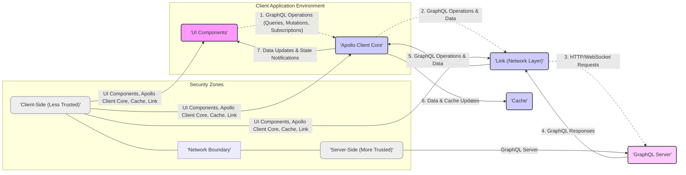

# Improved Project Design Document: Apollo Client for Threat Modeling

## 1. Project Overview

*   **Project Name:** Apollo Client
*   **Project Repository:** [https://github.com/apollographql/apollo-client](https://github.com/apollographql/apollo-client)
*   **Project Description:** Apollo Client is a comprehensive state management library for JavaScript that empowers developers to efficiently manage both local and remote data using GraphQL. It streamlines data fetching, caching, and modification within applications, particularly excelling in building robust and performant user interfaces. While framework-agnostic, Apollo Client offers deep integration with React, providing specialized hooks and components for seamless data management in React environments.
*   **Purpose of this Document:** This document provides an enhanced and detailed design overview of Apollo Client, specifically tailored for threat modeling activities. It elaborates on the architecture, dissects key components, clarifies data flow pathways, and meticulously outlines security considerations. The aim is to facilitate a comprehensive and effective threat modeling process, enabling the proactive identification and mitigation of potential security vulnerabilities.

## 2. Architecture Overview

Apollo Client acts as a client-side intermediary for data management, positioned between the user interface (UI) and a backend GraphQL server. It abstracts the complexities of data retrieval, caching mechanisms, and state management, allowing developers to concentrate on UI development and feature implementation.

The following diagram illustrates the high-level architecture:

**Architectural Layer Descriptions (with Security Context):**

*   **UI Components:**
    *   **Function:**  Present data to the user and initiate data interactions.
    *   **Security Relevance:**  Entry point for user interaction, susceptible to client-side vulnerabilities like XSS if not implemented carefully. Responsible for handling and displaying data securely.
*   **Apollo Client Core:**
    *   **Function:** Orchestrates data operations, manages cache interaction, and interfaces with the network layer.
    *   **Security Relevance:**  Central logic for data handling on the client. Vulnerabilities here could compromise data integrity or lead to unauthorized data access if not properly secured and configured. Manages sensitive operations like authentication headers via Links.
*   **Link (Network Layer):**
    *   **Function:**  Handles network communication with the GraphQL server, including request/response transformation and error handling.
    *   **Security Relevance:**  Manages the secure transport of data over the network. Crucial for implementing secure communication protocols (HTTPS/WSS) and handling authentication credentials securely. Misconfigurations in Links can lead to data leaks or insecure communication.
*   **Cache:**
    *   **Function:** Stores fetched GraphQL data to reduce network requests and improve performance.
    *   **Security Relevance:**  May store sensitive data client-side. Security considerations include protecting cached data from unauthorized access and ensuring appropriate cache invalidation strategies for sensitive information.
*   **GraphQL Server:**
    *   **Function:** Processes GraphQL operations and provides data.
    *   **Security Relevance:**  Backend system responsible for data security, authorization, and access control. Vulnerabilities here can lead to data breaches, unauthorized data manipulation, and denial of service.  Security of the GraphQL server is paramount for the overall security of the application.

## 3. Component Breakdown (Detailed for Threat Analysis)

This section provides a deeper dive into the key components of Apollo Client, focusing on functionalities relevant to security threat analysis.

### 3.1. Apollo Client Core (`@apollo/client/core`)

*   **Functionality (Security Focused):**
    *   **GraphQL Operation Parsing & Validation:** Parses GraphQL queries, mutations, and subscriptions. While primarily for functionality, parsing errors can sometimes be exploited if not handled correctly.
    *   **Cache Interaction Management:** Controls access to and modification of the cache. Improper cache policies or vulnerabilities in cache management could lead to data integrity issues.
    *   **Link Orchestration & Request Building:**  Constructs network requests based on GraphQL operations and Link configurations.  Responsible for including authentication headers and other security-related headers as configured in Links.
    *   **Error Handling & Propagation:**  Manages errors from the network layer and GraphQL server. Verbose error messages in development can be helpful but should be carefully controlled in production to avoid information leakage.
    *   **Query Deduplication & Concurrency Control:** Optimizes network requests. While primarily for performance, improper concurrency handling could theoretically lead to timing-based vulnerabilities in edge cases.
*   **Potential Security Concerns:**
    *   **Improper Error Handling:**  Leaking sensitive information in error responses (e.g., internal server paths, database details).
    *   **Cache Policy Misconfiguration:**  Caching sensitive data inappropriately or for too long.
    *   **Vulnerabilities in GraphQL Parsing Logic (though less likely in a mature library):**  Potential for denial-of-service or unexpected behavior if parsing logic is flawed.
*   **Input/Outputs (Security Perspective):**
    *   **Input:** GraphQL operations from UI components, cache read/write requests, responses from Links.
    *   **Output:** Cache updates, requests to Links, data/errors to UI components.

### 3.2. Cache (`@apollo/client/cache`)

*   **Functionality (Security Focused):**
    *   **Secure Data Storage (In-Memory by default):** Stores normalized GraphQL data in memory. In-memory cache is generally volatile, but the *nature* of data stored is the security concern.
    *   **Cache Invalidation & Garbage Collection:**  Manages cache eviction and invalidation.  Critical for ensuring sensitive data is not retained in the cache longer than necessary.
    *   **Cache Policies & Customization:** Allows configuration of caching behavior. Misconfigured cache policies can lead to security vulnerabilities (e.g., over-caching sensitive data).
    *   **Data Normalization & Denormalization:** Transforms GraphQL responses for efficient caching.  Normalization logic vulnerabilities are less likely but could theoretically lead to data corruption in the cache.
*   **Potential Security Concerns:**
    *   **Storage of Sensitive Data in Cache:**  Accidental or unavoidable caching of sensitive personal information (PII), API keys, or secrets.
    *   **Insufficient Cache Invalidation:**  Stale sensitive data remaining in the cache after it should be expired.
    *   **Cache Side-Channel Attacks (Less likely for in-memory cache in typical web apps, but consider for shared environments):**  In highly specific scenarios, cache access patterns might reveal information.
*   **Input/Outputs (Security Perspective):**
    *   **Input:** GraphQL responses from Apollo Client Core, cache invalidation requests.
    *   **Output:** Cached data to Apollo Client Core, cache eviction events.

### 3.3. Link (`@apollo/client/link`)

*   **Functionality (Security Focused):**
    *   **Secure Network Communication (via `HttpLink`, `WebSocketLink` etc.):**  Responsible for establishing and maintaining secure connections (HTTPS, WSS) to the GraphQL server.
    *   **Request Interception & Modification (Middleware):** Allows adding headers (e.g., Authorization), logging, and error handling.  Crucial for implementing authentication and authorization at the network level.
    *   **Response Interception & Processing:**  Processes responses from the server, including error handling and data transformation.  Error handling in Links should be secure and avoid leaking sensitive information.
    *   **Authentication & Authorization Handling (e.g., via `AuthLink`):**  Links are the primary mechanism for implementing client-side authentication and authorization logic.
*   **Potential Security Concerns:**
    *   **Insecure Transport (HTTP instead of HTTPS, WS instead of WSS):**  Data transmitted in plaintext, vulnerable to eavesdropping and man-in-the-middle attacks.
    *   **Misconfigured Authentication Headers:**  Incorrectly formatted or missing authentication headers leading to unauthorized access or authentication bypass.
    *   **Exposure of Sensitive Data in Request/Response Headers or Logs:**  Accidental logging or exposure of sensitive information in network requests or responses.
    *   **Vulnerabilities in Custom Link Implementations or Middleware:**  Security flaws in custom Links or middleware can introduce vulnerabilities.
*   **Input/Outputs (Security Perspective):**
    *   **Input:** GraphQL operations from Apollo Client Core, network responses from GraphQL server.
    *   **Output:** Network requests to GraphQL server, processed responses to Apollo Client Core.

### 3.4. React Integration (`@apollo/client/react`)

*   **Functionality (Security Focused):**
    *   **Secure Data Binding to UI Components:** Provides hooks and components for integrating Apollo Client with React.  While React integration itself doesn't directly introduce *new* security vulnerabilities in Apollo Client, improper usage within React components *can* lead to client-side vulnerabilities (like XSS).
    *   **Context Management (`ApolloProvider`):**  Makes the Apollo Client instance available in the React component tree.  No direct security implications from the context provider itself.
*   **Potential Security Concerns:**
    *   **Indirect XSS Vulnerabilities:**  If data fetched by Apollo Client is not properly sanitized or escaped before being rendered in React components, it can lead to XSS vulnerabilities. This is a *usage* concern, not a vulnerability in `@apollo/client/react` itself, but important to consider in the context of Apollo Client usage.
    *   **Over-exposure of Apollo Client Instance:**  While unlikely, if the Apollo Client instance is inadvertently exposed in a way that allows unauthorized modification of its configuration or cache, it *could* potentially lead to security issues.
*   **Input/Outputs (Security Perspective):**
    *   **Input:** Data and errors from Apollo Client Core.
    *   **Output:** UI updates, user interactions triggering GraphQL operations.

### 3.5. Utilities and Helpers (`@apollo/client/utilities`, `@apollo/client/cache-control`, etc.)

*   **Functionality (Security Focused):**
    *   **GraphQL Document Manipulation:** Utilities for parsing, printing, and transforming GraphQL documents.  Potential vulnerabilities in parsing logic (though less likely in mature libraries).
    *   **Cache Control Directive Handling:**  Processes cache control directives.  Misinterpretation or mishandling of these directives could lead to unintended caching behavior with security implications.
    *   **Type Policy Management:**  Allows customization of cache behavior based on GraphQL types.  Misconfigured type policies could lead to security issues related to data caching and access.
*   **Potential Security Concerns:**
    *   **Vulnerabilities in GraphQL Parsing Utilities (less likely):**  Similar to Core, parsing vulnerabilities are possible but less probable in mature libraries.
    *   **Misinterpretation of Cache Control Directives:**  Leading to incorrect caching decisions for sensitive data.
    *   **Security Flaws in Custom Type Policy Logic:**  If custom type policies are implemented with security vulnerabilities, they could impact data security.
*   **Input/Outputs (Security Perspective):**
    *   **Input:** GraphQL documents, cache control directives, type policy configurations.
    *   **Output:** Processed GraphQL documents, cache behavior instructions.

### 3.6. Devtools (`@apollo/client/devtools`)

*   **Functionality (Security Focused):**
    *   **Debugging & Inspection Tools (for developers):**  Provides insights into Apollo Client's internal state.  **Crucially, Devtools should be disabled or restricted in production environments.**
    *   **Cache Inspection & Modification (for debugging):**  Allows developers to view and modify the cache.  **This capability is a significant security risk if Devtools are accessible in production.**
    *   **GraphQL Operation Exploration (for development):**  Allows testing GraphQL operations.  No direct security implications in development, but should not be exposed in production.
*   **Potential Security Concerns:**
    *   **Exposure of Sensitive Data via Devtools in Production:**  Devtools can expose cached data, GraphQL operations, and potentially authentication tokens if accessible in production environments. This is a **high-severity vulnerability**.
    *   **Unauthorized Cache Modification via Devtools in Production:**  If Devtools are accessible in production, malicious actors could potentially modify the cache, leading to data corruption or manipulation.
*   **Input/Outputs (Security Perspective):**
    *   **Input:** Access to Apollo Client's internal state, user interactions within the Devtools UI.
    *   **Output:** Display of Apollo Client state, potential modification of cache (via Devtools UI).

## 4. Data Flow (Detailed Security Points)

The data flow, as previously described, is augmented here with specific security checkpoints and considerations at each stage.

```mermaid
graph LR
    A["'UI Component'"] -- "1. GraphQL Operation Request" --> B(" 'Apollo Client Core' ");
    B -- "2. Check Cache" --> C{Cache};
    C -- "Cache Hit (Data)" --> D["4. Return Cached Data"];
    D --> A;
    C -- "Cache Miss/Invalid" --> E["5. Network Request"];
    E --> F(" 'Link' ");
    F -- "6. Network Request (with Headers, e.g., Auth)" --> G(" 'GraphQL Server' ");
    G -- "7. Server-Side Authorization & Processing" --> G;
    G -- "8. GraphQL Response" --> F;
    F -- "9. Apollo Client Response (Error Handling)" --> B;
    B -- "10. Update Cache (Policy Enforcement)" --> C;
    B -- "11. Data Delivery (Sanitization Considerations)" --> A;
    A -- "12. UI Update (Secure Rendering)" --> A;
    style A fill:#f9f,stroke:#333,stroke-width:2px,rx:5px,ry:5px
    style B fill:#ccf,stroke:#333,stroke-width:2px,rx:5px,ry:5px
    style C fill:#ccf,stroke:#333,stroke-width:2px,rx:5px,ry:5px
    style D fill:#ccf,stroke:#333,stroke-width:2px,rx:5px,ry:5px
    style E fill:#ccf,stroke:#333,stroke-width:2px,rx:5px,ry:5px
    style F fill:#ccf,stroke:#333,stroke-width:2px,rx:5px,ry:5px
    style G fill:#fcf,stroke:#333,stroke-width:2px,rx:5px,ry:5px

    subgraph "Security Checkpoints"
        direction TB
        H["'2. Cache Check (Policy Enforcement)'"] --> I["'6. Request Headers (Auth, etc.)'"] --> J["'7. Server-Side Authorization'"] --> K["'9. Error Handling (No Leakage)'"] --> L["'10. Cache Policy (Sensitive Data)'"] --> M["'11. Data Sanitization (XSS Prevention)'"] --> N["'12. Secure Rendering (Context-Aware)'"]
    end
    H -- "Related to Step 2" --> C
    I -- "Related to Step 6" --> F
    J -- "Related to Step 7" --> G
    K -- "Related to Step 9" --> B
    L -- "Related to Step 10" --> C
    M -- "Related to Step 11" --> A
    N -- "Related to Step 12" --> A

    classDef securityCheckpoint stroke:#0a0,stroke-width:2px,fill:#dfd,rx:5px,ry:5px
    class H,I,J,K,L,M,N securityCheckpoint
```

**Security Checkpoints in Data Flow:**

*   **2. Cache Check (Policy Enforcement):**
    *   **Security Consideration:** Ensure cache policies are correctly configured to prevent unauthorized access to cached data and to appropriately handle sensitive data.
    *   **Threat:**  Bypassing authorization checks if cached data is served without re-validation.
    *   **Mitigation:** Implement appropriate cache policies, potentially with short TTLs for sensitive data or mechanisms for re-validation.
*   **6. Request Headers (Auth, etc.):**
    *   **Security Consideration:**  Verify that authentication and authorization headers are correctly included in network requests via Links.
    *   **Threat:**  Missing or incorrect authentication headers leading to unauthorized access or failed authentication.
    *   **Mitigation:**  Properly configure Links (e.g., `AuthLink`) to automatically add necessary headers. Securely manage and store authentication tokens.
*   **7. Server-Side Authorization & Processing:**
    *   **Security Consideration:**  GraphQL server must enforce robust authorization and input validation. Apollo Client relies on the server for security enforcement.
    *   **Threat:**  Server-side vulnerabilities like insecure resolvers, lack of authorization checks, or injection flaws.
    *   **Mitigation:**  Implement strong server-side security measures, including schema design review, authorization logic, input validation, and rate limiting.
*   **9. Error Handling (No Leakage):**
    *   **Security Consideration:**  Ensure error responses from the server and Link layer do not leak sensitive information to the client.
    *   **Threat:**  Information leakage via verbose error messages, exposing internal server details.
    *   **Mitigation:**  Implement secure error handling on both the server and client-side.  Log detailed errors server-side but return generic, user-friendly error messages to the client.
*   **10. Cache Policy (Sensitive Data):**
    *   **Security Consideration:**  Re-emphasize the importance of cache policies for sensitive data.
    *   **Threat:**  Caching sensitive data for too long or without proper protection.
    *   **Mitigation:**  Carefully design cache policies, avoid caching highly sensitive data if possible, or use encrypted caches if necessary.
*   **11. Data Sanitization (XSS Prevention):**
    *   **Security Consideration:**  Client-side application must sanitize or escape data received from the GraphQL server before rendering it in the UI to prevent XSS.
    *   **Threat:**  Cross-site scripting vulnerabilities if unsanitized data is rendered in the UI.
    *   **Mitigation:**  Implement proper output encoding or sanitization techniques in the UI components, especially when displaying user-generated content or data from external sources.
*   **12. Secure Rendering (Context-Aware):**
    *   **Security Consideration:**  Ensure UI components render data securely, considering the context and potential for injection vulnerabilities.
    *   **Threat:**  Context-dependent vulnerabilities, especially in dynamic rendering or when using templating engines.
    *   **Mitigation:**  Use secure rendering practices appropriate for the UI framework (e.g., React's JSX is generally safe against XSS by default, but still requires care with raw HTML rendering).

## 5. Security Considerations for Threat Modeling (Enhanced)

This section expands on security considerations, categorizing threats and providing more specific examples and mitigation strategies.

### 5.1. GraphQL Server Vulnerabilities (Backend Security)

*   **Threat Category:** Backend Security, Data Breach, Denial of Service
    *   **Specific Threats:**
        *   **Insecure GraphQL Schema:** Overly permissive queries, mutations, or subscriptions allowing access to sensitive data or operations without proper authorization.
        *   **Lack of Authorization:** Missing or insufficient authorization checks in GraphQL resolvers, allowing unauthorized data access or manipulation.
        *   **Input Validation Failures:**  GraphQL resolvers vulnerable to injection attacks (e.g., SQL injection, NoSQL injection, command injection) due to lack of input validation.
        *   **Denial of Service (DoS) via Complex Queries:**  Maliciously crafted complex or nested queries that consume excessive server resources, leading to DoS.
        *   **Information Disclosure via Verbose Errors:**  Detailed error messages exposing internal server paths, database details, or other sensitive information.
    *   **Mitigation Strategies:**
        *   **Secure Schema Design:**  Principle of least privilege in schema design, carefully control field access and operation permissions.
        *   **Implement Robust Authorization:**  Enforce authorization checks in all resolvers, based on user roles and permissions. Use GraphQL directives or dedicated authorization libraries.
        *   **Input Validation & Sanitization:**  Validate and sanitize all inputs in resolvers to prevent injection attacks. Use parameterized queries or ORM/ODM features to mitigate SQL/NoSQL injection.
        *   **Rate Limiting & Query Complexity Analysis:**  Implement rate limiting to prevent DoS attacks. Analyze query complexity and potentially reject overly complex queries.
        *   **Secure Error Handling:**  Implement secure error handling that logs detailed errors server-side but returns generic, user-friendly error messages to the client.

### 5.2. Client-Side Vulnerabilities (Apollo Client & Application Logic)

*   **Threat Category:** Client-Side Attacks, Data Exposure, Cross-Site Scripting (XSS)
    *   **Specific Threats:**
        *   **Cross-Site Scripting (XSS):**  Rendering unsanitized data fetched via Apollo Client in the UI, allowing execution of malicious scripts.
        *   **Client-Side Data Tampering (Less Direct via Apollo Client, more application logic):**  Manipulating client-side state or cached data in ways that lead to unintended application behavior or security issues.
        *   **Exposure of Sensitive Data in Client-Side Code or Storage:**  Accidentally logging or storing sensitive data (e.g., API keys, tokens) in client-side code, browser local storage, or unencrypted caches.
        *   **Devtools Exposure in Production:**  Leaving Apollo Client Devtools enabled in production, allowing unauthorized inspection and modification of client-side data and operations.
    *   **Mitigation Strategies:**
        *   **Output Encoding & Sanitization:**  Always sanitize or encode data fetched via Apollo Client before rendering it in the UI to prevent XSS. Use framework-specific mechanisms (e.g., React's JSX escaping).
        *   **Secure Client-Side State Management:**  Design client-side state management to minimize the risk of data tampering. Avoid storing sensitive data in client-side state if possible.
        *   **Secure Storage Practices:**  Avoid storing sensitive data in browser local storage or cookies unless absolutely necessary and properly encrypted. Consider using secure, browser-provided storage mechanisms if available.
        *   **Disable/Restrict Devtools in Production:**  Ensure Apollo Client Devtools are completely disabled or strictly restricted in production environments. Use build processes to remove Devtools code from production builds.

### 5.3. Network Communication Vulnerabilities

*   **Threat Category:** Man-in-the-Middle (MITM), Eavesdropping, Data Interception
    *   **Specific Threats:**
        *   **Insecure Transport (HTTP/WS):**  Using unencrypted HTTP or WebSocket (WS) for communication, allowing eavesdropping and MITM attacks.
        *   **TLS/SSL Stripping Attacks:**  MITM attackers downgrading HTTPS/WSS connections to HTTP/WS.
        *   **Compromised TLS/SSL Certificates:**  Using self-signed or invalid TLS/SSL certificates, or vulnerabilities in TLS/SSL implementations.
        *   **Exposure of Sensitive Data in Network Traffic (Headers, URLs):**  Accidentally including sensitive data in request headers, URLs, or query parameters that could be logged or intercepted.
    *   **Mitigation Strategies:**
        *   **Enforce HTTPS/WSS:**  Always use HTTPS for `HttpLink` and WSS for `WebSocketLink` to encrypt network traffic. Configure the server to redirect HTTP to HTTPS.
        *   **HSTS (HTTP Strict Transport Security):**  Implement HSTS on the server to force browsers to always use HTTPS and prevent SSL stripping attacks.
        *   **Valid TLS/SSL Certificates:**  Use valid, properly configured TLS/SSL certificates from trusted Certificate Authorities. Regularly update TLS/SSL libraries and configurations.
        *   **Minimize Sensitive Data in Network Traffic:**  Avoid including sensitive data in request headers, URLs, or query parameters. Use request bodies for sensitive data transmission.

### 5.4. Authentication and Authorization Vulnerabilities (Client & Server)

*   **Threat Category:** Unauthorized Access, Identity Spoofing, Privilege Escalation
    *   **Specific Threats:**
        *   **Weak or Missing Authentication:**  Lack of proper authentication mechanisms, allowing unauthorized access to the application or data.
        *   **Insecure Token Management:**  Storing authentication tokens insecurely (e.g., in local storage without encryption), or vulnerabilities in token generation, validation, or revocation.
        *   **Authorization Bypass:**  Circumventing authorization checks on the server or client-side, allowing unauthorized actions or data access.
        *   **Session Hijacking/Fixation:**  Vulnerabilities in session management allowing attackers to hijack or fix user sessions.
        *   **Insufficient Credential Strength:**  Using weak passwords or other easily compromised credentials.
    *   **Mitigation Strategies:**
        *   **Implement Strong Authentication:**  Use robust authentication mechanisms (e.g., OAuth 2.0, OpenID Connect, multi-factor authentication).
        *   **Secure Token Management:**  Store authentication tokens securely (e.g., using HttpOnly, Secure cookies, or secure browser storage APIs). Implement secure token generation, validation, and revocation processes.
        *   **Enforce Authorization at Multiple Layers:**  Implement authorization checks on both the client-side (for UI control) and server-side (for data access and operations).
        *   **Secure Session Management:**  Implement secure session management practices, including session timeouts, secure session identifiers, and protection against session hijacking and fixation.
        *   **Password Policies & Credential Management:**  Enforce strong password policies and encourage users to use strong, unique passwords. Implement secure password storage (hashing and salting).

### 5.5. Dependency and Configuration Vulnerabilities

*   **Threat Category:** Software Supply Chain Attacks, Configuration Errors, Outdated Software
    *   **Specific Threats:**
        *   **Vulnerabilities in Apollo Client Dependencies:**  Security vulnerabilities in third-party libraries used by Apollo Client or its dependencies.
        *   **Outdated Apollo Client or Dependencies:**  Using outdated versions of Apollo Client or its dependencies with known security vulnerabilities.
        *   **Misconfigurations in Apollo Client or Link Setup:**  Insecure configurations of Apollo Client, Links, or cache policies that weaken security.
        *   **Accidental Exposure of Configuration Secrets:**  Storing API keys, GraphQL endpoint URLs, or other configuration secrets insecurely in client-side code or configuration files.
    *   **Mitigation Strategies:**
        *   **Dependency Scanning & Management:**  Regularly scan Apollo Client and its dependencies for known vulnerabilities using dependency scanning tools. Use dependency management tools to track and update dependencies.
        *   **Keep Apollo Client and Dependencies Updated:**  Stay up-to-date with the latest versions of Apollo Client and its dependencies to patch known security vulnerabilities.
        *   **Secure Configuration Practices:**  Follow secure configuration practices for Apollo Client, Links, and cache policies. Review configurations for potential security weaknesses.
        *   **Secret Management:**  Use secure secret management practices to store and manage API keys, GraphQL endpoint URLs, and other configuration secrets. Avoid hardcoding secrets in client-side code or configuration files. Use environment variables or dedicated secret management services.

By systematically considering these security considerations and implementing the suggested mitigation strategies, developers and security teams can significantly enhance the security posture of applications built with Apollo Client and GraphQL. This detailed design document serves as a valuable resource for conducting thorough threat modeling and building more secure applications.