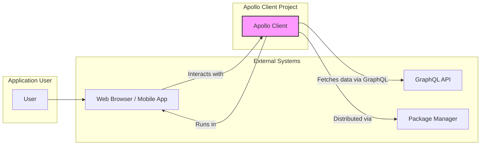
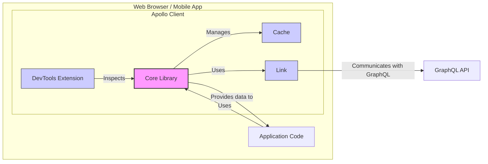
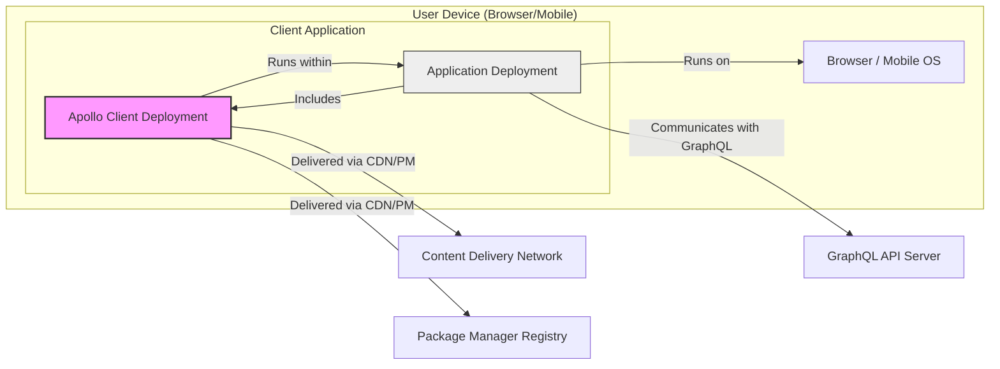

# BUSINESS POSTURE

This project, Apollo Client, aims to provide a comprehensive state management library for JavaScript that enables developers to manage both local and remote data with GraphQL.

Business Priorities:
- Simplify data fetching and management for JavaScript developers using GraphQL.
- Enhance developer productivity by offering a structured and efficient way to interact with GraphQL APIs.
- Enable the development of performant and scalable applications by optimizing data fetching and caching mechanisms.
- Ensure ease of integration and use across various JavaScript environments (web browsers, mobile applications, Node.js).
- Maintain a robust and stable library to minimize disruptions and ensure reliability for applications using Apollo Client.

Business Goals:
- Become the leading GraphQL client library in the JavaScript ecosystem.
- Foster a strong and active community around Apollo Client to drive adoption and contribution.
- Continuously improve the library's features, performance, and security to meet evolving developer needs.
- Provide excellent documentation and support to facilitate seamless integration and usage.
- Ensure compatibility and interoperability with a wide range of GraphQL servers and tooling.

Business Risks:
- Security vulnerabilities in Apollo Client could lead to data breaches or compromise applications using the library.
- Performance issues or instability could negatively impact the user experience of applications built with Apollo Client.
- Lack of adoption or developer dissatisfaction could hinder the project's goal of becoming the leading GraphQL client library.
- Competition from alternative GraphQL client libraries could reduce market share and impact the project's success.
- Community disengagement or lack of contributions could slow down development and innovation.

# SECURITY POSTURE

Existing Security Controls:
- security control: GitHub repository with public visibility ([https://github.com/apollographql/apollo-client](https://github.com/apollographql/apollo-client)).
- security control: Open source project, allowing for community security reviews.
- security control: Standard GitHub security features (e.g., branch protection, vulnerability scanning - if enabled by maintainers on GitHub).
- security control: Code review process (assuming standard practice for open source projects).

Accepted Risks:
- accepted risk: Vulnerabilities might be discovered in the library code due to its complexity and public exposure.
- accepted risk: Reliance on community contributions may introduce potential security risks if contributions are not thoroughly vetted.
- accepted risk:  Third-party dependencies might contain vulnerabilities that could affect Apollo Client.
- accepted risk:  Security practices of applications using Apollo Client are outside the direct control of the Apollo Client project.

Recommended Security Controls:
- security control: Implement automated Static Application Security Testing (SAST) tools in the CI/CD pipeline to detect potential vulnerabilities in the code.
- security control: Implement automated Dependency Scanning to identify and manage vulnerabilities in third-party dependencies.
- security control: Conduct regular security code reviews by security experts, focusing on critical components and areas prone to vulnerabilities.
- security control: Establish a clear vulnerability disclosure policy and process for reporting and addressing security issues.
- security control: Implement Dynamic Application Security Testing (DAST) for integration tests to identify runtime security issues.
- security control: Consider performing penetration testing or security audits by external security firms.
- security control: Provide security guidelines and best practices for developers using Apollo Client to build secure applications.
- security control: Security awareness training for developers contributing to Apollo Client, emphasizing secure coding practices.

Security Requirements:
- Authentication:
    - security requirement: Apollo Client should securely handle authentication tokens (e.g., JWT, API keys) provided by applications.
    - security requirement: Mechanisms should be in place to prevent tokens from being exposed in client-side code or logs unintentionally.
    - security requirement:  Consider supporting secure storage of authentication tokens in the browser (e.g., using HttpOnly cookies or secure local storage).
- Authorization:
    - security requirement: Apollo Client should correctly process and enforce authorization decisions returned by the GraphQL API.
    - security requirement:  Applications using Apollo Client should implement proper authorization logic based on the data and operations exposed by the GraphQL API.
    - security requirement:  Apollo Client should not bypass or weaken authorization mechanisms implemented on the GraphQL server.
- Input Validation:
    - security requirement: Apollo Client should sanitize and validate GraphQL queries and variables before sending them to the server to prevent injection attacks.
    - security requirement:  The library should handle potentially malicious or malformed GraphQL responses gracefully without causing application crashes or vulnerabilities.
    - security requirement:  Applications using Apollo Client should also perform input validation on data received from the GraphQL API to prevent client-side vulnerabilities.
- Cryptography:
    - security requirement: All communication between Apollo Client and the GraphQL server must be encrypted using HTTPS to protect data in transit.
    - security requirement:  If Apollo Client stores sensitive data locally (e.g., in cache), consider using encryption to protect this data at rest.
    - security requirement:  Ensure that any cryptographic operations performed by Apollo Client are implemented using secure and well-vetted cryptographic libraries.

# DESIGN

## C4 CONTEXT



Context Diagram Elements:

- Name: User
  - Type: Person
  - Description: End-user interacting with applications that utilize Apollo Client.
  - Responsibilities: Interacting with the application to consume data and perform actions.
  - Security controls: User authentication and authorization within the application (not directly managed by Apollo Client).

- Name: Web Browser / Mobile App
  - Type: Container
  - Description: The environment where applications built with Apollo Client are executed. This could be a web browser, a mobile application (iOS, Android), or other JavaScript runtime environments.
  - Responsibilities: Rendering the user interface, executing JavaScript code including Apollo Client, and interacting with the user.
  - Security controls: Browser/OS security features, application-level security controls (implemented by developers using Apollo Client).

- Name: Apollo Client
  - Type: System
  - Description: A comprehensive state management library for JavaScript that enables developers to manage both local and remote data with GraphQL. It acts as a client-side library to interact with GraphQL APIs.
  - Responsibilities: Fetching data from GraphQL APIs, caching data, managing application state, providing a developer-friendly API for GraphQL interactions.
  - Security controls: Input validation of GraphQL queries, secure handling of authentication tokens, adherence to secure coding practices during development.

- Name: GraphQL API
  - Type: External System
  - Description: The backend GraphQL server that provides data to applications using Apollo Client. This is an external system that Apollo Client interacts with.
  - Responsibilities: Serving data via GraphQL queries, handling authentication and authorization, managing data persistence.
  - Security controls: Server-side authentication and authorization, input validation, protection against GraphQL injection attacks, secure API design.

- Name: Package Manager
  - Type: External System
  - Description: Systems like npm, yarn, or CDN that are used to distribute and install Apollo Client library.
  - Responsibilities: Providing a distribution mechanism for Apollo Client, managing dependencies.
  - Security controls: Package integrity checks by package managers, security of the package registry infrastructure.

## C4 CONTAINER



Container Diagram Elements:

- Name: Core Library
  - Type: Container (Software Library)
  - Description: The main JavaScript library providing the core functionalities of Apollo Client, including query execution, mutation handling, and state management.
  - Responsibilities: Managing GraphQL operations, coordinating with Cache and Link containers, exposing API to application code.
  - Security controls: Input validation of GraphQL queries, secure handling of authentication tokens, implementation of secure coding practices.

- Name: Cache
  - Type: Container (Data Store - In-memory)
  - Description: In-memory cache within Apollo Client to store GraphQL query results for performance optimization.
  - Responsibilities: Storing and retrieving GraphQL data, managing cache invalidation, improving application performance by reducing network requests.
  - Security controls:  Securely managing cached data in memory, preventing unintended data leakage from the cache, consider encryption for sensitive data in cache if applicable.

- Name: Link
  - Type: Container (Networking Component)
  - Description: Responsible for handling network communication with the GraphQL API. It abstracts the underlying transport protocol (e.g., HTTP, WebSocket).
  - Responsibilities: Sending GraphQL requests to the server, receiving responses, handling network errors, managing authentication headers.
  - Security controls: Ensuring HTTPS is used for all communication, securely handling authentication headers, implementing proper error handling to prevent information disclosure.

- Name: DevTools Extension
  - Type: Container (Browser Extension)
  - Description: A browser extension that provides debugging and inspection tools for Apollo Client, aiding developers in understanding and optimizing GraphQL interactions.
  - Responsibilities: Inspecting Apollo Client state, monitoring GraphQL requests, providing debugging information.
  - Security controls:  Restricting access to sensitive data within the DevTools extension, ensuring the extension itself does not introduce vulnerabilities into the application or browser environment.

- Name: Application Code
  - Type: Container (Application Specific Code)
  - Description: The JavaScript code written by developers that utilizes Apollo Client to interact with GraphQL APIs and manage application state.
  - Responsibilities: Defining GraphQL queries and mutations, using Apollo Client API to fetch and manage data, implementing application logic and UI.
  - Security controls: Application-level authentication and authorization, input validation of user inputs, secure handling of data received from Apollo Client, protection against client-side vulnerabilities.

## DEPLOYMENT

Deployment Architecture: Browser/Mobile Application Deployment



Deployment Diagram Elements:

- Name: User Device (Browser/Mobile)
  - Type: Infrastructure (Physical Device/Virtual Machine)
  - Description: The end-user's device, such as a laptop, desktop, smartphone, or tablet, where the client application runs.
  - Responsibilities: Providing the runtime environment for the client application, including the browser or mobile operating system.
  - Security controls: Device-level security controls (OS security updates, device encryption, user authentication), browser/OS security features.

- Name: Browser / Mobile OS
  - Type: Software (Operating System/Runtime Environment)
  - Description: The operating system and runtime environment on the user's device, such as Chrome, Firefox, Safari, iOS, or Android.
  - Responsibilities: Executing the client application code, providing APIs for accessing device resources, managing security features.
  - Security controls: Browser/OS security updates, sandboxing of web applications, permission management for mobile apps.

- Name: Application Deployment
  - Type: Software (Application Package)
  - Description: The packaged and deployed client application that includes Apollo Client and application-specific code.
  - Responsibilities: Executing application logic, rendering the user interface, utilizing Apollo Client for data management and GraphQL interactions.
  - Security controls: Application-level security controls (authentication, authorization, input validation), secure coding practices, protection against client-side vulnerabilities.

- Name: Apollo Client Deployment
  - Type: Software (Library Deployment)
  - Description: The deployed instance of the Apollo Client library, included within the application package.
  - Responsibilities: Providing GraphQL client functionalities to the application, managing data fetching and caching.
  - Security controls: Security controls inherited from the Apollo Client library itself (input validation, secure token handling), and integration within the application deployment.

- Name: Content Delivery Network (CDN) / Package Manager Registry
  - Type: Infrastructure (Network Service/Registry)
  - Description: CDNs and package manager registries (like npm registry) are used to distribute Apollo Client library to developers and applications.
  - Responsibilities: Hosting and distributing Apollo Client library files, ensuring availability and fast delivery.
  - Security controls: CDN/Registry security measures to prevent tampering with packages, ensure integrity and authenticity of delivered files, HTTPS for delivery.

- Name: GraphQL API Server
  - Type: Infrastructure (Server)
  - Description: The backend server hosting the GraphQL API that Apollo Client communicates with.
  - Responsibilities: Serving GraphQL data, handling authentication and authorization, processing GraphQL queries and mutations.
  - Security controls: Server-side security controls (firewalls, intrusion detection), secure API design, authentication and authorization mechanisms, input validation, protection against server-side vulnerabilities.

## BUILD

```mermaid
graph LR
    subgraph "Developer Workstation"
        DEV[Developer]
        CODE[Source Code]
    end
    subgraph "GitHub"
        VCS[Version Control System (GitHub)]
        REPO[Apollo Client Repository]
    end
    subgraph "CI/CD System (GitHub Actions)"
        BUILD_SYSTEM[CI/CD Pipeline]
        SAST[SAST Scanner]
        DEP_SCAN[Dependency Scanner]
        LINTER[Linter]
        TEST[Automated Tests]
    end
    subgraph "Package Registry (npm/CDN)"
        ARTIFACTS[Build Artifacts (npm package, CDN files)]
    end

    DEV -- "Writes Code" --> CODE
    CODE -- "Commits & Pushes" --> VCS
    VCS -- "Hosts" --> REPO
    REPO -- "Triggers" --> BUILD_SYSTEM
    BUILD_SYSTEM -- "Checks Code with" --> SAST & LINTER
    BUILD_SYSTEM -- "Scans Dependencies with" --> DEP_SCAN
    BUILD_SYSTEM -- "Runs" --> TEST
    BUILD_SYSTEM -- "Builds" --> ARTIFACTS
    ARTIFACTS -- "Published to" --> Package Registry
    style BUILD_SYSTEM fill:#f9f,stroke:#333,stroke-width:2px
    style SAST fill:#ccf,stroke:#333,stroke-width:1px
    style DEP_SCAN fill:#ccf,stroke:#333,stroke-width:1px
    style LINTER fill:#ccf,stroke:#333,stroke-width:1px
    style TEST fill:#ccf,stroke:#333,stroke-width:1px
```

Build Process Description:

1.  Developers write code for Apollo Client on their local workstations.
2.  Code is committed and pushed to the Apollo Client GitHub repository, leveraging Git for version control.
3.  GitHub Actions or a similar CI/CD system is triggered by code changes in the repository.
4.  The CI/CD pipeline executes a series of automated steps:
    -   Static Application Security Testing (SAST) is performed to identify potential security vulnerabilities in the code.
    -   Dependency scanning is conducted to detect known vulnerabilities in third-party dependencies.
    -   Linters are used to enforce code style and quality standards.
    -   Automated tests (unit, integration, etc.) are executed to ensure code functionality and stability.
5.  If all checks pass, the CI/CD pipeline builds the distributable artifacts, such as npm packages and CDN files.
6.  The build artifacts are published to package registries like npm and potentially CDNs for distribution to developers and applications.

Build Diagram Elements:

- Name: Developer
  - Type: Person
  - Description: Software developers who contribute to the Apollo Client project by writing and modifying code.
  - Responsibilities: Writing code, fixing bugs, implementing new features, adhering to coding standards, participating in code reviews.
  - Security controls: Secure coding practices, code review participation, security awareness training.

- Name: Source Code
  - Type: Data (Code Files)
  - Description: The JavaScript/TypeScript code that constitutes the Apollo Client library.
  - Responsibilities: Implementing the functionality of Apollo Client, being stored and managed in the version control system.
  - Security controls: Version control (Git), code reviews, access control to the repository.

- Name: Version Control System (GitHub)
  - Type: Software Service
  - Description: GitHub platform used for hosting the Apollo Client repository, managing source code, and facilitating collaboration.
  - Responsibilities: Version control, code hosting, access management, issue tracking, pull request management.
  - Security controls: Access control, authentication, audit logging, security features provided by GitHub.

- Name: Apollo Client Repository
  - Type: Data Store (Code Repository)
  - Description: The Git repository on GitHub that stores the source code of Apollo Client.
  - Responsibilities: Storing the codebase, tracking changes, managing branches and releases.
  - Security controls: Access control (GitHub permissions), branch protection, audit logging.

- Name: CI/CD Pipeline (GitHub Actions)
  - Type: Software System
  - Description: Automated CI/CD system (e.g., GitHub Actions) that builds, tests, and publishes Apollo Client.
  - Responsibilities: Automating the build process, running tests, performing security checks, publishing artifacts.
  - Security controls: Secure pipeline configuration, access control to CI/CD system, secure storage of credentials, integration of security scanning tools (SAST, dependency scanning).

- Name: SAST Scanner
  - Type: Software Tool
  - Description: Static Application Security Testing tool integrated into the CI/CD pipeline to analyze code for vulnerabilities.
  - Responsibilities: Identifying potential security flaws in the source code without executing it.
  - Security controls: Configuration and maintenance of the SAST tool, secure integration into the CI/CD pipeline.

- Name: Dependency Scanner
  - Type: Software Tool
  - Description: Tool used to scan project dependencies for known vulnerabilities.
  - Responsibilities: Identifying vulnerable dependencies, providing reports and recommendations for remediation.
  - Security controls: Configuration and maintenance of the dependency scanning tool, secure integration into the CI/CD pipeline, vulnerability database updates.

- Name: Linter
  - Type: Software Tool
  - Description: Code linting tool used to enforce code style and quality standards.
  - Responsibilities: Identifying code style violations and potential code quality issues.
  - Security controls: Configuration and maintenance of the linter, ensuring it helps improve code quality and security.

- Name: Automated Tests
  - Type: Software (Test Suites)
  - Description: Automated test suites (unit, integration, etc.) that verify the functionality of Apollo Client.
  - Responsibilities: Ensuring code correctness, detecting regressions, improving code quality.
  - Security controls: Secure test environment, tests covering security-related functionalities, regular execution of tests.

- Name: Build Artifacts (npm package, CDN files)
  - Type: Data (Software Packages)
  - Description: The packaged and built versions of Apollo Client, ready for distribution (e.g., npm package, CDN files).
  - Responsibilities: Distributable versions of the library, ready for consumption by developers and applications.
  - Security controls: Integrity checks (checksums, signatures) for packages, secure storage of artifacts before publishing.

- Name: Package Registry (npm/CDN)
  - Type: Software Service
  - Description: Package registries like npm and CDNs used to distribute Apollo Client packages.
  - Responsibilities: Hosting and distributing Apollo Client packages, making them available to developers.
  - Security controls: Registry security measures, package integrity checks, HTTPS for package download, access control for publishing.

# RISK ASSESSMENT

Critical Business Processes:
- Distribution of Apollo Client library to developers.
- Functionality and reliability of Apollo Client library for applications using it.
- Community trust and adoption of Apollo Client.
- Development and maintenance of Apollo Client library.

Data Sensitivity:
- Source code of Apollo Client: High sensitivity. Confidentiality and integrity are crucial to prevent unauthorized modifications or exposure of vulnerabilities.
- User data handled by applications using Apollo Client: Sensitivity depends on the application context. Apollo Client itself does not store user data persistently, but it handles data fetched from GraphQL APIs which can be highly sensitive. The sensitivity is inherited from the applications using Apollo Client and the GraphQL APIs they interact with.
- Build artifacts (npm packages, CDN files): Medium sensitivity. Integrity is crucial to prevent supply chain attacks.

# QUESTIONS & ASSUMPTIONS

Questions:
- What specific SAST and dependency scanning tools are currently used in the Apollo Client CI/CD pipeline?
- Is there a formal vulnerability disclosure policy in place for Apollo Client?
- Are regular security audits or penetration testing conducted for Apollo Client?
- What security training is provided to developers contributing to Apollo Client?
- Are there specific guidelines or documentation for developers on how to use Apollo Client securely?
- What is the process for handling and patching security vulnerabilities discovered in Apollo Client?

Assumptions:
- BUSINESS POSTURE: The primary business goal is to provide a widely adopted and trusted GraphQL client library for JavaScript developers. Security, performance, and ease of use are key priorities.
- SECURITY POSTURE: Standard open-source development security practices are generally followed, but there is room for improvement in implementing more proactive security controls like automated security scanning and formal security audits. HTTPS is assumed for communication with GraphQL APIs.
- DESIGN: The design is based on a typical client-side JavaScript library architecture, with core library, caching, networking, and developer tooling components. Deployment is primarily focused on web browsers and mobile applications, distributed via package managers and CDNs. The build process involves standard CI/CD practices with potential for enhanced security checks.