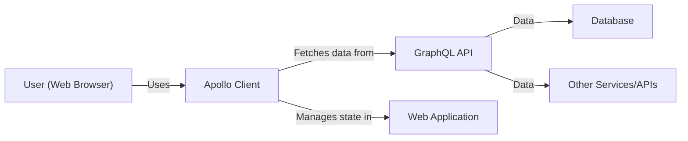
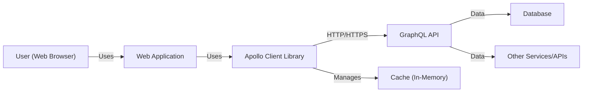
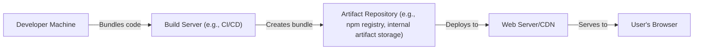
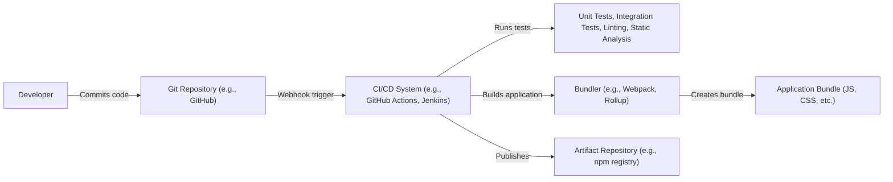

Okay, let's create a design document for the Apollo Client project, keeping in mind its purpose and potential security considerations.

# BUSINESS POSTURE

Apollo Client is a comprehensive state management library for JavaScript that enables developers to manage both local and remote data with GraphQL.  It's designed to help developers build high-quality, maintainable applications that interact with GraphQL APIs.  It is a crucial component for many modern web applications, particularly those that rely heavily on real-time data or complex data interactions.

Priorities:

-   Ease of Use:  Make it simple for developers to integrate and use GraphQL in their applications.
-   Performance:  Ensure efficient data fetching and caching to provide a smooth user experience.
-   Flexibility:  Support a wide range of use cases and integration with various front-end frameworks.
-   Maintainability:  Provide a well-documented and testable codebase.
-   Community:  Foster a strong and active community to support users and contributors.
-   Reliability: Ensure that data is fetched and managed reliably, even with intermittent network connectivity.

Goals:

-   Become the leading state management solution for GraphQL.
-   Simplify the development of data-driven applications.
-   Provide a robust and reliable platform for managing application data.

Business Risks:

-   Data Breaches:  If vulnerabilities exist, attackers could potentially access or manipulate sensitive data fetched through the client.
-   Denial of Service:  Poorly optimized queries or client-side vulnerabilities could be exploited to overload the GraphQL server or the client application.
-   Data Corruption:  Bugs in the client could lead to incorrect data being displayed or stored, potentially leading to data integrity issues.
-   Dependency Vulnerabilities:  Vulnerabilities in third-party dependencies could be exploited through the client.
-   Incorrect State Management: Logic errors in how the client manages state could lead to application instability or unexpected behavior.
-   Reputational Damage: Security incidents or major bugs could damage the reputation of the Apollo Client and the applications that use it.

# SECURITY POSTURE

Existing Security Controls:

-   security control: Code Reviews: The project is open-source and undergoes community code reviews. (Visible on GitHub).
-   security control: Testing: The project has a comprehensive test suite, including unit and integration tests. (Visible in the GitHub repository).
-   security control: Dependency Management: The project uses package managers (like npm or yarn) to manage dependencies. (Visible in `package.json` and lock files).
-   security control: Community Reporting: Vulnerabilities can be reported by the community. (GitHub Issues).
-   security control: Static Analysis: Likely use of linters and static analysis tools to identify potential code quality and security issues. (Visible in configuration files like `.eslintrc.js`, `.prettierrc.js`).

Accepted Risks:

-   accepted risk: Client-Side Attacks: As a client-side library, Apollo Client is inherently vulnerable to attacks that target the client's environment (e.g., browser vulnerabilities, XSS if data isn't handled carefully). This is a general risk for any client-side JavaScript code.
-   accepted risk: Third-Party Dependency Risks: While dependencies are managed, there's always a risk of vulnerabilities in third-party libraries.
-   accepted risk: User Misconfiguration: Developers misusing the library (e.g., not validating data, improper error handling) could introduce security vulnerabilities.

Recommended Security Controls:

-   security control: Regular Security Audits: Conduct periodic security audits, both internal and external, to identify potential vulnerabilities.
-   security control: Content Security Policy (CSP): Provide guidance and examples for developers on implementing CSP to mitigate XSS risks.
-   security control: Subresource Integrity (SRI): If distributing via CDN, use SRI tags to ensure the integrity of the fetched resources.
-   security control: Automated Dependency Scanning: Integrate automated dependency scanning tools (e.g., Snyk, Dependabot) into the CI/CD pipeline.
-   security control: Security Training: Provide security training for core contributors to ensure secure coding practices.

Security Requirements:

-   Authentication:
    -   The client should support various authentication mechanisms (e.g., API keys, JWT tokens, OAuth) for interacting with secured GraphQL APIs.
    -   Sensitive authentication data (e.g., tokens) should never be stored directly in the client-side code. Secure storage mechanisms (e.g., HTTP-only cookies, browser's secure storage APIs) should be used where appropriate, or the token should be managed server-side.

-   Authorization:
    -   The client itself doesn't handle authorization logic (that's the responsibility of the GraphQL server). However, it should correctly transmit authentication credentials to enable the server to enforce authorization rules.

-   Input Validation:
    -   While the GraphQL schema itself provides some level of input validation, the client should encourage developers to perform additional validation on the client-side to prevent common vulnerabilities (e.g., XSS, injection attacks).  This is particularly important for data that is displayed to the user.
    -   Provide clear documentation and examples on how to sanitize user inputs before sending them to the GraphQL server.

-   Cryptography:
    -   The client should use secure communication protocols (HTTPS) for all network requests.
    -   If caching sensitive data, consider encryption at rest, especially if using local storage.

# DESIGN

## C4 CONTEXT

Element Descriptions:

-   Element:
    -   Name: User (Web Browser)
    -   Type: Person
    -   Description: A person interacting with the web application through a web browser.
    -   Responsibilities: Initiates requests, views data, interacts with the application.
    -   Security controls: Browser security features (e.g., same-origin policy, CSP), user authentication (handled by the application).

-   Element:
    -   Name: Apollo Client
    -   Type: Software System
    -   Description: A JavaScript library for managing state and fetching data with GraphQL.
    -   Responsibilities: Fetches data from GraphQL APIs, caches data, manages application state, provides an API for interacting with data.
    -   Security controls: Secure communication (HTTPS), input validation (guidance), dependency management.

-   Element:
    -   Name: GraphQL API
    -   Type: Software System
    -   Description: A GraphQL server that provides data to the Apollo Client.
    -   Responsibilities: Exposes a GraphQL schema, resolves queries and mutations, enforces authorization rules.
    -   Security controls: Authentication, authorization, input validation, rate limiting, query depth limiting.

-   Element:
    -   Name: Web Application
    -   Type: Software System
    -   Description: The web application that uses Apollo Client to manage its data.
    -   Responsibilities: Renders UI, handles user interactions, interacts with Apollo Client.
    -   Security controls: XSS prevention, CSRF protection, input validation, secure session management.

-   Element:
    -   Name: Database
    -   Type: Software System
    -   Description: The database that stores the data accessed by the GraphQL API.
    -   Responsibilities: Stores and retrieves data.
    -   Security controls: Access control, encryption at rest, encryption in transit, auditing.

-   Element:
    -   Name: Other Services/APIs
    -   Type: Software System
    -   Description: Other services or APIs that the GraphQL API might interact with.
    -   Responsibilities: Provide specific functionalities or data.
    -   Security controls: Varies depending on the service.

## C4 CONTAINER

Element Descriptions:

-   Element:
    -   Name: User (Web Browser)
        - Type: Person
        - Description: A person interacting with the web application.
        - Responsibilities: Initiates requests, views data, interacts with the application.
        - Security controls: Browser security features, user authentication.

-   Element:
    -   Name: Web Application
        - Type: Container: JavaScript Application
        - Description: The front-end application running in the user's browser.
        - Responsibilities: Renders UI, handles user input, interacts with Apollo Client.
        - Security controls: XSS prevention, CSRF protection, input validation.

-   Element:
    -   Name: Apollo Client Library
        - Type: Container: JavaScript Library
        - Description: The Apollo Client library integrated into the web application.
        - Responsibilities: Fetches data, manages cache, updates application state.
        - Security controls: Secure communication (HTTPS), input validation (guidance).

-   Element:
    -   Name: Cache (In-Memory)
        - Type: Container: Data Store
        - Description: An in-memory cache used by Apollo Client to store fetched data.
        - Responsibilities: Stores data, provides fast access to cached data.
        - Security controls: Data is cleared when the browser session ends (typically).

-   Element:
    -   Name: GraphQL API
        - Type: Container: Web Application
        - Description: The GraphQL server.
        - Responsibilities: Processes GraphQL queries and mutations.
        - Security controls: Authentication, authorization, input validation, rate limiting.

-   Element:
    -   Name: Database
        - Type: Container: Database
        - Description: The database used by the GraphQL API.
        - Responsibilities: Stores and retrieves data.
        - Security controls: Access control, encryption.

-   Element:
    -   Name: Other Services/APIs
        - Type: Container: Varies
        - Description: Other services the GraphQL API might interact with.
        - Responsibilities: Varies depending on the service.
        - Security controls: Varies depending on the service.

## DEPLOYMENT

Possible Deployment Solutions:

1.  **Bundled with Web Application:** The most common scenario. Apollo Client is a JavaScript library, typically bundled with the web application's JavaScript code using tools like Webpack, Rollup, or Parcel.  The entire application is then deployed as static files to a web server or CDN.
2.  **CDN:** Apollo Client can be included from a CDN (Content Delivery Network). This can improve loading times and reduce server load.
3.  **Server-Side Rendering (SSR):** In SSR scenarios, Apollo Client can be used on the server to pre-fetch data before rendering the initial HTML.

Chosen Solution (Detailed Description): Bundled with Web Application

Element Descriptions:

-   Element:
    -   Name: Developer Machine
        - Type: Infrastructure Node
        - Description: The developer's local development environment.
        - Responsibilities: Writing code, running local tests.
        - Security controls: Local development environment security best practices.

-   Element:
    -   Name: Build Server (e.g., CI/CD)
        - Type: Infrastructure Node
        - Description: A server that automates the build and deployment process.
        - Responsibilities: Runs tests, builds the application bundle, deploys the application.
        - Security controls: Access control, secure configuration, vulnerability scanning.

-   Element:
    -   Name: Artifact Repository (e.g., npm registry, internal artifact storage)
        - Type: Infrastructure Node
        - Description: A repository that stores the built application artifacts.
        - Responsibilities: Stores and versions application builds.
        - Security controls: Access control, integrity checks.

-   Element:
    -   Name: Web Server/CDN
        - Type: Infrastructure Node
        - Description: A web server or CDN that hosts the web application's static files.
        - Responsibilities: Serves the application to users' browsers.
        - Security controls: HTTPS, WAF (Web Application Firewall), DDoS protection.

-   Element:
    -   Name: User's Browser
        - Type: Infrastructure Node
        - Description: The user's web browser.
        - Responsibilities: Runs the web application.
        - Security controls: Browser security features (e.g., same-origin policy, CSP).

## BUILD

Build Process Description:

1.  **Code Commit:** Developers commit code changes to a Git repository (e.g., GitHub).
2.  **CI/CD Trigger:** A webhook triggers the CI/CD system (e.g., GitHub Actions, Jenkins) on code changes.
3.  **Testing:** The CI/CD system runs various tests, including:
    -   Unit Tests: Test individual components of the Apollo Client library.
    -   Integration Tests: Test the interaction between different parts of the library and with a GraphQL server.
    -   Linting: Check code style and identify potential errors.
    -   Static Analysis: Analyze the code for potential security vulnerabilities and code quality issues.
4.  **Bundling:** If tests pass, a bundler (e.g., Webpack, Rollup) creates the application bundle, including the Apollo Client library and other dependencies.
5.  **Publishing:** The CI/CD system publishes the built application bundle to an artifact repository (e.g., npm registry for the library itself, or an internal artifact repository for a complete web application).
6.  **Supply Chain Security:**
    -   Dependency Management: Use package managers (npm, yarn) with lock files to ensure consistent and reproducible builds.
    -   Dependency Scanning: Integrate automated dependency scanning tools (e.g., Snyk, Dependabot) to identify and address vulnerabilities in dependencies.
    -   Code Signing: Consider code signing the published artifacts to ensure their integrity.

# RISK ASSESSMENT

Critical Business Processes:

-   Data Fetching: The core process of retrieving data from a GraphQL API.
-   State Management: Managing the application's state, including cached data and UI updates.
-   Real-time Updates: Handling real-time data updates using subscriptions.

Data Sensitivity:

-   The sensitivity of the data handled by Apollo Client depends entirely on the application using it. Apollo Client itself doesn't inherently handle sensitive data, but it *transports* data that could be highly sensitive (e.g., PII, financial data, health data) or non-sensitive (e.g., public content).
-   The GraphQL API and the underlying data stores are responsible for classifying and protecting data according to its sensitivity. Apollo Client should be configured to use secure transport (HTTPS) to protect data in transit.

# QUESTIONS & ASSUMPTIONS

Questions:

-   What specific GraphQL servers are commonly used with Apollo Client (to understand potential integration points and security considerations)?
-   Are there any specific compliance requirements (e.g., GDPR, HIPAA) that applications using Apollo Client typically need to adhere to?
-   What are the most common deployment environments for applications using Apollo Client (e.g., cloud providers, on-premise)?
-   What is the expected scale of applications using Apollo Client (number of users, data volume)?

Assumptions:

-   BUSINESS POSTURE: Assumes that the primary goal is to provide a reliable and efficient GraphQL client, prioritizing developer experience and performance.
-   SECURITY POSTURE: Assumes a moderate risk tolerance, typical of an open-source library.  Relies heavily on community contributions and secure coding practices.
-   DESIGN: Assumes a standard web application architecture, with Apollo Client running in the browser and communicating with a GraphQL API over HTTPS. Assumes that developers using the library are responsible for implementing appropriate security measures in their own applications.