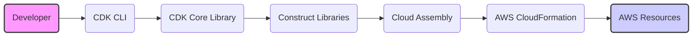
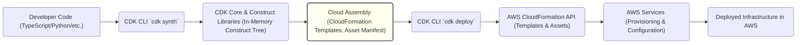

# Project Design Document: AWS Cloud Development Kit (CDK)

**Version:** 1.1
**Date:** October 26, 2023
**Author:** AI Architecture Expert

## 1. Introduction

This document provides an enhanced architectural design of the AWS Cloud Development Kit (CDK), a software development framework enabling developers to define cloud infrastructure as code using familiar programming languages. This design focuses on clarity and detail to facilitate effective threat modeling. It outlines the CDK's components, their interactions, and the flow of data, providing a solid foundation for identifying potential security vulnerabilities.

## 2. Goals and Objectives

The core design goals of the AWS CDK are:

*   **Developer-Centric Infrastructure Definition:** Empower developers to define and manage infrastructure using their preferred programming languages (TypeScript, Python, Java, .NET, Go).
*   **Abstraction and Simplification:** Offer high-level, reusable components (Constructs) that abstract away the complexities of individual AWS resource configurations.
*   **Promote Reusability and Sharing:** Enable the creation and distribution of custom Constructs, fostering code sharing and consistent infrastructure patterns.
*   **Reliable and Repeatable Deployments:** Leverage AWS CloudFormation as the underlying engine for provisioning and managing infrastructure changes.
*   **Accelerate Development Cycles:** Streamline the infrastructure definition and deployment process, increasing developer productivity.

## 3. High-Level Architecture

The AWS CDK primarily operates within the developer's local environment during the development and synthesis phases, interacting with AWS services primarily during deployment. Key actors and components include:

*   **Developer:** The user who writes and executes CDK code to define infrastructure.
*   **CDK CLI (`cdk`):** The command-line interface that developers use to interact with the CDK for tasks like synthesizing templates and deploying stacks.
*   **CDK Core Library (`aws-cdk-lib`):** Provides the foundational classes and interfaces necessary for defining infrastructure as code, managing the Construct tree, and orchestrating the synthesis process.
*   **Construct Libraries (`aws-cdk-lib.aws_*`):** Collections of pre-built, reusable components (Constructs) representing AWS resources and common infrastructure patterns, simplifying resource definition.
*   **Cloud Assembly (`.cdk.out`):** The output directory containing the generated CloudFormation templates (JSON or YAML), asset manifests, and other artifacts ready for deployment.
*   **AWS CloudFormation:** The AWS service responsible for provisioning and managing the lifecycle of the infrastructure defined in the Cloud Assembly.
*   **AWS Resources:** The actual AWS services (e.g., EC2 instances, S3 buckets, Lambda functions) that are created and managed by CloudFormation based on the CDK definitions.

## 4. Detailed Architecture

A more granular view of the CDK architecture reveals the following components and their interactions:

*   **CDK CLI (`cdk` command):**
    *   **Command Handling:** Parses and interprets user commands (e.g., `synth`, `deploy`, `destroy`).
    *   **Project Management:** Manages CDK project configuration (e.g., `cdk.json`, `package.json`), dependencies, and environment settings.
    *   **Synthesis Invocation:** Triggers the CDK Core Library to synthesize CloudFormation templates from the defined infrastructure code.
    *   **Deployment Orchestration:** Interacts with the AWS CloudFormation API to create, update, or delete stacks based on the generated templates.
    *   **Asset Management:** Handles the packaging and uploading of assets (e.g., Lambda function code, Docker images) to S3 for use by CloudFormation.
    *   **Credential Management:** Utilizes configured AWS credentials to interact with AWS services.
*   **CDK Core Library (`aws-cdk-lib`):**
    *   **Construct Abstraction:** Provides the base `Construct` class and related APIs for building the infrastructure tree.
    *   **Logical Tree Management:** Maintains the in-memory representation of the infrastructure being defined.
    *   **Synthesis Engine:** Traverses the Construct tree and generates the corresponding CloudFormation template(s).
    *   **Token Resolution:** Handles the resolution of dynamic values and cross-stack references during synthesis.
    *   **Aspect Framework:** Enables the application of cross-cutting concerns (e.g., tagging, security policies) to Constructs.
*   **Construct Libraries (`aws-cdk-lib.aws_*`):**
    *   **Resource Abstraction:** Offers high-level abstractions for specific AWS services (e.g., `Bucket`, `Function`, `Vpc`).
    *   **Property Validation:** Enforces type checking and validation of resource properties.
    *   **Default Configurations:** Provides sensible default configurations for AWS resources, reducing boilerplate.
    *   **Pattern Implementation:** Encapsulates common infrastructure patterns and best practices.
    *   **Extensibility:** Allows developers to create custom Constructs by composing existing ones or extending base classes.
*   **Cloud Assembly (`.cdk.out` directory):**
    *   **CloudFormation Templates:** Contains the generated JSON or YAML files that define the AWS resources to be provisioned.
    *   **Asset Manifest:** Lists the assets (e.g., files, Docker images) required for deployment and their corresponding S3 locations.
    *   **Metadata:** Includes metadata about the CDK application and the synthesis process.
*   **AWS CloudFormation Integration:**
    *   **API Interaction:** The CDK CLI uses the AWS SDK to communicate with the CloudFormation API endpoints.
    *   **Template Submission:** Submits the generated CloudFormation templates to CloudFormation for stack creation or updates.
    *   **Change Set Management:** Leverages CloudFormation Change Sets to preview infrastructure modifications before applying them.
    *   **Stack Lifecycle Management:** Manages the creation, updating, and deletion of CloudFormation stacks.
*   **CDK Toolkit (Bootstrapping):**
    *   **Environment Preparation:** Sets up the necessary resources in an AWS environment to support CDK deployments.
    *   **S3 Bucket Creation:** Creates an S3 bucket in the target AWS account and region to store deployment assets.
    *   **IAM Role Provisioning:** Provisions an IAM role with the necessary permissions for CloudFormation to manage resources in the stack.

## 5. Key Components and Their Functionality

A deeper dive into the core building blocks of a CDK application:

*   **CDK Application:**
    *   **Project Entry Point:** The main file (e.g., `app.py`, `main.ts`) that initializes the CDK application.
    *   **Stack Definition:** Contains the definition of one or more CDK Stacks.
    *   **Construct Instantiation:** Instantiates Constructs from the CDK libraries to represent the desired infrastructure.
*   **CDK Stack:**
    *   **Deployment Unit:** Represents a single unit of deployment in the CDK, directly corresponding to a CloudFormation stack.
    *   **Construct Grouping:** Organizes a collection of related Constructs.
    *   **Resource Scoping:** Defines the boundary for the resources that will be provisioned and managed together.
*   **Construct:**
    *   **Infrastructure Building Block:** The fundamental unit of composition in a CDK application, representing a cloud component or a pattern.
    *   **Resource Representation:** Can represent a single AWS resource (e.g., `CfnBucket`) or a higher-level abstraction composed of multiple resources (e.g., `Bucket`).
    *   **Property Configuration:** Configured through properties that define the attributes of the underlying resource(s).
*   **Aspects:**
    *   **Cross-Cutting Modifications:** Allow for applying modifications or validations to multiple Constructs within a Stack.
    *   **Policy Enforcement:** Can be used to enforce naming conventions, add mandatory tags, or implement security policies across resources.
*   **Context:**
    *   **Configuration Data:** Provides a mechanism to pass configuration information to the CDK application during synthesis.
    *   **Environment-Specific Settings:** Can be used to define different configurations for development, staging, and production environments.
    *   **External Data Integration:** Allows for loading configuration from external sources.

## 6. Data Flow

The typical flow of data during a CDK application deployment:

1. **Developer Code (TypeScript/Python/etc.):** Developers write code using a supported programming language and the CDK libraries to define their infrastructure.
2. **CDK CLI `cdk synth`:** The developer executes the `cdk synth` command, instructing the CDK to synthesize the infrastructure definition.
3. **CDK Core & Construct Libraries (In-Memory Construct Tree):** The CDK Core Library and relevant Construct Libraries process the developer's code, building an in-memory representation of the infrastructure as a tree of Constructs.
4. **Cloud Assembly (CloudFormation Templates, Asset Manifest):** The synthesis process generates the Cloud Assembly, which includes:
    *   One or more CloudFormation templates (JSON or YAML) describing the AWS resources to be created or updated.
    *   An asset manifest detailing any files or Docker images that need to be uploaded to S3.
5. **CDK CLI `cdk deploy`:** The developer executes the `cdk deploy` command, specifying the stack to be deployed.
6. **AWS CloudFormation API (Templates & Assets):** The CDK CLI uses the AWS SDK to communicate with the AWS CloudFormation API, submitting:
    *   The generated CloudFormation template.
    *   Instructions to CloudFormation to retrieve assets from the designated S3 bucket (as specified in the asset manifest).
7. **AWS Services (Provisioning & Configuration):** CloudFormation interprets the template and orchestrates the provisioning and configuration of the specified AWS resources by interacting with the respective AWS service APIs.
8. **Deployed Infrastructure in AWS:** The desired cloud infrastructure is created and configured within the AWS environment based on the definitions provided by the CDK application.

## 7. Security Considerations (For Threat Modeling)

This section outlines potential security considerations relevant for threat modeling the AWS CDK:

*   **Developer Environment Security:**
    *   **Threat:** Compromised developer workstations could expose AWS credentials, allowing unauthorized access to AWS resources or the injection of malicious code into CDK applications.
    *   **Mitigation:** Enforce strong authentication, utilize multi-factor authentication (MFA), and implement regular security scans on developer machines.
    *   **Threat:** Supply chain attacks targeting CDK dependencies (e.g., npm, PyPI, Maven). Malicious packages could be included in the project's dependencies.
    *   **Mitigation:** Employ dependency scanning tools, utilize software composition analysis (SCA), and pin dependencies to specific versions.
*   **CDK CLI Security:**
    *   **Threat:** Misconfigured or exposed AWS credentials used by the CDK CLI could lead to unauthorized deployments or modifications of infrastructure.
    *   **Mitigation:** Utilize IAM roles for the CDK CLI, leverage AWS SSO for centralized credential management, and avoid storing credentials directly in code or configuration files.
    *   **Threat:** Vulnerabilities in the CDK CLI itself could be exploited by malicious actors.
    *   **Mitigation:** Keep the CDK CLI updated to the latest version, monitor for security advisories, and follow security best practices for command-line tools.
*   **Cloud Assembly Security:**
    *   **Threat:** Sensitive information (e.g., secrets, API keys, database passwords) might be inadvertently included in CloudFormation templates or asset files within the `.cdk.out` directory.
    *   **Mitigation:** Avoid hardcoding secrets, utilize AWS Secrets Manager or Parameter Store, and implement secure handling of sensitive data during the build and deployment process.
    *   **Threat:** Unauthorized access to the `.cdk.out` directory could expose sensitive infrastructure details and potential vulnerabilities.
    *   **Mitigation:** Restrict access to the `.cdk.out` directory using appropriate file system permissions and access controls.
*   **CloudFormation Security:**
    *   **Threat:** Overly permissive IAM roles granted to CloudFormation could allow it to perform actions beyond the intended scope.
    *   **Mitigation:** Follow the principle of least privilege when defining IAM roles for CloudFormation, granting only the necessary permissions.
    *   **Threat:** Vulnerabilities in the CloudFormation service itself could be exploited.
    *   **Mitigation:** Stay informed about AWS security bulletins and best practices for securing CloudFormation deployments.
*   **Deployed Resource Security:**
    *   **Threat:** Security misconfigurations in the provisioned AWS resources (e.g., open security groups, public S3 buckets, unencrypted data) could create vulnerabilities.
    *   **Mitigation:** Utilize secure defaults provided by CDK Constructs, implement security best practices within the CDK code, and leverage security scanning tools to identify misconfigurations.
    *   **Threat:** Vulnerabilities in the applications deployed on the infrastructure provisioned by the CDK.
    *   **Mitigation:** Implement secure coding practices, perform regular vulnerability assessments, and utilize security scanning tools in the CI/CD pipeline.
*   **Secrets Management:**
    *   **Threat:** Hardcoding secrets directly in CDK code or CloudFormation templates exposes them in plain text.
    *   **Mitigation:** Never hardcode secrets. Utilize AWS Secrets Manager, AWS Systems Manager Parameter Store, or other secure secrets management solutions.
    *   **Threat:** Insecure storage or transmission of secrets during the deployment process.
    *   **Mitigation:** Ensure secrets are encrypted in transit and at rest. Leverage AWS KMS for encryption.
*   **Identity and Access Management (IAM):**
    *   **Threat:** Insufficiently scoped IAM roles and policies for developers and deployment pipelines could lead to unauthorized actions.
    *   **Mitigation:** Implement the principle of least privilege when defining IAM roles and policies for developers and CI/CD systems.
    *   **Threat:** Overly broad permissions granted to CDK-deployed resources could increase the attack surface.
    *   **Mitigation:** Scope down IAM permissions for deployed resources to the minimum necessary for their intended function.
*   **Logging and Monitoring:**
    *   **Threat:** Lack of adequate logging and monitoring of CDK deployments and the provisioned infrastructure can hinder incident response and security analysis.
    *   **Mitigation:** Enable CloudTrail logging for API calls, configure CloudWatch Logs for application and resource logs, and implement monitoring and alerting for security events.
    *   **Threat:** Insufficient auditing of changes made through the CDK can make it difficult to track and investigate security incidents.
    *   **Mitigation:** Utilize CloudTrail to audit changes made to infrastructure through the CDK and CloudFormation.
*   **Bootstrapping Process:**
    *   **Threat:** A misconfigured or compromised bootstrapping S3 bucket could lead to the exposure of deployment assets or the injection of malicious content.
    *   **Mitigation:** Secure the bootstrapping S3 bucket with appropriate access policies and encryption.
    *   **Threat:** Overly permissive permissions granted to the CloudFormation execution role during bootstrapping.
    *   **Mitigation:** Scope down the permissions of the CloudFormation execution role to the minimum necessary for deploying resources.

## 8. Deployment Process

A typical CDK application deployment follows these steps:

1. **Initialize CDK Project:** Use the CDK CLI (`cdk init`) to create a new project in the desired programming language.
2. **Define Infrastructure:** Write CDK code, utilizing Constructs, to define the desired AWS resources and their configurations.
3. **Synthesize Cloud Assembly:** Execute `cdk synth` to generate the CloudFormation templates and asset manifest in the `.cdk.out` directory.
4. **Review Generated Templates (Optional but Recommended):** Inspect the generated CloudFormation templates for accuracy, security configurations, and potential issues.
5. **Bootstrap Environment (If Necessary):** Run `cdk bootstrap` to provision the necessary bootstrapping resources (S3 bucket, IAM role) in the target AWS account and region if they don't already exist.
6. **Deploy Stack:** Execute `cdk deploy` to submit the generated CloudFormation template and assets to AWS CloudFormation, initiating the provisioning process.
7. **Monitor Deployment:** Track the progress of the CloudFormation stack creation or update in the AWS Management Console or using the AWS CLI.
8. **Destroy Stack (If Needed):** Execute `cdk destroy` to remove all the resources associated with a deployed CDK stack using CloudFormation.

## 9. Future Considerations

*   **Enhanced Security Scanning Integration:** Deeper integration with security scanning tools to automatically analyze CDK code and generated CloudFormation templates for potential vulnerabilities and misconfigurations.
*   **Policy-as-Code Integration:** Improved support for integrating policy-as-code frameworks (e.g., OPA, AWS Config Rules) directly within CDK Constructs to enforce security and compliance policies.
*   **Secrets Management Enhancements:** More seamless and secure integration with secrets management services like AWS Secrets Manager for managing sensitive information within CDK applications.
*   **Improved IAM Policy Generation:** More intelligent and granular IAM policy generation based on the resources and actions defined in CDK Constructs, adhering to the principle of least privilege.
*   **Built-in Security Best Practices:** Further enhancement of CDK Constructs to incorporate security best practices by default, reducing the likelihood of common security misconfigurations.

This enhanced design document provides a more detailed and structured understanding of the AWS CDK architecture, specifically tailored for threat modeling. By considering the various components, data flows, and potential security considerations outlined here, security professionals can more effectively identify and mitigate risks associated with using the CDK for infrastructure as code.