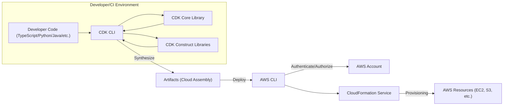

# Project Design Document: AWS Cloud Development Kit (CDK)

**Version:** 1.1
**Date:** October 26, 2023
**Author:** AI Cloud & Security Architect

## 1. Introduction

This document provides a detailed architectural design of the AWS Cloud Development Kit (CDK). It outlines the key components, data flows, and technologies involved in the CDK's operation. This document serves as a foundation for subsequent threat modeling activities to identify potential security vulnerabilities and design appropriate mitigations. This version includes more detailed explanations and expands on security considerations.

## 2. Goals and Objectives

*   Enable developers to define and provision cloud infrastructure as code using familiar programming languages, promoting developer productivity and reducing the learning curve for infrastructure management.
*   Provide high-level, reusable abstractions (Constructs) over AWS resources, simplifying infrastructure definition and promoting consistency and best practices.
*   Offer a consistent and repeatable way to provision and manage AWS infrastructure, reducing manual errors and ensuring infrastructure as code principles.
*   Integrate seamlessly with existing AWS services and workflows, leveraging the power and flexibility of the AWS ecosystem.
*   Facilitate the creation of reusable infrastructure components and patterns, enabling teams to share and standardize infrastructure configurations.
*   Enhance the security posture of deployed infrastructure by encouraging the use of secure defaults and enabling easier integration of security best practices.

## 3. Target Audience

*   Software developers who need to provision and manage cloud infrastructure.
*   DevOps engineers responsible for automating infrastructure deployments and managing infrastructure as code.
*   Security engineers who need to understand the architecture for threat modeling and security assessments.
*   Cloud architects designing and implementing cloud solutions using infrastructure as code.

## 4. High-Level Architecture

The AWS CDK operates primarily on the developer's local machine or within a CI/CD environment and interacts with AWS services through the AWS CLI and CloudFormation.

**Description of Components:**

*   **Developer Code (TypeScript/Python/Java/etc.):** The infrastructure-as-code definition written by the developer using a supported programming language. This code defines the desired state of the infrastructure.
*   **CDK CLI:** The command-line interface used to interact with the CDK. It orchestrates the synthesis and deployment processes, providing commands for managing CDK applications and stacks.
*   **CDK Core Library:** Provides the fundamental classes and abstractions necessary for defining CDK applications, stacks, and basic constructs. It handles the core logic of the CDK framework.
*   **CDK Construct Libraries:** Collections of pre-built, reusable components (Constructs) that represent AWS resources and common architectural patterns. These libraries abstract away the complexities of configuring individual AWS resources.
*   **AWS Account:** The target AWS environment where the infrastructure will be provisioned and managed. This is where the actual resources reside.
*   **AWS CLI:** The command-line interface used by the CDK CLI to interact with various AWS services, including CloudFormation, IAM, and S3. It handles the low-level API calls to AWS.
*   **CloudFormation Service:** The AWS service responsible for provisioning and managing infrastructure based on declarative templates. It interprets the generated CloudFormation template and orchestrates the creation, update, and deletion of AWS resources.
*   **AWS Resources (EC2, S3, etc.):** The actual cloud resources provisioned by CloudFormation based on the definitions in the CDK code.
*   **Artifacts (Cloud Assembly):** The output of the `cdk synth` command, containing the generated CloudFormation template (typically `template.json` or `template.yaml`) and any associated assets (e.g., zipped Lambda function code, Docker images).

## 5. Key Components and Their Functionality

*   **CDK Application (`App`):**
    *   Represents the root of a CDK project, serving as the entry point for defining infrastructure.
    *   Contains one or more CDK Stacks, logically grouping related resources.
    *   Manages the overall lifecycle of the CDK application, including initialization and synthesis.
*   **CDK Stack (`Stack`):**
    *   A unit of deployment in the CDK, directly corresponding to a CloudFormation stack. All resources within a stack are provisioned or updated together.
    *   Contains a collection of Constructs, representing the individual AWS resources and their configurations.
    *   Defines the scope of deployment and update operations, providing a boundary for managing infrastructure changes.
*   **Constructs:**
    *   The fundamental building blocks of CDK applications, encapsulating configuration and logic for AWS resources or higher-level patterns.
    *   Represent AWS resources or higher-level abstractions, simplifying infrastructure definition.
    *   Can be either:
        *   **L1 Constructs (CloudFormation Resources):** Direct, low-level mappings to CloudFormation resources, offering fine-grained control.
        *   **L2 Constructs (Curated Constructs):** Provide sensible defaults and simplify common configurations, reducing boilerplate code and promoting best practices.
        *   **L3 Constructs (Patterns):** Higher-level abstractions representing common architectural patterns, such as a load-balanced web service or a serverless API.
    *   Encapsulate configuration details, best practices, and often security hardening measures.
*   **CDK CLI Commands:**
    *   `cdk init`: Initializes a new CDK project, setting up the basic project structure and configuration files.
    *   `cdk synth`: Generates the CloudFormation template (Cloud Assembly) from the CDK code. This process involves interpreting the CDK code and translating it into a declarative template.
    *   `cdk deploy`: Deploys the CDK stack to AWS using CloudFormation. This command uploads the Cloud Assembly and initiates the CloudFormation stack creation or update process.
    *   `cdk destroy`: Deletes the deployed resources associated with a CDK stack using CloudFormation.
    *   `cdk diff`: Shows the differences between the current CDK code and the deployed stack, allowing developers to preview changes before deployment.
    *   `cdk watch`: Monitors file changes and automatically redeploys the stack, facilitating rapid development and testing.
*   **Cloud Assembly:**
    *   The output directory produced by the `cdk synth` command.
    *   Contains the generated CloudFormation template (usually `template.json` or `template.yaml`), which describes the infrastructure to be provisioned.
    *   May include other assets (e.g., zipped Lambda function code, Docker images, bundled files) that are necessary for deploying the infrastructure. These assets are typically stored in S3.
*   **AWS CloudFormation Hooks:**
    *   Allows custom logic to be executed during CloudFormation stack lifecycle events (e.g., pre-provisioning, post-provisioning).
    *   Can be defined and managed within the CDK, enabling custom actions to be performed before or after resource creation or updates. This can be used for tasks like custom security configurations or data seeding.

## 6. Data Flow

The primary data flow involves the transformation of developer code into deployable infrastructure through the CDK CLI and CloudFormation.

```mermaid
graph LR
    A["Developer Writes/Modifies CDK Code"] --> B["CDK CLI 'synth' Command"]
    B -- "Code Interpretation & Abstraction" --> C["CDK Core & Construct Libraries"]
    C -- "Template Generation & Asset Preparation" --> D["Cloud Assembly (CFN Template, Assets)"]
    D -- "Upload Artifacts" --> E["AWS S3 (for Assets)"]
    D --> F["CDK CLI 'deploy' Command"]
    F -- "Authentication & Authorization" --> G["AWS CLI"]
    G -- "Initiate Stack Operation" --> H["CloudFormation Service"]
    H -- "Retrieve Template & Assets" --> E
    H -- "Resource Provisioning" --> I["Provisioned AWS Resources"]
    H -- "Stack Events & Status Updates" --> F
```

**Detailed Steps:**

1. **Developer Writes/Modifies CDK Code:** Developers define or modify their infrastructure using a supported programming language and the CDK libraries, describing the desired state of their cloud resources.
2. **CDK CLI `synth` Command:** The developer executes the `cdk synth` command.
3. **CDK Core & Construct Libraries:** The CDK CLI invokes the core and construct libraries to interpret the developer's code. This involves resolving abstractions, applying defaults, and generating the underlying resource configurations.
4. **Cloud Assembly (CloudFormation Template, Assets):** The `synth` process generates a Cloud Assembly:
    *   The **CloudFormation Template:** A JSON or YAML file describing the AWS resources to be provisioned and their configurations.
    *   **Assets:**  Files or directories required by the infrastructure, such as Lambda function code, container images, or configuration files. These are prepared for upload.
5. **AWS S3 (for Assets):** The CDK CLI, during the `deploy` process, uploads the prepared assets to an S3 bucket in the target AWS account. The CloudFormation template will reference the location of these assets.
6. **CDK CLI `deploy` Command:** The developer executes the `cdk deploy` command, specifying the stack to deploy.
7. **AWS CLI:** The CDK CLI uses the AWS CLI, configured with appropriate credentials, to interact with AWS services.
8. **CloudFormation Service:** The AWS CLI sends the CloudFormation template and the locations of the uploaded assets in S3 to the CloudFormation service.
9. **Retrieve Template & Assets:** CloudFormation retrieves the CloudFormation template from the local environment (or a specified location) and accesses the necessary assets from S3.
10. **Resource Provisioning:** CloudFormation interprets the template and orchestrates the provisioning of the specified AWS resources in the target AWS account, using the information from the template and the assets.
11. **Stack Events & Status Updates:** CloudFormation provides real-time updates on the progress of the stack creation or update process, which can be monitored by the CDK CLI.

## 7. Security Considerations

*   **Secrets Management:**
    *   **Threat:** Hardcoding secrets in CDK code or CloudFormation templates exposes them.
    *   **Mitigation:** Utilize AWS Secrets Manager or AWS Systems Manager Parameter Store to manage secrets and inject them into resources using dynamic references. Avoid committing secrets to version control.
*   **IAM Roles and Permissions:**
    *   **Threat:** Overly permissive IAM roles granted to the CDK CLI or deployed resources can lead to privilege escalation.
    *   **Mitigation:** Follow the principle of least privilege. Define specific IAM roles with only the necessary permissions for the CDK CLI to deploy and for the deployed resources to function. Utilize CDK's IAM constructs to define fine-grained permissions.
*   **Code Injection:**
    *   **Threat:** Malicious code injected into custom resources or Lambda functions within the CDK application can compromise the environment.
    *   **Mitigation:** Thoroughly review and validate any custom code. Implement input validation and sanitization. Utilize secure coding practices.
*   **Dependency Management:**
    *   **Threat:** Security vulnerabilities in third-party libraries used by CDK applications can be exploited.
    *   **Mitigation:** Regularly scan dependencies for vulnerabilities using tools like npm audit or Snyk. Keep dependencies updated to the latest secure versions. Utilize software composition analysis (SCA).
*   **State Management:**
    *   **Threat:** Tampering with the CloudFormation state (stored in S3) could lead to inconsistent or compromised infrastructure.
    *   **Mitigation:** Secure the S3 bucket used by CloudFormation with appropriate access controls (e.g., bucket policies, KMS encryption). Enable versioning on the S3 bucket.
*   **Template Security:**
    *   **Threat:** Generated CloudFormation templates might contain security misconfigurations (e.g., open security groups, unencrypted resources).
    *   **Mitigation:** Utilize security linters and policy-as-code tools (e.g., AWS CloudFormation Guard, OPA) to scan generated templates for security violations. Leverage CDK's best practices and secure defaults in constructs.
*   **Supply Chain Security:**
    *   **Threat:** Compromised CDK libraries or dependencies could introduce vulnerabilities.
    *   **Mitigation:** Use trusted sources for CDK libraries. Verify the integrity of downloaded packages. Implement a secure development lifecycle for CDK applications.
*   **Access Control:**
    *   **Threat:** Unauthorized access to modify and deploy CDK applications can lead to malicious infrastructure changes.
    *   **Mitigation:** Implement strong authentication and authorization for accessing the development environment and CI/CD pipelines. Utilize version control and code review processes.
*   **Data at Rest and in Transit:**
    *   **Threat:** Sensitive data handled within the CDK's processes or the deployed infrastructure might be exposed if not properly encrypted.
    *   **Mitigation:** Enforce encryption at rest and in transit for sensitive data using KMS encryption. Utilize secure communication protocols (HTTPS). Configure resources to enforce encryption by default.
*   **CDK Pipelines Security:**
    *   **Threat:** Vulnerabilities in the CI/CD pipeline used to deploy CDK applications can be exploited to compromise deployments.
    *   **Mitigation:** Secure the CI/CD pipeline with appropriate access controls, secure credentials management, and vulnerability scanning. Implement pipeline stages for security testing and approval.

## 8. Technology Stack

*   **Programming Languages (for CDK Applications):** TypeScript, Python, Java, C#, Go, JavaScript.
*   **CDK Core Library:** Primarily written in TypeScript.
*   **AWS SDK:** Used by the CDK CLI to interact with AWS services.
*   **Node.js:** Required for running the CDK CLI and managing Node.js-based CDK projects.
*   **AWS CLI:** Used for authentication and low-level interaction with AWS services.
*   **CloudFormation:** The underlying infrastructure-as-code engine responsible for provisioning resources.
*   **IAM:** For managing permissions and access control for both the CDK CLI and deployed resources.
*   **S3:** Used for storing CloudFormation templates and assets during deployment.
*   **ECR (optional):** For storing container images used in CDK deployments.

## 9. Deployment Model

*   **Local Development:** Developers write and test CDK code on their local machines, using the CDK CLI to synthesize and deploy stacks.
*   **CI/CD Pipelines:** CDK applications are frequently integrated into CI/CD pipelines (e.g., AWS CodePipeline, GitHub Actions, Jenkins) for automated deployment and management of infrastructure changes.
*   **AWS CloudShell:** The CDK CLI can be used within AWS CloudShell, providing a browser-based environment for managing infrastructure.
*   **AWS CodeBuild/CodePipeline:** Commonly used AWS services for building and deploying CDK applications in an automated fashion.

## 10. Assumptions and Constraints

*   Developers have access to an AWS account with appropriate IAM permissions to deploy resources.
*   The AWS CLI is configured correctly with valid credentials and the desired AWS region.
*   Node.js and the CDK CLI are installed and configured on the developer's machine or within the CI/CD environment.
*   CloudFormation service limits are not exceeded for the resources being provisioned.
*   The security of the developer's local environment and any CI/CD systems is maintained.
*   Network connectivity exists between the deployment environment and AWS services.

## 11. Future Considerations

*   **Improved Security Scanning and Analysis:** Deeper integration with security scanning tools to automatically analyze CDK code and generated CloudFormation templates for vulnerabilities and misconfigurations.
*   **Policy as Code Integration:** Enhanced integration with policy-as-code tools like AWS CloudFormation Guard and Open Policy Agent (OPA) to enforce security and compliance policies directly within the CDK workflow.
*   **Enhanced Construct Libraries:** Continuously expanding the range and capabilities of pre-built Constructs, including more security-focused abstractions and best practices.
*   **Simplified State Management:** Exploring and potentially implementing alternative or enhanced state management solutions for improved reliability and security.
*   **Improved Developer Experience:** Further streamlining the development and deployment process, potentially through improved tooling and more intuitive APIs.
*   **Native Integration with More AWS Services:** Deeper and more seamless integration with a wider range of AWS services through dedicated CDK constructs.

This document provides a comprehensive and detailed overview of the AWS CDK architecture, serving as a valuable resource for understanding its components, data flows, and security considerations. This information is crucial for conducting thorough threat modeling and implementing appropriate security controls to protect CDK-managed infrastructure.