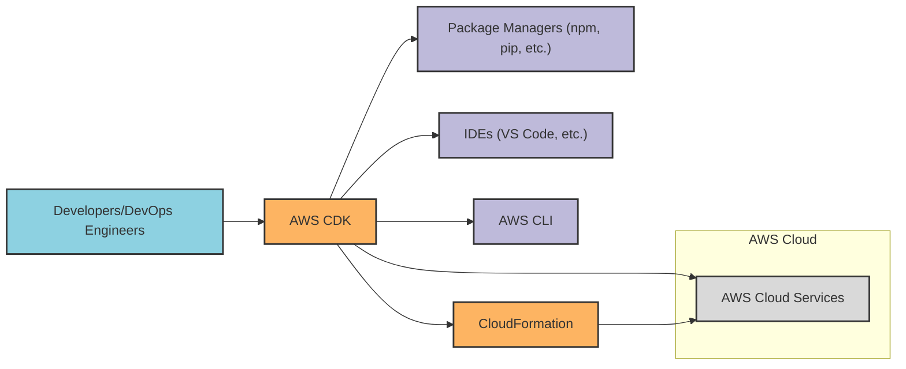
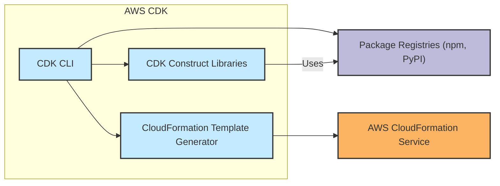
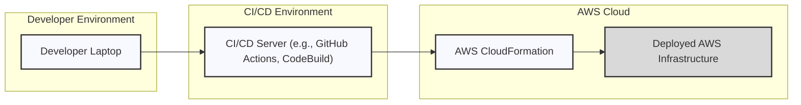

# BUSINESS POSTURE

The AWS Cloud Development Kit (CDK) project aims to provide a developer-friendly way to define cloud infrastructure as code and provision it through AWS CloudFormation. It allows developers to use familiar programming languages to define their infrastructure, abstracting away the complexities of raw CloudFormation templates.

- Business Priorities and Goals:
  - Simplify cloud infrastructure management for developers.
  - Increase developer productivity by using familiar programming languages for infrastructure as code.
  - Promote best practices and reusable infrastructure patterns through CDK constructs.
  - Accelerate cloud adoption and innovation on the AWS platform.
  - Reduce errors and inconsistencies in infrastructure deployments compared to manual configuration or raw CloudFormation.
  - Enable easier testing and version control of infrastructure configurations.

- Business Risks:
  - Security vulnerabilities in the CDK framework could lead to widespread misconfigurations and security breaches in AWS customer environments.
  - Complexity of the CDK framework might lead to misuse or unintended consequences if not properly understood.
  - Dependency on the CDK framework could create vendor lock-in if not carefully managed.
  - Bugs or limitations in CDK could delay project timelines or require workarounds.
  - Open-source nature of the project requires community trust and reliance on the maintainers for security and stability.

# SECURITY POSTURE

- Security Controls:
  - security control: Secure Software Development Lifecycle (SSDLC) - Implemented by AWS for all its services and open-source projects. Described in internal AWS security documentation and general AWS security best practices.
  - security control: Code Reviews - Implemented via GitHub pull requests and AWS internal code review processes. Described in GitHub repository contribution guidelines and AWS internal development processes.
  - security control: Static Code Analysis - Likely implemented using internal AWS tools and potentially integrated into the build pipeline. Not publicly documented in detail but standard practice for AWS projects.
  - security control: Dependency Scanning - Likely implemented using internal AWS tools to scan for vulnerabilities in dependencies. Not publicly documented in detail but standard practice for AWS projects.
  - security control: Build Pipeline Security - Implemented using AWS CodeBuild and other AWS services with IAM roles and access controls. Described in AWS documentation for CodeBuild and CI/CD best practices.
  - security control: Access Control to Repository - Implemented via GitHub permissions and AWS IAM for internal access. Described in GitHub documentation and AWS IAM documentation.
  - security control: Infrastructure as Code Security Scanning - While not explicitly stated for CDK itself, AWS provides services like AWS Security Hub and AWS Config that can be used to scan deployed infrastructure based on CloudFormation templates generated by CDK. Described in AWS Security Hub and AWS Config documentation.

- Accepted Risks:
  - accepted risk: Open-source nature implies public code visibility, potentially increasing the attack surface if vulnerabilities are discovered before patches are available. Mitigation is through proactive security practices and community engagement.
  - accepted risk: Reliance on third-party dependencies introduces supply chain risks. Mitigation is through dependency scanning and careful dependency management.
  - accepted risk: Complexity of the framework might lead to misconfigurations by users. Mitigation is through comprehensive documentation, examples, and best practices guidance.

- Recommended Security Controls:
  - security control: Supply Chain Security Hardening - Implement measures to verify the integrity and provenance of dependencies, potentially using tools like sigstore or similar mechanisms for verifying package signatures.
  - security control: Infrastructure as Code Security Scanning (Pre-deployment) - Integrate security scanning tools into the CDK build process to analyze generated CloudFormation templates for security misconfigurations before deployment. Tools like `cfn-lint` or commercial IaC security scanners can be used.
  - security control: Runtime Security Monitoring for CDK Applications - Provide guidance and examples for users on how to implement runtime security monitoring for applications deployed using CDK, leveraging AWS security services like CloudWatch, GuardDuty, and Security Hub.

- Security Requirements:
  - Authentication:
    - Requirement: CDK CLI operations that interact with AWS services must be authenticated using valid AWS credentials.
    - Requirement: Access to the CDK GitHub repository and build systems should be authenticated and authorized.
  - Authorization:
    - Requirement: CDK CLI operations should respect AWS IAM permissions of the authenticated user or role.
    - Requirement: CDK constructs should enforce least privilege principles when creating IAM roles and policies for deployed resources.
    - Requirement: Access to CDK repository and build systems should be authorized based on roles and responsibilities.
  - Input Validation:
    - Requirement: CDK CLI should validate user inputs to prevent injection attacks and other input-related vulnerabilities.
    - Requirement: CDK constructs should validate user-provided properties to ensure they are within expected ranges and formats, preventing unexpected behavior or security issues in generated CloudFormation templates.
    - Requirement: CDK should validate dependencies and external resources to prevent supply chain attacks.
  - Cryptography:
    - Requirement: Sensitive data handled by CDK, such as API keys or secrets, should be encrypted at rest and in transit.
    - Requirement: CDK should provide mechanisms for users to easily integrate encryption into their infrastructure deployments, such as using AWS KMS for key management and encryption of data at rest and in transit for services like S3, EBS, and RDS.
    - Requirement: Secrets management should be integrated with CDK, encouraging users to use services like AWS Secrets Manager or AWS Systems Manager Parameter Store for storing and retrieving sensitive information instead of hardcoding them in CDK code.

# DESIGN

## C4 CONTEXT

- Context Diagram Elements:
  - - Name: Developers/DevOps Engineers
    - Type: Person
    - Description: Users who write and deploy cloud infrastructure using AWS CDK.
    - Responsibilities: Define infrastructure as code using CDK, deploy infrastructure to AWS, manage and maintain deployed infrastructure.
    - Security controls: Authentication to their development machines, authorization to access AWS accounts, secure coding practices.
  - - Name: AWS CDK
    - Type: Software System
    - Description: AWS Cloud Development Kit, a framework for defining and deploying cloud infrastructure as code.
    - Responsibilities: Provide a high-level abstraction for defining AWS infrastructure, generate CloudFormation templates, deploy infrastructure to AWS via CloudFormation, manage CDK applications.
    - Security controls: Input validation, secure code development, dependency scanning, build pipeline security, access control to repository.
  - - Name: AWS Cloud Services
    - Type: Cloud
    - Description: The underlying AWS infrastructure and services (e.g., EC2, S3, Lambda, RDS) that are provisioned and managed by CDK.
    - Responsibilities: Provide the actual cloud resources and services, execute deployed applications, store data, provide compute resources.
    - Security controls: AWS shared responsibility model security controls, IAM, VPCs, security groups, encryption, logging, monitoring.
  - - Name: Package Managers (npm, pip, etc.)
    - Type: External System
    - Description: Package repositories used to distribute and install CDK libraries and dependencies.
    - Responsibilities: Host and distribute CDK packages, manage package versions and dependencies.
    - Security controls: Package signing, vulnerability scanning of packages, access control to package repositories.
  - - Name: IDEs (VS Code, etc.)
    - Type: External System
    - Description: Integrated Development Environments used by developers to write CDK code.
    - Responsibilities: Provide a development environment for writing CDK code, code editing, debugging, integration with version control systems.
    - Security controls: IDE security features, plugins security, secure development practices by developers.
  - - Name: AWS CLI
    - Type: External System
    - Description: AWS Command Line Interface, used by CDK CLI for interacting with AWS services.
    - Responsibilities: Provide a command-line interface for managing AWS services, authenticate and authorize AWS API requests.
    - Security controls: AWS CLI authentication and authorization mechanisms, secure configuration of AWS CLI.
  - - Name: CloudFormation
    - Type: Software System
    - Description: AWS CloudFormation service, used by CDK to provision and manage AWS infrastructure.
    - Responsibilities: Interpret CloudFormation templates generated by CDK, provision and manage AWS resources, track infrastructure state.
    - Security controls: CloudFormation service security controls, IAM roles for CloudFormation, CloudTrail logging.

## C4 CONTAINER

- Container Diagram Elements:
  - - Name: CDK CLI
    - Type: Container
    - Description: Command-line interface for interacting with CDK, used by developers to create, build, and deploy CDK applications.
    - Responsibilities: Parse CDK application code, invoke CDK Construct Libraries, generate CloudFormation templates, deploy applications using CloudFormation, manage CDK application lifecycle.
    - Security controls: Input validation, secure handling of AWS credentials, logging of operations, access control to CLI execution environment.
  - - Name: CDK Construct Libraries
    - Type: Container
    - Description: Libraries of pre-built infrastructure components (constructs) in various programming languages (TypeScript, Python, Java, etc.) that developers use to define their infrastructure.
    - Responsibilities: Provide reusable and well-architected infrastructure patterns, abstract away low-level CloudFormation details, enforce best practices, facilitate infrastructure composition.
    - Security controls: Secure coding practices for library development, code reviews, vulnerability scanning of library code, input validation within constructs, adherence to security best practices in generated CloudFormation templates.
  - - Name: CloudFormation Template Generator
    - Type: Container
    - Description: Component within CDK CLI that translates the high-level CDK application code into low-level CloudFormation JSON or YAML templates.
    - Responsibilities: Generate valid and secure CloudFormation templates, optimize templates for deployment efficiency, handle complex infrastructure configurations, ensure template correctness.
    - Security controls: Secure template generation logic, validation of generated templates against CloudFormation schema, prevention of injection vulnerabilities in templates, adherence to security best practices in generated templates.
  - - Name: Package Registries (npm, PyPI)
    - Type: External System
    - Description: Online repositories where CDK Construct Libraries are published and distributed.
    - Responsibilities: Host and distribute CDK libraries, manage library versions, provide package download services.
    - Security controls: Package signing, vulnerability scanning of hosted packages, access control to package publishing, infrastructure security of registry platform.
  - - Name: AWS CloudFormation Service
    - Type: Software System
    - Description: AWS service that interprets and executes CloudFormation templates to provision and manage AWS infrastructure.
    - Responsibilities: Parse CloudFormation templates, provision AWS resources, manage resource dependencies, track infrastructure state, handle updates and deletions of infrastructure.
    - Security controls: CloudFormation service security controls, IAM roles for CloudFormation execution, CloudTrail logging, infrastructure security of CloudFormation service.

## DEPLOYMENT

Deployment of CDK applications can vary depending on the user's environment and CI/CD pipelines. A common deployment scenario involves using a developer's local machine or a CI/CD system to execute the CDK CLI and deploy to AWS.

- Deployment Diagram Elements:
  - - Name: Developer Laptop
    - Type: Node
    - Description: Developer's local machine where CDK CLI is installed and used for development and potentially direct deployments.
    - Responsibilities: Running CDK CLI commands, developing CDK applications, storing CDK code and configurations, initiating deployments to AWS.
    - Security controls: Operating system security, endpoint security software, access control to developer machine, secure storage of AWS credentials, developer awareness of security best practices.
  - - Name: CI/CD Server (e.g., GitHub Actions, CodeBuild)
    - Type: Node
    - Description: Automated CI/CD system used to build, test, and deploy CDK applications in a controlled and repeatable manner.
    - Responsibilities: Automating CDK application build and deployment process, managing deployment pipelines, integrating with version control systems, providing audit trails of deployments.
    - Security controls: Secure CI/CD pipeline configuration, access control to CI/CD system, secure storage of AWS credentials within CI/CD environment (e.g., using secrets management), pipeline security scanning, audit logging of pipeline activities.
  - - Name: AWS CloudFormation
    - Type: Node
    - Description: AWS CloudFormation service that receives and executes CloudFormation templates generated by CDK to provision infrastructure.
    - Responsibilities: Provisioning and managing AWS resources based on CloudFormation templates, tracking infrastructure state, handling updates and rollbacks.
    - Security controls: CloudFormation service security controls, IAM roles for CloudFormation execution, CloudTrail logging, infrastructure security of CloudFormation service.
  - - Name: Deployed AWS Infrastructure
    - Type: Cloud
    - Description: The actual AWS resources (EC2 instances, S3 buckets, databases, etc.) provisioned and managed by CDK and CloudFormation.
    - Responsibilities: Hosting applications, storing data, providing services as defined in the CDK application.
    - Security controls: AWS shared responsibility model security controls, IAM, VPCs, security groups, encryption, logging, monitoring, application-level security controls.

## BUILD

The build process for CDK involves compiling CDK code (if using languages like TypeScript or Java), packaging CDK libraries, and potentially running tests and security checks. A typical build process might use CI/CD systems like GitHub Actions or AWS CodeBuild.

```mermaid
graph LR
    A["Developer"]:::person --> B["Code Repository (GitHub)"]:::code_repo
    B --> C["CI/CD System (GitHub Actions, CodeBuild)"]:::cicd
    C --> D["Build Process (Compilation, Testing, Packaging, Security Scans)"]:::build_process
    D --> E["Build Artifacts (Packages, Libraries)"]:::artifacts
    E --> F["Package Registries (npm, PyPI)"]:::package_registry

    classDef person fill:#8dd1e1,stroke:#333,stroke-width:2px
    classDef code_repo fill:#a6cee3,stroke:#333,stroke-width:2px
    classDef cicd fill:#b2df8a,stroke:#333,stroke-width:2px
    classDef build_process fill:#fb9a99,stroke:#333,stroke-width:2px
    classDef artifacts fill:#e31a1c,stroke:#333,stroke-width:2px
    classDef package_registry fill:#fdbf6f,stroke:#333,stroke-width:2px
```

- Build Diagram Elements:
  - - Name: Developer
    - Type: Person
    - Description: Software developer writing and contributing to the CDK project.
    - Responsibilities: Writing code, committing code to repository, creating pull requests, participating in code reviews.
    - Security controls: Secure coding practices, authentication to development environment, authorization to code repository.
  - - Name: Code Repository (GitHub)
    - Type: Code Repository
    - Description: GitHub repository hosting the CDK source code, issue tracking, and collaboration features.
    - Responsibilities: Version control of source code, managing branches and releases, tracking issues and feature requests, facilitating code collaboration.
    - Security controls: Access control to repository (GitHub permissions), branch protection rules, audit logging of repository activities, vulnerability scanning of repository dependencies.
  - - Name: CI/CD System (GitHub Actions, CodeBuild)
    - Type: CI/CD
    - Description: Automated CI/CD system used to build, test, and publish CDK libraries and tools.
    - Responsibilities: Automating build process, running tests, performing security scans, packaging build artifacts, publishing artifacts to package registries.
    - Security controls: Secure CI/CD pipeline configuration, access control to CI/CD system, secure storage of secrets and credentials, pipeline security scanning (SAST, dependency scanning), audit logging of pipeline activities.
  - - Name: Build Process (Compilation, Testing, Packaging, Security Scans)
    - Type: Build Process
    - Description: Steps involved in building CDK, including code compilation (for languages like TypeScript), unit and integration testing, packaging libraries, and performing security checks.
    - Responsibilities: Compiling code, running tests to ensure code quality, packaging libraries for distribution, performing static analysis security testing (SAST), dependency vulnerability scanning, generating build reports.
    - Security controls: SAST tools integration, dependency scanning tools integration, secure build environment, input validation during build process, output validation of build artifacts.
  - - Name: Build Artifacts (Packages, Libraries)
    - Type: Artifacts
    - Description: Output of the build process, including packaged CDK libraries (e.g., npm packages, Python wheels), command-line tools, and documentation.
    - Responsibilities: Providing distributable CDK libraries and tools, making CDK available to users, ensuring integrity and authenticity of build artifacts.
    - Security controls: Signing of build artifacts, checksum verification, secure storage of build artifacts, access control to artifact storage.
  - - Name: Package Registries (npm, PyPI)
    - Type: Package Registry
    - Description: Public package registries where CDK libraries are published and made available for download by users.
    - Responsibilities: Hosting and distributing CDK packages, managing package versions, providing package download services, ensuring package availability.
    - Security controls: Package signing verification, vulnerability scanning of hosted packages, access control to package publishing, infrastructure security of registry platform.

# RISK ASSESSMENT

- Critical Business Processes:
  - Secure and reliable deployment of cloud infrastructure for AWS customers.
  - Development and maintenance of the AWS CDK framework itself.
  - Distribution of secure and up-to-date CDK libraries to the community.

- Data to Protect and Sensitivity:
  - CDK Source Code: Confidentiality and integrity are important to prevent unauthorized modifications or exposure of intellectual property. Sensitivity: Medium to High.
  - AWS Credentials used in CDK deployments: Confidentiality is critical to prevent unauthorized access to AWS accounts and resources. Sensitivity: High.
  - CloudFormation Templates generated by CDK: Confidentiality and integrity are important as they define infrastructure configurations, potentially including sensitive information. Sensitivity: Medium to High.
  - CDK Build Artifacts (packages, libraries): Integrity and availability are crucial to ensure users are using trusted and functional CDK versions. Sensitivity: Medium.
  - User-provided CDK Application Code: Confidentiality and integrity are important for users' intellectual property and application security. Sensitivity: Varies, potentially High depending on application.

# QUESTIONS & ASSUMPTIONS

- Questions:
  - What are the specific compliance requirements (e.g., SOC 2, PCI DSS, HIPAA) that CDK needs to adhere to?
  - What is the process for handling security vulnerabilities reported in CDK or its dependencies?
  - Are there specific security training programs for CDK developers and contributors?
  - What are the performance and scalability requirements for the CDK build and deployment processes?
  - What is the expected level of security expertise among CDK users? (This will influence the complexity of security features and guidance needed).

- Assumptions:
  - BUSINESS POSTURE:
    - AWS prioritizes security and reliability for all its services, including CDK.
    - CDK is intended for production use and needs to meet enterprise-grade security standards.
    - The primary goal is to simplify and secure cloud infrastructure management for AWS customers.
  - SECURITY POSTURE:
    - AWS follows a robust Secure Software Development Lifecycle (SSDLC).
    - Code reviews and automated security scanning are integral parts of the CDK development process.
    - Security best practices are followed in the design and implementation of CDK constructs and features.
    - Users are expected to follow security best practices when using CDK to deploy their infrastructure.
  - DESIGN:
    - CDK is designed to be modular and extensible, allowing for future security enhancements and integrations.
    - The architecture is designed to minimize the attack surface and adhere to least privilege principles.
    - Deployment processes are designed to be automated and auditable, enhancing security and consistency.
    - Build processes are designed to ensure the integrity and security of CDK libraries and tools.