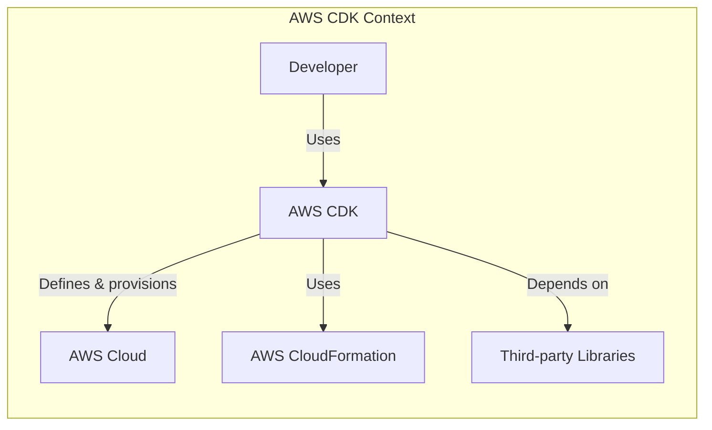
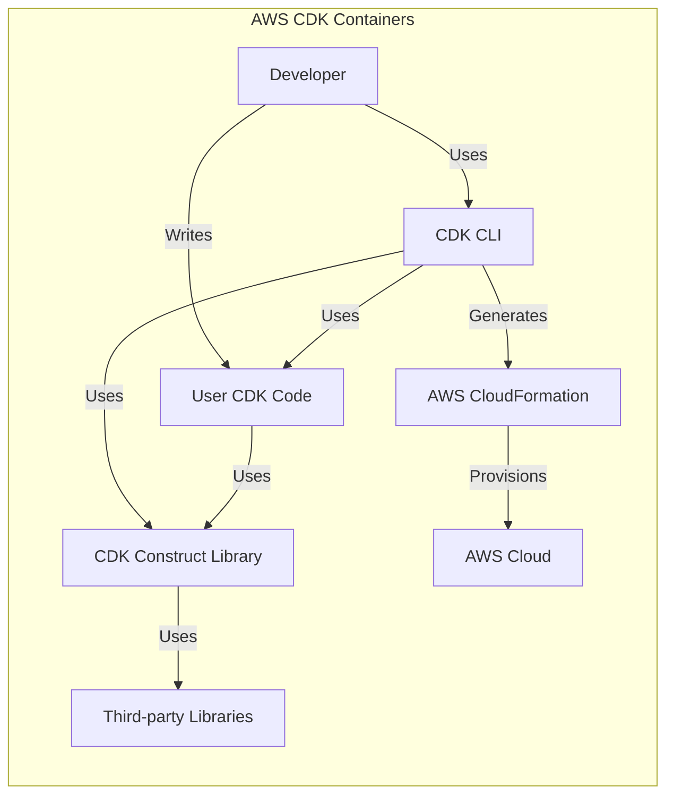
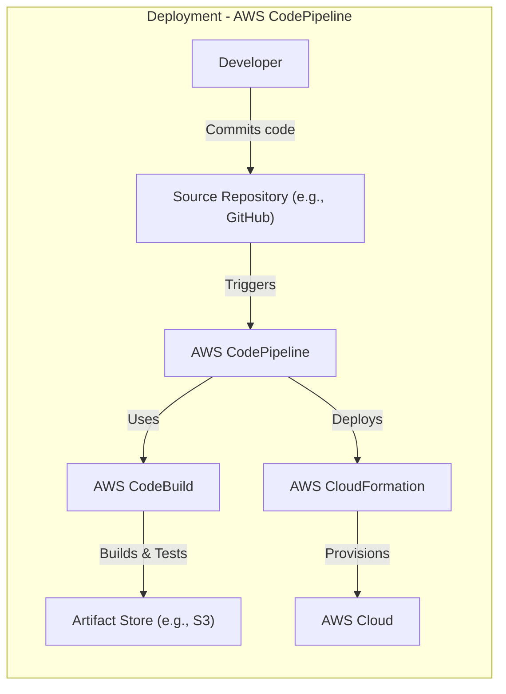
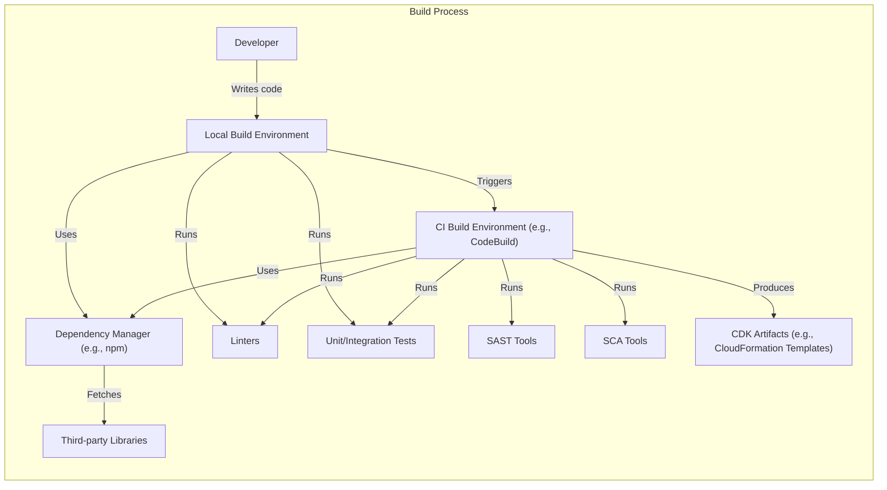

Okay, let's create a design document for the AWS CDK project, keeping in mind its purpose and potential security considerations.

# BUSINESS POSTURE

The AWS Cloud Development Kit (CDK) is a framework for defining cloud infrastructure as code and provisioning it through AWS CloudFormation.  It's a developer-centric tool designed to improve the speed, repeatability, and reliability of infrastructure deployments.

Priorities:

*   Enable developers to define infrastructure using familiar programming languages.
*   Promote infrastructure-as-code best practices.
*   Simplify the creation and management of AWS resources.
*   Reduce the risk of manual configuration errors.
*   Facilitate faster iteration cycles for application development.
*   Provide a higher level of abstraction compared to raw CloudFormation templates.

Goals:

*   Increase adoption of infrastructure-as-code within AWS user base.
*   Become the preferred method for defining and deploying AWS infrastructure.
*   Maintain a high level of quality and reliability for the CDK framework itself.
*   Foster a strong community around the CDK.

Business Risks:

*   Vulnerabilities in the CDK framework or its dependencies could lead to the creation of insecure infrastructure.
*   Incorrect use of the CDK by developers could result in misconfigured resources and security vulnerabilities.
*   Lack of proper training or understanding of CDK best practices could lead to operational issues.
*   The CDK's reliance on CloudFormation means that any limitations or issues in CloudFormation could impact CDK users.
*   Supply chain attacks targeting CDK dependencies could compromise user infrastructure.

# SECURITY POSTURE

Existing Security Controls:

*   security control: Code reviews: The GitHub repository shows a history of pull requests and code reviews, indicating a process for peer review of code changes. (Implemented in GitHub repository)
*   security control: Automated testing: The presence of test suites suggests that automated testing is used to verify the functionality and potentially the security of the CDK. (Implemented in GitHub repository)
*   security control: Static analysis: Likely use of linters and static analysis tools to identify potential code quality and security issues. (Mentioned in contribution guidelines, implemented in build process)
*   security control: Dependency management: Use of package managers (like npm) to manage dependencies, although the security of these dependencies needs to be continuously monitored. (Implemented in build process)
*   security control: AWS CloudFormation: Relies on the underlying security features of AWS CloudFormation, including IAM roles and policies for resource provisioning. (Inherited from AWS CloudFormation)
*   security control: IAM best practices: CDK encourages the use of IAM roles and policies to define least-privilege access for deployed resources. (Documented in CDK best practices)

Accepted Risks:

*   accepted risk: Reliance on third-party dependencies: The CDK, like any software project, depends on numerous third-party libraries.  The security of these libraries is outside the direct control of the CDK project, although efforts are likely made to keep them updated.
*   accepted risk: User-generated code: The CDK is a framework; the security of the infrastructure defined using the CDK is ultimately the responsibility of the user.  The CDK can provide tools and guidance, but it cannot guarantee the security of user-written code.
*   accepted risk: CloudFormation limitations: The CDK is built on top of CloudFormation. Any inherent limitations or vulnerabilities in CloudFormation will also affect CDK deployments.

Recommended Security Controls:

*   security control: Implement Software Composition Analysis (SCA): Integrate SCA tools to continuously monitor and identify vulnerabilities in third-party dependencies.
*   security control: Enhance static analysis: Expand the use of static analysis tools to include more comprehensive security checks, such as SAST (Static Application Security Testing).
*   security control: Provide security-focused examples and documentation: Offer more explicit guidance and examples on how to use the CDK to create secure infrastructure configurations.
*   security control: Consider signing CDK releases: Digitally sign CDK releases to ensure the integrity and authenticity of the software.
*   security control: Implement a vulnerability disclosure program: Establish a clear process for security researchers to report vulnerabilities in the CDK.

Security Requirements:

*   Authentication:
    *   The CDK itself does not handle user authentication directly. It relies on AWS credentials (access keys, session tokens) configured on the user's system or within the CI/CD environment. These credentials must be managed securely.
    *   The infrastructure deployed by the CDK may require authentication mechanisms (e.g., IAM users, Cognito user pools), which should be configured according to best practices.
*   Authorization:
    *   The CDK uses AWS IAM roles and policies to control access to AWS resources during deployment.  The principle of least privilege should be strictly followed.
    *   Applications deployed using the CDK may have their own authorization requirements, which should be implemented using appropriate mechanisms (e.g., IAM roles, resource-based policies).
*   Input Validation:
    *   The CDK itself should validate user inputs to prevent errors and potential security issues.
    *   Applications deployed using the CDK should implement robust input validation to protect against injection attacks and other vulnerabilities.
*   Cryptography:
    *   The CDK should use secure communication channels (HTTPS) when interacting with AWS services.
    *   Sensitive data (e.g., passwords, secrets) should be stored securely using services like AWS Secrets Manager or AWS Systems Manager Parameter Store, and accessed securely within CDK code.
    *   Encryption at rest and in transit should be enabled for relevant resources deployed by the CDK.

# DESIGN

## C4 CONTEXT

Element Descriptions:

*   Element:
    *   Name: Developer
    *   Type: Person
    *   Description: A software developer who uses the AWS CDK to define and deploy cloud infrastructure.
    *   Responsibilities: Writes CDK code, configures AWS credentials, initiates deployments.
    *   Security controls: Uses strong AWS credentials, follows secure coding practices.
*   Element:
    *   Name: AWS CDK
    *   Type: Software System
    *   Description: The AWS Cloud Development Kit framework.
    *   Responsibilities: Provides APIs for defining infrastructure, generates CloudFormation templates, interacts with AWS services.
    *   Security controls: Code reviews, automated testing, static analysis, dependency management.
*   Element:
    *   Name: AWS Cloud
    *   Type: External System
    *   Description: The Amazon Web Services cloud platform.
    *   Responsibilities: Provides cloud computing resources (compute, storage, networking, etc.).
    *   Security controls: AWS Shared Responsibility Model, various security services (IAM, VPC, KMS, etc.).
*   Element:
    *   Name: AWS CloudFormation
    *   Type: External System
    *   Description: AWS service for provisioning infrastructure as code.
    *   Responsibilities: Processes CloudFormation templates, creates and manages AWS resources.
    *   Security controls: IAM roles and policies, resource-based policies, CloudTrail logging.
*   Element:
    *   Name: Third-party Libraries
    *   Type: External System
    *   Description: External libraries and dependencies used by the AWS CDK.
    *   Responsibilities: Provide specific functionalities required by the CDK.
    *   Security controls: Dependency management, vulnerability scanning (recommended).

## C4 CONTAINER

Element Descriptions:

*   Element:
    *   Name: Developer
    *   Type: Person
    *   Description: A software developer.
    *   Responsibilities: Writes CDK code, uses the CDK CLI.
    *   Security controls: Uses strong AWS credentials, follows secure coding practices.
*   Element:
    *   Name: CDK CLI
    *   Type: Container (Command-line tool)
    *   Description: The command-line interface for the AWS CDK.
    *   Responsibilities: Processes CDK code, synthesizes CloudFormation templates, interacts with AWS services.
    *   Security controls: Input validation, secure communication with AWS services.
*   Element:
    *   Name: CDK Construct Library
    *   Type: Container (Library)
    *   Description: A library of pre-built components for defining AWS resources.
    *   Responsibilities: Provides reusable building blocks for infrastructure.
    *   Security controls: Code reviews, automated testing, static analysis.
*   Element:
    *   Name: AWS Cloud
    *   Type: External System
    *   Description: The Amazon Web Services cloud platform.
    *   Responsibilities: Provides cloud computing resources.
    *   Security controls: AWS Shared Responsibility Model, various security services.
*   Element:
    *   Name: AWS CloudFormation
    *   Type: External System
    *   Description: AWS service for provisioning infrastructure as code.
    *   Responsibilities: Processes CloudFormation templates, creates and manages AWS resources.
    *   Security controls: IAM roles and policies, resource-based policies, CloudTrail logging.
*   Element:
    *   Name: Third-party Libraries
    *   Type: External System
    *   Description: External libraries and dependencies.
    *   Responsibilities: Provide specific functionalities.
    *   Security controls: Dependency management, vulnerability scanning (recommended).
*   Element:
    *   Name: User CDK Code
    *   Type: Container (Code)
    *   Description: The infrastructure-as-code written by the developer using the CDK.
    *   Responsibilities: Defines the desired state of the AWS infrastructure.
    *   Security controls: Secure coding practices, adherence to least privilege, proper use of security features.

## DEPLOYMENT

Possible Deployment Solutions:

1.  Local Developer Machine: Developer runs CDK commands directly on their workstation.
2.  CI/CD Pipeline (e.g., AWS CodePipeline, Jenkins, GitHub Actions): CDK deployment is integrated into an automated build and deployment pipeline.
3.  AWS Cloud9: Developer uses the AWS Cloud9 IDE to write and deploy CDK code.
4.  AWS CloudShell: Developer uses the AWS CloudShell to write and deploy CDK code.

Chosen Solution (for detailed description): CI/CD Pipeline (AWS CodePipeline)

Element Descriptions:

*   Element:
    *   Name: Developer
    *   Type: Person
    *   Description: A software developer.
    *   Responsibilities: Commits CDK code to the source repository.
    *   Security controls: Uses strong AWS credentials, follows secure coding practices.
*   Element:
    *   Name: Source Repository (e.g., GitHub)
    *   Type: External System
    *   Description: Stores the CDK code and triggers the CI/CD pipeline.
    *   Responsibilities: Version control, webhook integration.
    *   Security controls: Access controls, branch protection rules.
*   Element:
    *   Name: AWS CodeBuild
    *   Type: AWS Service
    *   Description: Builds and tests the CDK code.
    *   Responsibilities: Executes build scripts, runs tests, produces artifacts.
    *   Security controls: IAM roles and policies, secure build environment.
*   Element:
    *   Name: AWS CodePipeline
    *   Type: AWS Service
    *   Description: Orchestrates the deployment process.
    *   Responsibilities: Manages stages (source, build, deploy), triggers actions.
    *   Security controls: IAM roles and policies, approval steps (optional).
*   Element:
    *   Name: AWS CloudFormation
    *   Type: AWS Service
    *   Description: Provisions the infrastructure defined by the CDK.
    *   Responsibilities: Processes CloudFormation templates, creates and manages AWS resources.
    *   Security controls: IAM roles and policies, resource-based policies, CloudTrail logging.
*   Element:
    *   Name: AWS Cloud
    *   Type: External System
    *   Description: The Amazon Web Services cloud platform.
    *   Responsibilities: Provides cloud computing resources.
    *   Security controls: AWS Shared Responsibility Model, various security services.
*   Element:
    *   Name: Artifact Store (e.g., S3)
    *   Type: AWS Service
    *   Description: Stores build artifacts, such as synthesized CloudFormation templates.
    *   Responsibilities: Secure storage of artifacts.
    *   Security controls: S3 bucket policies, encryption at rest.

## BUILD

Build Process Description:

1.  Developer writes CDK code on their local machine.
2.  Local Build Environment:
    *   Dependency Manager (e.g., npm, yarn) fetches and manages third-party libraries.
    *   Linters check code style and potential errors.
    *   Unit and integration tests are executed.
3.  Developer commits code to a source code repository (e.g., GitHub, AWS CodeCommit).
4.  CI Build Environment (e.g., AWS CodeBuild, Jenkins, GitHub Actions):
    *   The commit triggers a build in the CI environment.
    *   Dependency Manager fetches and manages third-party libraries.
    *   Linters are executed.
    *   SAST (Static Application Security Testing) tools analyze the code for security vulnerabilities.
    *   SCA (Software Composition Analysis) tools analyze dependencies for known vulnerabilities.
    *   Unit and integration tests are executed.
    *   CDK Artifacts (CloudFormation templates) are generated.
5.  Build artifacts are stored in a secure location (e.g., AWS S3 bucket).

Security Controls in Build Process:

*   security control: Dependency Management: Using a package manager (npm, yarn) to manage dependencies and track versions.
*   security control: Linters: Enforcing code style and identifying potential errors.
*   security control: SAST: Analyzing code for security vulnerabilities.
*   security control: SCA: Scanning dependencies for known vulnerabilities.
*   security control: Unit/Integration Tests: Verifying the functionality and security of the code.
*   security control: Secure Build Environment: Using a controlled and secure environment for building the software (e.g., AWS CodeBuild with appropriate IAM roles).
*   security control: Artifact Storage: Storing build artifacts in a secure location with access controls and encryption.

# RISK ASSESSMENT

Critical Business Processes:

*   Infrastructure Deployment: The core process is the reliable and secure deployment of cloud infrastructure.  Failures or vulnerabilities in this process could lead to service outages, data breaches, or other significant business impacts.
*   Application Development: The CDK is designed to support application development by providing a streamlined way to manage infrastructure.  Issues with the CDK could slow down development cycles and delay the release of new features.
*   Compliance: Many organizations use the CDK to help them meet compliance requirements (e.g., HIPAA, PCI DSS).  Insecure infrastructure configurations could lead to compliance violations.

Data Sensitivity:

*   CDK Code: May contain sensitive information such as database connection strings, API keys, or other secrets if not managed properly. Sensitivity: High
*   CloudFormation Templates: Generated by the CDK; describe the infrastructure to be deployed. May contain sensitive information similar to CDK code. Sensitivity: High
*   AWS Credentials: Used by the CDK to interact with AWS services.  Must be protected with extreme care. Sensitivity: Critical
*   Application Data: The CDK itself does not directly handle application data, but the infrastructure it deploys may store and process sensitive data. The sensitivity of this data depends on the specific application. Sensitivity: Variable (Low to Critical)

# QUESTIONS & ASSUMPTIONS

Questions:

*   What specific compliance requirements (if any) need to be considered for CDK deployments?
*   What is the expected level of expertise of developers using the CDK?  This will influence the need for security training and documentation.
*   What is the process for handling security vulnerabilities discovered in the CDK or its dependencies?
*   Are there any specific AWS services or features that are commonly used with the CDK and require special security considerations?
*   What is the process for reviewing and approving changes to the CDK codebase?
*   What are the specific tools used for SAST and SCA?

Assumptions:

*   BUSINESS POSTURE: The organization has a moderate to high risk aversion, given that the CDK is used to manage critical cloud infrastructure.
*   SECURITY POSTURE: AWS credentials are managed securely, following AWS best practices. Developers are familiar with basic security concepts and secure coding practices. A CI/CD pipeline is used for CDK deployments.
*   DESIGN: The CDK is used primarily to deploy infrastructure for applications running on AWS. The primary deployment target is AWS CloudFormation. The build process includes automated testing and security checks.