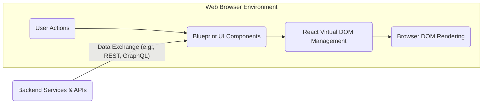
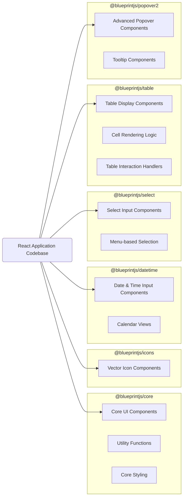
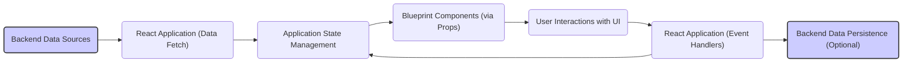

## Project Design Document: Blueprint UI Toolkit (Improved)

**1. Introduction**

This document provides an enhanced design overview of the Blueprint UI toolkit, an open-source, React-based library developed by Palantir Technologies. This detailed description aims to facilitate comprehensive threat modeling by clearly outlining Blueprint's architecture, core components, and data flow within a web application.

**2. Goals and Objectives**

The primary goal remains to provide a clear and detailed design document of the Blueprint UI toolkit to enable effective threat modeling. Specific objectives include:

*   Clearly describing the high-level architecture of Blueprint and its role within a web application's frontend.
*   Identifying and detailing the functionality of key component packages within the Blueprint library.
*   Illustrating the typical data flow within an application utilizing Blueprint components, highlighting potential interaction points.
*   Explicitly outlining potential security considerations arising from Blueprint's design and usage patterns.

**3. High-Level Architecture**

Blueprint is a client-side library designed for integration into React-based web applications. It provides a rich set of UI components and utilities to build sophisticated, data-intensive user interfaces. Blueprint operates entirely within the browser and relies on the host application's backend for data persistence and business logic.

*   **User Actions:**  Initiated by the user interacting with the web application in the browser.
*   **Blueprint UI Components:** The pre-built UI elements provided by the Blueprint library (e.g., buttons, forms, data tables).
*   **React Virtual DOM Management:** React's internal mechanism for efficiently updating the user interface.
*   **Browser DOM Rendering:** The final rendering of the HTML elements in the user's browser.
*   **Backend Services & APIs:** External systems providing data and functionality to the web application through APIs.

**4. Detailed Architecture**

Blueprint is modularly structured into several distinct packages, each offering a specific set of functionalities. This modularity allows developers to include only the necessary components in their applications.

*   **`@blueprintjs/core`:** The foundational package containing essential components (buttons, forms, icons, typography), utility functions, and core styling definitions.
*   **`@blueprintjs/icons`:** Provides a comprehensive collection of vector-based icons designed for use within Blueprint components. These icons are typically SVG-based.
*   **`@blueprintjs/datetime`:** Offers specialized components for handling date and time inputs and displays, including date pickers and calendar views.
*   **`@blueprintjs/select`:** Includes components for selecting items from lists or menus, often with features like filtering and searching.
*   **`@blueprintjs/table`:** Provides powerful components for displaying and interacting with tabular data, supporting features like sorting, filtering, and cell rendering.
*   **`@blueprintjs/popover2`:** Offers advanced popover and tooltip components for displaying contextual information or actions. This is an evolution of the original popover functionality.

*   **React Application Codebase:** The developer's application code that imports and utilizes the various Blueprint packages.
*   Arrows indicate the integration and usage of specific Blueprint packages within the React application.

**5. Key Components and Functionality**

*   **Buttons:** Interactive elements for triggering user actions, available in various styles and sizes.
*   **Forms:** A collection of input components for gathering user data, including text inputs, checkboxes, radio buttons, and select dropdowns.
*   **Icons:** Scalable vector graphics used for visual representation within the UI.
*   **Dialogs and Overlays:** Components for displaying modal content or temporary information that overlays the main application view.
*   **Menus:** Lists of actions or options presented to the user for selection.
*   **Tables:** Components for displaying structured data in a tabular format, often with interactive features.
*   **Tree:** Components for visualizing hierarchical data structures.
*   **Tabs:** Components for organizing content into separate views within a single interface.
*   **Toasts:** Non-intrusive, temporary notification messages displayed to the user.
*   **Popover and Tooltips:** Components for displaying contextual information on user interaction (e.g., hover, click).

**6. Data Flow within a Blueprint Application**

The typical data flow in an application using Blueprint involves these stages:

1. **Data Retrieval:** The React application fetches data from backend services, often using asynchronous requests (e.g., `fetch`, `axios`).
2. **State Management:** The retrieved data is managed within the application's state using React's built-in `useState` hook or external state management libraries (e.g., Redux, Zustand, Recoil).
3. **Component Rendering with Props:** Blueprint components receive data as properties (props) from the application's state. These props determine how the components are rendered and what data they display.
4. **User Interaction and Events:** Users interact with Blueprint components, triggering events (e.g., button clicks, form submissions, table cell edits).
5. **Event Handling and State Updates:** Event handlers within the React application respond to user interactions, often updating the application's state based on the event.
6. **Data Persistence (Optional):** State updates may trigger API calls to the backend to persist changes made by the user.
7. **Re-rendering of Components:** React re-renders the affected Blueprint components based on the updated state, reflecting the changes in the user interface.

**7. Security Considerations for Threat Modeling**

As a client-side UI library, Blueprint's security considerations primarily focus on how it handles data and user interactions within the browser environment. The security of the overall application also depends heavily on the security practices of the integrating application and its backend.

*   **Cross-Site Scripting (XSS) Vulnerabilities:**
    *   **Risk:** If the application using Blueprint passes unsanitized user-provided data or HTML as props to Blueprint components, it can create XSS vulnerabilities. Components that render dynamic content are particularly susceptible.
    *   **Mitigation:**  Strict input validation and output encoding/escaping within the integrating application are crucial.
*   **Dependency Chain Vulnerabilities:**
    *   **Risk:** Blueprint relies on other open-source libraries. Vulnerabilities in these dependencies can indirectly affect applications using Blueprint.
    *   **Mitigation:** Regularly update Blueprint and its dependencies. Utilize tools for dependency vulnerability scanning.
*   **Client-Side Data Exposure:**
    *   **Risk:**  Sensitive data displayed through Blueprint components can be exposed if not handled carefully. For example, displaying sensitive information in plain text within a table without proper access controls.
    *   **Mitigation:** Implement appropriate access controls and consider data masking or encryption where necessary.
*   **Input Validation Gaps:**
    *   **Risk:** While Blueprint provides form components, it's the responsibility of the integrating application to perform robust input validation. Insufficient validation can lead to various vulnerabilities (e.g., injection attacks).
    *   **Mitigation:** Implement comprehensive client-side and server-side input validation.
*   **State Management Security Issues:**
    *   **Risk:**  Vulnerabilities in the application's state management logic can indirectly impact Blueprint components and the data they display. For example, allowing unauthorized modification of state.
    *   **Mitigation:** Follow secure state management practices and implement appropriate authorization checks.
*   **Third-Party Integration Risks:**
    *   **Risk:** If the application integrates Blueprint with other third-party libraries or services, vulnerabilities in those integrations can create security risks.
    *   **Mitigation:** Carefully evaluate the security of third-party integrations.
*   **Configuration and Default Settings:**
    *   **Risk:**  Default configurations of Blueprint components might not always align with strict security requirements.
    *   **Mitigation:** Review and customize the configuration of Blueprint components to meet security best practices.
*   **Denial of Service (DoS) on the Client-Side:**
    *   **Risk:**  Maliciously crafted data or interactions could potentially overwhelm the client-side rendering capabilities of Blueprint components, leading to a denial of service for the user.
    *   **Mitigation:** Implement appropriate data validation and consider performance implications of rendering large datasets.

**8. Deployment**

Blueprint is deployed as part of the frontend build process of a React application. Common steps include:

*   **Installation:** Installing Blueprint packages using npm or yarn (`npm install @blueprintjs/core @blueprintjs/icons ...`).
*   **Importing Components:** Importing and utilizing Blueprint components within React components in the application's codebase.
*   **Bundling:** Using build tools like Webpack, Parcel, or Rollup to bundle the application's code, including the Blueprint library, into static assets.
*   **Deployment:** Deploying the generated static assets (HTML, CSS, JavaScript) to a web server, CDN (Content Delivery Network), or cloud storage service.

**9. Technologies Used**

*   **React:** The core JavaScript library for building the user interface components.
*   **TypeScript:** The primary programming language used for developing Blueprint, providing static typing and improved code maintainability.
*   **CSS (or Sass/Less):** Used for styling the visual appearance of the components. Blueprint provides its own styling conventions and CSS classes.
*   **npm or yarn:** Package managers for managing project dependencies, including Blueprint packages.
*   **Build Tools (Webpack, Parcel, Rollup):** Used for bundling and optimizing the application's assets for deployment.

**10. Future Considerations for Security Analysis**

*   Conduct a detailed review of specific Blueprint components that handle user input or render dynamic content to identify potential XSS vulnerabilities.
*   Analyze the Blueprint project's security practices, including vulnerability disclosure policies and response processes.
*   Investigate common integration patterns and configurations of Blueprint in real-world applications to identify potential security misconfigurations or common pitfalls.
*   Perform static and dynamic analysis of the Blueprint codebase to identify potential security flaws.

This improved design document provides a more comprehensive and detailed understanding of the Blueprint UI toolkit's architecture and functionality. This information is essential for conducting a thorough threat model to identify potential security vulnerabilities and develop appropriate mitigation strategies for applications utilizing this library.