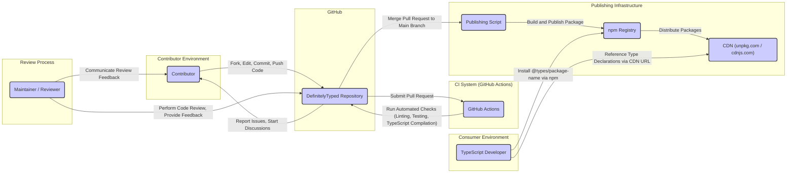

## Project Design Document: DefinitelyTyped (Improved)

**1. Introduction**

This document provides an enhanced design overview of the DefinitelyTyped project, intended for use in threat modeling and security analysis. It elaborates on the key components, processes, and data flows within the project to facilitate a deeper understanding of potential vulnerabilities and risks. This document builds upon the previous version with more specific details relevant to security considerations.

**2. Project Overview**

DefinitelyTyped is a collaborative, community-driven project that hosts a vast collection of TypeScript declaration files (`.d.ts`) for JavaScript libraries. These declaration files enable TypeScript developers to seamlessly integrate and utilize JavaScript libraries with strong typing. The project's core mission is to provide accurate, up-to-date, and comprehensive type definitions, thereby enhancing the development experience and reducing type-related errors in TypeScript projects interacting with JavaScript code.

**3. Goals and Objectives**

* **Comprehensive Coverage:** To offer type declarations for a wide and growing range of JavaScript libraries.
* **High-Quality Declarations:** To ensure the accuracy, consistency, and correctness of the provided type definitions.
* **Community Engagement:** To actively facilitate and encourage contributions from the global TypeScript community.
* **Automation and Efficiency:** To leverage automation for testing, linting, and the publishing pipeline of type declarations.
* **Timely Updates and Maintenance:** To maintain type declarations in sync with the latest versions and updates of their corresponding JavaScript libraries.

**4. Target Audience**

This document is primarily intended for:

* Security analysts conducting threat modeling exercises on the DefinitelyTyped project.
* Developers actively contributing to the DefinitelyTyped repository.
* Maintainers responsible for the oversight and upkeep of the DefinitelyTyped project.
* Individuals seeking a detailed understanding of the project's architecture and security landscape.

**5. System Architecture**

The DefinitelyTyped project operates as a distributed system involving various interconnected components and interactions.

**5.1. Core Components:**

* **GitHub Repository ("DefinitelyTyped"):**
    * The central, authoritative repository on GitHub that stores all TypeScript declaration files (`.d.ts`).
    * Serves as the primary platform for managing contributions via pull requests.
    * Functions as the issue tracking system for bug reports, feature requests, and discussions.
    * Houses project configuration files, tooling scripts, and documentation.
* **Contributor Workstations:**
    * The local development environments utilized by individual contributors to create, modify, and test type declaration files.
    * Relies on Git for version control and seamless interaction with the central GitHub repository.
* **Continuous Integration (CI) System ("GitHub Actions"):**
    * An automated system that performs build, test, and linting processes on submitted pull requests.
    * Executes TypeScript compiler checks and other custom validation scripts to ensure code quality.
    * Provides immediate feedback to contributors regarding the quality and correctness of their contributions.
* **Review Process:**
    * A crucial step involving maintainers and experienced contributors who meticulously review submitted pull requests.
    * Focuses on verifying the correctness, quality, consistency, and adherence to project standards of the type declarations.
    * Leverages GitHub's built-in code review features for communication and feedback.
* **Publishing Pipeline:**
    * An automated workflow responsible for publishing approved type declarations to the npm registry.
    * Triggered automatically upon the successful merging of a pull request into the main branch.
    * Involves building, packaging, and securely publishing the type declarations as npm packages.
* **npm Registry ("npmjs.com"):**
    * The public package registry where DefinitelyTyped packages (scoped under `@types`) are published and made available.
    * Acts as the primary distribution point for TypeScript developers to install and utilize type declarations in their projects.
* **Content Delivery Network (CDN) ("unpkg.com", "cdnjs.com"):**
    * Provides a globally distributed network for accessing the published type declaration files.
    * Allows developers to directly reference type declarations within their projects via publicly accessible URLs.
* **Definitely Typed Website ("definitelytyped.org"):**
    * A website providing information about the project, comprehensive contribution guidelines, and a search functionality for type declarations.
    * Interacts with the GitHub repository to retrieve and display relevant project data.

**5.2. Data Flow Diagram:**

**6. Detailed Component Descriptions:**

* **GitHub Repository ("DefinitelyTyped"):**
    * **Purpose:**  Serves as the central hub for all project activities, including code storage, collaboration, and issue management.
    * **Functionality:**
        * Version control using Git.
        * Management of contributions through pull requests.
        * Issue tracking and discussion forums.
        * Access control for repository collaborators.
        * Storage of project configuration (e.g., `.github/workflows`, `tsconfig.json`).
    * **Inputs:** Code contributions (pull requests), issue reports, discussion threads, configuration updates.
    * **Outputs:** Merged code changes, resolved issues, project documentation, notifications.
    * **Security Considerations:**
        * **Access Control:**  Risk of unauthorized access or modifications if collaborator accounts are compromised.
        * **Malicious Code Injection:** Potential for malicious code to be introduced through pull requests if not adequately reviewed.
        * **Branch Protection Rules:** Misconfigured branch protection rules could allow for bypassing review processes.
        * **Vulnerability Scanning:**  Dependencies used by the repository's tooling (e.g., linters) could introduce vulnerabilities.

* **Contributor Workstations:**
    * **Purpose:** Provides the environment for contributors to develop and test type declarations locally.
    * **Functionality:**
        * Code editing using various IDEs and text editors.
        * TypeScript compilation and testing.
        * Git operations for interacting with the remote repository.
    * **Inputs:** JavaScript libraries, existing type declarations, contribution guidelines, local environment configurations.
    * **Outputs:** New or modified type declaration files (`.d.ts`).
    * **Security Considerations:**
        * **Compromised Environments:**  Security of contributor workstations is outside the project's direct control, but compromised machines could introduce malicious code.
        * **Data Leakage:** Sensitive information (though minimal in this project) could be exposed if workstations are not secure.

* **Continuous Integration (CI) System ("GitHub Actions"):**
    * **Purpose:** Automates the validation and testing of code contributions to ensure quality and prevent regressions.
    * **Functionality:**
        * Running linters (e.g., ESLint, Prettier) to enforce code style.
        * Executing TypeScript compiler checks to verify type correctness.
        * Running custom validation scripts and tests.
        * Building and packaging type declarations for testing.
    * **Inputs:** Pull requests submitted to the GitHub repository, CI configuration files (`.github/workflows`).
    * **Outputs:** Pass/fail status of checks, build artifacts, error logs, notifications.
    * **Security Considerations:**
        * **Workflow Tampering:**  Malicious actors could attempt to modify CI workflows to bypass checks or introduce malicious steps.
        * **Secret Management:** Secure storage and access control for sensitive credentials used by CI (e.g., npm token).
        * **Dependency Vulnerabilities:**  Vulnerabilities in dependencies used by CI workflows could be exploited.
        * **Code Injection:**  Pull requests could contain code that exploits vulnerabilities in the CI environment.

* **Review Process:**
    * **Purpose:**  A human-in-the-loop process to ensure the quality, correctness, and security of type declarations before they are merged.
    * **Functionality:**
        * Manual inspection of code changes in pull requests.
        * Providing feedback and suggestions to contributors.
        * Discussions and collaboration on proposed changes.
        * Approving or rejecting pull requests based on review criteria.
    * **Inputs:** Pull requests submitted to the GitHub repository, project guidelines, reviewer expertise.
    * **Outputs:** Approval or rejection of pull requests, feedback for contributors, merged code.
    * **Security Considerations:**
        * **Human Error:**  Reviewers might inadvertently miss subtle security vulnerabilities or malicious code.
        * **Compromised Reviewer Accounts:** If reviewer accounts are compromised, malicious code could be approved.
        * **Social Engineering:** Reviewers could be targeted by social engineering to approve malicious changes.

* **Publishing Pipeline:**
    * **Purpose:**  Automates the process of making approved type declarations available to the wider TypeScript community via npm.
    * **Functionality:**
        * Building npm packages from the merged code.
        * Authenticating with the npm registry using secure credentials.
        * Publishing packages to the npm registry under the `@types` scope.
        * Potentially updating CDN configurations.
    * **Inputs:** Merged code in the main branch of the GitHub repository, npm credentials, publishing scripts.
    * **Outputs:** Published packages on the npm registry, updates to CDN.
    * **Security Considerations:**
        * **Credential Management:**  Secure storage and management of npm API tokens is critical.
        * **Unauthorized Publishing:**  Risk of unauthorized individuals gaining access to publishing credentials.
        * **Supply Chain Attacks:**  Compromised publishing pipelines could be used to inject malicious code into published packages.
        * **Integrity of Published Packages:** Ensuring the published packages are not tampered with during the publishing process.

* **npm Registry ("npmjs.com"):**
    * **Purpose:**  The public repository for hosting and distributing npm packages, including DefinitelyTyped's type declarations.
    * **Functionality:**
        * Package hosting and version management.
        * Download tracking and statistics.
        * User authentication and authorization.
        * Metadata storage for packages.
    * **Inputs:** Published packages from the DefinitelyTyped publishing pipeline, user installation requests.
    * **Outputs:** Downloadable type declaration packages for TypeScript developers.
    * **Security Considerations:**
        * **Registry Security:** Reliance on the security of the npm registry infrastructure itself.
        * **Supply Chain Attacks:**  If the npm registry is compromised, malicious packages could be distributed.
        * **Package Integrity:** Ensuring the integrity of packages hosted on the registry.

* **Content Delivery Network (CDN) ("unpkg.com", "cdnjs.com"):**
    * **Purpose:** To provide fast and globally accessible distribution of published type declaration files.
    * **Functionality:**
        * Caching of package files for faster delivery.
        * Global distribution of content.
        * Serving files over HTTPS.
    * **Inputs:** Packages published to the npm registry.
    * **Outputs:** Accessible type declaration files via public URLs.
    * **Security Considerations:**
        * **CDN Security:** Reliance on the security of the CDN provider's infrastructure.
        * **Content Injection/Tampering:**  Risk of malicious actors injecting or tampering with the hosted files if the CDN is compromised.
        * **Availability:**  Ensuring the CDN remains available to serve the type declaration files.

* **Definitely Typed Website ("definitelytyped.org"):**
    * **Purpose:**  Provides information, documentation, and search functionality for the DefinitelyTyped project.
    * **Functionality:**
        * Displaying project documentation and contribution guidelines.
        * Providing a search interface for finding type declarations.
        * Potentially displaying statistics and other project-related information.
    * **Inputs:** Data from the GitHub repository, user search queries.
    * **Outputs:** Web pages displaying project information and search results.
    * **Security Considerations:**
        * **Web Application Security:** Standard web application vulnerabilities such as XSS, CSRF, and SQL injection.
        * **Data Security:** Protecting any sensitive data stored or processed by the website.
        * **Availability:** Ensuring the website remains available to users.

**7. Security Considerations (Categorized):**

* **Supply Chain Vulnerabilities:**
    * Malicious code introduced through compromised contributor accounts or workstations.
    * Compromised dependencies in the project's tooling or CI environment.
    * Malicious packages published to npm due to compromised credentials.
* **Code Integrity:**
    * Introduction of incorrect or malicious type declarations that could lead to runtime errors or security vulnerabilities in consuming applications.
    * Tampering with published packages on npm or CDNs.
* **Authentication and Authorization:**
    * Compromised maintainer or reviewer accounts leading to unauthorized actions.
    * Weak or leaked credentials for npm publishing.
    * Lack of proper access controls for sensitive resources.
* **Infrastructure Security:**
    * Vulnerabilities in the GitHub platform, CI system, npm registry, or CDN providers.
    * Denial-of-service attacks targeting project infrastructure.
* **Human Factors:**
    * Social engineering attacks targeting contributors or maintainers.
    * Accidental introduction of vulnerabilities due to lack of awareness or training.

**8. Technologies Used:**

* **Programming Languages:** TypeScript, JavaScript
* **Version Control System:** Git
* **Platform and Hosting:** GitHub
* **Continuous Integration:** GitHub Actions
* **Linting and Formatting:** ESLint, Prettier
* **Package Management:** npm
* **Content Delivery Networks:** unpkg.com, cdnjs.com
* **Web Technologies (Website):**  Likely a static site generator (e.g., Docusaurus, Jekyll) with HTML, CSS, and JavaScript.

**9. Future Considerations:**

* **Enhanced Automated Security Scanning:** Implementing more comprehensive static analysis security testing (SAST) and dependency vulnerability scanning within the CI pipeline.
* **Formal Security Audits:** Conducting regular independent security audits of the project's codebase, infrastructure, and processes.
* **Multi-Factor Authentication (MFA) Enforcement:** Mandating MFA for all maintainers and contributors with elevated privileges.
* **Improved Secret Management:** Employing more robust secret management solutions for storing and accessing sensitive credentials.
* **Community Security Champions:** Establishing a group of dedicated community members focused on security best practices and vulnerability identification.
* **Software Bill of Materials (SBOM):** Generating and maintaining an SBOM for published packages to improve transparency and vulnerability tracking.
* **Incident Response Plan:** Developing a clear plan for responding to and mitigating security incidents.

This improved design document provides a more detailed and nuanced understanding of the DefinitelyTyped project's architecture and security considerations, making it a more effective resource for threat modeling and risk assessment.