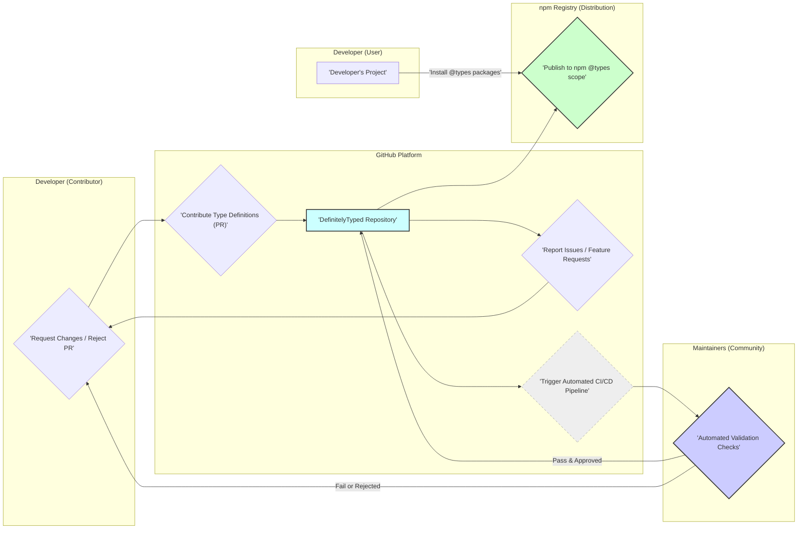
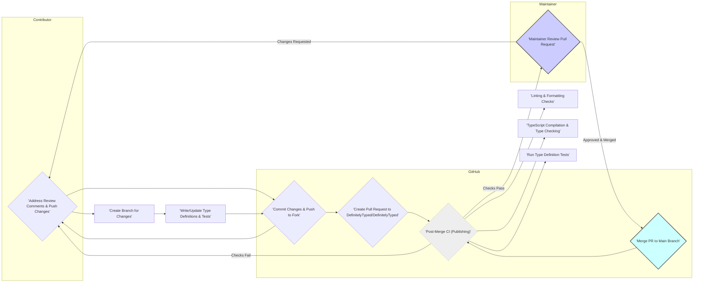
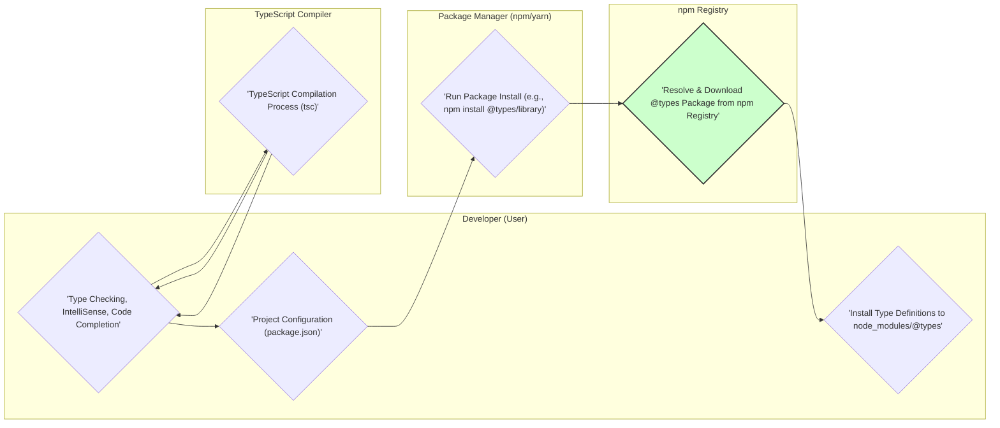

# Project Design Document: DefinitelyTyped (Improved)

## 1. Project Overview

### 1.1. Project Name
DefinitelyTyped

### 1.2. Project Repository URL
https://github.com/definitelytyped/definitelytyped

### 1.3. Project Goals and Objectives
*   **Goal:** To provide high-quality TypeScript type definitions for the vast ecosystem of JavaScript libraries, enabling seamless TypeScript integration.
*   **Objectives:**
    *   **Enhance TypeScript Development:** Empower TypeScript developers to use JavaScript libraries with strong typing, improving code quality, maintainability, and developer experience.
    *   **Maintain Comprehensive Coverage:**  Strive for a comprehensive and up-to-date collection of type definitions, covering a wide range of popular JavaScript libraries.
    *   **Foster Community Collaboration:** Cultivate a vibrant and collaborative community of contributors and maintainers to ensure the project's sustainability and growth.
    *   **Ensure Type Definition Quality:**  Maintain high standards for type definition accuracy, correctness, and adherence to best practices through rigorous review processes and automated tooling.
    *   **Promote Compatibility and Versioning:** Provide type definitions that are compatible with various versions of JavaScript libraries and TypeScript, addressing versioning complexities effectively.
    *   **Improve Discoverability:** Make type definitions easily discoverable and accessible to TypeScript developers through npm and project documentation.

### 1.4. Target Audience
*   **Primary Audience: TypeScript Developers:**  Developers actively using TypeScript who need type definitions for JavaScript libraries in their projects.
*   **Secondary Audience:**
    *   **JavaScript Library Authors:** Benefit indirectly from increased adoption of their libraries by TypeScript developers due to readily available type definitions.
    *   **Contributors to DefinitelyTyped:** Developers who contribute new type definitions, update existing ones, improve tooling, or enhance documentation.
    *   **DefinitelyTyped Maintainers:** Experienced community members who dedicate time to review contributions, manage the project, and ensure the quality of type definitions.

### 1.5. Success Metrics
*   **Coverage:**
    *   Number of packages with type definitions in `@types`.
    *   Percentage of popular JavaScript libraries covered.
*   **Quality:**
    *   Number of issues reported against type definitions (lower is better).
    *   Time to resolve reported issues.
    *   Maintainer review turnaround time for pull requests.
    *   Automated test pass rate.
*   **Community Engagement:**
    *   Number of active contributors.
    *   Number of pull requests submitted and merged.
    *   Activity in issue tracker and discussions.
    *   Growth of `@types` package downloads on npm.
*   **Usage:**
    *   Download statistics for `@types` packages from npm.
    *   Indirectly, the growth of TypeScript adoption in the wider JavaScript ecosystem.

### 1.6. High-Level System Architecture

DefinitelyTyped operates as a distributed, community-driven system centered around a GitHub repository and the npm registry. The core architectural elements are:

*   **Decentralized Contribution:** Type definitions are contributed by a global community of developers via pull requests to the central GitHub repository.
*   **Community Review and Governance:** Maintainers, acting as community leaders, review and validate contributions, ensuring quality and adherence to project standards.
*   **Automated Validation and Testing:** A comprehensive CI/CD pipeline automatically validates type definitions through linting, compilation, and testing.
*   **Centralized Publication and Distribution:** Approved type definitions are published to the npm registry under the `@types` scope, providing a central distribution point for TypeScript developers.
*   **Consumption via Standard Package Managers:** TypeScript developers consume type definitions using standard npm package managers like `npm` or `yarn`, seamlessly integrating them into their projects.

## 2. Detailed System Architecture

### 2.1. Components and Modules

*   **GitHub Repository (`definitelytyped/definitelytyped`):**
    *   **`types/` Directory:**  The core directory containing all type definition packages, organized by npm package name. Each package directory contains:
        *   `index.d.ts`: The main type definition file.
        *   `package.json`:  Package metadata (name, version, dependencies, etc.).
        *   `tsconfig.json`: TypeScript configuration for the package.
        *   `test/` (optional): Directory containing test files (`.ts`) to validate type definitions.
        *   `README.md` (optional): Package-specific documentation.
    *   **`npmrc.json`:** Configuration for npm publishing.
    *   **`support/`:**  Scripts and utilities for project maintenance and tooling.
    *   **`.github/workflows/`:** GitHub Actions workflow definitions for CI/CD.
    *   **`README.md` (root):** Project-level documentation and contribution guidelines.
    *   **`CODE_OF_CONDUCT.md`:** Project's code of conduct.
    *   **Issue Tracker:**  For bug reports, feature requests, and general discussions.
    *   **Pull Request System:**  For managing contributions and code reviews.

*   **Automated Tooling (GitHub Actions CI/CD Pipeline):**
    *   **Linting:**  Uses ESLint (or similar) to enforce code style and identify potential issues in `.d.ts` files.
    *   **TypeScript Compilation (`tsc`):** Compiles type definitions and test files to verify syntax correctness and type compatibility.
    *   **Type Checking and Testing:** Executes test files (if present) using the TypeScript compiler to ensure type definitions accurately reflect the behavior of the JavaScript library.
    *   **API Extractor (optional, for complex packages):**  May be used to generate type definitions from JavaScript code or documentation.
    *   **Version Bumping and Changelog Generation:**  Automates version updates for `@types` packages based on changes and generates changelogs.
    *   **npm Publishing:**  Securely publishes validated type definition packages to the npm registry under the `@types` scope.

*   **npm Registry (`npmjs.com`):**
    *   **`@types` Scope:**  The designated namespace for all DefinitelyTyped packages, ensuring clear identification and organization.
    *   **Package Hosting and Distribution:**  Provides a reliable platform for hosting and distributing `@types` packages to TypeScript developers globally.
    *   **Package Metadata and Search:**  Allows developers to search for and discover type definitions using package names and keywords.

### 2.2. Data Flow Diagrams

#### 2.2.1. Contribution Workflow (Detailed)

#### 2.2.2. Consumption Workflow (Detailed)

### 2.3. Data Storage and Persistence

*   **GitHub Repository (Git):**
    *   **Persistent Storage:** Git provides persistent storage for all project files, history, and metadata.
    *   **Version Control:**  Git manages version history, enabling rollback, branching, and collaboration.
    *   **Backup and Redundancy:** GitHub provides backup and redundancy for the repository data.
*   **npm Registry:**
    *   **Package Storage:** npm registry stores the published `@types` packages as compressed archives.
    *   **Metadata Storage:** Stores package metadata, version information, and download statistics.
    *   **Content Delivery Network (CDN):** npm utilizes a CDN for efficient package distribution.

### 2.4. External Dependencies and Integrations

*   **GitHub Platform:**
    *   **Version Control (Git):** Core version control system.
    *   **Collaboration Platform:** Issue tracking, pull requests, discussions, project management features.
    *   **CI/CD (GitHub Actions):** Automated build, test, and deployment pipelines.
    *   **Authentication and Authorization:** Manages user accounts and permissions for repository access.
*   **npm Registry:**
    *   **Package Distribution:** Primary distribution channel for `@types` packages.
    *   **Package Management:**  Provides package installation, dependency resolution, and version management.
    *   **Authentication (npm accounts):** Used for publishing packages to the `@types` scope.
*   **Node.js and npm/yarn:**
    *   **Development Environment:** Required for running tooling, scripts, and package management tasks.
    *   **Package Management CLI:** `npm` or `yarn` command-line interfaces for package installation and publishing.
*   **TypeScript Compiler (`tsc`):**
    *   **Type Checking and Compilation:**  Essential for validating and compiling type definitions and test files.
    *   **Language Service:** Powers IDE features like IntelliSense and code completion based on type definitions.
*   **Linting Tools (ESLint, Prettier):**
    *   **Code Quality and Style Enforcement:**  Ensures consistent code style and identifies potential code quality issues.
*   **Testing Frameworks/Tools (e.g., Jest, Mocha - indirectly):**
    *   **Type Definition Testing:** While not explicitly defined, contributors use testing methodologies to validate type definitions, often implicitly using testing frameworks within their test files.

### 2.5. User Roles and Permissions (Detailed)

*   **Anonymous Users (Public - Read-Only):**
    *   **GitHub Repository Access:** Read access to the `definitelytyped/definitelytyped` repository (view code, issues, pull requests, documentation).
    *   **npm Registry Access:** Public access to download `@types` packages from the npm registry.
*   **Contributors (Write Access via Pull Requests):**
    *   **GitHub Repository Access:**
        *   Fork the repository.
        *   Create branches in their forks.
        *   Submit pull requests to the main repository.
        *   Comment on issues and pull requests.
    *   **npm Registry Access:** No direct publishing access. Contributions are published by maintainers through the CI/CD pipeline.
*   **Maintainers (Write Access - Direct & Administrative):**
    *   **GitHub Repository Access:**
        *   Direct write access to the `definitelytyped/definitelytyped` repository (merge pull requests, manage branches, modify files).
        *   Manage issues and pull requests (labeling, closing, assigning).
        *   Configure repository settings and CI/CD pipelines.
        *   Manage repository collaborators and permissions.
    *   **npm Registry Access:**
        *   Publish packages to the `@types` scope on npm (typically automated via CI/CD, using securely stored npm tokens).
        *   Manage package metadata on npm (less common, usually automated).
    *   **Community Governance:**  Responsible for upholding project standards, resolving conflicts, and guiding the project's direction.

## 3. Infrastructure and Deployment

### 3.1. Hosting Environment

*   **GitHub:**
    *   **Source Code Hosting:**  Git repository hosting.
    *   **Collaboration Platform:** Issue tracking, pull requests, wikis, discussions.
    *   **CI/CD Infrastructure:** GitHub Actions for automated workflows.
*   **npm Registry:**
    *   **Package Registry:** Hosts and distributes `@types` packages.
    *   **CDN:** Content Delivery Network for package downloads.
    *   **Infrastructure Managed by npm, Inc.:**  Ensuring scalability and availability of the registry.

### 3.2. Deployment Process (Automated CI/CD via GitHub Actions)

*   **Trigger:**  Merging a pull request into the main branch (or a designated release branch) in the `definitelytyped/definitelytyped` repository automatically triggers the GitHub Actions CI/CD pipeline.
*   **Workflow Steps (Simplified):**
    1.  **Checkout Code:**  GitHub Actions checks out the latest code from the merged branch.
    2.  **Setup Node.js Environment:**  Installs Node.js and npm.
    3.  **Install Dependencies:** Installs project dependencies required for tooling and publishing.
    4.  **Linting and Formatting:** Runs linters and formatters to check code style.
    5.  **TypeScript Compilation and Testing:** Compiles type definitions and runs associated tests.
    6.  **Version Bumping:**  Determines if package versions need to be bumped based on changes.
    7.  **Package and Publish:**
        *   Packages updated type definitions into npm packages.
        *   Authenticates with npm using securely stored API tokens (GitHub Secrets).
        *   Publishes updated packages to the npm registry under the `@types` scope using `npm publish`.
    8.  **Changelog Generation (Optional):**  Generates or updates changelogs for published packages.
*   **Automation and Reliability:** The entire deployment process is fully automated, ensuring consistent and reliable publishing of type definitions.

### 3.3. Scalability and Availability Considerations

*   **GitHub Platform:**  Inherently scalable and highly available, managed by GitHub's infrastructure. DefinitelyTyped benefits from GitHub's robust platform.
*   **npm Registry:** Designed for high scalability and availability to serve a massive volume of package downloads globally.  Managed by npm, Inc. with infrastructure designed for reliability.
*   **DefinitelyTyped Project Scalability (Community-Driven):**
    *   **Community Contribution Model:**  Scales horizontally by leveraging a large community of contributors.
    *   **Automated Tooling:**  CI/CD and automated validation tools are crucial for handling a large volume of contributions efficiently.
    *   **Maintainer Capacity:**  The capacity of the maintainer team to review and manage contributions is a key factor in project scalability.
    *   **Documentation and Guidelines:** Clear contribution guidelines and documentation help streamline the contribution process and improve efficiency.

## 4. Security Considerations (Detailed)

This section expands on the initial security considerations, providing more detail and potential mitigation strategies for threat modeling.

*   **4.1. Malicious Type Definitions / Code Injection Risk**
    *   **Threat:** Contributors could intentionally or unintentionally introduce malicious code or misleading type definitions that could:
        *   Cause unexpected behavior in TypeScript applications using these definitions.
        *   Expose vulnerabilities in tooling that processes type definitions.
        *   Mislead developers about the actual API of a JavaScript library, potentially leading to security flaws in their applications.
    *   **Impact:** Integrity violation, potential availability issues, developer confusion, indirect security vulnerabilities in consuming applications.
    *   **Likelihood:** Medium (due to community contribution model, but mitigated by review process).
    *   **Mitigation Strategies:**
        *   **Rigorous Code Review:**  Mandatory and thorough review of all pull requests by experienced maintainers, focusing on code logic, potential security implications, and adherence to best practices.
        *   **Automated Linting and Static Analysis:**  Employ advanced linters and static analysis tools to detect suspicious patterns, potential vulnerabilities, and deviations from coding standards in `.d.ts` files.
        *   **Input Validation (in tooling):** If custom tooling is used to process type definitions, ensure robust input validation to prevent injection attacks.
        *   **"Principle of Least Privilege" for Tooling:**  Limit the permissions and capabilities of automated tooling to minimize potential damage if compromised.

*   **4.2. Compromised Maintainer Accounts**
    *   **Threat:** Attackers could compromise maintainer accounts through phishing, credential stuffing, or other methods. A compromised maintainer account could be used to:
        *   Merge malicious pull requests without proper review.
        *   Directly modify the repository to inject malicious code.
        *   Publish compromised packages to the npm registry.
    *   **Impact:** Integrity violation, availability disruption, potential supply chain attack, damage to project reputation.
    *   **Likelihood:** Medium (depends on maintainer security practices).
    *   **Mitigation Strategies:**
        *   **Multi-Factor Authentication (MFA):** Enforce MFA for all maintainer accounts on GitHub and npm.
        *   **Strong Password Policies:**  Promote and enforce strong, unique passwords for maintainer accounts.
        *   **Regular Security Audits and Training:** Conduct periodic security audits of maintainer accounts and access, and provide security awareness training to maintainers.
        *   **Code Signing (Consideration):** Explore code signing for published `@types` packages to provide an additional layer of integrity verification (though not currently standard practice for `@types`).
        *   **Account Activity Monitoring:** Monitor maintainer account activity for suspicious or unusual actions.

*   **4.3. Dependency Vulnerabilities in Tooling and CI/CD**
    *   **Threat:** Vulnerabilities in dependencies used by the CI/CD pipeline (GitHub Actions workflows, Node.js modules, linting tools, etc.) could be exploited to:
        *   Compromise the build process.
        *   Inject malicious code into published packages.
        *   Gain unauthorized access to project infrastructure.
    *   **Impact:** Integrity violation, availability disruption, potential supply chain attack.
    *   **Likelihood:** Medium (common supply chain risk in software projects).
    *   **Mitigation Strategies:**
        *   **Regular Dependency Updates:**  Keep all dependencies in tooling and CI/CD pipelines up-to-date with the latest security patches.
        *   **Dependency Vulnerability Scanning:**  Implement automated dependency vulnerability scanning tools (e.g., Dependabot, Snyk) to identify and alert on known vulnerabilities.
        *   **Secure Dependency Management Practices:**  Use `package-lock.json` or `yarn.lock` to ensure consistent dependency versions and prevent unexpected updates.
        *   **Minimal Dependency Footprint:**  Minimize the number of dependencies used in tooling and CI/CD to reduce the attack surface.

*   **4.4. Denial of Service (DoS) Attacks**
    *   **Threat:**  DoS attacks targeting GitHub or npm could disrupt:
        *   Contribution process (GitHub unavailable).
        *   Consumption of type definitions (npm registry unavailable).
    *   **Impact:** Availability disruption, hindering development workflows for TypeScript developers.
    *   **Likelihood:** Low to Medium (depending on attacker motivation and capabilities, but mitigated by GitHub and npm's infrastructure).
    *   **Mitigation Strategies:**
        *   **Rely on GitHub and npm Security Measures:**  Depend on the robust DoS protection mechanisms implemented by GitHub and npm.
        *   **Rate Limiting (Consideration for Custom Tooling):** If custom tooling is developed, implement rate limiting to mitigate potential abuse.
        *   **Monitoring and Alerting:** Monitor the availability of GitHub and npm services and set up alerts for outages.

*   **4.5. Supply Chain Attacks via npm Registry**
    *   **Threat:**  Compromise of the npm registry itself or vulnerabilities in npm's infrastructure could potentially lead to:
        *   Distribution of malicious packages under the `@types` scope, even if the DefinitelyTyped repository is secure.
        *   "Typosquatting" attacks where attackers create packages with names similar to `@types` packages to trick developers.
    *   **Impact:** Integrity violation, potential widespread supply chain attack affecting TypeScript ecosystem.
    *   **Likelihood:** Low (npm registry is a critical infrastructure component with significant security investments, but not impossible).
    *   **Mitigation Strategies:**
        *   **Monitor npm Security Advisories:** Stay informed about npm security advisories and best practices.
        *   **Package Provenance (Future Consideration):**  Explore and adopt package provenance mechanisms if and when they become available in the npm ecosystem to verify the authenticity and origin of `@types` packages.
        *   **Community Awareness:** Educate the TypeScript community about potential supply chain risks and best practices for verifying package integrity.
        *   **Careful Package Name Selection:**  Choose clear and unambiguous package names to minimize typosquatting risks.

## 5. Technology Stack

*   **Programming Languages:**
    *   **TypeScript:** Primary language for type definitions and test files.
    *   **JavaScript:** Used for tooling, scripts, and potentially some CI/CD logic.
*   **Core Technologies and Platforms:**
    *   **Git:** Version control system (GitHub).
    *   **GitHub:** Collaboration platform, repository hosting, CI/CD (GitHub Actions).
    *   **npm Registry:** Package registry for distribution of `@types` packages.
    *   **Node.js:** Runtime environment for tooling and scripts.
    *   **npm / yarn:** Package managers.
*   **Development and Tooling:**
    *   **TypeScript Compiler (`tsc`):** Type checking, compilation, and language service.
    *   **ESLint:** JavaScript/TypeScript linter for code quality and style enforcement.
    *   **Prettier:** Code formatter for consistent code style.
    *   **Markdown:** Documentation format.
    *   **Mermaid:** Diagramming tool (for documentation).
    *   **Testing Frameworks (Implicit):** Contributors use various testing approaches within their test files, potentially leveraging frameworks like Jest, Mocha, or others indirectly.
*   **CI/CD Technologies (GitHub Actions):**
    *   **GitHub Actions Workflows:** YAML-based workflow definitions for automated pipelines.
    *   **Node.js Environment in Actions:**  Execution environment for CI/CD steps.
    *   **npm CLI in Actions:** Package management within CI/CD.
    *   **GitHub Secrets:** Secure storage for API tokens and sensitive credentials used in CI/CD.

This improved design document provides a more detailed and comprehensive overview of the DefinitelyTyped project, enhancing its value for threat modeling and further development planning. It includes expanded sections on security considerations, success metrics, and a more granular breakdown of the system architecture and workflows.