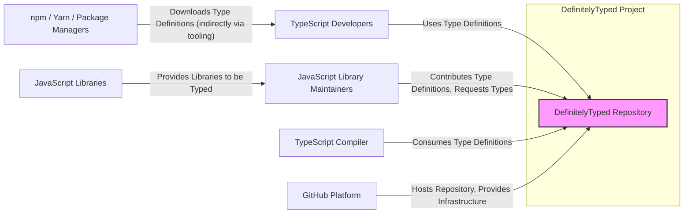
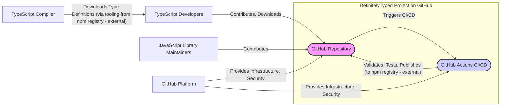

# BUSINESS POSTURE

- Business Priorities and Goals:
  - Provide a central repository of high-quality TypeScript type definitions for JavaScript libraries.
  - Enable TypeScript developers to seamlessly integrate JavaScript libraries into their projects with type safety.
  - Foster a collaborative community for maintaining and expanding the type definition library.
  - Ensure the type definitions are accurate, up-to-date, and compatible with various JavaScript libraries and TypeScript versions.
  - Reduce the friction for TypeScript developers using JavaScript libraries, improving developer productivity and code quality.
- Business Risks:
  - Risk of introducing vulnerabilities into projects that rely on DefinitelyTyped if type definitions are compromised or contain malicious code.
  - Risk of inaccurate or incomplete type definitions leading to runtime errors or unexpected behavior in consuming applications.
  - Risk of reputational damage if the repository is perceived as unreliable or insecure.
  - Risk of reduced community trust and contribution if security is not adequately addressed.
  - Risk of service disruption if the repository becomes unavailable or experiences performance issues.

# SECURITY POSTURE

- Existing Security Controls:
  - security control: GitHub platform security features, including authentication, authorization, and access control, are used to manage access to the repository. Implemented by: GitHub.
  - security control: Code review process is in place for all contributions to the repository. Implemented by: Community Maintainers via GitHub Pull Requests.
  - security control: Issue reporting and community moderation are used to identify and address potential problems. Implemented by: GitHub Issues and Community Maintainers.
  - security control: Automated checks, such as linters and TypeScript compiler checks, are likely used in CI to validate contributions. Implemented by: GitHub Actions (likely, details not specified in input).
- Accepted Risks:
  - accepted risk: Potential for minor inaccuracies or omissions in type definitions due to the community-driven nature of the project.
  - accepted risk: Risk of occasional delays in reviewing and merging contributions.
  - accepted risk: Reliance on the security of the GitHub platform.
- Recommended Security Controls:
  - security control: Implement automated Security Scanning (SAST) on pull requests to detect potential vulnerabilities in contributed type definitions.
  - security control: Implement Dependency Scanning to ensure that build and tooling dependencies are free from known vulnerabilities.
  - security control: Formalize a security review process specifically focused on identifying and mitigating security risks in type definitions, especially for widely used or critical libraries.
  - security control: Introduce input validation beyond basic type checking to prevent injection attacks or other malicious patterns in type definitions.
  - security control: Regularly audit the repository's security configuration and access controls.
  - security control: Implement a process for reporting and responding to security vulnerabilities in type definitions.
- Security Requirements:
  - Authentication:
    - Requirement: Contributors and maintainers must authenticate to GitHub to contribute to the repository.
    - Requirement: GitHub authentication mechanisms should be considered secure and up-to-date.
  - Authorization:
    - Requirement: Role-based access control within GitHub should be used to manage permissions for different actions (e.g., read, write, merge).
    - Requirement: Clearly defined roles and responsibilities for maintainers and contributors.
  - Input Validation:
    - Requirement: All contributed type definition files must be validated to ensure they are syntactically correct TypeScript code.
    - Requirement: Input validation should go beyond syntax and type checking to identify potentially malicious patterns or code injection attempts within type definitions.
    - Requirement: Validation should be performed automatically as part of the CI process.
  - Cryptography:
    - Requirement: HTTPS should be enforced for all access to the repository to protect data in transit.
    - Requirement: Consider signing commits to ensure the integrity and authenticity of the codebase (if not already implemented by GitHub).

# DESIGN

## C4 CONTEXT



- Context Diagram Elements:
  - - Name: DefinitelyTyped Repository
    - Type: Software System
    - Description: A GitHub repository containing TypeScript type definitions for JavaScript libraries. It serves as a central source of type information for the TypeScript ecosystem.
    - Responsibilities:
      - Store and manage TypeScript type definition files.
      - Facilitate community contributions and maintenance of type definitions.
      - Provide access to type definitions for TypeScript developers and tools.
    - Security controls:
      - security control: GitHub platform security features (authentication, authorization, infrastructure security).
      - security control: Code review process for contributions.
      - security control: Issue reporting and community moderation.
      - security control: Potentially automated security checks in CI (to be confirmed).
  - - Name: TypeScript Developers
    - Type: Person
    - Description: Software developers who use TypeScript and want to integrate JavaScript libraries into their projects with type safety.
    - Responsibilities:
      - Discover and utilize type definitions from DefinitelyTyped.
      - Report issues or contribute improvements to type definitions.
      - Consume type definitions in their TypeScript projects.
    - Security controls:
      - security control: Rely on the integrity and security of type definitions provided by DefinitelyTyped.
  - - Name: JavaScript Library Maintainers
    - Type: Person
    - Description: Developers or organizations who maintain JavaScript libraries and may contribute or request type definitions for their libraries in DefinitelyTyped.
    - Responsibilities:
      - Contribute type definitions for their JavaScript libraries.
      - Ensure the accuracy and completeness of type definitions for their libraries.
      - Request type definitions for libraries they maintain.
    - Security controls:
      - security control: Adhere to contribution guidelines and security best practices when submitting type definitions.
  - - Name: TypeScript Compiler
    - Type: Software System
    - Description: The official TypeScript compiler, which consumes type definition files from DefinitelyTyped (indirectly, usually via tooling) to provide type checking and language services.
    - Responsibilities:
      - Parse and process type definition files.
      - Use type definitions to perform type checking and provide code intelligence.
    - Security controls:
      - security control: Assumes the integrity of the type definition files it consumes.
  - - Name: npm / Yarn / Package Managers
    - Type: Software System
    - Description: Package managers used by TypeScript developers to manage project dependencies. While not directly interacting with DefinitelyTyped repository, tooling often uses these to download type definitions from npm registry which are published from DefinitelyTyped.
    - Responsibilities:
      - Download and install project dependencies, including type definitions (often indirectly via tooling that fetches from npm registry).
    - Security controls:
      - security control: Package managers have their own security mechanisms for package integrity and provenance (not directly related to DefinitelyTyped repository security).
  - - Name: GitHub Platform
    - Type: Software System
    - Description: The platform hosting the DefinitelyTyped repository, providing infrastructure, version control, and collaboration features.
    - Responsibilities:
      - Host the Git repository and its contents.
      - Provide web interface and API for accessing the repository.
      - Manage user authentication and authorization.
      - Provide CI/CD infrastructure (GitHub Actions).
    - Security controls:
      - security control: GitHub's comprehensive security measures for its platform and services.
  - - Name: JavaScript Libraries
    - Type: Software System
    - Description: The ecosystem of JavaScript libraries for which DefinitelyTyped provides type definitions.
    - Responsibilities:
      - Function as intended according to their documentation.
    - Security controls:
      - security control: Security of JavaScript libraries is independent of DefinitelyTyped, but type definitions aim to accurately represent their API and behavior.

## C4 CONTAINER



- Container Diagram Elements:
  - - Name: GitHub Repository
    - Type: Container - Git Repository and Web Interface
    - Description: The core container is the Git repository hosted on GitHub. It stores all type definition files, contribution history, and project metadata. GitHub provides the web interface for browsing and interacting with the repository.
    - Responsibilities:
      - Version control for type definition files.
      - Storage and retrieval of repository content.
      - Web interface for browsing and contribution management.
      - API access for automation and tooling.
    - Security controls:
      - security control: GitHub platform security features (authentication, authorization, infrastructure security).
      - security control: Access control lists and permissions within GitHub.
      - security control: Audit logs for repository activities (provided by GitHub).
  - - Name: GitHub Actions CI/CD
    - Type: Container - Continuous Integration and Continuous Delivery Pipeline
    - Description: GitHub Actions is used for automating the build, test, and validation process for contributions. It likely includes steps for linting, type checking, and potentially security scanning. It may also be used for publishing type definitions to npm registry (though publishing is external to this repository itself).
    - Responsibilities:
      - Automate the validation of contributions (linting, type checking, testing).
      - Enforce code quality and style guidelines.
      - Potentially automate security checks (SAST, dependency scanning - recommended).
      - Potentially automate publishing process (external to this repository).
    - Security controls:
      - security control: Secure configuration of GitHub Actions workflows.
      - security control: Access control for workflow management and secrets.
      - security control: Security scanning tools integrated into the CI pipeline (recommended).
      - security control: Supply chain security for CI dependencies and tools.
  - - Name: GitHub Platform
    - Type: Container - Infrastructure and Security Provider
    - Description: GitHub platform provides the underlying infrastructure for both the repository and GitHub Actions, including servers, databases, network, and security services.
    - Responsibilities:
      - Provide reliable and secure infrastructure for hosting the repository and CI/CD.
      - Manage platform-level security controls and monitoring.
    - Security controls:
      - security control: GitHub's comprehensive security measures for its platform infrastructure.

## DEPLOYMENT

- Deployment Architecture:
  - Solution: GitHub Cloud Deployment
  - Details: DefinitelyTyped project is deployed entirely on GitHub's cloud infrastructure. There are no separate deployment environments managed by the DefinitelyTyped project itself. The repository, web interface, and CI/CD are all hosted and managed by GitHub.

```mermaid
flowchart LR
    subgraph "GitHub Cloud Infrastructure"
        subgraph "Region 1"
            Server1["GitHub Web Servers"]
            Server2["GitHub Git Servers"]
            Server3["GitHub Actions Runners"]
            Database1["GitHub Metadata Database"]
        end
        subgraph "Region 2"
            Server4["GitHub Web Servers"]
            Server5["GitHub Git Servers"]
            Server6["GitHub Actions Runners"]
            Database2["GitHub Metadata Database Replica"]
        end
        LoadBalancer["Global Load Balancer"]
    end
    Internet["Internet"] -- "HTTPS Access" --> LoadBalancer
    LoadBalancer -- "HTTP/HTTPS" --> Server1 & Server4
    LoadBalancer -- "Git Protocol" --> Server2 & Server5
    Server1 & Server4 -- "Read/Write" --> Database1 & Database2
    Server2 & Server5 -- "Read/Write" --> Database1 & Database2
    Server3 & Server6 -- "Access Repository, Run Workflows" --> Server2 & Server5
    style LoadBalancer fill:#bbb,stroke:#333,stroke-width:1px
    style "GitHub Cloud Infrastructure" fill:#eee,stroke:#333,stroke-width:2px
    style Server1 fill:#ddd,stroke:#333,stroke-width:1px
    style Server2 fill:#ddd,stroke:#333,stroke-width:1px
    style Server3 fill:#ddd,stroke:#333,stroke-width:1px
    style Server4 fill:#ddd,stroke:#333,stroke-width:1px
    style Server5 fill:#ddd,stroke:#333,stroke-width:1px
    style Server6 fill:#ddd,stroke:#333,stroke-width:1px
    style Database1 fill:#eee,stroke:#333,stroke-width:1px
    style Database2 fill:#eee,stroke:#333,stroke-width:1px
```

- Deployment Diagram Elements:
  - - Name: GitHub Web Servers
    - Type: Infrastructure - Web Server
    - Description: Servers responsible for handling HTTP/HTTPS requests for the GitHub web interface, including access to the DefinitelyTyped repository.
    - Responsibilities:
      - Serve the GitHub web application.
      - Handle user authentication and authorization for web access.
      - Route requests to appropriate backend services.
    - Security controls:
      - security control: Web server security hardening and configuration by GitHub.
      - security control: HTTPS encryption for web traffic.
      - security control: Web Application Firewall (WAF) likely in place (managed by GitHub).
  - - Name: GitHub Git Servers
    - Type: Infrastructure - Git Server
    - Description: Servers responsible for handling Git operations, such as clone, push, pull, for the DefinitelyTyped repository.
    - Responsibilities:
      - Manage Git repository data and version control.
      - Handle Git protocol requests.
      - Enforce access control for Git operations.
    - Security controls:
      - security control: Git server security hardening and configuration by GitHub.
      - security control: SSH and HTTPS for Git protocol encryption.
      - security control: Access control for Git repository access.
  - - Name: GitHub Actions Runners
    - Type: Infrastructure - CI/CD Runner
    - Description: Servers that execute GitHub Actions workflows, including CI/CD pipelines for DefinitelyTyped.
    - Responsibilities:
      - Execute CI/CD workflows defined in GitHub Actions.
      - Access the Git repository to perform build and test operations.
      - Report workflow status and results.
    - Security controls:
      - security control: Runner environment security hardening by GitHub.
      - security control: Secure execution of workflow steps.
      - security control: Isolation between workflow runs.
  - - Name: GitHub Metadata Database
    - Type: Infrastructure - Database
    - Description: Databases used by GitHub to store metadata about repositories, users, permissions, and other platform data, including data related to DefinitelyTyped.
    - Responsibilities:
      - Store and manage GitHub platform metadata.
      - Provide data persistence and availability.
    - Security controls:
      - security control: Database security hardening and access control by GitHub.
      - security control: Data encryption at rest and in transit within GitHub infrastructure.
      - security control: Database replication for high availability and disaster recovery.
  - - Name: Global Load Balancer
    - Type: Infrastructure - Load Balancer
    - Description: A global load balancer that distributes incoming traffic across different GitHub regions and server instances, ensuring high availability and performance.
    - Responsibilities:
      - Distribute traffic across GitHub infrastructure.
      - Provide high availability and fault tolerance.
      - Potentially perform DDoS mitigation and other traffic management functions.
    - Security controls:
      - security control: Load balancer security configuration and hardening by GitHub.
      - security control: DDoS protection and traffic filtering (managed by GitHub).

## BUILD

```mermaid
flowchart LR
    Developer["Developer"] -- "Code Contribution (Pull Request)" --> GitHubPR["GitHub Pull Request"]
    GitHubPR -- "Triggers" --> GitHubActions["GitHub Actions CI"]
    subgraph GitHubActions
        Linting["Linting Checks"]
        TypeScriptCheck["TypeScript Compiler Checks"]
        TestSuites["Run Test Suites (if any)"]
        SecurityScan["Security Scanning (Recommended)"]
    end
    GitHubActions -- "Validation Results" --> GitHubPRReview["GitHub PR Review"]
    GitHubPRReview -- "Merge (on Approval)" --> GitHubRepo["GitHub Repository (Main Branch)"]
    GitHubRepo -- "Triggers (on Merge - Optional)" --> PublishProcess["Publishing Process (External - e.g., to npm registry)"]
    style GitHubActions fill:#ccf,stroke:#333,stroke-width:2px
```



- Build Process Description:
  - Developer creates a contribution (e.g., new type definition or update) and submits it as a Pull Request (PR) to the DefinitelyTyped GitHub repository.
  - The PR submission automatically triggers the GitHub Actions CI pipeline.
  - The CI pipeline performs a series of automated checks:
    - Linting Checks: Code linters analyze the code for style and potential errors.
    - TypeScript Compiler Checks: The TypeScript compiler verifies the type definitions for syntax and type correctness.
    - Test Suites (if any): If test suites are included with the contribution, they are executed to ensure the type definitions behave as expected.
    - Security Scanning (Recommended): Security scanning tools (SAST, dependency checks) should be integrated to identify potential vulnerabilities in the contributed code and dependencies.
  - The results of the CI pipeline are reported back to the GitHub PR.
  - Maintainers review the PR, considering the CI results and manually inspecting the code.
  - Upon approval from maintainers, the PR is merged into the main branch of the GitHub repository.
  - Optionally, a merge to the main branch can trigger a separate publishing process (which is likely external to this repository and managed by the DefinitelyTyped maintainers) to publish the type definitions to package registries like npm.
- Build Security Controls:
  - security control: Automated CI pipeline ensures consistent and repeatable build and validation process. Implemented by: GitHub Actions.
  - security control: Linting and TypeScript compiler checks help prevent syntax errors and type inconsistencies. Implemented by: GitHub Actions (Linters, TypeScript Compiler).
  - security control: Code review process by maintainers adds a manual security and quality gate. Implemented by: Community Maintainers.
  - security control: (Recommended) Security scanning (SAST, dependency scanning) in CI to detect potential vulnerabilities early in the development lifecycle. Recommended for implementation in: GitHub Actions.
  - security control: (Recommended) Supply chain security considerations for CI environment, ensuring tools and dependencies used in the build process are secure. Recommended for implementation in: GitHub Actions configuration and runner environment.
  - security control: Access control to GitHub Actions workflows and secrets to prevent unauthorized modifications to the build process. Implemented by: GitHub platform access controls.

# RISK ASSESSMENT

- Critical Business Processes:
  - Maintaining the integrity and accuracy of TypeScript type definitions.
  - Ensuring the availability and accessibility of the DefinitelyTyped repository.
  - Facilitating a trustworthy and collaborative community for type definition contributions.
- Data Sensitivity:
  - Type Definition Files (.d.ts): Publicly available code, but integrity is critical. Compromised type definitions can introduce vulnerabilities into a wide range of projects. High integrity requirement.
  - Contribution History (Git): Publicly available, important for traceability and accountability. Medium integrity requirement.
  - Metadata (e.g., issue reports, PR discussions): Publicly available, contributes to community knowledge and project management. Low to medium integrity requirement.
  - No highly confidential data is directly managed within the DefinitelyTyped repository itself. The primary concern is the integrity and availability of public type definition data.

# QUESTIONS & ASSUMPTIONS

- Questions:
  - What specific security scanning tools are currently used (if any) in the GitHub Actions CI pipeline?
  - Is there a formal process for security reviews of contributions, especially for widely used or critical type definitions?
  - What is the process for handling reported security vulnerabilities in type definitions? Is there a dedicated security team or contact?
  - Are there any specific guidelines or training for maintainers on security best practices for code review and contribution management?
  - What is the process for publishing type definitions to npm registry or other distribution channels? Are there security controls in place for the publishing process?
- Assumptions:
  - The GitHub platform provides a reasonably secure infrastructure and platform-level security controls.
  - Community contributors are generally well-intentioned, but security vulnerabilities can be introduced unintentionally or maliciously.
  - The primary security risk is related to the integrity of type definitions and the potential for introducing vulnerabilities into consuming projects through compromised or inaccurate types.
  - The project relies heavily on community contributions and the code review process for maintaining quality and security.
  - The build and CI/CD processes are currently based on GitHub Actions, and can be extended to incorporate additional security controls.