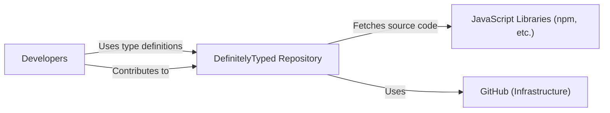
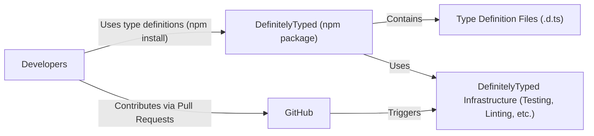
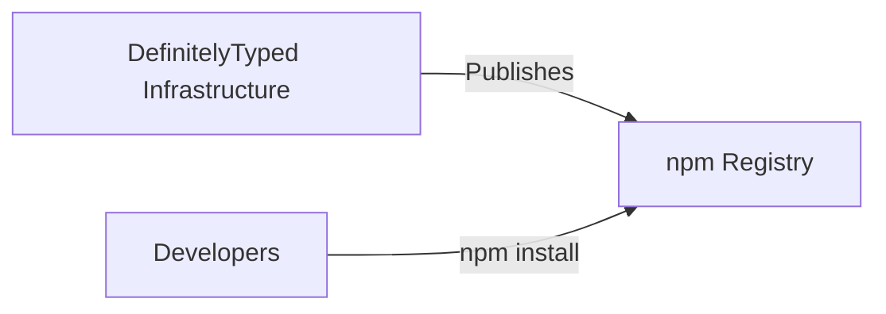
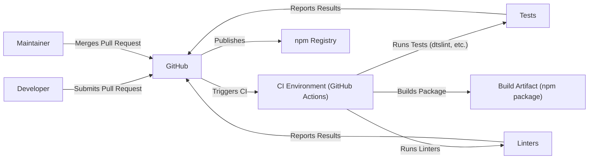

Okay, let's create a design document for the DefinitelyTyped project.

# BUSINESS POSTURE

Business Priorities and Goals:

*   Provide a central, high-quality repository of TypeScript type definitions for popular JavaScript libraries.
*   Enable developers to use existing JavaScript libraries in their TypeScript projects with strong typing, improving code quality, maintainability, and developer experience.
*   Foster a collaborative community of contributors to maintain and expand the type definition library.
*   Reduce the barrier to entry for TypeScript adoption by providing readily available type definitions.
*   Improve discoverability of type definitions.

Most Important Business Risks:

*   Inaccurate or outdated type definitions: This could lead to runtime errors, incorrect code behavior, and developer frustration, undermining the project's core value proposition.
*   Malicious type definitions: A compromised type definition could introduce vulnerabilities into projects that consume it, potentially leading to security breaches.
*   Lack of community participation: The project relies on volunteer contributions. Insufficient participation could lead to stagnation and outdated definitions.
*   Scalability challenges: As the number of supported libraries and contributors grows, the project needs to ensure its infrastructure and processes can handle the increasing load.
*   Competition from other type definition sources: Alternative sources of type definitions could emerge, potentially fragmenting the ecosystem and reducing the project's relevance.

# SECURITY POSTURE

Existing Security Controls:

*   security control: Code Review: All changes to type definitions are subject to review by other contributors before being merged. This helps catch errors, inconsistencies, and potential security issues. (Described in the project's contribution guidelines and enforced by GitHub's pull request mechanism).
*   security control: Automated Testing: Some type definitions include automated tests to verify their correctness. (Described in the project's documentation and implemented using various testing frameworks).
*   security control: Community Moderation: The project has a team of moderators who monitor contributions and address reported issues. (Described in the project's documentation and implemented through GitHub's issue tracking and moderation tools).
*   security control: Read-only access for most users: Only maintainers can merge changes. (Enforced by GitHub's permission model).

Accepted Risks:

*   accepted risk: Reliance on volunteer contributors: The project's success depends on the ongoing contributions of volunteers. There's a risk of insufficient participation or slow response times to issues.
*   accepted risk: Potential for human error: Despite code review, there's always a risk of human error leading to inaccurate or insecure type definitions.
*   accepted risk: Limited formal security audits: The project does not appear to have undergone regular, comprehensive security audits by external experts.

Recommended Security Controls:

*   security control: Implement a more robust type definition testing framework: This could include automated checks for common security vulnerabilities, such as incorrect type definitions that could lead to type confusion or prototype pollution attacks.
*   security control: Introduce a security vulnerability reporting process: Provide a clear and secure channel for researchers to report potential security issues.
*   security control: Consider using a Software Bill of Materials (SBOM) for type definitions: This would improve transparency and help track dependencies, making it easier to identify and address vulnerabilities in underlying JavaScript libraries.
*   security control: Explore options for static analysis of type definitions: Tools could be used to automatically detect potential security issues or inconsistencies.
*   security control: Regularly review and update dependencies: Ensure that any tools or libraries used by the DefinitelyTyped project itself are kept up-to-date to mitigate potential vulnerabilities.

Security Requirements:

*   Authentication: Not directly applicable to the core functionality of providing type definitions. GitHub authentication is used for contribution management.
*   Authorization: GitHub's permission model controls who can contribute and merge changes. Maintainers have elevated privileges.
*   Input Validation: Type definitions themselves act as a form of input validation for TypeScript code. The project should ensure that type definitions are well-formed and do not contain malicious code.
*   Cryptography: Not directly applicable to the core functionality. HTTPS is used for accessing the repository and related resources.

# DESIGN

## C4 CONTEXT

Element Descriptions:

*   Element:
    *   Name: Developers
    *   Type: Person
    *   Description: Software developers using TypeScript.
    *   Responsibilities: Use type definitions from DefinitelyTyped in their projects, contribute new or updated type definitions.
    *   Security controls: N/A (External entity)

*   Element:
    *   Name: DefinitelyTyped Repository
    *   Type: Software System
    *   Description: The central repository for TypeScript type definitions.
    *   Responsibilities: Store type definitions, manage contributions, provide access to type definitions.
    *   Security controls: Code review, community moderation, read-only access for most users.

*   Element:
    *   Name: JavaScript Libraries (npm, etc.)
    *   Type: Software System
    *   Description: Repositories and package managers for JavaScript libraries.
    *   Responsibilities: Host the source code of JavaScript libraries.
    *   Security controls: N/A (External entity, but DefinitelyTyped relies on the security of these platforms).

*   Element:
    *   Name: GitHub (Infrastructure)
    *   Type: Software System
    *   Description: The platform hosting the DefinitelyTyped repository.
    *   Responsibilities: Provide version control, issue tracking, collaboration tools, and access control.
    *   Security controls: GitHub's built-in security features, including access controls, two-factor authentication, and vulnerability scanning.

## C4 CONTAINER

Element Descriptions:

*   Element:
    *   Name: Developers
    *   Type: Person
    *   Description: Software developers using TypeScript.
    *   Responsibilities: Use type definitions, contribute type definitions.
    *   Security controls: N/A (External entity)

*   Element:
    *   Name: DefinitelyTyped (npm package)
    *   Type: Container (npm package)
    *   Description: The published npm package containing the type definitions.
    *   Responsibilities: Provide a convenient way for developers to install type definitions.
    *   Security controls: npm package signing (if implemented).

*   Element:
    *   Name: Type Definition Files (.d.ts)
    *   Type: Container (Files)
    *   Description: The actual TypeScript type definition files.
    *   Responsibilities: Define the types for JavaScript libraries.
    *   Security controls: Code review, automated testing (where applicable).

*   Element:
    *   Name: DefinitelyTyped Infrastructure (Testing, Linting, etc.)
    *   Type: Container (Various tools and scripts)
    *   Description: The tools and scripts used to manage the DefinitelyTyped project, including testing, linting, and publishing.
    *   Responsibilities: Ensure the quality and consistency of type definitions.
    *   Security controls: Regular updates, dependency management.

*   Element:
    *   Name: GitHub
    *   Type: Software System
    *   Description: The platform hosting the DefinitelyTyped repository and providing collaboration tools.
    *   Responsibilities: Version control, issue tracking, pull request management.
    *   Security controls: GitHub's built-in security features.

## DEPLOYMENT

Possible Deployment Solutions:

1.  **npm Registry:** The primary deployment method. Type definitions are published as npm packages.
2.  **GitHub Pages:** Could be used for documentation and project website.
3.  **CDN:** A CDN could be used to serve the type definitions directly, although this is less common.

Chosen Solution (npm Registry):

Element Descriptions:

*   Element:
    *   Name: DefinitelyTyped Infrastructure
    *   Type: Software System
    *   Description: The tools and scripts used to manage and publish the DefinitelyTyped project.
    *   Responsibilities: Build, test, and publish type definitions.
    *   Security controls: Access controls, secure build environment.

*   Element:
    *   Name: npm Registry
    *   Type: Software System
    *   Description: The public npm registry.
    *   Responsibilities: Host and distribute npm packages.
    *   Security controls: npm's security features, including package signing and vulnerability scanning.

*   Element:
    *   Name: Developers
    *   Type: Person
    *   Description: Software developers using TypeScript.
    *   Responsibilities: Install and use type definitions.
    *   Security controls: N/A (External entity)

## BUILD

Build Process Description:

1.  A developer creates or modifies type definitions and submits a pull request to the DefinitelyTyped repository on GitHub.
2.  GitHub Actions (or a similar CI system) is triggered by the pull request.
3.  The CI environment runs tests (using tools like dtslint) and linters to ensure the quality and correctness of the type definitions.
4.  Test and linter results are reported back to GitHub.
5.  If the tests and linters pass, and a maintainer approves the pull request, it is merged into the main branch.
6.  A separate process (potentially also triggered by GitHub Actions) builds the npm package and publishes it to the npm registry.

Security Controls:

*   security control: CI/CD Pipeline: GitHub Actions (or similar) automates the build, test, and deployment process.
*   security control: Automated Testing: dtslint and other testing tools are used to verify the correctness of type definitions.
*   security control: Linting: Linters enforce code style and help prevent common errors.
*   security control: Code Review: All changes are reviewed by maintainers before being merged.
*   security control: Access Control: Only maintainers can merge pull requests and publish to npm.

# RISK ASSESSMENT

Critical Business Processes:

*   Providing accurate and up-to-date type definitions.
*   Maintaining a healthy and active community of contributors.
*   Ensuring the security and integrity of the type definitions.

Data to Protect:

*   Type definition files (.d.ts): Sensitivity - Medium (Incorrect or malicious definitions can cause problems, but they don't directly contain sensitive data).
*   Contributor information (GitHub usernames, potentially email addresses): Sensitivity - Low (Publicly available information).
*   Internal project documentation and communication: Sensitivity - Low to Medium (Depending on the content).

# QUESTIONS & ASSUMPTIONS

Questions:

*   Are there any specific security audits or penetration tests performed on the DefinitelyTyped infrastructure or processes?
*   What is the exact process for handling reported security vulnerabilities?
*   What are the specific tools and configurations used for testing and linting?
*   Are there any plans to implement package signing for the npm packages?
*   What is the long-term strategy for ensuring the sustainability and scalability of the project?

Assumptions:

*   BUSINESS POSTURE: The primary goal is to provide a community-driven, high-quality resource for TypeScript type definitions.
*   SECURITY POSTURE: The project relies heavily on community contributions and code review for security. There is a limited budget for formal security audits.
*   DESIGN: The project uses GitHub for version control, issue tracking, and CI/CD. The primary deployment method is publishing to the npm registry. The build process is automated using GitHub Actions (or a similar system).