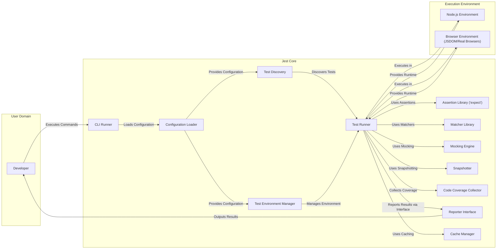
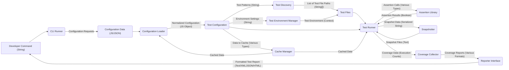

# Project Design Document: Jest

**Version:** 1.1
**Date:** October 26, 2023
**Author:** AI Software Architect

## 1. Introduction

This document provides an enhanced design overview of the Jest JavaScript testing framework. It aims to provide a more detailed capture of the architectural components, data flows, and interactions within the system, building upon the previous version. This document will serve as a more robust foundation for subsequent threat modeling activities.

Jest is a comprehensive JavaScript testing framework, widely adopted for testing React applications and adaptable for diverse JavaScript projects. Its core strengths lie in its ease of use, zero-configuration setup for many projects, powerful features like snapshot testing and mocking, and a focus on providing an excellent developer experience.

## 2. Goals

The primary goals of this enhanced design document are:

*   To provide a more granular articulation of the architecture and key components of Jest, including sub-components where relevant.
*   To offer a more detailed description of the data flow and interactions within the system, specifying data types where possible.
*   To provide a richer level of detail to facilitate more effective and targeted threat modeling.
*   To serve as an improved and more comprehensive reference point for understanding Jest's internal workings.

## 3. Scope

This document expands upon the previous scope to provide a more in-depth look at the core functionalities and architectural components of the Jest testing framework, including:

*   Detailed breakdown of test discovery mechanisms.
*   In-depth analysis of configuration loading and merging processes.
*   Examination of the test environment setup and teardown lifecycle, including sandboxing.
*   Detailed explanation of the assertion library and the extensibility of matchers.
*   Comprehensive overview of mocking and spying capabilities, including different mocking strategies.
*   Detailed process of snapshot creation, storage, and comparison.
*   In-depth look at code coverage instrumentation and reporting.
*   Detailed explanation of watch mode and interactive testing workflows.
*   Analysis of integration points with different JavaScript environments (Node.js, browsers, and potentially others).

This document still does not cover:

*   Specific test suites written by users using Jest.
*   Third-party integrations or plugins in exhaustive detail, but will touch upon common integration points.
*   The absolute lowest-level implementation details of specific modules, focusing on architectural significance.

## 4. High-Level Architecture

**Description of Components (Enhanced):**

*   **Developer:** The user interacting with Jest, typically through command-line interface commands and configuration files.
*   **CLI Runner:** The primary entry point for Jest execution. It handles command parsing using libraries like `yargs`, orchestrates the test lifecycle, and manages plugins.
*   **Configuration Loader:**  A sophisticated component responsible for merging configurations from `jest.config.js`, `package.json` (`jest` field), command-line arguments, and default settings. It performs schema validation and provides a normalized configuration object.
*   **Test Discovery:** Employs various strategies to locate test files, including glob patterns, explicit file paths, and potentially custom resolvers. It filters files based on configuration and provides a list of test paths to the Test Runner.
*   **Test Environment Manager:**  Abstracts the underlying test execution environment. It can instantiate Node.js environments, browser-like environments using JSDOM, or interact with real browsers via tools like Puppeteer or Playwright. It manages global setup and teardown scripts.
*   **Test Runner:** The core execution engine. It loads test files, executes individual test cases, manages test hooks (before/after each/all), and coordinates with other components like the Assertion Library, Mocking Engine, and Snapshotter. It often utilizes worker processes for parallel test execution.
*   **Assertion Library ('expect'):**  Provides the fundamental `expect` function for writing assertions. It's designed to be extensible, allowing users to define custom matchers.
*   **Matcher Library:** A collection of built-in matchers (e.g., `toBe`, `toEqual`, `toHaveBeenCalled`) that extend the functionality of the Assertion Library. Users can also create custom matchers.
*   **Mocking Engine:**  Offers powerful mocking and spying capabilities. It includes functions like `jest.mock()`, `jest.spyOn()`, `jest.fn()`, and `jest.isMockFunction()`. It manages module mocking, function mocking, and provides utilities for inspecting mock calls.
*   **Snapshotter:**  Handles the creation, storage, and comparison of snapshot files. It uses algorithms to serialize data structures and compare them for changes. It provides mechanisms for updating snapshots when intentional changes occur.
*   **Code Coverage Collector:** Integrates with code instrumentation tools (often via Babel plugins) to track code execution during tests. It generates coverage reports in various formats (e.g., HTML, LCOV, Cobertura) and allows configuration of coverage thresholds.
*   **Reporter Interface:** Defines an interface for reporting test results. Jest includes several built-in reporters (e.g., default, verbose, JUnit) and allows users to create custom reporters to integrate with different tools and platforms.
*   **Cache Manager:**  Implements caching mechanisms to improve performance, especially in watch mode. It caches transformed modules, test results, and other intermediate data. It uses file system-based caching and manages cache invalidation based on file changes and configuration.
*   **Node.js Environment:** The standard Node.js runtime environment where Jest primarily executes tests for backend or full-stack JavaScript applications.
*   **Browser Environment (JSDOM/Real Browsers):**  Simulates a browser environment using JSDOM for testing front-end logic without a real browser. It can also integrate with real browsers using tools like Puppeteer or Playwright for end-to-end testing.

## 5. Component Details (Enhanced)

This section provides a more detailed description of key components and their functionalities, focusing on inputs, outputs, and potential security considerations.

*   **CLI Runner:**
    *   **Inputs:** Command-line arguments, environment variables.
    *   **Outputs:** Test execution status, reports, console output.
    *   **Functionality:** Parses arguments using libraries like `yargs`, initializes global Jest state, loads configuration, orchestrates test discovery and execution, manages watch mode, invokes reporters, handles errors and exits.
    *   **Security Considerations:** Vulnerable to command injection if arguments are not properly sanitized.

*   **Configuration Loader:**
    *   **Inputs:** `jest.config.js`, `package.json`, command-line arguments, default configuration.
    *   **Outputs:** Normalized Jest configuration object.
    *   **Functionality:** Reads and merges configuration from various sources, performs schema validation using libraries like `json-schema`, resolves file paths, and provides the final configuration to other Jest components.
    *   **Security Considerations:** Potential for path traversal vulnerabilities if file paths in configuration are not validated. Exposure of sensitive information if configuration files are not properly secured.

*   **Test Discovery:**
    *   **Inputs:** Configuration object (including test match patterns, ignore patterns, root directories).
    *   **Outputs:** List of absolute paths to test files.
    *   **Functionality:** Uses glob libraries (e.g., `fast-glob`) to find files matching specified patterns, filters files based on ignore patterns, and potentially uses custom resolvers for non-standard project structures.
    *   **Security Considerations:**  Potential for unintended file inclusion or exclusion if patterns are not carefully constructed.

*   **Test Environment Manager:**
    *   **Inputs:** Configuration object (including `testEnvironment` setting, global setup/teardown files).
    *   **Outputs:**  Initialized test environment (global scope, environment variables).
    *   **Functionality:** Determines the test environment (Node.js, JSDOM, browser), sets up the global scope, loads global setup files, manages environment variables, and handles environment teardown. May use sandboxing techniques for isolation.
    *   **Security Considerations:**  Weak isolation between test environments could lead to test pollution or information leakage. Vulnerabilities in JSDOM or browser automation tools could be exploited.

*   **Test Runner:**
    *   **Inputs:** List of test file paths, configuration object, test environment.
    *   **Outputs:** Test results (pass/fail status, assertion results, coverage data).
    *   **Functionality:** Loads and executes test files, manages the test lifecycle (before/after hooks), invokes assertion libraries, interacts with the mocking engine and snapshotter, collects code coverage data, and manages worker processes for parallel execution.
    *   **Security Considerations:**  Execution of arbitrary code within test files poses a significant risk. Improper handling of asynchronous operations could lead to race conditions.

*   **Assertion Library (`expect`):**
    *   **Inputs:** Values to be compared, matcher functions.
    *   **Outputs:** Boolean indicating assertion success or failure, error messages.
    *   **Functionality:** Provides the core `expect` function and the framework for defining and using matchers.
    *   **Security Considerations:**  Generally not a direct source of vulnerabilities, but custom matchers could potentially introduce security issues if not carefully implemented.

*   **Matcher Library:**
    *   **Inputs:** Values to be compared.
    *   **Outputs:** Boolean indicating match success or failure, error messages.
    *   **Functionality:** Provides a collection of pre-built matcher functions for common assertion scenarios.
    *   **Security Considerations:** Similar to the Assertion Library, custom matchers are the primary area of concern.

*   **Mocking Engine:**
    *   **Inputs:** Module paths, function names, mock implementations.
    *   **Outputs:** Mocked functions and modules, spy objects.
    *   **Functionality:** Allows users to replace dependencies with mock implementations, spy on function calls, and control the behavior of mocked objects.
    *   **Security Considerations:**  Over-reliance on mocking could mask real integration issues. Improperly implemented mocks could introduce unexpected behavior.

*   **Snapshotter:**
    *   **Inputs:** Data to be snapshotted, existing snapshot files.
    *   **Outputs:** New or updated snapshot files, comparison results.
    *   **Functionality:** Serializes data structures (often using libraries like `pretty-format`), compares them to existing snapshots, and provides mechanisms for updating snapshots.
    *   **Security Considerations:**  Snapshot poisoning – malicious actors could modify snapshot files to make failing tests appear to pass. Secure storage and version control of snapshot files are important.

*   **Code Coverage Collector:**
    *   **Inputs:** Instrumented code, test execution results.
    *   **Outputs:** Code coverage reports in various formats.
    *   **Functionality:** Uses code instrumentation (often via Babel plugins like `babel-plugin-istanbul`) to track code execution during tests and generates coverage reports.
    *   **Security Considerations:**  Manipulation of coverage data could hide areas of code that are not adequately tested.

*   **Reporter Interface:**
    *   **Inputs:** Test results, configuration object.
    *   **Outputs:** Formatted test reports (console output, files).
    *   **Functionality:** Defines an interface for reporting test results. Built-in and custom reporters implement this interface to format and output results.
    *   **Security Considerations:**  Vulnerabilities in custom reporters could be exploited to leak sensitive information from test results.

*   **Cache Manager:**
    *   **Inputs:** Data to be cached, cache invalidation signals.
    *   **Outputs:** Cached data.
    *   **Functionality:** Caches transformed modules, test results, and other intermediate data to improve performance. Manages cache invalidation based on file changes and configuration.
    *   **Security Considerations:** Cache poisoning – malicious actors could inject harmful data into the cache, potentially affecting subsequent test runs or masking issues.

## 6. Data Flow (Enhanced)

The data flow during a Jest test run, with more specific data types, can be described as follows:

1. **Developer initiates Jest execution:** The developer runs a Jest command (e.g., `jest --watch`, `yarn test --coverage`).
2. **CLI Runner processes arguments:** The CLI Runner parses command-line arguments (strings), environment variables (strings), and initializes the process.
3. **Configuration is loaded:** The Configuration Loader reads configuration files (`jest.config.js` - JavaScript/JSON, `package.json` - JSON), merges them with command-line arguments (strings) and default settings (JavaScript objects), and performs validation.
4. **Test files are discovered:** The Test Discovery component uses the configuration object (JavaScript object containing file patterns - strings) to find test files, resulting in a list of absolute file paths (strings).
5. **Test environment is set up:** The Test Environment Manager uses the configuration object (JavaScript object containing environment settings - strings) to create the necessary environment (Node.js process, JSDOM instance, browser context).
6. **Test Runner executes tests:**
    *   Test files (JavaScript code) are loaded and executed within the environment.
    *   Assertions (using `expect` with various data types) are evaluated, producing boolean results.
    *   Mocks (JavaScript functions and objects) are managed.
    *   Snapshots (serialized data structures - strings) are created or compared against existing snapshot files (text files).
    *   Code coverage data (execution counts per line/branch - numbers) is collected.
7. **Test results are reported:** The Reporter receives test results (JavaScript objects containing test status, assertion results, error messages) and outputs them to the console (text), files (various formats like XML, JSON, HTML), or other configured destinations.
8. **Cache is updated:** The Cache Manager stores transformed modules (JavaScript code), test results (JavaScript objects), and other relevant data (various data types) in a file system cache.

**Data Flow Diagram (Enhanced):**

## 7. Security Considerations (Enhanced)

This section expands upon the initial security considerations, providing more specific examples and potential attack vectors.

*   **Configuration Injection:**
    *   **Threat:** Malicious configuration files or command-line arguments could inject arbitrary code, modify environment variables, or point to malicious test files.
    *   **Example:** A crafted `jest.config.js` could include a `setupFilesAfterEnv` script that executes arbitrary commands.
    *   **Mitigation:**  Strict validation of configuration values, avoiding dynamic execution of code from configuration where possible, and secure storage of configuration files.

*   **Test Code Injection:**
    *   **Threat:** Compromised test files could execute arbitrary code within the test environment, potentially leading to information disclosure, denial of service, or even remote code execution if the test environment has network access.
    *   **Example:** A test file could contain code that reads sensitive environment variables or attempts to access internal network resources.
    *   **Mitigation:**  Code review of test files, secure development practices, and running tests in isolated environments with limited privileges.

*   **Snapshot Poisoning:**
    *   **Threat:** Attackers could modify snapshot files to make failing tests appear to pass, masking regressions or vulnerabilities.
    *   **Example:**  Altering a snapshot to accept an output containing a security flaw.
    *   **Mitigation:**  Treat snapshot files as code, store them in version control, and review changes to snapshot files carefully. Consider using signed snapshots or other integrity checks.

*   **Reporter Vulnerabilities:**
    *   **Threat:** Vulnerabilities in custom reporters could be exploited to leak sensitive information from test results (e.g., API keys, database credentials) or execute arbitrary code on the machine running the tests.
    *   **Example:** A custom reporter that writes test results to a file without proper sanitization could be vulnerable to path traversal.
    *   **Mitigation:**  Careful review of custom reporter code, using well-vetted and secure reporting libraries, and limiting the privileges of the test execution environment.

*   **Dependency Vulnerabilities:**
    *   **Threat:** Jest relies on numerous dependencies, which could contain known security vulnerabilities.
    *   **Example:** A vulnerability in a transitive dependency used for code instrumentation could be exploited.
    *   **Mitigation:**  Regularly update dependencies, use vulnerability scanning tools, and consider using tools like `npm audit` or `yarn audit`.

*   **Code Coverage Manipulation:**
    *   **Threat:** Malicious actors could potentially manipulate code coverage data to hide areas of code that are not adequately tested or to falsely inflate coverage metrics.
    *   **Example:**  Modifying instrumentation data or coverage reports directly.
    *   **Mitigation:**  Secure the code coverage generation process and the storage of coverage reports. Implement checks to detect anomalies in coverage data.

*   **Cache Poisoning:**
    *   **Threat:** If the Jest cache is not properly secured, malicious actors could inject harmful data into the cache, potentially leading to the execution of outdated or malicious code during subsequent test runs.
    *   **Example:** Replacing a cached, transformed module with a compromised version.
    *   **Mitigation:**  Ensure proper file system permissions for the cache directory, consider using integrity checks for cached data, and provide mechanisms for invalidating the cache securely.

*   **Test Environment Isolation:**
    *   **Threat:** Insufficient isolation between test environments could lead to tests interfering with each other, causing unexpected behavior or information leakage.
    *   **Example:** One test modifying global state that affects subsequent tests.
    *   **Mitigation:**  Utilize sandboxing techniques, isolate test environments using separate processes or containers, and carefully manage global state within tests.

## 8. Technologies Used (Enhanced)

*   **JavaScript (ECMAScript):** The core language for Jest and test code.
*   **Node.js:** The primary runtime environment for executing Jest and many JavaScript tests.
*   **npm, Yarn, pnpm:** Package managers for dependency management.
*   **Babel:** Widely used for code transformation, including JSX compilation and code instrumentation for coverage. Key plugins include `babel-plugin-istanbul`.
*   **JSDOM:** A pure-JavaScript implementation of web standards, used to simulate a browser environment for testing front-end code.
*   **Chokidar:** Used for efficient file system watching in watch mode.
*   **Yargs:** A popular library for parsing command-line arguments.
*   **Pretty-Format:**  Used for serializing JavaScript values into a human-readable format for snapshot testing.
*   **`expect` (Part of Jest):** The built-in assertion library.
*   **Various other specialized JavaScript libraries:** For tasks like file system operations, path manipulation, and asynchronous control flow.

## 9. Deployment Considerations

Jest is primarily deployed as a development dependency within JavaScript projects. It is executed locally by developers during development, in CI/CD pipelines for automated testing, and sometimes in pre-commit hooks to ensure code quality. The security of the environments where Jest is executed (developer machines, CI/CD agents) is crucial.

## 10. Future Considerations

Potential future developments that could impact the architecture and security include:

*   **Improved Sandboxing and Isolation:**  Further enhancements to test environment isolation to mitigate risks of test pollution and information leakage.
*   **Standardized Plugin Security:**  Mechanisms for verifying the security and integrity of Jest plugins.
*   **Enhanced Snapshot Security:**  Features like signed snapshots or more robust mechanisms for detecting and preventing snapshot poisoning.
*   **Integration with Secure Enclaves or Confidential Computing:**  Exploring options for running tests in more secure environments for highly sensitive applications.
*   **Formal Security Audits:**  Regular security audits of the Jest codebase and its dependencies.

This enhanced document provides a more detailed and nuanced understanding of the Jest project's design, offering a stronger foundation for comprehensive threat modeling and security analysis. The added details regarding data flow, component functionalities, and specific security considerations will be invaluable for identifying potential vulnerabilities and developing effective mitigation strategies.