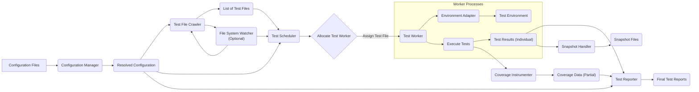

# Project Design Document: Jest Testing Framework

**Version:** 1.1
**Date:** October 26, 2023
**Author:** AI Software Architect

## 1. Introduction

This document provides an enhanced design overview of the Jest JavaScript testing framework (as represented by the codebase at [https://github.com/facebook/jest](https://github.com/facebook/jest)). This revision aims to provide an even clearer and more detailed understanding of Jest's architecture, key components, and data flow, specifically tailored for subsequent threat modeling activities. Improvements focus on clarifying component interactions and potential security implications.

## 2. Project Overview

Jest is a comprehensive JavaScript testing framework, widely adopted for testing React applications and other JavaScript projects. Its design emphasizes ease of use and a rich feature set, including zero-configuration defaults, snapshot testing, built-in code coverage, and powerful mocking capabilities. Jest operates primarily within a Node.js environment, orchestrating test execution and generating detailed reports.

## 3. System Architecture

The Jest architecture comprises several interacting components that orchestrate the testing process:

*   **Configuration Manager:**  Responsible for loading, merging, and validating Jest's configuration from `jest.config.js`, `package.json`, and command-line arguments.
*   **Test File Crawler:**  Identifies test files based on configured patterns and traverses directories to locate them.
*   **Test Scheduler:**  Determines the order and strategy for executing tests, including parallelization using worker processes.
*   **Test Worker:**  An isolated process (or thread) responsible for executing the tests within a single test file. Multiple workers can run concurrently.
*   **Environment Adapter:**  Provides an abstraction layer for the test execution environment, allowing tests to run in Node.js or browser-like environments (e.g., using jsdom).
*   **Test Reporter:**  Gathers test results from the workers and formats them into various reports (console output, JUnit XML, etc.).
*   **Snapshot Handler:**  Manages the creation, storage, and comparison of snapshot files for UI and data structure verification.
*   **Coverage Instrumenter:**  Instruments code to collect coverage data during test execution, often using libraries like `istanbul`.
*   **File System Watcher:**  (Optional) Monitors file system changes and triggers re-runs of affected tests in watch mode.

## 4. Data Flow

The following diagram illustrates the refined high-level data flow within Jest, emphasizing the role of worker processes:

**Detailed Data Flow Description:**

*   **Configuration Files:** Jest begins by reading configuration from various sources.
*   **Configuration Manager:**  Loads, merges, and validates the configuration.
*   **Resolved Configuration:** The final, resolved configuration object.
*   **Test File Crawler:** Identifies all relevant test files based on the configuration.
*   **List of Test Files:** A list of paths to the discovered test files.
*   **Test Scheduler:** Receives the list of test files and the configuration to determine the execution order and strategy.
*   **Allocate Test Worker:** The scheduler allocates available worker processes.
*   **Test Worker:** An isolated process responsible for running tests in a single file.
*   **Environment Adapter:** Sets up the appropriate test environment within the worker.
*   **Test Environment:** The runtime environment for the tests (e.g., Node.js globals, jsdom).
*   **Execute Tests:** The worker executes the test cases within the assigned file.
*   **Test Results (Individual):**  Results of individual tests (pass/fail) are generated by the worker.
*   **Test Reporter:** Collects test results from all workers.
*   **Snapshot Handler:** Manages snapshot creation and comparison during test execution in workers.
*   **Coverage Instrumenter:** Instruments code within the worker process to collect coverage data.
*   **Coverage Data (Partial):** Partial coverage data collected by individual workers.
*   **Final Test Reports:** The reporter aggregates all results and generates final reports.
*   **Snapshot Files:** Stores or compares against existing snapshot files.
*   **File System Watcher (Optional):** Monitors for file changes.

## 5. Key Components - Detailed Description

*   **Configuration Manager:**
    *   Loads configuration from `jest.config.js`, `package.json` (`jest` section), and command-line arguments.
    *   Merges configuration options with precedence rules.
    *   Validates configuration against a schema.
    *   Resolves file paths and module names specified in the configuration.
    *   Handles environment variables relevant to Jest's operation.
*   **Test File Crawler:**
    *   Uses glob patterns from the configuration to find test files.
    *   Recursively searches directories.
    *   Can be extended with custom resolvers for specific file structures.
*   **Test Scheduler:**
    *   Manages the execution queue of test files.
    *   Determines the degree of parallelism based on available resources and configuration.
    *   Distributes test files to available `Test Worker` processes.
    *   May implement different scheduling strategies.
*   **Test Worker:**
    *   A separate Node.js process (or potentially a thread in the future).
    *   Receives a single test file to execute.
    *   Sets up the test environment using the `Environment Adapter`.
    *   Executes the test code using a test runner (e.g., Jest's internal runner).
    *   Collects test results and coverage data for the assigned file.
    *   Communicates results back to the main Jest process.
*   **Environment Adapter:**
    *   Provides an abstract interface for interacting with the test execution environment.
    *   Includes built-in adapters for Node.js and browser-like environments (using jsdom).
    *   Allows for custom environment implementations to simulate specific runtime conditions.
    *   Manages global objects, module loading, and other environment-specific setup.
*   **Test Reporter:**
    *   Receives individual test results from `Test Worker` processes.
    *   Aggregates and formats the results.
    *   Outputs results to the console, files (e.g., JUnit XML), or other configured outputs.
    *   Supports custom reporter implementations for tailored reporting.
*   **Snapshot Handler:**
    *   Serializes data structures (often React components) into snapshot files.
    *   Compares current test outputs with stored snapshots.
    *   Provides mechanisms for updating snapshots when changes are intentional.
    *   Manages the storage and retrieval of snapshot files, typically alongside test files.
*   **Coverage Instrumenter:**
    *   Instruments JavaScript code (using libraries like `istanbul` or `@istanbuljs/nyc`) to track code execution.
    *   Collects data on line coverage, branch coverage, function coverage, etc.
    *   Reports coverage data to the `Test Reporter`.
*   **File System Watcher:**
    *   (Optional) Monitors the file system for changes (using libraries like `chokidar`).
    *   Identifies which tests are affected by file changes.
    *   Triggers the `Test File Crawler` and `Test Scheduler` to re-run relevant tests.

## 6. Configuration

Jest offers extensive configuration options to customize its behavior. Key areas of configuration include:

*   **`testMatch` / `testRegex`:**  Specifying patterns to identify test files.
*   **`moduleNameMapper`:**  Mapping module names to different paths for mocking or custom resolution.
*   **`transform`:**  Defining how files are transformed before execution (e.g., using Babel for JSX).
*   **`testEnvironment`:**  Selecting the environment adapter (e.g., `node`, `jsdom`).
*   **`reporters`:**  Configuring the list of reporters and their options.
*   **`coverageThreshold`:**  Setting minimum code coverage requirements.
*   **`snapshotSerializers`:**  Customizing how snapshots are serialized.
*   **`setupFilesAfterEnv` / `setupFiles`:**  Specifying scripts to run before and after setting up the test environment.
*   **`globals`:**  Defining global variables available in the test environment.

Configuration can be provided through:

*   A `jest.config.js` file in the project root directory.
*   A `jest` section within the `package.json` file.
*   Command-line arguments passed to the `jest` executable.

## 7. Security Considerations (Enhanced)

Building upon the preliminary considerations, here are more specific security aspects relevant for threat modeling:

*   **Configuration as Code Execution Vector:**  `jest.config.js` is a JavaScript file, allowing arbitrary code execution during Jest initialization. Malicious configurations could compromise the system.
*   **File System Vulnerabilities:** Jest's extensive file system interactions (test discovery, report writing, snapshot management) are potential attack vectors. Path traversal vulnerabilities could allow access to sensitive files.
*   **Dependency Chain Risks:** Jest relies on a significant number of dependencies. Vulnerabilities in these dependencies could be exploited if not properly managed and updated.
*   **Code Injection through Mocks and Transforms:**  Malicious configurations in `moduleNameMapper` or `transform` could inject arbitrary code during the module loading or transformation process.
*   **Exposure of Sensitive Data in Snapshots:** Snapshots might inadvertently capture and persist sensitive information (e.g., API keys, personal data) if not carefully reviewed.
*   **Test Isolation and Sandbox Escapes:** While `Test Worker` processes provide some isolation, vulnerabilities in the environment adapter or Node.js itself could allow for sandbox escapes, impacting the host system.
*   **Reporting Vulnerabilities:**  Vulnerabilities in custom reporters could be exploited to leak test results or other sensitive information.
*   **Resource Exhaustion in Watch Mode:**  Malicious file changes could be crafted to cause excessive re-testing in watch mode, leading to denial of service.
*   **Communication Channel Security:** The communication channel between the main Jest process and `Test Worker` processes should be considered for potential vulnerabilities (although typically within the local machine).

## 8. Diagrams

The data flow diagram in section 4 provides a visual representation of the system. Additional useful diagrams for threat modeling could include:

*   **Component Diagram:**  A detailed diagram showing the internal modules and components of Jest and their dependencies, highlighting trust boundaries.
*   **Deployment Diagram:** Illustrating the typical deployment environment of Jest (developer workstation, CI/CD pipeline) and potential interaction points with other systems.

## 9. Assumptions and Constraints

*   This design document is based on the current understanding of the Jest codebase available on GitHub.
*   The focus remains on the core functionality relevant to testing JavaScript applications.
*   Implementation details within specific modules are described at a high level.
*   The document assumes a standard Node.js environment for Jest execution.
*   All formatting adheres to the specified constraints (markdown lists, mermaid diagrams with quoted node names, no markdown tables).

This improved design document provides a more detailed and nuanced understanding of the Jest testing framework, specifically for the purpose of informing thorough threat modeling activities. The enhanced descriptions of component interactions and security considerations aim to facilitate a more comprehensive security analysis.
