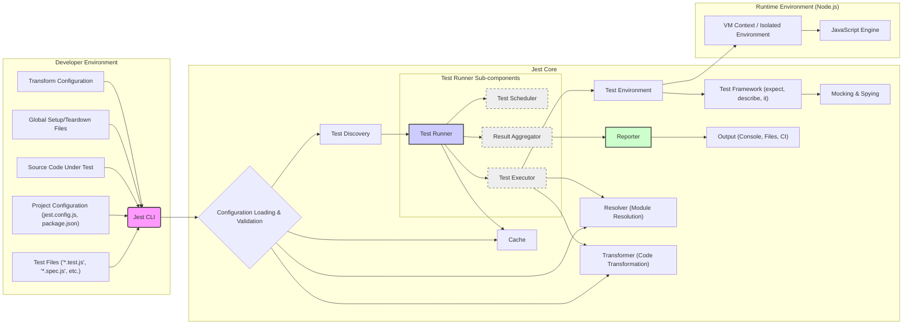

Okay, I will improve the project design document for Jest based on your feedback and focusing on clarity, detail, and threat modeling relevance.

Here is the improved version:

# Project Design Document: Jest - JavaScript Testing Framework (Improved)

## 1. Project Overview

**Project Name:** Jest

**Project Description:** Jest is a delightful JavaScript Testing Framework with a focus on simplicity and developer experience. It is designed to work seamlessly with a wide range of JavaScript projects, including those using Babel, TypeScript, Node.js, React, Angular, Vue.js, and more. Jest's key features include:

*   **Zero-Configuration Setup:**  Aims to provide out-of-the-box functionality for most JavaScript projects, minimizing configuration needs.
*   **Fast and Parallel Execution:**  Executes tests in parallel across multiple processes, significantly reducing test run times. Test environments are isolated to prevent interference.
*   **Integrated Code Coverage:**  Provides built-in code coverage reporting without requiring external tools or complex setup.
*   **Powerful Mocking Capabilities:**  Offers robust mocking and spying functionalities to isolate units of code and simulate dependencies effectively.
*   **Snapshot Testing:**  Enables capturing snapshots of outputs to easily detect unintended UI changes or data structure modifications.
*   **Watch Mode:**  Automatically re-runs tests when code changes are detected, providing immediate feedback during development.
*   **Clear Error Messages:**  Focuses on providing informative and actionable error messages to aid in debugging.

**Project Repository:** [https://github.com/facebook/jest](https://github.com/facebook/jest)

**Purpose of this Document:** This document provides a detailed design overview of the Jest testing framework. It is intended to be used as a basis for threat modeling and security analysis. The document outlines the system architecture, key components, data flow, technology stack, trust boundaries, and external interfaces to facilitate the identification of potential security vulnerabilities and attack vectors within the Jest framework.

## 2. System Architecture (Detailed)

Jest's architecture is modular and designed for extensibility.  The core system interacts with various plugins and configurations to provide its full functionality. The following diagram provides a more detailed view of the architecture, highlighting key sub-components and interactions.

**Detailed Component Descriptions:**

*   **Test Files ('\*.test.js', '\*.spec.js', etc.):** JavaScript files containing test suites and individual test cases written using Jest's testing API. These files are the primary input for Jest.
*   **Project Configuration (jest.config.js, package.json):** Configuration files that define Jest's behavior. This includes:
    *   Test directory locations and file name patterns.
    *   Reporters to use for outputting test results.
    *   Code transformation settings (e.g., Babel, TypeScript).
    *   Module resolution rules.
    *   Environment settings (e.g., browser-like environment using jsdom).
    *   Global setup and teardown files.
    *   Cache settings.
*   **Source Code Under Test:** The JavaScript code that is being tested by the test files. Jest needs access to this code for execution and coverage analysis.
*   **Jest CLI:** The command-line interface (`jest`) used to initiate test runs and interact with Jest. It parses command-line arguments and orchestrates the test execution process.
*   **Configuration Loading & Validation:** This component is responsible for:
    *   Reading Jest configuration from `jest.config.js`, `package.json`, and command-line arguments.
    *   Merging configuration from different sources.
    *   Validating the configuration to ensure it is consistent and valid according to Jest's schema.
    *   Handling default configurations when no explicit configuration is provided.
*   **Test Discovery:**  This component identifies test files based on the configured test file patterns and directory settings. It traverses the file system to locate relevant files.
*   **Test Runner:** The core orchestrator of test execution. It manages the overall test lifecycle and consists of sub-components:
    *   **Test Scheduler:**  Manages the scheduling and parallel execution of test files. It determines how tests are distributed across worker processes.
    *   **Test Executor:**  Executes individual test files within isolated test environments. It loads test files, runs test suites and cases, and collects test results.
    *   **Result Aggregator:**  Collects test results from individual test executors, aggregates them, and provides a unified view of the test run outcome.
*   **Test Environment:** Sets up and manages the environment in which test code is executed. By default, it's a Node.js environment, but can be configured to use browser-like environments (e.g., jsdom) or custom environments. It provides globals and APIs needed for test execution.
*   **Test Framework (expect, describe, it):** Provides the core API for writing tests.
    *   `describe`:  Groups related test cases into test suites.
    *   `it` (or `test`): Defines individual test cases.
    *   `expect`:  Assertion library used to make assertions about the code under test.
*   **Mocking & Spying:**  Provides functionalities for creating mocks and spies to:
    *   Isolate units of code by replacing dependencies with controlled mocks.
    *   Spy on function calls to verify interactions and behavior.
    *   Control the behavior of mocked functions (return values, implementations).
*   **Reporter:**  Formats and outputs test results. Jest supports various built-in reporters (e.g., default console reporter, JUnit reporter) and allows for custom reporters. Reporters process test results and generate output in different formats.
*   **Output (Console, Files, CI):**  The destination for test reports. This can be:
    *   Console output for immediate feedback during development.
    *   Log files for persistent records of test runs.
    *   Integration with CI/CD systems (e.g., JUnit XML reports).
*   **Cache:** Jest uses a cache to improve performance by:
    *   Caching transformed files to avoid redundant transformations.
    *   Optionally caching test results to speed up subsequent test runs (e.g., in watch mode).
*   **VM Context / Isolated Environment:**  Utilizes Node.js's VM module (or similar mechanisms) to create isolated JavaScript environments for each test file. This ensures:
    *   Tests do not interfere with each other's global scope.
    *   Each test runs in a clean and predictable environment.
*   **JavaScript Engine:** The underlying JavaScript runtime environment (typically Node.js's V8 engine) that executes Jest's core logic and the test code.
*   **Resolver (Module Resolution):**  Handles module resolution, mimicking Node.js module resolution or using custom resolvers. It determines how modules are located and loaded during test execution.
*   **Transformer (Code Transformation):**  Applies code transformations (e.g., using Babel, TypeScript compilers) to test files and source code before execution. This allows Jest to work with different JavaScript dialects and features.
*   **Global Setup/Teardown Files:** Files specified in configuration to be executed once before all test suites begin (setup) or after all test suites have finished (teardown). These are used for global environment setup or cleanup.
*   **Transform Configuration:** Configuration settings that define how code transformations are applied, including which transformers to use for specific file types and their options.

## 3. Data Flow (Detailed)

The data flow in Jest is more nuanced than a simple linear sequence. It involves parallel processing and data transformations. A more detailed data flow description is as follows:

1.  **Initialization & Configuration:**
    *   Jest CLI is invoked.
    *   Configuration Loading & Validation component reads and validates configuration from all sources.
    *   Resolver and Transformer components are initialized based on configuration.
    *   Cache component is initialized and potentially loads cached data.

2.  **Test Discovery Phase:**
    *   Test Discovery component identifies test files based on configured patterns.
    *   List of test file paths is generated.

3.  **Test Execution Phase (Parallel):**
    *   Test Runner's Test Scheduler distributes test files to worker processes (Test Executors).
    *   For each test file in a worker process:
        *   **Environment Setup:** Test Environment component creates a new isolated VM context.
        *   **Code Transformation (if needed):** Transformer component transforms the test file and relevant source code (if configured and not cached). Transformed code is potentially cached.
        *   **Module Resolution:** Resolver component resolves module dependencies within the test file.
        *   **Test File Execution:** JavaScript Engine executes the transformed test file within the isolated environment. This involves running test suites (`describe` blocks) and test cases (`it` blocks), and executing assertions (`expect`). Mocking and spying functionalities are used as needed within test code.
        *   **Result Collection (per test file):** Test Executor collects test results (pass/fail status, errors, coverage data) for the executed test file.

4.  **Result Aggregation & Reporting Phase:**
    *   Test Runner's Result Aggregator collects test results from all Test Executors.
    *   Reporter component processes the aggregated test results.
    *   Reporter generates output in the configured format (console output, files, etc.).
    *   Output is delivered to the specified destinations.

5.  **Cache Update (Optional):**
    *   Cache component updates the cache with transformed files and potentially test results based on configuration and caching policies.

**Data Types Handled (Expanded):**

*   **Configuration Data:**  Complex nested objects representing Jest settings, including paths, regular expressions, and function configurations (JSON, JavaScript objects).
*   **Source Code:** JavaScript, TypeScript, or other transpilable code (text files).
*   **Test Code:** JavaScript test files with Jest-specific API calls (text files).
*   **Transformed Code:**  Output of code transformation processes (JavaScript text or in-memory representations).
*   **Test Results:**  Structured data representing test outcomes, including test case names, statuses, error messages, assertion results, and performance metrics (objects, JSON).
*   **Coverage Data:** Detailed information about code coverage, including line, branch, and function coverage metrics (objects, JSON, reports in formats like LCOV).
*   **Cache Data:** Serialized representations of transformed code, and potentially test results, stored for performance optimization (serialized data, file system entries).
*   **Module Resolution Paths:** Strings representing file paths and module names used during module resolution.
*   **Reporter Output:** Formatted text or structured data generated by reporters (text, XML, JSON, etc.).

## 4. Technology Stack (Detailed Dependencies)

Jest relies on a rich ecosystem of Node.js libraries. Key dependencies and their roles include:

*   **Core JavaScript & Node.js:**
    *   **JavaScript (ECMAScript):** The primary programming language.
    *   **Node.js:** Runtime environment providing core functionalities like file system access, process management, and VM contexts.
    *   **npm/yarn:** Package managers for dependency management.

*   **Code Transformation & Language Support:**
    *   **@babel/core & Babel Plugins:** For JavaScript and JSX transformation, enabling support for modern JavaScript features and syntax.
    *   **typescript & ts-jest (or similar):** For TypeScript support, enabling testing of TypeScript code.

*   **File System & Utilities:**
    *   **Chokidar:**  Robust file system watching for watch mode functionality.
    *   **graceful-fs:**  Improved file system operations, handling errors more gracefully.
    *   **slash:** Path normalization across different operating systems.
    *   **micromatch:**  Globbing library for file path matching in test discovery and configuration.
    *   **jest-util:**  Collection of utility functions used throughout Jest.

*   **Testing Framework & Assertions:**
    *   **expect:** Jest's assertion library, providing a rich set of matchers for making assertions in tests.
    *   **pretty-format:**  For formatting values in assertion error messages and snapshots, improving readability.

*   **Mocking & Spying:**
    *   **jest-mock:**  Jest's mocking library, providing functionalities for creating mocks, spies, and controlling function behavior.

*   **Code Coverage:**
    *   **istanbul-lib-coverage, istanbul-lib-instrument, istanbul-reports, nyc:**  Libraries from the Istanbul.js family used for code coverage analysis and reporting.

*   **Output & Reporting:**
    *   **chalk:**  For colored console output, enhancing the user experience.
    *   **jest-reporters:**  Provides built-in reporters and infrastructure for custom reporters.

*   **Runtime Environment & Isolation:**
    *   **vm:** Node.js VM module for creating isolated JavaScript environments.
    *   **jsdom:** (Optional) For providing a browser-like DOM environment for testing front-end code.

*   **Caching:**
    *   **jest-haste-map:**  Used for efficient file system crawling and caching of file metadata.

*   **Module Resolution:**
    *   **jest-resolve:**  Handles module resolution logic, mimicking Node.js module resolution.

*   **Other Utilities:**
    *   **source-map-support:** For source map handling, improving debugging experience when using code transformations.
    *   **p-map:** For asynchronous iteration with concurrency control.
    *   Numerous other smaller utility libraries from the Node.js ecosystem.

## 5. Trust Boundaries (Refined)

Expanding on the trust boundaries identified earlier, with more detail on assets and potential threats:

*   **Boundary 1: Developer Environment <-> Jest Core:**
    *   **Trust Level Change:**  Transition from developer-controlled inputs (test files, configuration, source code, global setup/teardown) to the Jest execution environment.
    *   **Assets at Risk:** Jest core components, Jest's execution environment, potentially the host system if vulnerabilities are exploited.
    *   **Threats:**
        *   **Malicious Test Code Execution:**  Developers might intentionally or unintentionally write test code that attempts to exploit vulnerabilities in Jest or the runtime environment.
        *   **Configuration Injection/Manipulation:** Malicious configuration files could be crafted to alter Jest's behavior in unintended ways, potentially leading to security issues.
        *   **Exploitation via Global Setup/Teardown:**  Malicious code in global setup/teardown files could be executed outside the isolated test environment, gaining broader access.
        *   **Denial of Service:**  Crafted test files or configurations could cause Jest to consume excessive resources, leading to DoS.

*   **Boundary 2: Jest Core <-> Test Environment:**
    *   **Trust Level Change:** Transition from Jest's core logic to the isolated test environment where untrusted user-provided test code is executed.
    *   **Assets at Risk:**  Isolation of test environments, integrity of other tests, potentially the host system if sandbox escapes are possible.
    *   **Threats:**
        *   **Sandbox Escape:**  Vulnerabilities in the VM context isolation could allow test code to break out of the sandbox and access resources outside the intended environment.
        *   **Inter-Test Interference:**  If isolation is not perfect, malicious test code could potentially affect other tests running in parallel or subsequent test runs.
        *   **Resource Exhaustion within Environment:**  Test code could intentionally or unintentionally consume excessive resources within the isolated environment, impacting performance or stability.

*   **Boundary 3: Jest Core <-> Reporters:**
    *   **Trust Level Change:** Transition from Jest's core to external reporting components, especially custom reporters provided by users.
    *   **Assets at Risk:**  Integrity of test reports, potentially external systems if reporters interact with them.
    *   **Threats:**
        *   **Reporter Code Execution:**  Custom reporters, if not properly vetted, could contain malicious code that gets executed when Jest processes test results.
        *   **Insecure Data Handling in Reporters:** Reporters might process test results or other data insecurely, leading to information disclosure or other vulnerabilities.
        *   **Vulnerabilities in Reporter Dependencies:** Reporters might rely on external libraries with their own vulnerabilities.
        *   **Unintended External Interactions:** Custom reporters could be designed to interact with external systems (databases, networks) in insecure ways.

*   **Boundary 4: Jest Core <-> Cache:**
    *   **Trust Level Change:** Interaction with the file system for caching transformed files and test results.
    *   **Assets at Risk:**  Integrity of cached data, file system integrity, potentially performance if cache is manipulated.
    *   **Threats:**
        *   **Cache Poisoning:**  Malicious actors could attempt to inject malicious or corrupted data into the cache, which could then be used by Jest, leading to unexpected behavior or vulnerabilities.
        *   **Cache Data Tampering:**  Tampering with cached data could lead to incorrect test results or bypass security checks.
        *   **Unauthorized Cache Access:**  If cache permissions are not properly configured, unauthorized users could access or modify cached data.

*   **Boundary 5: Jest Core <-> External Dependencies (npm packages):**
    *   **Trust Level Change:** Reliance on a large number of external npm packages for various functionalities.
    *   **Assets at Risk:**  Integrity and security of Jest as a whole, as vulnerabilities in dependencies can directly impact Jest.
    *   **Threats:**
        *   **Dependency Vulnerabilities:**  Known or zero-day vulnerabilities in Jest's dependencies could be exploited by attackers.
        *   **Supply Chain Attacks:**  Compromised dependencies in the npm registry could be introduced into Jest's dependency tree, potentially injecting malicious code.
        *   **Dependency Confusion:**  Attacks exploiting naming similarities in package registries to trick users into installing malicious packages.

## 6. External Interfaces (Detailed)

Expanding on external interfaces with more security-relevant details:

*   **File System:**
    *   **Read Operations:** Jest reads test files, configuration files (`jest.config.js`, `package.json`), source code, global setup/teardown files, and potentially cached data from the file system.
        *   **Security Consideration:**  File system access permissions must be correctly configured to prevent unauthorized access to sensitive project files. Jest should handle file access errors gracefully and avoid disclosing sensitive path information in error messages.
    *   **Write Operations:** Jest writes cache data, coverage reports, test reports (e.g., JUnit XML), and potentially log files to the file system.
        *   **Security Consideration:**  Jest should ensure that write operations are performed securely, preventing directory traversal vulnerabilities or overwriting critical system files. Output directories should be configurable and ideally within the project scope.
    *   **File System Watching (Chokidar):**  Jest uses file system watching to detect changes in watch mode.
        *   **Security Consideration:**  File system watching mechanisms should be robust and not susceptible to resource exhaustion or denial-of-service attacks by monitoring excessively large file trees or rapidly changing files.

*   **Command Line Interface (CLI):**
    *   **Input:** Jest CLI receives commands and arguments from the user.
        *   **Security Consideration:**  CLI argument parsing should be robust to prevent command injection vulnerabilities. Jest should validate and sanitize user inputs from the CLI.
    *   **Output:** Jest outputs test results, progress, and error messages to the console (stdout/stderr).
        *   **Security Consideration:**  Console output should avoid disclosing sensitive information unnecessarily. Error messages should be informative but not overly verbose in revealing internal system details.

*   **Node.js APIs:**
    *   **Process Management (child_process):** Jest might use `child_process` for parallel test execution or running external tools.
        *   **Security Consideration:**  If `child_process` is used, Jest must carefully construct commands to avoid command injection vulnerabilities. Input to spawned processes should be sanitized.
    *   **VM Module:**  Used for creating isolated VM contexts.
        *   **Security Consideration:**  Robust and secure usage of the VM module is critical for test environment isolation. Vulnerabilities in VM context creation or management could lead to sandbox escapes.
    *   **File System APIs (fs):**  Used for file system operations.
        *   **Security Consideration:**  Secure file system API usage is essential to prevent file system vulnerabilities (directory traversal, race conditions, etc.).
    *   **Networking APIs (net, http, etc. - potentially indirectly via dependencies or custom reporters):**  While Jest core might not directly use networking APIs, custom reporters or dependencies could.
        *   **Security Consideration:**  If networking is involved, standard network security best practices should be followed (input validation, secure protocols, protection against network-based attacks).

*   **npm Registry (or yarn registry):**
    *   **Dependency Download:** Jest relies on npm/yarn to download and install dependencies.
        *   **Security Consideration:**  Dependency management should be secure. Using `npm audit` or similar tools to scan for dependency vulnerabilities is important. Consider using lock files (`package-lock.json`, `yarn.lock`) to ensure consistent dependency versions and mitigate dependency confusion attacks.

*   **CI/CD Systems (Optional):**
    *   **Reporting Integration:** Jest can integrate with CI/CD systems by outputting test reports in specific formats (e.g., JUnit XML).
        *   **Security Consideration:**  Ensure that test reports do not inadvertently expose sensitive information to CI/CD systems. Secure communication channels should be used if reports are transmitted over a network.

*   **Custom Reporters (Optional):**
    *   **Plugin Interface:** Jest provides an interface for users to create custom reporters.
        *   **Security Consideration:**  Custom reporters represent a significant extension point and potential security risk. Jest should provide clear guidelines and security recommendations for developing custom reporters. Users should carefully review and vet custom reporters, especially those from untrusted sources.

## 7. Security Considerations (Detailed and Expanded)

Expanding on the initial security considerations with more specific examples and potential attack vectors:

*   **Code Execution Vulnerabilities:**
    *   **Deserialization Vulnerabilities:** If Jest or its dependencies use deserialization mechanisms (e.g., for caching or configuration parsing), vulnerabilities could arise if untrusted data is deserialized, leading to arbitrary code execution.
    *   **Prototype Pollution:** JavaScript prototype pollution vulnerabilities in Jest's core or dependencies could be exploited to inject malicious properties into objects, potentially leading to unexpected behavior or code execution.
    *   **Vulnerabilities in Transpilers (Babel, TypeScript):** If vulnerabilities exist in the code transformation process (e.g., in Babel plugins or TypeScript compiler), malicious code could be injected during transformation.

*   **Sandbox Escape:**
    *   **VM Context Breakouts:**  Vulnerabilities in Node.js's VM module or Jest's usage of it could allow test code to escape the isolated VM context and gain access to the underlying Node.js process or host system.
    *   **Context Switching Issues:**  Improper handling of context switching between the Jest core and test environments could potentially lead to security vulnerabilities.

*   **Configuration Injection:**
    *   **YAML/JSON Parsing Vulnerabilities:** If Jest uses YAML or JSON parsing for configuration, vulnerabilities in the parsing libraries could be exploited to inject malicious configurations.
    *   **Command Injection via Configuration:**  If configuration options allow for execution of shell commands or external processes, vulnerabilities could arise if user-provided configuration values are not properly sanitized.

*   **Dependency Vulnerabilities:**
    *   **Known Vulnerabilities in npm Packages:**  Regularly scan dependencies for known vulnerabilities using tools like `npm audit` or `yarn audit`. Implement a process for patching or updating vulnerable dependencies promptly.
    *   **Transitive Dependencies:**  Pay attention to vulnerabilities in transitive dependencies (dependencies of dependencies).

*   **Cache Poisoning:**
    *   **Cache Invalidation Issues:**  Improper cache invalidation logic could lead to serving stale or corrupted cached data, potentially causing unexpected behavior or security issues.
    *   **Cache Directory Permissions:**  Ensure proper permissions are set on the cache directory to prevent unauthorized modification or access.

*   **Reporter Vulnerabilities:**
    *   **Cross-Site Scripting (XSS) in HTML Reporters:** If HTML reporters are used, ensure proper output encoding to prevent XSS vulnerabilities if test results contain user-provided data.
    *   **Server-Side Request Forgery (SSRF) in Custom Reporters:**  If custom reporters interact with external systems, ensure they are protected against SSRF vulnerabilities.

*   **Denial of Service (DoS):**
    *   **Regular Expression DoS (ReDoS):**  Vulnerable regular expressions in Jest's code or configuration parsing could be exploited to cause ReDoS attacks, leading to CPU exhaustion.
    *   **Resource Exhaustion via Malicious Tests:**  Maliciously crafted test files could be designed to consume excessive memory or CPU, leading to DoS. Implement resource limits or safeguards if possible.
    *   **File System Watching DoS:**  As mentioned earlier, file system watching mechanisms could be abused to cause DoS.

*   **Information Disclosure:**
    *   **Verbose Error Messages:**  Avoid disclosing sensitive information (e.g., internal paths, configuration details, dependency versions) in error messages or debug logs.
    *   **Insecure Handling of Sensitive Data in Reports:**  Ensure that test reports do not inadvertently expose sensitive data that was used in tests (e.g., API keys, passwords). Sanitize or redact sensitive information from reports if necessary.

This improved document provides a more comprehensive and detailed design overview of Jest, specifically tailored for threat modeling purposes. It should serve as a solid foundation for identifying and mitigating potential security risks within the Jest testing framework.