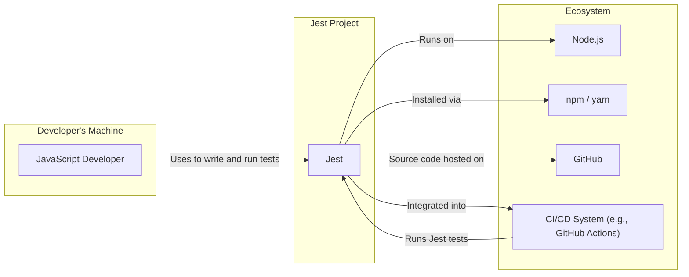
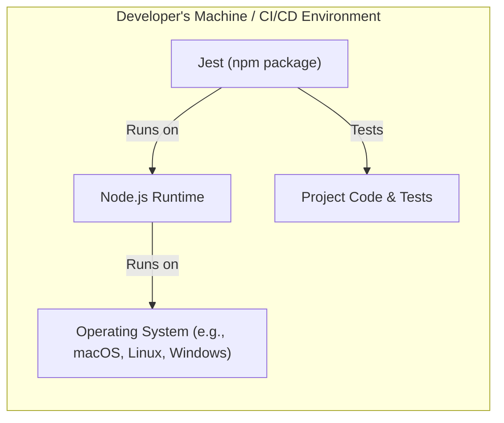
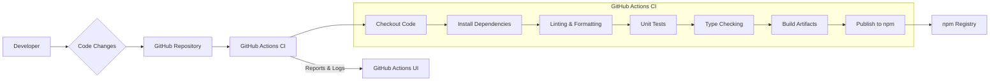

# BUSINESS POSTURE

This project, Jest, aims to provide a delightful JavaScript Testing Framework with a focus on simplicity and developer experience. It is designed to work out of the box, requiring minimal configuration, and offers rich features like mocking, snapshot testing, and code coverage.

- Business Priorities:
  - Ease of use and developer productivity.
  - Reliability and correctness of test execution.
  - Performance and speed of test runs.
  - Wide adoption and community support.

- Business Goals:
  - Become the leading JavaScript testing framework.
  - Enable developers to write and run tests efficiently.
  - Improve the quality and reliability of JavaScript software.

- Business Risks:
  - Security vulnerabilities in Jest could compromise developer environments or CI/CD pipelines.
  - Bugs in Jest could lead to false positive or false negative test results, impacting software quality.
  - Poor performance could deter adoption and developer satisfaction.
  - Lack of community support or maintainability could lead to project stagnation.

# SECURITY POSTURE

Jest, as an open-source project and a developer tool, has a unique security posture. It is not a directly deployed application but rather a library and CLI tool used in development environments.

- Existing Security Controls:
  - security control: GitHub repository access control - Implemented via GitHub's permission system.
  - security control: Code review process - Implemented via GitHub pull requests and community contributions.
  - security control: Open-source community review - Implemented by the public nature of the repository and issue tracking.
  - security control: Dependency management - Implemented via `package-lock.json` or similar to manage dependencies.
  - accepted risk: Vulnerabilities in dependencies - Accepted risk inherent in using third-party libraries.
  - accepted risk: Open-source vulnerability disclosure - Accepted risk that vulnerabilities might be publicly disclosed before a patch is available.

- Recommended Security Controls:
  - recommended security control: Automated Dependency Vulnerability Scanning - Integrate tools like `npm audit` or `Dependabot` into CI/CD to automatically detect and report vulnerable dependencies.
  - recommended security control: Static Application Security Testing (SAST) - Integrate SAST tools into CI/CD to automatically scan Jest's codebase for potential vulnerabilities.
  - recommended security control: Security focused code review guidelines - Establish and follow guidelines for code reviews that specifically address security considerations.
  - recommended security control: Security vulnerability reporting process - Clearly define a process for reporting and handling security vulnerabilities, including a security policy document.

- Security Requirements:
  - Authentication: Not directly applicable to Jest as a library. Authentication is relevant for contributors to the Jest project via GitHub authentication.
  - Authorization: Not directly applicable to Jest as a library. Authorization is relevant for repository access control on GitHub.
  - Input Validation: Jest processes test files and configuration files as input. Input validation is crucial to prevent malicious test code or configuration from exploiting Jest. This is primarily the responsibility of the Jest core and test runner components.
  - Cryptography: Cryptography is not a core requirement for Jest itself. However, if Jest is used in projects that handle sensitive data and require cryptographic operations in tests, Jest should not interfere with or weaken those operations.

# DESIGN

Jest's design is modular and plugin-based, allowing for extensibility and customization. It consists of a core engine, test runners, reporters, and configuration loading mechanisms.

## C4 CONTEXT



- C4 Context Elements:
  - - Name: "JavaScript Developer"
    - Type: Person
    - Description: Developers who write and run JavaScript tests using Jest.
    - Responsibilities: Writing test code, configuring Jest, running tests, and interpreting test results.
    - Security controls: Local development environment security practices, secure coding practices when writing tests.
  - - Name: "Jest"
    - Type: System
    - Description: The JavaScript testing framework itself, the subject of this design document.
    - Responsibilities: Discovering tests, running tests, providing test results, code coverage, mocking, and snapshot testing.
    - Security controls: Input validation, secure coding practices in Jest codebase, dependency management, security testing.
  - - Name: "Node.js"
    - Type: System
    - Description: The JavaScript runtime environment that Jest runs on.
    - Responsibilities: Providing the execution environment for Jest and JavaScript tests.
    - Security controls: Node.js security updates, secure configuration of Node.js environment.
  - - Name: "npm / yarn"
    - Type: System
    - Description: Package managers used to install and manage Jest and its dependencies.
    - Responsibilities: Package installation, dependency resolution, script execution.
    - Security controls: Package integrity checks by npm/yarn, using `package-lock.json` or similar to ensure consistent dependency versions.
  - - Name: "GitHub"
    - Type: System
    - Description: Platform for hosting Jest's source code, issue tracking, and collaboration.
    - Responsibilities: Source code management, version control, issue tracking, pull request management, CI/CD via GitHub Actions.
    - Security controls: GitHub's security features for repository access control, authentication, and vulnerability scanning.
  - - Name: "CI/CD System (e.g., GitHub Actions)"
    - Type: System
    - Description: Continuous Integration and Continuous Delivery systems used to automate builds, tests, and potentially deployment of projects using Jest.
    - Responsibilities: Automating test execution, running linters and security scanners, generating build artifacts.
    - Security controls: Secure CI/CD pipeline configuration, access control to CI/CD system, secrets management for credentials used in CI/CD.

## C4 CONTAINER

```mermaid
flowchart LR
    subgraph "Jest System"
        A["Jest CLI"]
        B["Jest Core"]
        C["Test Runners"]
        D["Configuration Loader"]
        E["Reporter System"]
    end

    A -- "Uses" --> B
    A -- "Uses" --> D
    B -- "Uses" --> C
    B -- "Uses" --> E
    D -- "Loads configuration from" --> "jest.config.js"
    C -- "Executes tests in" --> "Test Files"
    E -- "Generates reports to" --> "Console / Files"
```

- C4 Container Elements:
  - - Name: "Jest CLI"
    - Type: Container
    - Description: Command-line interface for interacting with Jest. Provides commands to run tests, configure Jest, and view results.
    - Responsibilities: Command parsing, invoking Jest core functionalities, presenting results to the user.
    - Security controls: Input validation of CLI arguments, secure handling of configuration paths.
  - - Name: "Jest Core"
    - Type: Container
    - Description: The core logic of Jest. Manages test discovery, test execution orchestration, and coordination between other containers.
    - Responsibilities: Test discovery, test scheduling, managing test runners, collecting test results, and providing APIs for other containers.
    - Security controls: Input validation of test files and configuration data, secure execution of test runners, handling of exceptions and errors.
  - - Name: "Test Runners"
    - Type: Container
    - Description: Responsible for executing individual test files or test suites. Can be different runners for different environments (e.g., Node.js, browser).
    - Responsibilities: Running test code in a specific environment, providing test results back to Jest Core.
    - Security controls: Sandboxing test execution environments if necessary, preventing test code from escaping the intended execution context, resource management during test execution.
  - - Name: "Configuration Loader"
    - Type: Container
    - Description: Loads and parses Jest configuration from various sources (e.g., `jest.config.js`, command-line arguments, `package.json`).
    - Responsibilities: Reading configuration files, parsing configuration data, validating configuration options, providing configuration to other Jest components.
    - Security controls: Input validation of configuration files, preventing malicious configuration from compromising Jest, secure handling of file paths and access.
  - - Name: "Reporter System"
    - Type: Container
    - Description: Responsible for formatting and outputting test results in various formats (e.g., console output, JUnit XML, JSON).
    - Responsibilities: Formatting test results, generating reports, providing different output formats, allowing custom reporters.
    - Security controls: Sanitizing output to prevent injection vulnerabilities in reports, secure handling of report file paths and access.

## DEPLOYMENT

Jest itself is not deployed as a standalone application. It is deployed as a development dependency within JavaScript projects. The "deployment" context for Jest is primarily the developer's local machine and CI/CD environments where tests are executed.

- Deployment Architecture: Developer's Local Machine / CI/CD Environment



- Deployment Elements:
  - - Name: "Operating System (e.g., macOS, Linux, Windows)"
    - Type: Infrastructure
    - Description: The operating system on which Node.js and Jest are executed.
    - Responsibilities: Providing the base environment for running software, managing system resources.
    - Security controls: Operating system security hardening, regular security updates, user access control.
  - - Name: "Node.js Runtime"
    - Type: Infrastructure
    - Description: The JavaScript runtime environment that executes Jest and the tests.
    - Responsibilities: Executing JavaScript code, providing APIs for file system access, network communication, etc.
    - Security controls: Node.js security updates, secure configuration of Node.js runtime, limiting Node.js capabilities if necessary.
  - - Name: "Jest (npm package)"
    - Type: Software
    - Description: The Jest npm package installed as a development dependency in a project.
    - Responsibilities: Providing the testing framework functionalities within the project's environment.
    - Security controls: Dependency vulnerability scanning, ensuring integrity of npm package during installation.
  - - Name: "Project Code & Tests"
    - Type: Software
    - Description: The JavaScript project codebase and the test files written for that project.
    - Responsibilities: Containing the application logic and the tests that verify its correctness.
    - Security controls: Secure coding practices in project code and tests, input validation in project code, access control to project codebase.

## BUILD

The Jest build process is automated using GitHub Actions for Continuous Integration. It focuses on ensuring code quality, running tests, and publishing the npm package.



- Build Elements:
  - - Name: "Developer"
    - Type: Person
    - Description: Developers who contribute code changes to the Jest project.
    - Responsibilities: Writing code, running local tests, submitting pull requests.
    - Security controls: Secure development environment, code review participation.
  - - Name: "GitHub Repository"
    - Type: System
    - Description: The GitHub repository hosting the Jest source code.
    - Responsibilities: Source code management, version control, pull request management, triggering CI workflows.
    - Security controls: GitHub's security features for repository access control, branch protection, and vulnerability scanning.
  - - Name: "GitHub Actions CI"
    - Type: System
    - Description: GitHub Actions workflows configured to automate the Jest build process.
    - Responsibilities: Automating build steps, running tests, performing security checks, publishing npm package.
    - Security controls: Secure CI workflow configuration, secrets management for npm publishing credentials, access control to GitHub Actions workflows.
  - - Name: "Checkout Code"
    - Type: Build Step
    - Description: Step in CI workflow to checkout the latest code from the GitHub repository.
    - Responsibilities: Retrieving source code for the build process.
    - Security controls: Ensuring integrity of code retrieved from the repository.
  - - Name: "Install Dependencies"
    - Type: Build Step
    - Description: Step in CI workflow to install project dependencies using npm or yarn.
    - Responsibilities: Installing required libraries and tools for building and testing Jest.
    - Security controls: Dependency vulnerability scanning during installation, using `package-lock.json` to ensure consistent dependency versions.
  - - Name: "Linting & Formatting"
    - Type: Build Step
    - Description: Step in CI workflow to run linters and formatters to enforce code style and quality.
    - Responsibilities: Improving code consistency and catching potential code quality issues.
    - Security controls: Static code analysis for potential security vulnerabilities (basic linting rules).
  - - Name: "Unit Tests"
    - Type: Build Step
    - Description: Step in CI workflow to run Jest's own unit tests to ensure its functionality.
    - Responsibilities: Verifying the correctness of Jest's code.
    - Security controls: Comprehensive test suite to catch regressions and ensure code quality.
  - - Name: "Type Checking"
    - Type: Build Step
    - Description: Step in CI workflow to perform type checking (e.g., using TypeScript) to catch type-related errors.
    - Responsibilities: Improving code reliability and catching type errors early.
    - Security controls: Type system helps prevent certain classes of vulnerabilities related to type mismatches.
  - - Name: "Build Artifacts"
    - Type: Build Step
    - Description: Step in CI workflow to generate build artifacts, such as compiled JavaScript files.
    - Responsibilities: Preparing distributable files for npm package.
    - Security controls: Ensuring build process does not introduce vulnerabilities into build artifacts.
  - - Name: "Publish to npm"
    - Type: Build Step
    - Description: Step in CI workflow to publish the built Jest package to the npm registry.
    - Responsibilities: Making Jest package available for public consumption.
    - Security controls: Secure credentials management for npm publishing, package integrity checks during publishing.
  - - Name: "npm Registry"
    - Type: System
    - Description: The public npm registry where Jest package is published.
    - Responsibilities: Hosting and distributing npm packages.
    - Security controls: npm's security measures for package integrity and malware scanning.
  - - Name: "GitHub Actions UI"
    - Type: System
    - Description: GitHub Actions user interface for viewing build reports and logs.
    - Responsibilities: Providing visibility into build process and results.
    - Security controls: Access control to GitHub Actions UI, audit logging of build activities.

# RISK ASSESSMENT

- Critical Business Process: Ensuring the quality and reliability of JavaScript software through effective testing. Jest is a critical tool for this process for many JavaScript development teams.
- Data to Protect:
  - Jest Source Code: Sensitivity - Medium (Intellectual property, maintaining project integrity).
  - Jest Build Artifacts (npm package): Sensitivity - Medium (Ensuring package integrity and preventing supply chain attacks).
  - Test Code (written by Jest users): Sensitivity - Low to Medium (Potentially contains business logic or sensitive information depending on the project, but generally less sensitive than production application code).
  - Jest Configuration: Sensitivity - Low (Configuration settings, generally not sensitive).

# QUESTIONS & ASSUMPTIONS

- BUSINESS POSTURE:
  - Assumption: The primary business goal is to maintain Jest as a leading, widely adopted, and reliable JavaScript testing framework.
  - Question: Are there specific business metrics used to measure the success of Jest (e.g., adoption rate, user satisfaction surveys)?

- SECURITY POSTURE:
  - Assumption: Current security practices rely heavily on GitHub's built-in features and open-source community review.
  - Question: Is there a formal security policy document for the Jest project?
  - Question: Are there any existing automated security scanning tools integrated into the Jest development process beyond GitHub's default checks?

- DESIGN:
  - Assumption: The C4 model is a suitable way to represent the architecture of Jest, even though it's a development tool rather than a deployed application.
  - Question: Are there any plans to further modularize or refactor Jest's architecture in the future that would impact the container diagram?
  - Question: Are there specific performance or scalability considerations that drive the design of Jest, especially regarding test execution speed?