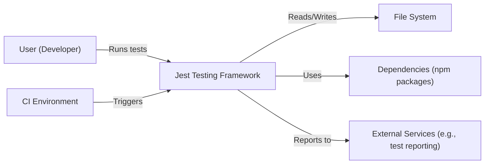
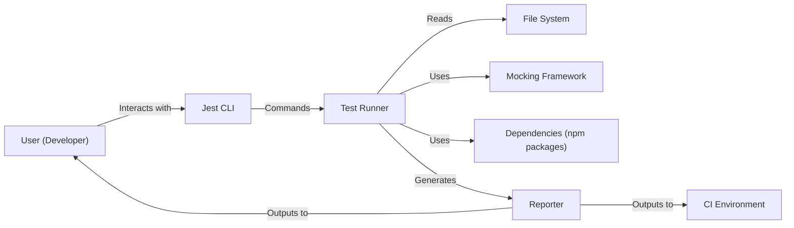
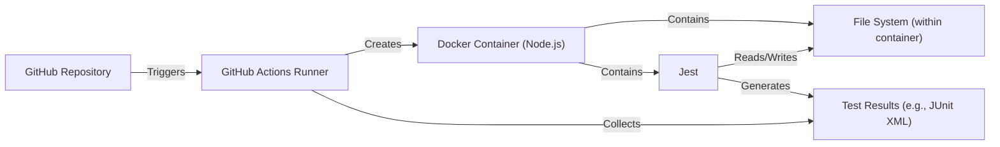
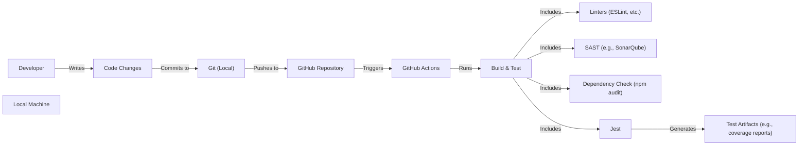

# BUSINESS POSTURE

Business Priorities and Goals:

*   Provide a delightful JavaScript testing framework with a focus on simplicity and ease of use.
*   Offer a "zero-configuration" experience for most projects, minimizing setup time.
*   Ensure fast test execution and efficient performance.
*   Support a wide range of JavaScript projects and features, including modern syntax and various testing styles (unit, integration, etc.).
*   Maintain a large and active community, fostering contributions and providing support.
*   Enable easy mocking and spying on dependencies.
*   Provide clear and informative test results and error messages.
*   Integrate well with other development tools and workflows.

Business Risks:

*   Vulnerabilities in the testing framework could be exploited to compromise the integrity of test results or potentially execute malicious code within the development or CI/CD environment.
*   Incompatibility with specific JavaScript versions or project setups could lead to user frustration and hinder adoption.
*   Performance bottlenecks in the framework could slow down development workflows and increase testing time.
*   Lack of support for specific testing needs or patterns could limit the framework's applicability.
*   Complexity in configuration or usage could deter users, especially beginners.
*   Inadequate documentation or community support could lead to difficulties in troubleshooting and adoption.
*   Supply chain attacks targeting Jest's dependencies could introduce vulnerabilities.

# SECURITY POSTURE

Existing Security Controls:

*   security control: Regular dependency updates to address known vulnerabilities. (Visible in package.json and related files)
*   security control: Code linting and static analysis to identify potential code quality and security issues. (Visible in configuration files like .eslintrc.js)
*   security control: Use of automated tests to ensure the functionality and stability of the framework itself. (Visible in the test suite)
*   security control: Security Policy document. (Visible in SECURITY.md)
*   security control: Code of Conduct. (Visible in CODE_OF_CONDUCT.md)

Accepted Risks:

*   accepted risk: Jest relies on a large number of third-party dependencies, increasing the potential attack surface. While efforts are made to keep these updated, there's an inherent risk associated with relying on external code.
*   accepted risk: The "zero-configuration" approach, while convenient, might lead to less secure defaults in some specific scenarios. Users are expected to review and customize configurations as needed for enhanced security.
*   accepted risk: Jest executes user-provided test code, which inherently carries a risk if that code contains vulnerabilities or malicious intent. Users are responsible for the security of their own test code.

Recommended Security Controls:

*   security control: Implement a robust Software Bill of Materials (SBOM) management process to track and manage all dependencies, including transitive dependencies.
*   security control: Conduct regular security audits and penetration testing of the framework to identify potential vulnerabilities.
*   security control: Implement Content Security Policy (CSP) and Subresource Integrity (SRI) where applicable to mitigate the risk of cross-site scripting (XSS) and other code injection attacks. (This might be more relevant if Jest is used in a browser environment).
*   security control: Provide clear security guidelines and best practices for users, emphasizing the importance of secure test code and configuration.
*   security control: Explore the use of sandboxing techniques to isolate test execution and limit the potential impact of vulnerabilities in user code or dependencies.

Security Requirements:

*   Authentication: Not directly applicable to Jest as a testing framework, as it primarily operates within a development or CI/CD environment. However, if Jest is integrated with external services (e.g., for reporting), authentication to those services should be handled securely.
*   Authorization: Not directly applicable in the same way as for an application with user roles. However, access control to CI/CD environments and build systems where Jest is used should be properly managed.
*   Input Validation: Jest itself should validate its configuration inputs and command-line arguments to prevent unexpected behavior or vulnerabilities. User-provided test code should also implement proper input validation.
*   Cryptography: If Jest interacts with cryptographic operations (e.g., in user test code), it should rely on established and well-vetted cryptographic libraries. Jest itself should not implement custom cryptography.

# DESIGN

## C4 CONTEXT

Element Descriptions:

*   Element:
    *   Name: User (Developer)
    *   Type: Person
    *   Description: A software developer who writes and runs tests using Jest.
    *   Responsibilities: Writing test code, configuring Jest, running tests, interpreting results.
    *   Security controls: Secure coding practices, awareness of potential security risks in test code.

*   Element:
    *   Name: Jest Testing Framework
    *   Type: Software System
    *   Description: The core Jest framework, responsible for running tests, managing dependencies, and reporting results.
    *   Responsibilities: Test discovery, execution, mocking, reporting, assertion handling.
    *   Security controls: Dependency management, code linting, static analysis, internal testing.

*   Element:
    *   Name: File System
    *   Type: System
    *   Description: The local file system where test files, source code, and configuration files reside.
    *   Responsibilities: Storing and providing access to files.
    *   Security controls: Operating system file permissions.

*   Element:
    *   Name: CI Environment
    *   Type: System
    *   Description: A Continuous Integration environment (e.g., GitHub Actions, Jenkins) that automatically runs tests.
    *   Responsibilities: Triggering test runs, managing build artifacts, reporting results.
    *   Security controls: Access control, secure configuration, isolation of build environments.

*   Element:
    *   Name: External Services (e.g., test reporting)
    *   Type: System
    *   Description: External services that Jest might interact with, such as test reporting platforms or code coverage tools.
    *   Responsibilities: Varies depending on the service.
    *   Security controls: Secure communication (HTTPS), authentication, authorization.

*   Element:
    *   Name: Dependencies (npm packages)
    *   Type: System
    *   Description: Third-party libraries that Jest depends on.
    *   Responsibilities: Providing specific functionality used by Jest.
    *   Security controls: Dependency management, vulnerability scanning, SBOM.

## C4 CONTAINER

Element Descriptions:

*   Element:
    *   Name: User (Developer)
    *   Type: Person
    *   Description: A software developer who writes and runs tests using Jest.
    *   Responsibilities: Writing test code, configuring Jest, running tests, interpreting results.
    *   Security controls: Secure coding practices, awareness of potential security risks in test code.

*   Element:
    *   Name: Jest CLI
    *   Type: Container (Command-Line Interface)
    *   Description: The command-line interface for interacting with Jest.
    *   Responsibilities: Parsing command-line arguments, configuring the test runner, initiating test runs.
    *   Security controls: Input validation, secure handling of configuration options.

*   Element:
    *   Name: Test Runner
    *   Type: Container (Process)
    *   Description: The core component that executes tests and manages the test lifecycle.
    *   Responsibilities: Discovering test files, running tests, managing asynchronous operations, handling timeouts.
    *   Security controls: Sandboxing (if implemented), resource limits, secure handling of test code.

*   Element:
    *   Name: Reporter
    *   Type: Container (Module)
    *   Description: The component responsible for generating test reports.
    *   Responsibilities: Collecting test results, formatting output, displaying results to the user or sending them to external services.
    *   Security controls: Secure communication with external services (if applicable).

*   Element:
    *   Name: Mocking Framework
    *   Type: Container (Module)
    *   Description: The component that provides mocking and spying capabilities.
    *   Responsibilities: Creating mocks, spies, and stubs, managing mock behavior.
    *   Security controls: Secure handling of mock implementations, preventing unintended side effects.

*   Element:
    *   Name: File System
    *   Type: System
    *   Description: The local file system.
    *   Responsibilities: Storing and providing access to files.
    *   Security controls: Operating system file permissions.

*   Element:
    *   Name: Dependencies (npm packages)
    *   Type: System
    *   Description: Third-party libraries that Jest depends on.
    *   Responsibilities: Providing specific functionality used by Jest.
    *   Security controls: Dependency management, vulnerability scanning, SBOM.

*   Element:
    *   Name: CI Environment
    *   Type: System
    *   Description: A Continuous Integration environment.
    *   Responsibilities: Triggering test runs, managing build artifacts, reporting results.
    *   Security controls: Access control, secure configuration, isolation of build environments.

## DEPLOYMENT

Possible Deployment Solutions:

1.  Local Development Environment: Jest is typically installed as a development dependency within a JavaScript project using npm or yarn.  It's executed directly on the developer's machine.
2.  CI/CD Environment: Jest is executed within a CI/CD pipeline (e.g., GitHub Actions, Jenkins, CircleCI) as part of the build and test process.  This often involves a containerized environment.
3.  Cloud-Based Testing Platforms: Some cloud platforms provide integrated testing environments where Jest can be used.

Chosen Solution (CI/CD Environment - GitHub Actions):

Element Descriptions:

*   Element:
    *   Name: GitHub Repository
    *   Type: System
    *   Description: The source code repository hosted on GitHub.
    *   Responsibilities: Storing code, triggering CI/CD workflows.
    *   Security controls: Access control, branch protection rules, code review policies.

*   Element:
    *   Name: GitHub Actions Runner
    *   Type: Infrastructure Node (Virtual Machine/Container)
    *   Description: The environment provided by GitHub Actions to execute workflows.
    *   Responsibilities: Running build and test steps, managing dependencies, reporting results.
    *   Security controls: Isolation of runner environments, access control, secure configuration.

*   Element:
    *   Name: Docker Container (Node.js)
    *   Type: Container
    *   Description: A Docker container with a Node.js runtime environment.
    *   Responsibilities: Providing a consistent and isolated environment for running Jest.
    *   Security controls: Use of official Node.js images, regular image updates, minimal image size.

*   Element:
    *   Name: Jest
    *   Type: Application
    *   Description: The Jest testing framework, installed within the Docker container.
    *   Responsibilities: Running tests, managing dependencies, reporting results.
    *   Security controls: (See previous sections)

*   Element:
    *   Name: File System (within container)
    *   Type: System
    *   Description: The file system within the Docker container.
    *   Responsibilities: Storing temporary files, test results, and other data during the test run.
    *   Security controls: Ephemeral nature of the container file system, limited access.

*   Element:
    *   Name: Test Results (e.g., JUnit XML)
    *   Type: Data
    *   Description: The output of the Jest test run, often in a standardized format like JUnit XML.
    *   Responsibilities: Providing a record of test outcomes.
    *   Security controls: Secure storage and access control to test results.

## BUILD

Build Process Description:

1.  Developer makes code changes on their local machine.
2.  Changes are committed to a local Git repository.
3.  Changes are pushed to a remote GitHub repository.
4.  The push triggers a GitHub Actions workflow.
5.  The workflow checks out the code.
6.  The workflow sets up the Node.js environment.
7.  The workflow installs project dependencies (including Jest) using npm or yarn.
8.  Linters (e.g., ESLint) are run to check code style and identify potential issues.
9.  Static Application Security Testing (SAST) tools (e.g., SonarQube) are run to analyze the code for security vulnerabilities.
10. Dependency checks (e.g., `npm audit`) are performed to identify known vulnerabilities in dependencies.
11. Jest is executed to run the test suite.
12. Test artifacts (e.g., code coverage reports) are generated.
13. The workflow reports the results (build status, test results, security scan findings).

Security Controls:

*   security control: Use of linters (ESLint, etc.) to enforce coding standards and identify potential code quality issues.
*   security control: Integration of SAST tools (e.g., SonarQube) to detect security vulnerabilities in the codebase.
*   security control: Automated dependency checks (e.g., `npm audit`, Dependabot) to identify and address known vulnerabilities in project dependencies.
*   security control: Use of a CI/CD environment (GitHub Actions) to automate the build and test process, ensuring consistency and repeatability.
*   security control: Code review process to ensure that code changes are reviewed by other developers before being merged.
*   security control: Branch protection rules in GitHub to prevent direct pushes to main branches and enforce code review requirements.

# RISK ASSESSMENT

Critical Business Processes:

*   Ensuring the correctness and reliability of software developed using Jest.
*   Maintaining developer productivity and efficiency.
*   Protecting the integrity of the development and CI/CD environment.

Data to Protect:

*   Source Code (Sensitivity: Medium to High - Contains intellectual property and potentially sensitive logic).
*   Test Code (Sensitivity: Medium - Could reveal details about the application's functionality and potential vulnerabilities).
*   Configuration Files (Sensitivity: Medium to High - May contain API keys, credentials, or other sensitive information).
*   Test Results (Sensitivity: Low to Medium - May contain information about code coverage and potential weaknesses).
*   Dependencies (Sensitivity: Medium - Vulnerabilities in dependencies can be exploited).
*   Build Artifacts (Sensitivity: Low to High - Depending on the nature of the artifact).

# QUESTIONS & ASSUMPTIONS

Questions:

*   Are there any specific compliance requirements (e.g., PCI DSS, HIPAA) that need to be considered?
*   What is the level of access control required for the CI/CD environment and build systems?
*   Are there any specific external services that Jest integrates with, and what are their security requirements?
*   What is the expected level of security expertise among Jest users?
*   What is the process for handling security vulnerabilities reported in Jest or its dependencies?

Assumptions:

*   BUSINESS POSTURE: The primary goal is to provide a reliable and efficient testing framework, with security being a significant but not necessarily the *absolute* top priority (compared to, say, a banking application).
*   SECURITY POSTURE: Developers are responsible for the security of their own test code. Jest provides tools and features to help, but ultimately the security of the tested application rests with the developers.
*   DESIGN: The CI/CD environment (GitHub Actions) is configured securely, with appropriate access controls and isolation.
*   DESIGN: Developers are using a relatively modern and secure version of Node.js.
*   DESIGN: The project follows standard security best practices for dependency management and code review.