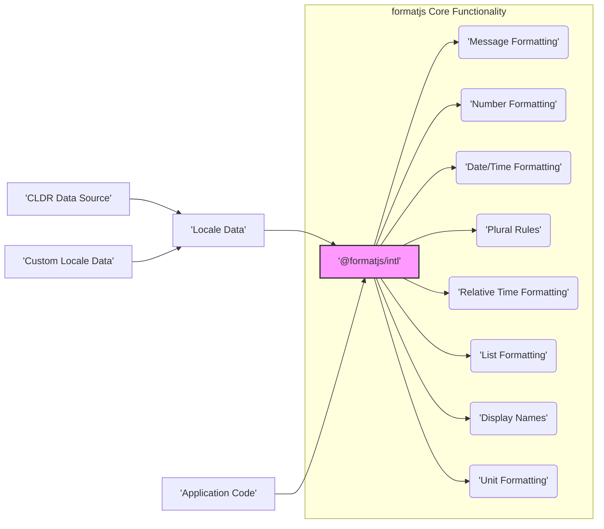
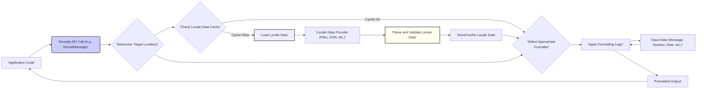

## Project Design Document: formatjs (Improved)

**1. Introduction**

This document provides an enhanced design overview of the `formatjs` project (available at [https://github.com/formatjs/formatjs](https://github.com/formatjs/formatjs)). Building upon the initial design, this version offers more granular detail and a stronger focus on aspects relevant to threat modeling. It aims to provide a comprehensive understanding of the system's architecture, data flows, and functionalities to facilitate the identification and analysis of potential security vulnerabilities.

**2. Project Overview**

`formatjs` is a modular collection of JavaScript libraries dedicated to internationalization (i18n). Its core purpose is to enable developers to create applications that seamlessly adapt to diverse linguistic and cultural conventions. It achieves this by providing robust functionalities for formatting various data types, including dates, numbers, currencies, and complex messages, according to specified locales.

**3. System Architecture**

The `formatjs` project adopts a monorepo structure, housing several independent yet interconnected packages. This modular design promotes maintainability and allows developers to include only the necessary functionalities in their applications. The relationships between key packages are illustrated below:

*   **@formatjs/intl (Core):**  The foundational package, providing core interfaces, abstract classes, and shared utilities used by other formatting packages. It serves as the central access point for various formatters.
*   **Message Formatting:**  Responsible for parsing and formatting messages that can include placeholders, pluralization rules, select cases, and rich text formatting based on locale data.
*   **Number Formatting:**  Provides comprehensive number formatting capabilities, including handling different number systems, currencies, percentages, and significant digits according to locale-specific rules.
*   **Date/Time Formatting:**  Enables formatting dates and times according to various locale-specific patterns, calendar systems, time zones, and eras.
*   **Plural Rules:** Implements the Unicode CLDR pluralization rules, allowing for the correct grammatical form of words based on numerical values and locale.
*   **Relative Time Formatting:**  Formats time differences relative to a specific point in time (often "now"), using locale-specific phrases like "yesterday" or "in 5 minutes."
*   **List Formatting:**  Formats lists of items according to locale-specific conventions for conjunctions (e.g., "and", "or") and separators.
*   **Display Names:** Provides localized display names for various entities like languages, scripts, regions, currencies, and calendar types.
*   **Unit Formatting:**  Formats values with units (e.g., "10 kilometers", "2 hours") according to locale-specific conventions.
*   **Locale Data:**  A collection of locale-specific information (e.g., date formats, number symbols, pluralization rules, translations) necessary for formatting. This data can originate from:
    *   **CLDR Data Source:** The primary and authoritative source for internationalization data.
    *   **Custom Locale Data:** Applications can provide their own locale data to override or supplement CLDR data.
*   **Application Code:**  The user's application that integrates and utilizes the `formatjs` libraries to perform internationalization tasks.

**4. Data Flow (Detailed)**

A more detailed view of the data flow within `formatjs` highlights potential points of interaction and data manipulation:

1. **Application Code Invocation:** The application initiates a formatting request by calling a specific `formatjs` API function, providing input data and potentially locale information.
2. **Locale Determination:** `formatjs` determines the target locale(s) for formatting. This can be explicitly provided, inferred from application settings, or derived from the user's environment.
3. **Locale Data Cache Check:**  `formatjs` checks if the required locale data is already loaded and cached in memory to optimize performance.
4. **Locale Data Loading (if needed):** If the locale data is not cached, `formatjs` proceeds to load it from a configured locale data provider.
5. **Locale Data Provider:** Locale data can be provided through various mechanisms, including:
    *   Local files bundled with the application.
    *   Content Delivery Networks (CDNs).
    *   Dynamically fetched from an API.
6. **Parse and Validate Locale Data:**  Loaded locale data is parsed and validated to ensure it conforms to the expected structure and format. This step is crucial for preventing issues caused by malformed or unexpected data.
7. **Store/Cache Locale Data:**  Validated locale data is stored in a cache for subsequent use, reducing the need for repeated loading.
8. **Formatter Selection:** Based on the type of formatting requested, the appropriate formatter component within `formatjs` is selected.
9. **Apply Formatting Logic:** The selected formatter applies the core formatting logic, utilizing the loaded locale data and the provided input data.
10. **Input Data Processing:** The formatter processes the input data according to the formatting rules defined by the locale data.
11. **Formatted Output Generation:** The formatter generates the final formatted output, which is then returned to the application.

**5. Key Components and Functionality (Detailed)**

This section provides a more in-depth look at the key components and their functionalities, highlighting aspects relevant to security:

*   **Core Formatting Engines:**
    *   **Message Formatting Engine:**  Parses message syntax, handles ICU message syntax, and applies locale-specific pluralization and select rules. **Security Consideration:** Potential for format string vulnerabilities if user-provided input is not properly sanitized before being used in message formatting. Risk of ReDoS if complex or maliciously crafted message patterns are processed.
    *   **Number Formatting Engine:**  Formats numbers, currencies, and percentages based on locale data. **Security Consideration:**  Potential for issues if locale data contains malicious or unexpected number formatting patterns.
    *   **Date/Time Formatting Engine:**  Formats dates and times according to locale-specific patterns. **Security Consideration:**  Similar to number formatting, malicious locale data could lead to unexpected output or errors.
    *   **Plural Rules Engine:**  Determines the correct plural form based on locale rules. **Security Consideration:**  While less direct, incorrect plural rules could lead to misleading information.
    *   **Relative Time, List, Display Names, Unit Formatting Engines:** These engines rely on locale data and input validation. **Security Consideration:**  Potential vulnerabilities related to malicious locale data or unvalidated input.

*   **Locale Data Management:**
    *   **Locale Data Loading and Parsing:**  Responsible for fetching and parsing locale data from various sources. **Security Consideration:**  Vulnerable to attacks if fetching from untrusted sources (e.g., insecure network connections, compromised CDNs). Improper parsing could lead to vulnerabilities if malformed data is not handled correctly.
    *   **Locale Data Validation:**  Crucial for ensuring the integrity and correctness of locale data. **Security Consideration:**  Lack of proper validation can lead to unexpected behavior or vulnerabilities if malicious data is introduced.
    *   **Locale Data Storage/Caching:**  Manages how locale data is stored and cached. **Security Consideration:**  Insecure caching mechanisms could expose sensitive locale data.

*   **API Interfaces:**
    *   **Public API Functions:**  The primary entry points for interacting with `formatjs`. **Security Consideration:**  Input validation at the API level is crucial to prevent injection attacks and other input-related vulnerabilities.
    *   **Configuration Options:**  Allow customization of formatting behavior. **Security Consideration:**  Improperly configured options could potentially introduce security risks.

**6. Security Considerations (Enhanced)**

This section provides a more structured and detailed overview of potential security considerations for threat modeling:

*   **Input Validation Vulnerabilities:**
    *   **Format String Vulnerabilities:**  If user-provided strings are directly used in message formatting without proper escaping, attackers could inject malicious format specifiers.
    *   **Cross-Site Scripting (XSS):** If formatted output is directly rendered in a web page without proper sanitization, it could lead to XSS vulnerabilities.
    *   **Locale Injection:**  Attackers might try to manipulate the locale setting to trigger unexpected behavior or access sensitive information.

*   **Data Integrity Vulnerabilities:**
    *   **Malicious Locale Data:**  Compromised or crafted locale data could lead to incorrect formatting, unexpected behavior, or even denial-of-service. This could originate from compromised CDNs, insecure data sources, or vulnerabilities in the data loading process.
    *   **Data Tampering:**  If locale data is not properly protected during transit or storage, attackers could tamper with it.

*   **Availability Vulnerabilities:**
    *   **Denial of Service (DoS):**
        *   **Resource Exhaustion:**  Processing extremely large or complex input data or locale data could exhaust server resources.
        *   **ReDoS (Regular Expression Denial of Service):**  If regular expressions are used in parsing or formatting logic, maliciously crafted input could cause excessive backtracking, leading to DoS.
    *   **Inefficient Locale Data Loading:**  If locale data loading is not optimized, it could lead to performance issues and potential availability problems.

*   **Supply Chain Vulnerabilities:**
    *   **Compromised Dependencies:**  `formatjs` relies on external libraries and data sources (like CLDR). Vulnerabilities in these dependencies could indirectly affect `formatjs`.
    *   **Malicious Packages:**  Risk of using compromised or malicious versions of `formatjs` packages.

*   **Information Disclosure:**
    *   **Exposure of Sensitive Data:**  Incorrectly formatted output might inadvertently reveal sensitive information.
    *   **Verbose Error Messages:**  Detailed error messages could expose internal system information to attackers.

**7. Deployment Model (Detailed)**

The deployment model of `formatjs` influences the attack surface and potential security risks:

*   **Client-Side (Browser):**
    *   **Attack Surface:**  More exposed to direct manipulation and inspection by users.
    *   **Considerations:**  Ensure proper sanitization of output before rendering in the DOM to prevent XSS. Be mindful of the size of locale data bundles.
*   **Server-Side (Node.js):**
    *   **Attack Surface:**  Less directly exposed but still vulnerable to attacks through application inputs.
    *   **Considerations:**  Protect locale data sources and ensure secure handling of user-provided input. Be aware of potential resource exhaustion issues.
*   **Hybrid Deployments:**  Applications might use `formatjs` on both the client and server. Security measures need to be consistent across both environments.

**8. Dependencies (Security Implications)**

`formatjs` relies on various dependencies. It's crucial to consider their security posture:

*   **Direct Dependencies:**  Libraries directly used by `formatjs`. Their vulnerabilities could directly impact `formatjs`. Regular security audits and updates are necessary.
*   **Transitive Dependencies:**  Dependencies of the direct dependencies. These also pose a risk and should be monitored.
*   **CLDR Data:**  While not a traditional dependency, the integrity of CLDR data is critical. Ensure the process of obtaining and integrating CLDR data is secure.

**9. Future Considerations (Security Focused)**

Future development should consider the following security aspects:

*   **Security Audits:**  Regular security audits and penetration testing to identify potential vulnerabilities.
*   **Input Sanitization Libraries:**  Integration with robust input sanitization libraries to prevent injection attacks.
*   **Content Security Policy (CSP):**  Encourage the use of CSP to mitigate XSS risks when using `formatjs` in web applications.
*   **Subresource Integrity (SRI):**  Recommend using SRI for loading `formatjs` and its dependencies from CDNs to ensure integrity.
*   **Secure Locale Data Loading Mechanisms:**  Explore and implement secure methods for loading locale data, such as using HTTPS and verifying data integrity.

This improved design document provides a more detailed and security-focused overview of the `formatjs` project, serving as a valuable resource for threat modeling activities. It highlights potential vulnerabilities and areas of concern that should be further investigated.
