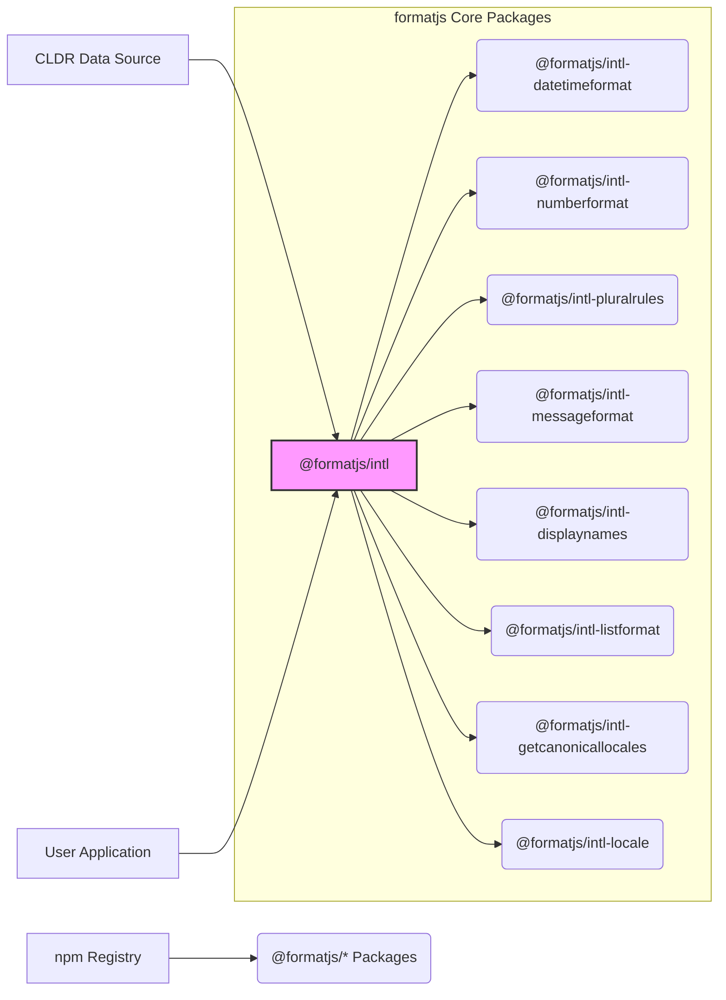
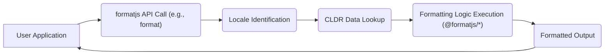
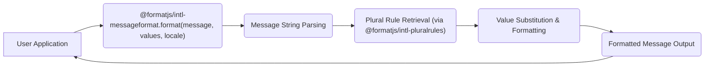

# Project Design Document: formatjs

**Version:** 1.1
**Date:** October 26, 2023
**Author:** AI Software Architect

## 1. Introduction

This document provides a detailed design overview of the `formatjs` project, a collection of modular JavaScript libraries dedicated to internationalization (i18n). The purpose of this document is to clearly outline the project's architecture, component interactions, and data flows, serving as a foundation for subsequent threat modeling exercises.

## 2. Goals and Objectives

The core objectives of the `formatjs` project are to:

* Offer a suite of JavaScript libraries for formatting data according to various locales, encompassing dates, numbers, plurals, and messages.
* Implement internationalization standards and established best practices.
* Maintain a modular design, allowing developers to include only necessary functionalities.
* Achieve high performance and efficiency in formatting operations.
* Ensure seamless integration within diverse JavaScript environments, including browsers and Node.js.

## 3. Architecture Overview

`formatjs` adopts a modular architecture, comprising several independent packages that address specific i18n concerns. This design promotes flexibility and reduces the overall bundle size for consumers.

The following diagram illustrates the key components and their relationships:

**Key Architectural Elements:**

* **`@formatjs/intl` (Core & Polyfills):** This package serves as the central point, often providing polyfills for standard ECMAScript Internationalization API (Intl) features. It enables consistent behavior across different JavaScript environments.
* **Specialized Formatting Packages (`@formatjs/intl-*`):** These packages offer focused implementations for specific formatting tasks:
    * **`@formatjs/intl-datetimeformat`:** For formatting dates and times based on locale-specific patterns.
    * **`@formatjs/intl-numberformat`:** For formatting numbers, currencies, and percentages according to locale rules.
    * **`@formatjs/intl-pluralrules`:** For determining the appropriate plural form of a number for a given locale.
    * **`@formatjs/intl-messageformat`:** A powerful library for formatting messages with placeholders, selections, and pluralization.
    * **`@formatjs/intl-displaynames`:** For retrieving translated names of languages, regions, and scripts.
    * **`@formatjs/intl-listformat`:** For formatting lists of items in a locale-sensitive manner.
    * **`@formatjs/intl-getcanonicallocales`:** A utility for standardizing locale identifiers.
    * **`@formatjs/intl-locale`:** Provides utilities for working with locale objects.
* **CLDR Data Source:** The Common Locale Data Repository (CLDR) provides the essential locale-specific data (e.g., date formats, number patterns, plural rules) that `formatjs` relies upon.
* **User Application:** The software application that integrates and utilizes the `formatjs` libraries for internationalization.
* **npm Registry:** The primary distribution platform for `formatjs` packages.

## 4. Component Details

A deeper look into the key components reveals their specific functionalities and interactions:

* **`@formatjs/intl` (Core & Polyfills):**
    * **Purpose:** To provide polyfills for the standard Intl API, ensuring consistent functionality across environments.
    * **Functionality:** Detects native Intl API support and falls back to `formatjs` implementations when necessary. It also serves as a foundational dependency for other `@formatjs/intl-*` packages.
    * **Key Interactions:** Used by all other `@formatjs/intl-*` packages.
    * **Data Handling:** Indirectly handles locale data by facilitating its use within other components.

* **`@formatjs/intl-datetimeformat`:**
    * **Purpose:** To format dates and times according to locale-specific conventions.
    * **Functionality:** Accepts a `Date` object and a locale identifier as input, returning a formatted string based on CLDR date and time patterns for the specified locale.
    * **Key Interactions:** Consumes data from the CLDR Data Source. Utilized by User Applications for date and time formatting.
    * **Data Handling:** Processes `Date` objects and utilizes locale-specific formatting patterns from CLDR.

* **`@formatjs/intl-numberformat`:**
    * **Purpose:** To format numbers, currencies, and percentages according to locale-specific rules.
    * **Functionality:** Takes a numerical value and a locale identifier, returning a formatted string. It uses CLDR data for number formatting patterns, currency symbols, and other locale-specific numerical conventions.
    * **Key Interactions:** Consumes data from the CLDR Data Source. Used by User Applications for number formatting.
    * **Data Handling:** Processes numerical values and applies locale-specific formatting rules from CLDR.

* **`@formatjs/intl-pluralrules`:**
    * **Purpose:** To determine the correct plural form for a given number and locale.
    * **Functionality:** Accepts a numerical value and a locale identifier, returning the appropriate plural category (e.g., "zero", "one", "two", "few", "many", "other") based on CLDR pluralization rules.
    * **Key Interactions:** Consumes data from the CLDR Data Source. Used internally by `@formatjs/intl-messageformat` and potentially by User Applications directly.
    * **Data Handling:** Processes numerical values and utilizes locale-specific pluralization rules from CLDR.

* **`@formatjs/intl-messageformat`:**
    * **Purpose:** To format messages that include placeholders, selection logic, and pluralization rules.
    * **Functionality:** Accepts a message string (potentially containing ICU Message Syntax), an object of values for placeholders, and a locale identifier. It returns a formatted message string, leveraging `@formatjs/intl-pluralrules` for pluralization.
    * **Key Interactions:** Uses `@formatjs/intl-pluralrules`. Used by User Applications for localizing application messages.
    * **Data Handling:** Processes message strings and placeholder values, incorporating pluralization rules.

* **CLDR Data Source:**
    * **Purpose:** To provide the foundational locale-specific data required for internationalization.
    * **Functionality:** Contains a vast repository of data, including date and time formats, number formats, pluralization rules, currency symbols, and translated names for languages and regions.
    * **Key Interactions:** Consumed by all the core formatting packages within `formatjs`.
    * **Data Handling:**  Static data that is loaded and utilized by the `formatjs` libraries.

## 5. Data Flow

The general flow of data within `formatjs` involves the following steps:

**Detailed Breakdown of Data Flow:**

1. **User Application Initiates Formatting:** The User Application calls a formatting function exposed by one of the `@formatjs/intl-*` packages, providing input data (e.g., a date, a number, a message) and a locale identifier.
2. **Locale Identification:** The `formatjs` library identifies the target locale for formatting. This might be explicitly provided by the application or determined based on user settings or browser language.
3. **CLDR Data Lookup:** Based on the identified locale, the relevant data from the CLDR Data Source is retrieved. This data is typically pre-packaged with the `formatjs` library or loaded separately.
4. **Formatting Logic Execution:** The core formatting logic within the specific `@formatjs/intl-*` package processes the input data using the retrieved CLDR data to perform the formatting operation.
5. **Formatted Output Generation:** The formatting logic generates the formatted output, which is typically a string representing the formatted date, number, or message.
6. **Formatted Output Returned:** The formatted output is returned to the User Application.

For message formatting using `@formatjs/intl-messageformat`, the data flow is more specific:

## 6. Security Considerations

This section outlines potential security considerations relevant to the `formatjs` project, which will be further analyzed during threat modeling:

* **Compromised CLDR Data:** If the CLDR data source were to be compromised and malicious data injected, it could lead to incorrect or unexpected formatting, potentially causing application errors or security vulnerabilities in consuming applications.
    * **Mitigation Strategies:** Implement robust mechanisms to verify the integrity and authenticity of the CLDR data source. Consider using signed data or checksums.
* **Input Validation Vulnerabilities:** Insufficient validation of locale identifiers or formatting options provided by the user could lead to unexpected behavior, errors, or potentially be exploited to cause denial-of-service or other issues.
    * **Mitigation Strategies:** Implement strict input validation and sanitization for all user-provided locale identifiers and formatting options.
* **Regular Expression Denial of Service (ReDoS) in Message Formatting:** Complex or maliciously crafted message formats processed by `@formatjs/intl-messageformat` could potentially lead to ReDoS attacks, consuming excessive CPU resources.
    * **Mitigation Strategies:** Carefully review and optimize the message parsing logic. Implement safeguards to prevent overly complex regular expressions or message patterns. Consider timeouts for parsing operations.
* **Dependency Chain Vulnerabilities:** Security vulnerabilities present in the project's dependencies could indirectly affect `formatjs`.
    * **Mitigation Strategies:** Regularly update dependencies to their latest secure versions. Employ dependency scanning tools to identify and address known vulnerabilities.
* **Prototype Pollution Risks:** Improper handling of user-provided options or data within the libraries could potentially lead to prototype pollution vulnerabilities, allowing attackers to inject malicious properties into object prototypes.
    * **Mitigation Strategies:** Avoid directly assigning user-provided data to object prototypes. Use safe object manipulation techniques and consider using immutable data structures where appropriate.
* **Cross-Site Scripting (XSS) via Formatted Output:** While `formatjs` primarily focuses on formatting, if the formatted output is directly rendered in a web page without proper encoding or sanitization, it could potentially introduce XSS vulnerabilities, especially when using rich text formatting features (if implemented).
    * **Mitigation Strategies:** Emphasize the responsibility of consuming applications to properly encode and sanitize the output generated by `formatjs` before rendering it in a web context.
* **Locale Injection Attacks:** If locale identifiers are derived from untrusted sources without proper validation, attackers might be able to inject malicious locale identifiers that could lead to unexpected behavior or expose sensitive information.
    * **Mitigation Strategies:** Always validate and sanitize locale identifiers obtained from untrusted sources.

## 7. Deployment

`formatjs` packages are typically deployed and utilized as follows:

* **Installation via npm/yarn:** Developers install the necessary `@formatjs/*` packages using package managers like npm or yarn.
* **Bundling with Application Code:** The installed packages are then bundled along with the application's source code using bundlers such as Webpack, Rollup, or Parcel.
* **Runtime Execution:** The `formatjs` APIs are invoked within the application's runtime environment to perform internationalization tasks as needed.
* **CLDR Data Inclusion:** CLDR data can be bundled directly with the application for offline use or loaded on demand, depending on the specific requirements and the chosen `formatjs` packages.

## 8. Future Considerations

Potential future enhancements for `formatjs` include:

* **Performance Optimization:** Continuously seeking opportunities to improve the performance and efficiency of the formatting algorithms.
* **Enhanced Rich Text Support:** Further development of rich text formatting capabilities within `@formatjs/intl-messageformat` to support more complex text styling and structure.
* **Framework Integrations:** Providing more seamless integration and utility functions specifically tailored for popular JavaScript frameworks like React, Angular, and Vue.js.
* **Improved TypeScript Definitions:** Maintaining and enhancing the quality and completeness of TypeScript definitions for all packages to improve developer experience and type safety.
* **Standardization Efforts:** Actively participating in and aligning with relevant internationalization standards and specifications.

This revised design document provides a more detailed and structured overview of the `formatjs` project, incorporating enhanced descriptions, clearer data flow diagrams, and more specific security considerations to facilitate effective threat modeling.