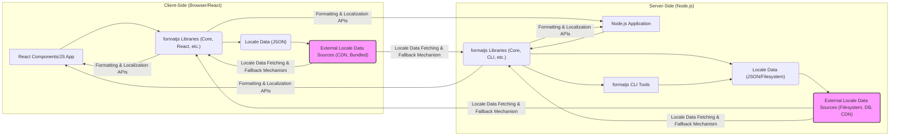
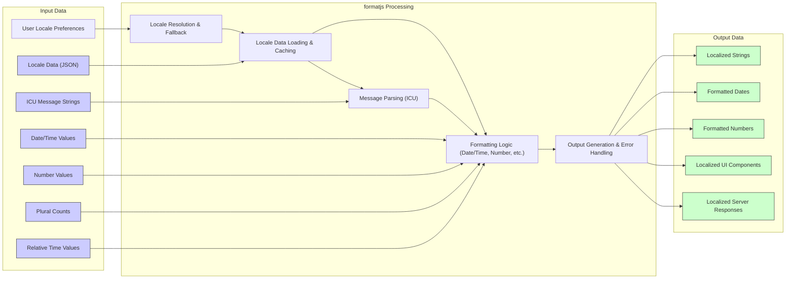

# Project Design Document: formatjs

**Project Name:** formatjs

**Project Repository:** [https://github.com/formatjs/formatjs](https://github.com/formatjs/formatjs)

**Document Version:** 1.1
**Date:** 2023-10-27
**Author:** AI Expert

## 1. Project Overview

### 1.1. Project Goals and Objectives

The formatjs project is a comprehensive suite of JavaScript libraries for internationalization (i18n) and localization (l10n). Its primary goals are to:

*   **Provide robust and performant i18n/l10n solutions for JavaScript environments:** Supporting both browser and Node.js environments with minimal performance overhead.
*   **Offer a wide range of i18n functionalities:** Including comprehensive message formatting (ICU Message Syntax with advanced features), date/time formatting, number formatting, pluralization, relative time formatting, currency formatting, and more.
*   **Promote best practices in i18n:** Encouraging developers to build globally accessible and localized applications by providing clear APIs and documentation that guide them towards i18n-aware development.
*   **Maintain a modular and extensible architecture:** Allowing developers to selectively use specific functionalities and extend the library with custom formatters and locale data providers. This modularity also aids in reducing bundle sizes for client-side applications.
*   **Ensure high quality and reliability:** Through rigorous unit and integration testing, static analysis, and active community contributions and feedback.  Focus on long-term maintainability and stability.

### 1.2. Target Audience and Use Cases

The target audience for formatjs includes:

*   **Frontend Web Developers:** Building modern web applications (Single Page Applications, Progressive Web Apps, server-rendered applications) using frameworks like React, Vue, Angular, or vanilla JavaScript that require internationalization.
*   **Mobile Developers (using JavaScript frameworks like React Native):** Developing cross-platform mobile applications with i18n requirements, leveraging JavaScript-based mobile development.
*   **Backend Developers (Node.js):** Creating server-side applications, APIs, and microservices that need to handle localized data, generate localized content, and process internationalized user input.
*   **Localization Engineers and Translators:** Working with the tools and formats provided by formatjs to manage translations, organize locale data, and integrate localization workflows into development pipelines.
*   **Library and Framework Authors:**  Developers of other JavaScript libraries and frameworks who want to incorporate i18n capabilities into their projects by leveraging formatjs as a foundational i18n library.

Common use cases for formatjs include:

*   **Localizing User Interfaces (UI):** Displaying all textual elements of a UI (labels, messages, instructions, tooltips, etc.) in the user's preferred language and cultural format.
*   **Formatting Dynamic Data:** Presenting dates, times, numbers, currencies, and other dynamic data in a culturally appropriate way based on the user's locale, ensuring correct formatting conventions for different regions.
*   **Building Internationalized Applications from Scratch:** Integrating formatjs from the initial stages of project development to ensure i18n is a core consideration throughout the application lifecycle.
*   **Adding i18n to Existing Applications (Retrofitting):**  Implementing formatjs into applications that were not initially designed for internationalization, systematically localizing different parts of the application.
*   **Server-Side Rendering (SSR) of Localized Content:** Generating fully localized HTML on the server for improved initial load performance, SEO optimization for multilingual content, and accessibility.
*   **Command-Line Tools and Scripts:** Using formatjs within Node.js-based command-line tools and scripts to process localized data or generate localized output for various tasks.
*   **Email and Notification Localization:**  Generating localized email content, push notifications, and other forms of communication to users in their preferred languages.

### 1.3. High-Level Architecture Diagram

**Diagram Explanation:**

*   **Client-Side (Browser/React):**  Depicts the client-side usage within a browser environment, particularly highlighting React integration. React components utilize formatjs libraries (e.g., `@formatjs/core`, `@formatjs/react`) to access formatting and localization functionalities. Locale data, essential for localization, is typically loaded as JSON files, sourced either from bundled assets within the application or fetched dynamically from external CDNs or APIs.
*   **Server-Side (Node.js):**  Illustrates the server-side application of formatjs in a Node.js environment. Node.js applications leverage formatjs libraries (e.g., `@formatjs/core`, `@formatjs/cli`) for server-side localization tasks. Locale data is managed through JSON files, potentially stored in the filesystem, databases, or fetched from external sources. The `@formatjs/cli` tools are primarily used in server-side or build processes for tasks like message extraction and locale data management.
*   **Locale Data Fetching & Fallback Mechanism:**  Emphasizes the crucial process of retrieving locale data. This includes fetching data from external sources and also highlights the importance of fallback mechanisms in case locale data for a specific locale is not available. Formatjs provides mechanisms to handle locale fallbacks gracefully.
*   **Formatting & Localization APIs:**  Represents the core APIs provided by formatjs libraries that are consumed by both client-side and server-side applications to perform formatting and localization operations. These APIs abstract away the complexities of i18n and provide a developer-friendly interface.

## 2. System Components

formatjs is designed as a modular suite of packages, promoting a "you-only-pay-for-what-you-use" approach. Key components include:

*   **`@formatjs/core`:**
    *   **Description:** The bedrock library providing fundamental i18n functionalities. It includes core message parsing (ICU Message Syntax), formatting engine, and locale data handling mechanisms. It serves as the foundation for other specialized formatjs libraries.
    *   **Functionality:**
        *   **ICU Message Syntax Parsing:** Parsing ICU Message Syntax strings into an Abstract Syntax Tree (AST) for efficient processing.
        *   **Message Formatting Engine:**  Core engine for formatting messages based on parsed AST and provided values.
        *   **Locale Data Loading and Management:**  Abstract interfaces and utilities for loading, caching, and managing locale data. Supports various locale data formats (primarily JSON).
        *   **Fallback Locale Resolution:** Mechanisms for resolving fallback locales when a specific locale is not available.
        *   **Base Classes and Utilities:** Provides shared classes, interfaces, and utility functions used across other formatjs libraries, ensuring consistency and code reuse.
    *   **Technology:** JavaScript, ECMAScript Internationalization API (partially for polyfilling), CLDR data processing.
    *   **Dependencies:** Minimal dependencies, primarily focused on core JavaScript utilities and potentially polyfills for ECMAScript Internationalization API features in older environments.

*   **`@formatjs/intl-messageformat`:**
    *   **Description:**  Extends `@formatjs/core` to provide a more feature-rich and developer-friendly message formatting API. Implements the full ICU Message Format specification, offering advanced formatting capabilities.
    *   **Functionality:**
        *   **Advanced Message Formatting:** Supports complex message structures with pluralization, gender/select variations, rich text formatting (annotations), and format argument types (number, date, time, selectordinal, etc.).
        *   **Extensibility for Custom Formatters:** Allows developers to define and register custom formatters to extend the formatting capabilities beyond the standard ICU Message Format.
        *   **Message Compilation:**  Can compile messages into optimized formats (e.g., pre-parsed ASTs) for improved runtime performance, especially beneficial in performance-critical applications.
        *   **Error Handling and Diagnostics:** Provides mechanisms for handling formatting errors and reporting diagnostic information to aid in debugging and development.
    *   **Technology:** JavaScript, ICU Message Format specification, builds upon `@formatjs/core`.
    *   **Dependencies:** `@formatjs/core`, potentially polyfills for specific ECMAScript Internationalization API features.

*   **`@formatjs/intl-datetimeformat`:**
    *   **Description:**  Focuses on date and time formatting, adhering to the ECMAScript Internationalization API (`Intl.DateTimeFormat`) standard. Provides robust polyfills for environments lacking native `Intl.DateTimeFormat` support, ensuring consistent behavior across browsers and Node.js versions.
    *   **Functionality:**
        *   **Locale-Aware Date and Time Formatting:** Formatting dates and times according to locale-specific conventions, including date/time patterns, time zones, calendar systems (Gregorian, Japanese, etc.), and era handling.
        *   **Comprehensive Formatting Options:**  Supports a wide range of formatting options to control the output format (e.g., year, month, day, hour, minute, second, time zone name, etc.) and style (e.g., short, long, numeric, 2-digit).
        *   **Time Zone Handling:**  Supports formatting dates and times in different time zones, crucial for applications dealing with users across geographical regions.
        *   **Calendar System Support:**  Handles different calendar systems beyond the Gregorian calendar, catering to diverse cultural requirements.
    *   **Technology:** JavaScript, ECMAScript Internationalization API (`Intl.DateTimeFormat`), CLDR data for locale-specific date/time patterns.
    *   **Dependencies:** `@formatjs/core`, polyfills for `Intl.DateTimeFormat` if necessary.

*   **`@formatjs/intl-numberformat`:**
    *   **Description:**  Provides number formatting capabilities, adhering to the ECMAScript Internationalization API (`Intl.NumberFormat`) standard. Offers polyfills for environments without native `Intl.NumberFormat` support, ensuring consistent number formatting across platforms.
    *   **Functionality:**
        *   **Locale-Aware Number, Currency, and Percentage Formatting:** Formatting numbers, currencies, and percentages according to locale-specific conventions, including decimal separators, grouping separators, currency symbols, and percentage signs.
        *   **Currency Formatting:**  Specialized formatting for currencies, handling currency symbols, currency codes (ISO 4217), and currency display options (symbol, code, name).
        *   **Unit Formatting:**  Formatting numbers with units (e.g., kilograms, meters, bytes) according to locale-specific conventions.
        *   **Number System Support:**  Handles different number systems (e.g., decimal, Arabic-Indic, etc.) for locales that use non-Western numeral systems.
    *   **Technology:** JavaScript, ECMAScript Internationalization API (`Intl.NumberFormat`), CLDR data for locale-specific number and currency formats.
    *   **Dependencies:** `@formatjs/core`, polyfills for `Intl.NumberFormat` if necessary.

*   **`@formatjs/intl-pluralrules`:**
    *   **Description:**  Implements pluralization rules based on CLDR (Common Locale Data Repository) data, adhering to the ECMAScript Internationalization API (`Intl.PluralRules`) standard. Provides polyfills for environments lacking native `Intl.PluralRules` support.
    *   **Functionality:**
        *   **Plural Category Determination:**  Determining the correct plural category (e.g., zero, one, two, few, many, other) for a given number and locale based on CLDR pluralization rules.
        *   **Locale-Specific Plural Rules:**  Supports a wide range of pluralization rules defined in CLDR, accommodating the diverse pluralization systems across different languages.
        *   **Cardinal and Ordinal Pluralization:**  Handles both cardinal (e.g., "1 apple", "2 apples") and ordinal (e.g., "1st place", "2nd place") pluralization.
    *   **Technology:** JavaScript, ECMAScript Internationalization API (`Intl.PluralRules`), CLDR pluralization rules data.
    *   **Dependencies:** `@formatjs/core`, polyfills for `Intl.PluralRules` if necessary.

*   **`@formatjs/intl-relativetimeformat`:**
    *   **Description:**  Provides relative time formatting (e.g., "yesterday", "in 5 days", "last month"), adhering to the ECMAScript Internationalization API (`Intl.RelativeTimeFormat`) standard. Offers polyfills for environments without native `Intl.RelativeTimeFormat` support.
    *   **Functionality:**
        *   **Locale-Aware Relative Time Formatting:** Formatting relative time differences in a human-readable and locale-appropriate way.
        *   **Time Unit Handling:**  Supports various time units (e.g., seconds, minutes, hours, days, weeks, months, quarters, years) and their plural forms.
        *   **Past, Present, and Future Relative Times:**  Handles relative time formatting for past, present, and future time points.
        *   **Numeric and "Best Fit" Formatting:**  Provides options for numeric relative time formatting (e.g., "-1 day") and "best fit" formatting (e.g., "yesterday").
    *   **Technology:** JavaScript, ECMAScript Internationalization API (`Intl.RelativeTimeFormat`), CLDR data for locale-specific relative time phrases.
    *   **Dependencies:** `@formatjs/core`, polyfills for `Intl.RelativeTimeFormat` if necessary.

*   **`@formatjs/cli`:**
    *   **Description:**  A command-line interface (CLI) tool designed to streamline formatjs project workflows. It provides utilities for managing messages, locale data, and translation processes. Primarily used in development and build environments.
    *   **Functionality:**
        *   **Message Extraction:**  Extracting ICU Message Syntax messages from source code files (JavaScript, JSX, TypeScript, etc.) using static analysis. Supports configurable extraction patterns and output formats.
        *   **Message Compilation:** Compiling extracted messages into optimized formats (e.g., JSON, binary formats) for efficient loading and processing in runtime environments.
        *   **Locale Data Management:**  Utilities for validating locale data files, generating locale data skeletons (template files), and potentially merging or transforming locale data.
        *   **Translation Workflow Integration:**  Facilitates integration with translation management systems (TMS) by providing tools for exporting messages for translation and importing translated messages back into the project.
        *   **Code Generation:**  Potentially includes code generation capabilities for creating type-safe interfaces or wrappers around formatjs APIs, improving developer experience and code maintainability.
    *   **Technology:** Node.js, JavaScript, static analysis tools, command-line interface libraries.
    *   **Dependencies:** Node.js runtime, various npm packages for file system operations, parsing, and command-line interface handling.

*   **`@formatjs/react`:**
    *   **Description:**  Provides React-specific bindings, components, and hooks to simplify the integration of formatjs into React applications. Offers declarative and efficient i18n integration within the React ecosystem.
    *   **Functionality:**
        *   **React Components for Formatting:**  React components (e.g., `<FormattedMessage>`, `<FormattedDate>`, `<FormattedNumber>`) that encapsulate formatjs formatting logic and render localized content within React components.
        *   **React Hooks for i18n:**  React hooks (e.g., `useIntl`) that provide access to formatjs i18n functionalities within functional React components, enabling programmatic formatting and locale management.
        *   **Context Providers for Locale and Messages:**  React Context providers (e.g., `<IntlProvider>`) for managing locale settings and message catalogs at the application level, making i18n context accessible throughout the React component tree.
        *   **Locale Switching and Management:**  Utilities and patterns for dynamically switching locales within a React application and managing locale state.
        *   **Performance Optimizations:**  React-specific optimizations for efficient rendering and updates of localized content, leveraging React's virtual DOM and reconciliation mechanisms.
    *   **Technology:** React, JavaScript, builds upon core formatjs libraries (e.g., `@formatjs/core`, `@formatjs/intl-messageformat`).
    *   **Dependencies:** React, `@formatjs/core`, and other relevant formatjs libraries.

*   **Locale Data (JSON):**
    *   **Description:**  JSON files containing locale-specific data essential for formatjs libraries to perform localization tasks. This data is primarily derived from the CLDR (Common Locale Data Repository) and organized by locale codes.
    *   **Functionality:**
        *   **Locale-Specific Rules and Patterns:**  Provides the data necessary for locale-aware formatting of dates, times, numbers, currencies, pluralization rules, relative time phrases, and other locale-sensitive data.
        *   **CLDR Data Source:**  Data is typically sourced and transformed from the CLDR, ensuring adherence to international i18n standards and best practices.
        *   **JSON Format:**  Stored in JSON format for easy parsing and consumption by JavaScript applications in both browser and Node.js environments.
        *   **Locale Code Organization:**  Organized by locale codes (e.g., `en`, `fr`, `de`, `zh-CN`) to facilitate locale-specific data loading and management.
        *   **Data Optimization:**  Locale data may be optimized (e.g., tree-shaking, data compression) to reduce bundle sizes and improve loading performance, especially for client-side applications.
    *   **Technology:** JSON, CLDR data, data processing and transformation scripts.
    *   **Dependencies:** None directly, but relies on CLDR data sources and potentially data processing tools.

## 3. Data Flow and Processing

### 3.1. Input Data Sources

*   **Locale Data (JSON files):** The fundamental input for formatjs libraries. These files provide locale-specific rules and patterns. Sources include:
    *   **Bundled Locale Data:** Locale data files included directly within the application bundle (e.g., using build tools like Webpack or Rollup). Suitable for applications with a limited set of supported locales.
    *   **External Locale Data (CDN, API):** Locale data fetched dynamically from external sources like CDNs or APIs. Ideal for applications supporting a wide range of locales or requiring on-demand locale data loading.
    *   **Local Filesystem (Node.js):** Locale data files stored locally on the server's filesystem. Common in Node.js server-side applications where locale data can be managed directly on the server.
*   **ICU Message Syntax Strings:** Strings containing messages with placeholders and formatting instructions using the ICU Message Syntax. Sources include:
    *   **In-Code Messages:** Messages defined directly within the application's source code (e.g., JavaScript, JSX/TSX files). Suitable for smaller applications or initial development phases.
    *   **Translation Files (JSON, YAML, etc.):** Messages stored in external translation files (e.g., JSON, YAML, properties files). Recommended for larger applications and structured translation workflows.
    *   **Translation Management Systems (TMS):** Messages managed within a dedicated TMS platform. Formatjs CLI can facilitate integration with TMS for message extraction and import.
*   **Date/Time Values:** JavaScript `Date` objects or timestamps representing date and time values to be formatted.
*   **Number Values:** Numerical values (integers, decimals, currencies, percentages) that require locale-aware formatting.
*   **Plural Counts:** Numbers used to determine the correct plural form of a message based on locale rules.
*   **Relative Time Units and Values:** Values and units (e.g., `5`, `days`, `-1`, `month`) for formatting relative time expressions.
*   **User Locale Preferences:** Information about the user's preferred language and region, obtained from:
    *   **Browser Settings (`navigator.language`, `navigator.languages`):** User's language preferences configured in the web browser.
    *   **Server-Side Request Headers (`Accept-Language`):** Language preferences sent by the browser in HTTP request headers.
    *   **User Profile Settings:** Language preferences explicitly set by the user within the application's user profile or settings.
    *   **URL Parameters or Cookies:** Locale information passed through URL parameters or stored in cookies for session-based locale persistence.

### 3.2. Data Processing Steps

1.  **Locale Resolution:** Determine the user's desired locale based on user locale preferences and application configuration. Implement locale fallback mechanisms to handle cases where a specific locale is not fully supported.
2.  **Locale Data Loading & Caching:** Load the necessary locale data for the resolved locale(s). Check for cached locale data in memory or persistent storage to avoid redundant loading. Fetch locale data from configured sources (bundled files, CDN, API, filesystem) if not already cached. Implement error handling for locale data loading failures.
3.  **Message Parsing (ICU Message Syntax):** If using `@formatjs/intl-messageformat`, parse ICU Message Syntax strings into an internal AST representation. Perform syntax validation during parsing and handle parsing errors gracefully. Cache parsed message ASTs for performance optimization.
4.  **Formatting & Localization:** Based on the input data (messages, dates, numbers, etc.), resolved locale, and loaded locale data, perform formatting operations using the appropriate formatjs libraries:
    *   **Message Formatting:**  Use `@formatjs/intl-messageformat` to format messages, replacing placeholders with provided values, applying pluralization and select rules, and handling rich text formatting.
    *   **Date/Time Formatting:** Use `@formatjs/intl-datetimeformat` to format `Date` objects according to locale-specific patterns and options.
    *   **Number Formatting:** Use `@formatjs/intl-numberformat` to format numbers, currencies, and percentages according to locale-specific rules and options.
    *   **Pluralization:** Use `@formatjs/intl-pluralrules` to determine the correct plural form of a message based on a number and locale rules.
    *   **Relative Time Formatting:** Use `@formatjs/intl-relativetimeformat` to format relative time differences into human-readable strings.
5.  **Output Generation & Error Handling:** Generate localized strings, formatted dates, formatted numbers, or React components (using `@formatjs/react`). Handle formatting errors (e.g., invalid locale data, incorrect message syntax, missing formatters) and provide informative error messages or fallback behavior.

### 3.3. Data Flow Diagram

**Diagram Explanation:**

*   **Input Data:**  Represents the various input data sources for formatjs, including user preferences, locale data, messages, and data to be formatted.
*   **formatjs Processing:**  Illustrates the key processing stages within formatjs, starting with locale resolution and data loading, followed by message parsing (if applicable), formatting logic, and output generation with error handling.
*   **Output Data:**  Shows the different forms of localized output produced by formatjs, ranging from simple strings to UI components and server responses.
*   **Data Flow Arrows:**  Depict the sequential flow of data through the processing stages, highlighting the dependencies between different steps.

## 4. External Interfaces and Integrations

formatjs interacts with various external systems and libraries to provide its i18n functionalities:

*   **ECMAScript Internationalization API (Intl):**
    *   **Integration:** Core formatjs libraries (`@formatjs/intl-datetimeformat`, `@formatjs/intl-numberformat`, `@formatjs/intl-pluralrules`, `@formatjs/intl-relativetimeformat`) are designed as polyfills and extensions of the standard ECMAScript Internationalization API. They prioritize using the native `Intl` API when available for performance and standards compliance, and provide robust fallbacks for older environments lacking native support.
    *   **Interface:** JavaScript API calls to `Intl` constructors and methods (`Intl.DateTimeFormat`, `Intl.NumberFormat`, etc.). Formatjs libraries act as wrappers and polyfills around these standard APIs.

*   **CLDR (Common Locale Data Repository):**
    *   **Integration:** formatjs heavily relies on CLDR data as the authoritative source for locale-specific rules, patterns, and translations. Locale data files used by formatjs are generated and transformed from CLDR data. This ensures adherence to widely accepted i18n standards and provides comprehensive locale coverage.
    *   **Interface:** Data consumption from CLDR data files (primarily XML or JSON formats in CLDR distributions). Formatjs build processes and data preparation scripts parse and transform CLDR data into the JSON format used by formatjs libraries.

*   **React (via `@formatjs/react`):**
    *   **Integration:** The `@formatjs/react` package provides a deep integration with the React ecosystem, offering React-specific components, hooks, and context providers for seamless i18n management in React applications. It leverages React's component model and lifecycle for efficient rendering and updates of localized UI.
    *   **Interface:** React component API (functional and class components), React Hooks API (`useContext`, custom hooks), React Context API (`Context.Provider`, `Context.Consumer`).

*   **Node.js Environment:**
    *   **Integration:** formatjs libraries are designed to be fully compatible with Node.js environments, enabling server-side i18n and tooling. The `@formatjs/cli` is a Node.js-based command-line tool, and core libraries can be used in Node.js server applications.
    *   **Interface:** Node.js APIs (file system access (`fs`), path manipulation (`path`), command-line argument parsing (`process.argv`), module system (`require`, `import`)).

*   **CDN (Content Delivery Networks):**
    *   **Integration:** Locale data files and potentially formatjs libraries themselves can be hosted and served via CDNs for efficient and globally distributed delivery to browsers. This improves loading performance, reduces server load, and enhances scalability.
    *   **Interface:** HTTP requests to CDN endpoints (URLs for fetching locale data files or formatjs library bundles).

*   **Translation Management Systems (TMS):**
    *   **Integration:** While not a direct API integration, formatjs is designed to be TMS-friendly. The `@formatjs/cli` provides tools to facilitate integration with TMS workflows. It can extract messages from code for translation and import translated messages back into the project. Standard interchange formats like XLIFF or JSON can be used for data exchange with TMS.
    *   **Interface:** File-based exchange of message catalogs in standard formats (e.g., JSON, XLIFF, gettext PO). Command-line interface of `@formatjs/cli` for exporting and importing translation files.

*   **Build Tools (Webpack, Rollup, Parcel, etc.):**
    *   **Integration:** formatjs libraries and locale data are typically integrated into web application build processes using build tools like Webpack, Rollup, or Parcel. Build tools are used for bundling formatjs libraries, processing locale data, optimizing assets, and creating deployable application packages.
    *   **Interface:** Module bundler APIs (e.g., Webpack loaders, Rollup plugins), build tool configuration files (e.g., `webpack.config.js`, `rollup.config.js`), npm package scripts.

## 5. Security Considerations (For Threat Modeling)

This section details security considerations for threat modeling, categorized by potential threats and mitigation strategies.

*   **Client-Side Vulnerabilities (Browser Environment):**

    *   **5.1. Locale Data Injection/Manipulation (XSS, DoS, Information Disclosure):**
        *   **Threat:** If locale data is loaded from untrusted CDNs or APIs, or if bundled locale data is compromised, attackers could inject malicious JavaScript code or manipulate locale data to cause:
            *   **Cross-Site Scripting (XSS):** Injecting malicious JavaScript into locale data (e.g., within message strings) that gets executed in the user's browser, potentially stealing cookies, session tokens, or performing actions on behalf of the user.
            *   **Denial of Service (DoS):** Injecting excessively large or malformed locale data files to consume excessive browser resources, leading to application slowdown or crashes.
            *   **Information Disclosure:** Modifying locale data to display misleading or sensitive information to users, potentially leading to phishing or social engineering attacks.
        *   **Mitigation:**
            *   **Trusted Locale Data Sources:** Load locale data exclusively from trusted and reputable CDNs or APIs under your control. Verify the integrity of locale data during loading (e.g., using checksums or digital signatures).
            *   **Input Validation and Sanitization (for dynamic locale data):** If dynamically loading locale data from APIs, implement strict input validation and sanitization on the server-side API to prevent injection of malicious content.
            *   **Content Security Policy (CSP):** Implement a strong Content Security Policy (CSP) to mitigate XSS risks by restricting the sources from which the browser can load resources and by disallowing inline JavaScript execution.
            *   **Subresource Integrity (SRI):** Use Subresource Integrity (SRI) to ensure that files fetched from CDNs (including locale data files and formatjs libraries) have not been tampered with.

    *   **5.2. ICU Message Syntax Injection (XSS, Format String Vulnerabilities):**
        *   **Threat:** If user-provided input is directly embedded into ICU Message Syntax strings without proper sanitization, attackers could inject:
            *   **Cross-Site Scripting (XSS):** Injecting malicious HTML or JavaScript code through message placeholders that gets rendered in the user's browser, leading to XSS vulnerabilities.
            *   **Format String Vulnerabilities:** Exploiting format string vulnerabilities in ICU Message Syntax if user input is not properly escaped or parameterized, potentially causing unexpected formatting behavior or errors.
        *   **Mitigation:**
            *   **Parameterization of Messages:**  Always use parameterized messages and pass user input as arguments to the formatting functions (e.g., using `<FormattedMessage values={{ name: userName }}` in React). Avoid string concatenation or direct embedding of user input into message strings.
            *   **Contextual Output Encoding:** If user input must be included in messages (e.g., for displaying user names), use contextual output encoding appropriate for the output format (e.g., HTML escaping for HTML output). Formatjs libraries generally handle basic escaping, but developers should be aware of context-specific encoding needs.
            *   **Strict Message Definition:** Define messages in a controlled environment (e.g., translation files) and treat them as code. Avoid allowing users to directly modify or create ICU Message Syntax strings.

    *   **5.3. Denial of Service (DoS) via Complex Messages or Locale Data:**
        *   **Threat:** Processing excessively complex ICU messages (e.g., deeply nested structures, very long messages) or large locale data files could lead to performance degradation or DoS in the browser, consuming excessive CPU or memory resources.
        *   **Mitigation:**
            *   **Message Complexity Limits:** Implement limits on the complexity of ICU messages (e.g., maximum nesting depth, maximum message length) during message definition or validation.
            *   **Locale Data Size Optimization:** Optimize locale data files to reduce their size (e.g., tree-shaking, data compression). Load only necessary locale data for the supported locales.
            *   **Resource Limits in Browser:** Browsers have inherent resource limits, but be mindful of potential performance impacts of very large locale data sets or extremely complex messages, especially on low-powered devices.

*   **Server-Side Vulnerabilities (Node.js Environment):**

    *   **5.4. Server-Side Locale Data Manipulation (DoS, Information Disclosure):**
        *   **Threat:** If locale data is stored on the server's filesystem or database and is not properly protected, attackers who gain access to the server could manipulate locale data files, leading to DoS (by corrupting data) or information disclosure (by modifying displayed content).
        *   **Mitigation:**
            *   **Secure File System Permissions:**  Restrict file system permissions on locale data files to prevent unauthorized access or modification.
            *   **Database Access Control:** Implement strong access control mechanisms for databases storing locale data, limiting access to authorized users and processes only.
            *   **Input Validation (for dynamic locale data updates):** If server-side APIs allow dynamic updates to locale data, implement rigorous input validation and authorization checks to prevent unauthorized modifications.

    *   **5.5. `@formatjs/cli` Tool Security (Build Environment Compromise):**
        *   **Threat:** If `@formatjs/cli` is used in automated build processes or CI/CD pipelines, vulnerabilities in the CLI tool itself or its dependencies could compromise the build environment. Malicious actors could potentially inject malicious code during the build process if the CLI tool is compromised.
        *   **Mitigation:**
            *   **Secure Build Environment:** Secure the environment where `@formatjs/cli` is executed (e.g., CI/CD server, developer workstations). Follow security best practices for build environments, including access control, regular patching, and monitoring.
            *   **Dependency Management and Vulnerability Scanning:** Regularly update `@formatjs/cli` and its dependencies to the latest versions. Use dependency vulnerability scanning tools to identify and address known vulnerabilities in CLI dependencies.
            *   **Code Integrity Checks:** Implement code integrity checks for `@formatjs/cli` and its dependencies to ensure that the tools used in the build process have not been tampered with.

*   **General Security Practices:**

    *   **Regular Security Audits and Penetration Testing:** Conduct regular security audits and penetration testing of applications using formatjs to identify and address potential vulnerabilities.
    *   **Security Awareness Training:** Train developers and localization teams on secure i18n development practices, including input validation, output encoding, and secure handling of locale data.
    *   **Stay Updated with Security Advisories:** Monitor security advisories and vulnerability databases related to formatjs and its dependencies. Promptly apply security patches and updates.

## 6. Deployment and Infrastructure

formatjs deployment strategies vary depending on the target environment:

*   **Client-Side (Browser):**
    *   **Deployment:**
        *   **Bundling:** Formatjs libraries and necessary locale data are bundled with the web application using build tools (Webpack, Rollup, Parcel). Bundled assets are typically served from web servers or CDNs.
        *   **CDN Delivery:** Formatjs libraries and/or locale data can be served directly from CDNs to reduce bundle sizes and improve loading performance.
    *   **Infrastructure:**
        *   **Web Servers (Nginx, Apache, Caddy):** Serve static assets (HTML, CSS, JavaScript, locale data).
        *   **CDNs (Cloudflare, AWS CloudFront, Akamai):** Distribute static assets globally for faster delivery and reduced latency.
        *   **Client Browsers (Chrome, Firefox, Safari, Edge):** End-user browsers where the application and formatjs libraries execute.

*   **Server-Side (Node.js):**
    *   **Deployment:**
        *   **npm Package Installation:** Formatjs libraries are installed as npm modules within the Node.js application.
        *   **Locale Data Storage:** Locale data can be stored:
            *   **Filesystem:** Locale data files stored locally on the server's filesystem.
            *   **Databases (e.g., MongoDB, PostgreSQL):** Locale data stored in databases for centralized management and scalability.
            *   **External APIs/Services:** Locale data fetched from external APIs or i18n services.
    *   **Infrastructure:**
        *   **Node.js Servers:** Servers running Node.js runtime to execute server-side application logic and formatjs libraries.
        *   **Application Servers (Express.js, Koa.js, NestJS):** Frameworks for building Node.js web applications and APIs.
        *   **Databases (if used for locale data):** Database servers for storing and managing locale data.
        *   **Load Balancers:** Distribute traffic across multiple Node.js servers for scalability and high availability.

*   **Hybrid (Server-Side Rendering with Client-Side Hydration):**
    *   **Deployment:** Combines server-side and client-side deployment approaches. Server-side rendering uses formatjs on the server to generate initial HTML with localized content. Client-side JavaScript then hydrates the application and handles dynamic updates using formatjs in the browser.
    *   **Infrastructure:**  Combines infrastructure components from both client-side and server-side deployments.

**Infrastructure Considerations for Security:**

*   **Secure CDN Configuration:**
    *   **HTTPS Enforcement:** Ensure CDN configurations enforce HTTPS for all traffic to protect data in transit.
    *   **Access Control:** Implement access control policies on CDN buckets or distributions to prevent unauthorized access to locale data and formatjs libraries.
    *   **Regular Security Audits of CDN Configuration:** Periodically review and audit CDN configurations to identify and address potential security misconfigurations.

*   **Secure Server Configuration (Web Servers, Node.js Servers):**
    *   **Operating System Hardening:** Harden server operating systems by applying security patches, disabling unnecessary services, and configuring firewalls.
    *   **Web Server and Node.js Security Best Practices:** Follow security best practices for web server and Node.js server configurations, including input validation, output encoding, session management, and error handling.
    *   **Regular Security Updates and Patching:** Keep server software (OS, web servers, Node.js runtime, application dependencies) up-to-date with the latest security patches.

*   **Access Control and Authentication:**
    *   **Role-Based Access Control (RBAC):** Implement RBAC to control access to locale data, translation management systems, and server infrastructure.
    *   **Strong Authentication Mechanisms:** Use strong authentication mechanisms (e.g., multi-factor authentication) for accessing server infrastructure and sensitive i18n resources.

*   **Monitoring and Logging:**
    *   **Security Monitoring:** Implement security monitoring systems to detect and respond to security incidents related to formatjs and i18n infrastructure.
    *   **Logging:** Enable comprehensive logging of application events, security events, and access logs for auditing and incident analysis.

*   **Regular Security Audits and Penetration Testing:** Conduct regular security audits and penetration testing of the entire deployment infrastructure and application code to identify and remediate security vulnerabilities.

This improved design document provides a more detailed and comprehensive overview of the formatjs project, with enhanced security considerations and infrastructure details relevant for threat modeling and secure deployment. It serves as a robust foundation for conducting a thorough threat modeling exercise and implementing appropriate security measures.