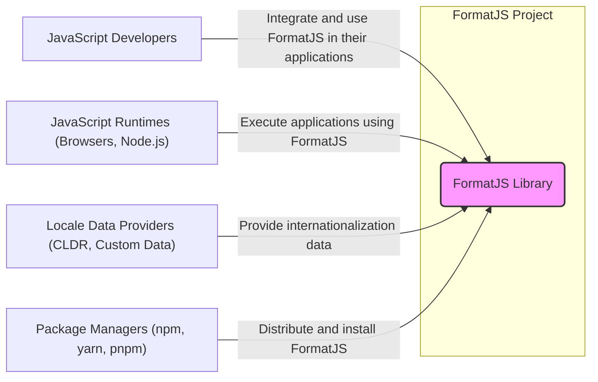
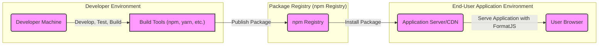
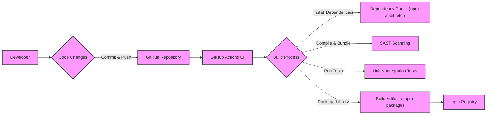

# BUSINESS POSTURE

The formatjs project aims to provide a comprehensive set of internationalization (i18n) tools and libraries for JavaScript. It focuses on formatting messages, dates, numbers, and currencies for different locales, enabling developers to build applications that are accessible and user-friendly for a global audience.

- Business Priorities:
  - Provide accurate and reliable internationalization functionalities for JavaScript applications.
  - Offer a performant and efficient library to minimize impact on application performance.
  - Maintain a widely adopted and community-supported i18n solution.
  - Ensure compatibility with various JavaScript environments (browsers, Node.js, React Native, etc.).
  - Facilitate easy integration and usage for developers.

- Business Goals:
  - Become the leading i18n library in the JavaScript ecosystem.
  - Expand the library's features and functionalities to cover a broader range of i18n needs.
  - Foster a strong and active community of contributors and users.
  - Ensure long-term sustainability and maintenance of the project.

- Business Risks:
  - Security vulnerabilities in the library could lead to application security issues (e.g., injection attacks through format strings).
  - Performance bottlenecks in the library could negatively impact application user experience.
  - Lack of community support or maintainership could lead to project stagnation and obsolescence.
  - Incompatibility issues with new JavaScript environments or frameworks could limit adoption.
  - Incorrect or incomplete locale data could result in inaccurate internationalization.

# SECURITY POSTURE

- Security Controls:
  - security control: Code review process for contributions (GitHub Pull Requests). Implemented via GitHub workflow and project maintainers.
  - security control: Unit and integration testing. Implemented via Jest and GitHub Actions.
  - security control: Linting and code formatting. Implemented via ESLint, Prettier and GitHub Actions.
  - security control: Dependency scanning for known vulnerabilities. Implemented via Dependabot and GitHub Security Advisories.

- Accepted Risks:
  - accepted risk: Potential vulnerabilities in third-party dependencies. Mitigated by dependency scanning and updates.
  - accepted risk: Risk of vulnerabilities introduced by community contributions. Mitigated by code review and testing.
  - accepted risk: Denial of service if library is used to process untrusted user input without proper validation and rate limiting in consuming application.

- Recommended Security Controls:
  - security control: Implement Static Application Security Testing (SAST) tools in the CI/CD pipeline to automatically detect potential code vulnerabilities.
  - security control: Introduce fuzz testing to identify edge cases and potential vulnerabilities in parsing and formatting logic.
  - security control: Establish a clear security vulnerability reporting process and response plan.
  - security control: Consider signing releases to ensure authenticity and integrity of distributed packages.
  - security control: Regularly audit dependencies for security vulnerabilities and update them promptly.

- Security Requirements:
  - Authentication: Not directly applicable to a JavaScript library. Authentication is the responsibility of applications using the library.
  - Authorization: Not directly applicable to a JavaScript library. Authorization is the responsibility of applications using the library.
  - Input Validation:
    - The library must handle potentially malicious or unexpected input gracefully without causing crashes or unexpected behavior.
    - Format strings and locale data should be validated to prevent injection attacks or other vulnerabilities.
    - Input validation should be performed on all external data sources, including user-provided format strings and locale data.
  - Cryptography:
    - Cryptography is not a primary requirement for this library. However, if future features involve handling sensitive data or secure communication, appropriate cryptographic measures must be implemented.
    - If cryptography is used, ensure usage of well-vetted and standard cryptographic libraries and algorithms.

# DESIGN

## C4 CONTEXT



- Context Diagram Elements:
  - - Name: FormatJS Library
    - Type: Software System
    - Description: The core FormatJS library providing internationalization functionalities for JavaScript applications.
    - Responsibilities:
      - Formatting messages, dates, numbers, and currencies according to specified locales.
      - Providing APIs for developers to integrate i18n into their applications.
      - Handling locale data and providing mechanisms for customization.
    - Security Controls:
      - Input validation to prevent injection attacks.
      - Secure coding practices to minimize vulnerabilities.
      - Regular security audits and vulnerability scanning.

  - - Name: JavaScript Developers
    - Type: Person
    - Description: Developers who use the FormatJS library to internationalize their JavaScript applications.
    - Responsibilities:
      - Integrating FormatJS into their projects.
      - Using the library's APIs correctly and securely.
      - Providing appropriate locale data and configurations.
    - Security Controls:
      - Secure development practices in their applications.
      - Proper handling of user input and data.
      - Regular updates of dependencies, including FormatJS.

  - - Name: JavaScript Runtimes (Browsers, Node.js)
    - Type: Software System
    - Description: Environments where JavaScript applications using FormatJS are executed.
    - Responsibilities:
      - Executing JavaScript code, including FormatJS library.
      - Providing necessary APIs and functionalities for JavaScript applications.
    - Security Controls:
      - Runtime environment security features (e.g., sandboxing in browsers).
      - Regular updates and security patches for runtimes.

  - - Name: Locale Data Providers (CLDR, Custom Data)
    - Type: External System/Data Source
    - Description: Sources of internationalization data, such as the Unicode CLDR or custom locale data provided by developers.
    - Responsibilities:
      - Providing accurate and up-to-date locale data.
      - Ensuring data integrity and availability.
    - Security Controls:
      - Data validation and integrity checks.
      - Secure data storage and access controls for data providers.

  - - Name: Package Managers (npm, yarn, pnpm)
    - Type: Software System
    - Description: Tools used to distribute and install JavaScript packages, including FormatJS.
    - Responsibilities:
      - Hosting and distributing JavaScript packages.
      - Ensuring package integrity and availability.
      - Providing package installation and management functionalities.
    - Security Controls:
      - Package integrity checks (e.g., checksums, signatures).
      - Vulnerability scanning of packages.
      - Secure infrastructure for package hosting and distribution.

## C4 CONTAINER

```mermaid
flowchart LR
    subgraph "FormatJS Project"
        A("Core Library":::container)
        B("Locale Data Packages":::container)
        C("CLI Tools (Optional)":::container)
        D("Documentation Website":::container)
    end
    style A fill:#f9f,stroke:#333,stroke-width:2px
    style B fill:#f9f,stroke:#333,stroke-width:2px
    style C fill:#f9f,stroke:#333,stroke-width:2px
    style D fill:#f9f,stroke:#333,stroke-width:2px
    B --> A: Uses Data
    C --> A: Uses Library
    D --> A: Documents Library
    E["JavaScript Developers"] -- "Integrate" --> A
    E -- "Install" --> B
    E -- "Use" --> C
    E -- "Read" --> D
    classDef container fill:#ccf,stroke:#333,stroke-width:2px
```

- Container Diagram Elements:
  - - Name: Core Library
    - Type: Container (JavaScript Library)
    - Description: The main JavaScript library containing the core internationalization logic and APIs.
    - Responsibilities:
      - Implementing formatting functions for messages, dates, numbers, and currencies.
      - Providing APIs for developers to use in their applications.
      - Handling locale data loading and management.
    - Security Controls:
      - Input validation within formatting functions.
      - Secure coding practices to prevent vulnerabilities.
      - Unit and integration testing.
      - SAST scanning in CI/CD.

  - - Name: Locale Data Packages
    - Type: Container (npm Packages)
    - Description: Separate npm packages containing locale-specific data (e.g., date formats, number formats, translations).
    - Responsibilities:
      - Storing and providing locale data in a structured format.
      - Allowing developers to install only the necessary locale data.
    - Security Controls:
      - Data integrity checks for locale data.
      - Regular updates to locale data packages.
      - Potentially signing packages for distribution.

  - - Name: CLI Tools (Optional)
    - Type: Container (Command-Line Interface)
    - Description: Optional command-line tools for tasks like locale data generation, format string validation, or other utility functions.
    - Responsibilities:
      - Providing command-line interface for specific i18n-related tasks.
      - Automating certain i18n workflows.
    - Security Controls:
      - Input validation for CLI arguments and inputs.
      - Secure coding practices for CLI tools.

  - - Name: Documentation Website
    - Type: Container (Web Application)
    - Description: A website providing documentation, examples, and API references for the FormatJS library.
    - Responsibilities:
      - Hosting documentation for the library.
      - Providing tutorials and examples for developers.
      - Facilitating community engagement and support.
    - Security Controls:
      - Standard web application security practices (e.g., HTTPS, input validation, protection against common web vulnerabilities).
      - Access controls for website administration.

## DEPLOYMENT

For a JavaScript library, "deployment" primarily refers to publishing the library to package registries like npm, making it available for developers to install and use in their applications.



- Deployment Diagram Elements:
  - - Name: Developer Machine
    - Type: Infrastructure (Laptop/Desktop)
    - Description: Developer's local machine used for developing, testing, and building the FormatJS library.
    - Responsibilities:
      - Code development and testing.
      - Running build scripts and tools.
      - Preparing packages for publishing.
    - Security Controls:
      - Developer workstation security practices (OS hardening, antivirus, etc.).
      - Secure access to development tools and repositories.

  - - Name: Build Tools (npm, yarn, etc.)
    - Type: Software Tool
    - Description: Package managers and build tools used to build and package the FormatJS library.
    - Responsibilities:
      - Managing dependencies.
      - Running build scripts (compilation, bundling, etc.).
      - Packaging the library for distribution.
    - Security Controls:
      - Secure configuration of build tools.
      - Dependency vulnerability scanning during build.

  - - Name: npm Registry
    - Type: Infrastructure (Package Registry)
    - Description: The npm registry (or other package registries) where FormatJS packages are published and hosted.
    - Responsibilities:
      - Hosting and distributing FormatJS packages.
      - Providing package installation services.
      - Ensuring package availability and integrity.
    - Security Controls:
      - Package integrity checks (checksums, signatures).
      - Infrastructure security for the registry.
      - Access controls for package publishing.

  - - Name: Application Server/CDN
    - Type: Infrastructure (Server/CDN)
    - Description: Servers or Content Delivery Networks where applications using FormatJS are deployed.
    - Responsibilities:
      - Hosting and serving applications.
      - Delivering application code and assets, including FormatJS library.
    - Security Controls:
      - Server and CDN security best practices.
      - Secure application deployment processes.

  - - Name: User Browser
    - Type: Infrastructure (Web Browser)
    - Description: End-user web browsers that execute JavaScript applications using FormatJS.
    - Responsibilities:
      - Executing JavaScript code.
      - Rendering web applications.
    - Security Controls:
      - Browser security features (sandboxing, content security policies).
      - User awareness of browser security best practices.

## BUILD



- Build Process Description:
  - Developer makes code changes and commits them to the GitHub repository.
  - GitHub Actions CI is triggered on code push.
  - Build process in CI includes:
    - Installing dependencies.
    - Running dependency checks (e.g., `npm audit`) to identify known vulnerabilities.
    - Compiling and bundling the library code.
    - Performing Static Application Security Testing (SAST) to detect potential code vulnerabilities.
    - Running unit and integration tests to ensure code quality and functionality.
    - Packaging the library into distributable artifacts (npm package).
  - Build artifacts (npm package) are published to the npm registry.

- Build Security Controls:
  - security control: Automated CI/CD pipeline (GitHub Actions) to ensure consistent and repeatable builds.
  - security control: Dependency scanning (`npm audit`) to identify and mitigate vulnerable dependencies.
  - security control: Static Application Security Testing (SAST) to detect potential code vulnerabilities before release.
  - security control: Unit and integration testing to ensure code quality and reduce the risk of introducing bugs.
  - security control: Code linting and formatting to maintain code quality and consistency.
  - security control: Code review process for all code changes before merging to main branch.
  - security control: Secure storage of build secrets and credentials in CI/CD environment.
  - security control: Consider signing npm packages to ensure authenticity and integrity during distribution.

# RISK ASSESSMENT

- Critical Business Processes:
  - Providing accurate and reliable internationalization functionalities to JavaScript applications.
  - Maintaining the reputation and trust of the FormatJS project within the JavaScript developer community.
  - Ensuring the long-term availability and maintainability of the library.

- Data to Protect:
  - Source code of the FormatJS library. Sensitivity: High (Confidentiality, Integrity, Availability).
  - Locale data (CLDR, custom data). Sensitivity: Medium (Integrity, Availability).
  - Build and release pipeline infrastructure. Sensitivity: High (Confidentiality, Integrity, Availability).
  - Documentation website content. Sensitivity: Low (Integrity, Availability).

- Data Sensitivity:
  - Source code: Highly sensitive as it represents the core intellectual property and any compromise could lead to vulnerabilities or malicious modifications.
  - Locale data: Moderately sensitive as inaccuracies or corruption could lead to incorrect internationalization and impact user experience.
  - Build and release pipeline: Highly sensitive as compromise could lead to supply chain attacks and distribution of malicious code.
  - Documentation website: Less sensitive, but integrity is important to ensure accurate information for users.

# QUESTIONS & ASSUMPTIONS

- Questions:
  - What is the process for reporting and handling security vulnerabilities in FormatJS?
  - Are there any specific regulatory compliance requirements that FormatJS needs to adhere to (e.g., accessibility standards)?
  - Are there plans to implement package signing for npm releases?
  - What is the strategy for managing and updating locale data, especially in terms of security and accuracy?
  - Are there any specific use cases or deployment environments that are considered high-risk for FormatJS?

- Assumptions:
  - The primary goal of FormatJS is to provide a secure and reliable i18n library for JavaScript developers.
  - Security vulnerabilities in FormatJS could have a significant impact on applications that depend on it.
  - The project maintainers are committed to addressing security concerns and maintaining a secure codebase.
  - The target users of FormatJS are JavaScript developers building web applications, mobile applications, and server-side applications.
  - The project relies on community contributions and open-source principles for development and maintenance.