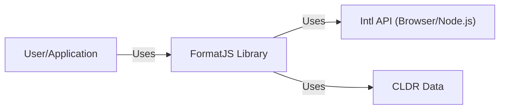
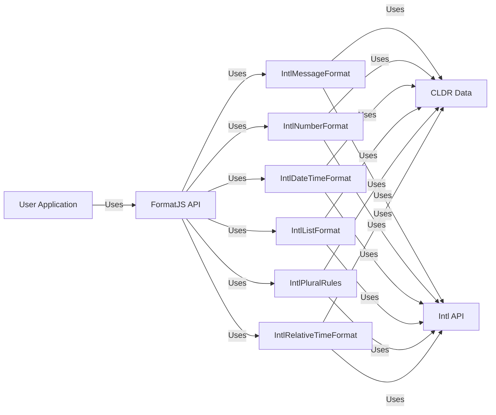
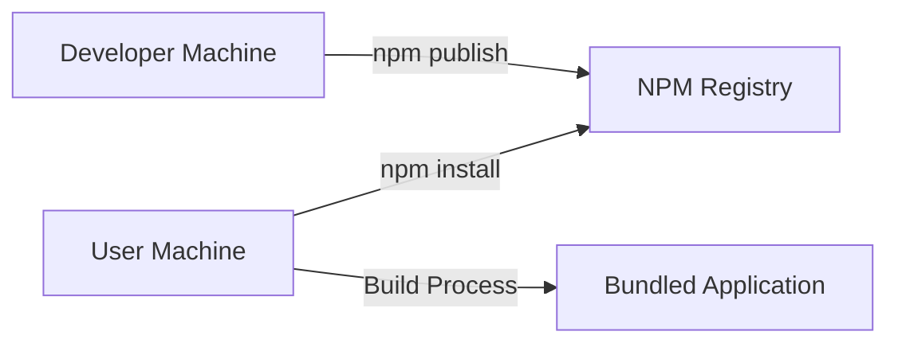
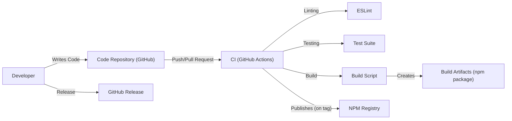

# BUSINESS POSTURE

Business Priorities and Goals:

*   Provide a comprehensive, modular collection of JavaScript libraries for internationalization (i18n).
*   Offer a robust and flexible solution for formatting dates, numbers, and messages, supporting a wide range of locales.
*   Ensure ease of use and integration with various JavaScript frameworks and build systems.
*   Maintain high performance and small bundle sizes to minimize impact on application load times.
*   Foster a strong community and ecosystem around the project.
*   Provide high quality, well-tested, and reliable library.

Business Risks:

*   Data integrity: Incorrect formatting of dates, numbers, or messages could lead to misinterpretation of data, potentially causing financial or operational errors.
*   Reputational damage: Bugs or vulnerabilities in the library could affect applications using it, leading to negative user experiences and damage to the reputation of both the library and the applications using it.
*   Compliance issues: Failure to properly handle locale-specific data formats could lead to non-compliance with regional regulations or standards.
*   Availability: Issues with library availability (e.g., CDN outages, build failures) could disrupt applications relying on it.
*   Maintainability: Lack of proper documentation, testing, or modular design could make it difficult to maintain and update the library, leading to technical debt.

# SECURITY POSTURE

Existing Security Controls:

*   security control: Regular dependency updates: The project uses Dependabot to keep dependencies up-to-date, mitigating known vulnerabilities in third-party libraries. (Visible in GitHub repository configuration)
*   security control: Code linting: ESLint is used to enforce code style and identify potential issues. (Visible in .eslintrc.js configuration)
*   security control: Testing: Extensive test suites are implemented to ensure code correctness and prevent regressions. (Visible in the `packages/*/tests` directories)
*   security control: Continuous Integration (CI): GitHub Actions are used to automate testing and linting on every push and pull request. (Visible in .github/workflows directory)
*   security control: Security Policy: Project provide security policy and contact information in case security issue is found. (Visible in SECURITY.md)

Accepted Risks:

*   accepted risk: The library relies on external data sources (e.g., CLDR, Intl API) for locale-specific information. While efforts are made to validate this data, there's an inherent risk of inaccuracies or inconsistencies in these external sources.
*   accepted risk: The library's primary focus is on formatting, not data validation or sanitization. It's assumed that input data is already validated and sanitized before being passed to the library.

Recommended Security Controls:

*   security control: Content Security Policy (CSP): If the library is used in a web context, implementing a CSP can help mitigate XSS vulnerabilities.
*   security control: Subresource Integrity (SRI): If distributing the library via a CDN, using SRI can ensure that the fetched resources haven't been tampered with.
*   security control: Static Application Security Testing (SAST): Integrate SAST tools into the CI pipeline to automatically scan for potential security vulnerabilities in the codebase.
*   security control: Software Composition Analysis (SCA): Use SCA tools to identify and track all third-party components, including their licenses and known vulnerabilities, going beyond basic dependency updates.

Security Requirements:

*   Authentication: Not directly applicable, as the library itself doesn't handle authentication.
*   Authorization: Not directly applicable, as the library itself doesn't handle authorization.
*   Input Validation:
    *   The library should handle invalid or unexpected input gracefully, without crashing or throwing unhandled exceptions.
    *   While the library isn't responsible for full data validation, it should perform basic type checking and range checks on input parameters to prevent unexpected behavior.
*   Cryptography: Not directly applicable, as the library's primary function is formatting, not encryption or secure communication. However, if any cryptographic operations are added in the future (e.g., for secure localization data transmission), they must use well-established and up-to-date cryptographic libraries and algorithms.
*   Output Encoding:
    *   If the library is used to generate HTML or other markup, proper output encoding must be used to prevent XSS vulnerabilities. This is primarily the responsibility of the application using the library, but the library should provide clear guidance and examples on safe usage.

# DESIGN

## C4 CONTEXT

Element Descriptions:

*   Element:
    *   Name: User/Application
    *   Type: User/External System
    *   Description: A user interacting with an application that utilizes the FormatJS library, or the application itself.
    *   Responsibilities: Provides input data to be formatted, consumes the formatted output.
    *   Security controls: Input validation, output encoding, secure coding practices.

*   Element:
    *   Name: FormatJS
    *   Type: Project
    *   Description: The FormatJS internationalization library.
    *   Responsibilities: Provides APIs for formatting dates, numbers, and messages according to locale-specific rules.
    *   Security controls: Regular dependency updates, code linting, testing, CI, security policy.

*   Element:
    *   Name: Intl API (Browser/Node.js)
    *   Type: External System
    *   Description: The built-in Internationalization API provided by the JavaScript runtime environment (browser or Node.js).
    *   Responsibilities: Provides low-level internationalization functionalities.
    *   Security controls: Managed by the browser/Node.js vendor, assumed to be secure.

*   Element:
    *   Name: CLDR Data
    *   Type: External Data Source
    *   Description: The Unicode Common Locale Data Repository (CLDR), providing locale-specific data.
    *   Responsibilities: Supplies data for formatting rules, translations, etc.
    *   Security controls: Data integrity checks (to the extent possible), reliance on trusted sources.

## C4 CONTAINER

Element Descriptions:

*   Element:
    *   Name: User Application
    *   Type: External System
    *   Description: An application that uses the FormatJS library.
    *   Responsibilities: Integrates and utilizes the FormatJS API.
    *   Security controls: Input validation, output encoding, secure coding practices.

*   Element:
    *   Name: FormatJS API
    *   Type: Container
    *   Description: The top-level API of the FormatJS library, providing a unified interface for accessing different formatting functionalities.
    *   Responsibilities: Exposes functions and classes for formatting.
    *   Security controls: Input validation (basic type checking).

*   Element:
    *   Name: IntlMessageFormat, IntlNumberFormat, IntlDateTimeFormat, IntlListFormat, IntlPluralRules, IntlRelativeTimeFormat
    *   Type: Container
    *   Description: Individual modules within FormatJS, each responsible for a specific type of formatting (messages, numbers, dates/times, lists, plurals, relative time).
    *   Responsibilities: Implements the formatting logic for their respective domains.
    *   Security controls: Input validation (basic type checking), reliance on Intl API and CLDR data.

*   Element:
    *   Name: CLDR Data
    *   Type: External Data Source
    *   Description: Locale data from the Unicode Common Locale Data Repository.
    *   Responsibilities: Provides the data needed for locale-aware formatting.
    *   Security controls: Data integrity checks (to the extent possible).

*   Element:
    *   Name: Intl API
    *   Type: External System
    *   Description: The built-in JavaScript Internationalization API.
    *   Responsibilities: Provides underlying formatting capabilities.
    *   Security controls: Managed by the browser/Node.js vendor.

## DEPLOYMENT

Possible Deployment Solutions:

1.  CDN (e.g., unpkg, jsDelivr):  Users can include FormatJS directly in their web pages via `<script>` tags.
2.  NPM Package: Users can install FormatJS as a dependency in their Node.js or browser-based projects using `npm` or `yarn`.
3.  Bundled with Application: FormatJS can be bundled directly into an application's JavaScript code using a bundler like Webpack, Rollup, or Parcel.

Chosen Solution (NPM Package):

Element Descriptions:

*   Element:
    *   Name: Developer Machine
    *   Type: Infrastructure
    *   Description: The machine where FormatJS developers write and build the library.
    *   Responsibilities: Code development, testing, building, publishing.
    *   Security controls: Secure coding practices, access controls, code signing (optional).

*   Element:
    *   Name: NPM Registry
    *   Type: External System
    *   Description: The public npm registry, where FormatJS packages are hosted.
    *   Responsibilities: Stores and serves npm packages.
    *   Security controls: Managed by npm, Inc., includes security measures like two-factor authentication for publishers.

*   Element:
    *   Name: User Machine
    *   Type: Infrastructure
    *   Description: The machine where a user installs and uses FormatJS.
    *   Responsibilities: Installs FormatJS, builds the application using it.
    *   Security controls: Secure coding practices, dependency management.

*   Element:
    *   Name: Bundled Application
    *   Type: Application
    *   Description: The final application built by the user, including the integrated FormatJS library.
    *   Responsibilities: Runs the application logic, including internationalization.
    *   Security controls: Application-level security controls (e.g., CSP, input validation).

## BUILD

Element Descriptions:

*   Developer: Writes code and initiates the build process.
*   Code Repository (GitHub): Stores the source code and triggers CI workflows.
*   CI (GitHub Actions): Automates the build, test, and linting processes.
*   ESLint: Performs static code analysis to enforce code style and identify potential issues.
*   Test Suite: Runs unit and integration tests to ensure code correctness.
*   Build Script: Executes the build process, creating the npm package.
*   Build Artifacts (npm package): The distributable package containing the compiled FormatJS library.
*   NPM Registry: The public registry where the npm package is published.
*   GitHub Release: Used to manage releases and versioning.

Security Controls in Build Process:

*   Code Review: Pull requests are reviewed before merging, ensuring code quality and security.
*   Automated Testing: The CI pipeline runs comprehensive tests on every push and pull request.
*   Linting: ESLint helps identify potential code quality and security issues.
*   Dependency Management: Dependabot keeps dependencies up-to-date, mitigating known vulnerabilities.
*   Secure Publishing: Publishing to npm requires authentication, and two-factor authentication is recommended.

# RISK ASSESSMENT

Critical Business Processes:

*   Accurate and consistent internationalization of applications.
*   Maintaining the reputation and trust of the FormatJS library and its users.
*   Ensuring the availability and reliability of the library.

Data to Protect and Sensitivity:

*   Source Code: Medium sensitivity. The source code is publicly available, but unauthorized modifications could introduce vulnerabilities.
*   CLDR Data: Low sensitivity. This data is publicly available and standardized.
*   User-Provided Data (to be formatted): Variable sensitivity. The library itself doesn't store or transmit user data, but the applications using it might handle sensitive data. The library must handle this data correctly without introducing vulnerabilities.
*   NPM Credentials: High sensitivity. Compromise of these credentials could allow attackers to publish malicious versions of the library.

# QUESTIONS & ASSUMPTIONS

Questions:

*   Are there any specific compliance requirements (e.g., GDPR, CCPA) that the library needs to consider, even indirectly?
*   Are there any plans to introduce features that might involve handling sensitive data (e.g., user preferences, localized content storage)?
*   What is the process for handling security vulnerabilities reported by external researchers?
*   Is there a plan for long-term support (LTS) and maintenance of the library?

Assumptions:

*   BUSINESS POSTURE: The primary goal is to provide a reliable and high-quality internationalization library.  Profitability is not a direct concern, as it's an open-source project.
*   SECURITY POSTURE: The project follows best practices for open-source development, including regular dependency updates and CI.  A moderate level of security risk is acceptable, given the nature of the library and its open-source nature.
*   DESIGN: The library is designed to be modular and extensible. The use of the Intl API is a core design decision. The primary deployment method is via npm.