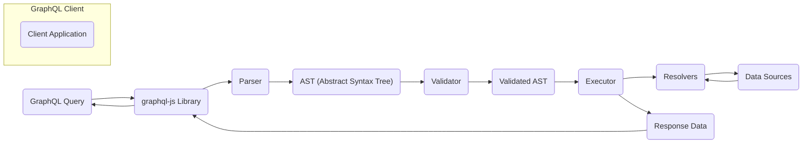
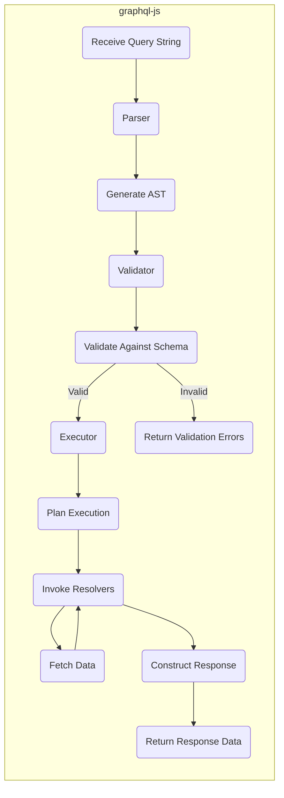

# Project Design Document: graphql-js

**Version:** 1.1
**Date:** October 26, 2023
**Author:** AI Software Architect

## 1. Introduction

This document provides an enhanced and detailed design overview of the `graphql-js` project, the JavaScript reference implementation of the GraphQL specification. This document is intended to serve as a robust foundation for subsequent threat modeling activities. It clearly outlines the key architectural components, the step-by-step data flow, and crucial deployment considerations of `graphql-js`.

## 2. Project Overview

`graphql-js` is a foundational JavaScript library that provides the essential building blocks for implementing GraphQL servers. It encompasses functionalities for:

*   Parsing GraphQL query, mutation, and subscription strings.
*   Defining and validating GraphQL schemas.
*   Executing GraphQL operations against provided data resolvers.

This library is a cornerstone of the JavaScript GraphQL ecosystem, utilized by numerous popular server frameworks and tools.

## 3. Goals

*   Present a clear and comprehensive architectural overview of `graphql-js`.
*   Precisely identify key components and elucidate their interactions.
*   Describe the data flow within the library in a detailed, step-by-step manner.
*   Highlight specific areas of security concern to facilitate effective threat modeling.

## 4. Target Audience

This document is intended for a technical audience, including:

*   Security engineers and architects tasked with performing threat modeling.
*   Software developers actively working with or extending the `graphql-js` library.
*   DevOps engineers responsible for the deployment and maintenance of applications utilizing `graphql-js`.

## 5. Architectural Overview

`graphql-js` is structured as a modular library, with distinct components handling different phases of the GraphQL request lifecycle. The core of its architecture is the processing of a GraphQL operation against a well-defined schema.

### 5.1. High-Level Architecture



*   **Client Application:** The software application initiating the GraphQL request to retrieve or manipulate data.
*   **GraphQL Query:** The string containing the GraphQL operation (query, mutation, or subscription) formulated by the client.
*   **`graphql-js` Library:** The central library responsible for the entire process of interpreting and executing the GraphQL request.
*   **Parser:** This component takes the raw GraphQL query string as input and transforms it into a structured representation.
*   **AST (Abstract Syntax Tree):** A hierarchical tree structure representing the syntactic structure of the GraphQL query.
*   **Validator:** This component checks the AST against the defined GraphQL schema to ensure the query is semantically correct and adheres to the schema's rules.
*   **Validated AST:** The AST after it has successfully passed all validation checks.
*   **Executor:** This component takes the validated AST and orchestrates the process of fetching the requested data.
*   **Resolvers:** These are functions you define that are responsible for fetching the actual data for specific fields in your GraphQL schema.
*   **Data Sources:** The underlying systems (databases, APIs, caches, etc.) where the resolvers retrieve the data from.
*   **Response Data:** The data returned by the resolvers, formatted according to the structure specified in the original GraphQL query.

### 5.2. Key Components

*   **Parser (`graphql/language/parser.js`):**
    *   **Functionality:** Takes the raw GraphQL query string as input and uses lexical analysis and parsing techniques to create an Abstract Syntax Tree (AST).
    *   **Responsibility:**  Identifies the syntactic elements of the query and reports any syntax errors.
*   **AST (Abstract Syntax Tree) (`graphql/language/ast.js`):**
    *   **Functionality:** Represents the GraphQL query's structure in a tree-like format.
    *   **Representation:** Each node in the tree corresponds to a specific part of the query, such as selections, fields, and arguments.
*   **Schema Definition (`graphql/type`):**
    *   **Functionality:** Defines the structure and types of data available through the GraphQL API.
    *   **Construction:** Built using classes like `GraphQLSchema`, `GraphQLObjectType`, and `GraphQLString` to define types, fields, and their relationships.
*   **Validator (`graphql/validation`):**
    *   **Functionality:** Takes the AST and the GraphQL schema as input and enforces the rules defined in the GraphQL specification.
    *   **Checks Performed:**
        *   Verifies that requested fields exist on the specified types.
        *   Ensures that argument types and values are correct.
        *   Validates the proper usage of fragments.
    *   **Output:** Reports any validation errors found in the query.
*   **Executor (`graphql/execution`):**
    *   **Functionality:** Takes the validated AST, the GraphQL schema, and a map of resolver functions as input and orchestrates the execution of the query.
    *   **Process:**
        *   Traverses the AST.
        *   Calls the corresponding resolver functions for each field in the query.
        *   Manages the order of execution, including handling asynchronous operations.
        *   Collects the results from the resolvers.
        *   Formats the results into the final GraphQL response.
*   **Type System (`graphql/type`):**
    *   **Functionality:** Provides the fundamental building blocks for defining GraphQL schemas and ensuring type safety.
    *   **Components:** Includes classes for defining various types:
        *   Object types (`GraphQLObjectType`)
        *   Interfaces (`GraphQLInterfaceType`)
        *   Unions (`GraphQLUnionType`)
        *   Enums (`GraphQLEnumType`)
        *   Scalar types (`GraphQLString`, `GraphQLInt`, etc.)
        *   Input types (`GraphQLInputObjectType`)
*   **Language Utilities (`graphql/language`):**
    *   **Functionality:** Offers utility functions for working with the GraphQL language.
    *   **Examples:** Printing ASTs to a string, locating the source position of elements in the query.
*   **Error Handling (`graphql/error`):**
    *   **Functionality:** Defines classes for representing different types of errors that can occur during the GraphQL request lifecycle.
    *   **Types:** Includes classes for validation errors and execution errors.

## 6. Data Flow

The journey of a GraphQL request processed by `graphql-js` involves the following steps:

1. **Receive GraphQL Query String:** The `graphql-js` library receives the raw GraphQL query string from the client.
2. **Parsing into AST:** The `Parser` component analyzes the query string and transforms it into an Abstract Syntax Tree (AST), representing the query's structure.
3. **Validation Against Schema:** The `Validator` component takes the generated AST and the defined GraphQL schema as input. It then checks if the query is valid according to the schema's rules and the GraphQL specification.
4. **Execution Planning:** If the query is valid, the `Executor` component analyzes the validated AST to determine the optimal order for executing the resolvers.
5. **Resolver Invocation:** The `Executor` invokes the appropriate resolver functions based on the fields specified in the query. Each resolver is responsible for fetching data for its corresponding field.
6. **Data Retrieval:** The invoked resolvers interact with various data sources (databases, APIs, etc.) to retrieve the requested data.
7. **Response Construction:** The `Executor` gathers the data returned by the resolvers and structures it into a JSON response that conforms to the format expected by the GraphQL specification.
8. **Return Response Data:** The `graphql-js` library sends the constructed JSON response back to the client.



## 7. Deployment Considerations

`graphql-js`, being a JavaScript library, is typically deployed within a Node.js environment. Common deployment scenarios include:

*   **Standalone GraphQL Server:** Utilizing frameworks like Express.js or Koa.js to build a dedicated GraphQL server powered by `graphql-js`.
*   **Backend for Frontend (BFF) Layer:** Integrating `graphql-js` into a BFF layer to aggregate data from multiple backend services and tailor the API for specific client needs.
*   **Serverless Functions:** Deploying GraphQL endpoints as serverless functions (e.g., AWS Lambda, Google Cloud Functions) using `graphql-js` for request processing.

Key security considerations during deployment include:

*   **Dependency Management:** Regularly updating `graphql-js` and its dependencies to patch known security vulnerabilities.
*   **Resource Limits:** Implementing mechanisms to prevent denial-of-service attacks by:
    *   Limiting the maximum depth and complexity of queries.
    *   Setting timeouts for query execution.
*   **Rate Limiting:** Protecting the GraphQL endpoint from abuse by limiting the number of requests from a single client within a specific timeframe.
*   **Input Validation:** While `graphql-js` performs schema validation, implementing additional input validation within resolvers can provide an extra layer of security.
*   **Error Handling:**  Carefully handling and logging errors to prevent the leakage of sensitive information through error messages. Avoid providing overly detailed internal error information to clients.

## 8. Security Considerations for Threat Modeling

Based on the architecture and data flow, the following areas present potential security concerns that should be considered during threat modeling:

*   **Query Complexity Attacks:**
    *   **Nested Queries:** Attackers can craft deeply nested queries that require significant server resources to resolve, potentially leading to denial of service.
    *   **Excessive Aliasing:** Using a large number of aliases in a query can inflate the response size, consuming bandwidth and server resources.
    *   **Introspection Abuse:** While useful for development, enabling introspection in production environments can expose the entire schema to attackers, revealing potential vulnerabilities and data structures.
*   **Injection Attacks:**
    *   **GraphQL Injection:** Although less prevalent than SQL injection, vulnerabilities in custom resolvers or dynamic schema generation could allow attackers to inject malicious code or queries.
*   **Denial of Service (DoS):**
    *   **Maliciously Crafted Queries:** Attackers can design queries specifically to overwhelm the server's processing capabilities.
    *   **Resource Exhaustion through Resolvers:** Exploiting resolvers that perform computationally expensive operations or access slow data sources can lead to resource exhaustion.
*   **Authorization and Authentication Issues:**
    *   **Schema Design Flaws:** Incorrectly designed schemas might inadvertently expose sensitive data that should be protected.
    *   **Insecure Resolvers:** Lack of proper authorization checks within resolver functions can allow unauthorized access to data.
*   **Data Exposure Risks:**
    *   **Over-fetching (Mitigated but still a concern):** While GraphQL aims to prevent over-fetching, poorly designed schemas or resolvers might still expose more data than necessary.
    *   **Information Leakage through Errors:** Verbose or improperly handled error messages can leak sensitive information about the application's internal workings or data structures.
*   **Dependency Vulnerabilities:**
    *   Exploiting known vulnerabilities in `graphql-js` itself or its underlying dependencies. Regularly scanning and updating dependencies is crucial.
*   **Server-Side Request Forgery (SSRF):**
    *   If resolvers make external API calls based on user-provided input, they could be vulnerable to SSRF attacks if proper validation and sanitization are not implemented.

## 9. Diagrams

### 9.1. High-Level Architecture Diagram (Improved)

```mermaid
graph LR
    subgraph "GraphQL Client"
        "Client Application"
    end
    "GraphQL Query" --> "graphql-js Library";
    "graphql-js Library" --> "Parser";
    "Parser" --> "AST (Abstract Syntax Tree)";
    "AST (Abstract Syntax Tree)" --> "Validator";
    "Validator" --> "Validated AST";
    "Validated AST" --> "Executor";
    "Executor" --> "Resolvers";
    "Resolvers" --> "Data Sources";
    "Data Sources" --> "Resolvers";
    "Executor" --> "Response Data";
    "Response Data" --> "graphql-js Library";
    "graphql-js Library" --> "GraphQL Query";
```

### 9.2. Data Flow Diagram (Improved)

```mermaid
graph LR
    subgraph "graphql-js"
        "Receive Query String" --> "Parser";
        "Parser" --> "Generate AST";
        "Generate AST" --> "Validator";
        "Validator" --> "Validate Against Schema";
        "Validate Against Schema" -- "Valid" --> "Executor";
        "Validate Against Schema" -- "Invalid" --> "Return Validation Errors";
        "Executor" --> "Plan Execution";
        "Plan Execution" --> "Invoke Resolvers";
        "Invoke Resolvers" --> "Fetch Data";
        "Fetch Data" --> "Invoke Resolvers";
        "Invoke Resolvers" --> "Construct Response";
        "Construct Response" --> "Return Response Data";
    end
```

## 10. Conclusion

This enhanced document provides a more detailed and clearer design overview of the `graphql-js` project. By elaborating on the key components, providing a step-by-step description of the data flow, and highlighting specific security considerations, this document aims to be a valuable resource for threat modeling activities. A thorough understanding of the architecture and potential vulnerabilities is essential for building secure and robust GraphQL APIs using `graphql-js`. This document serves as a solid foundation for identifying and mitigating potential security risks associated with this widely used library.
