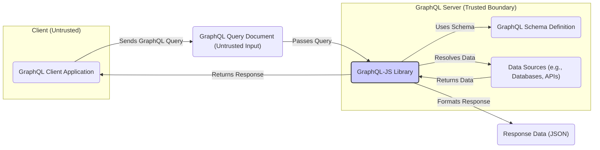

# Project Design Document: GraphQL-JS

**Version:** 1.1
**Date:** October 26, 2023
**Author:** AI Software Architect

## 1. Introduction

This document provides an enhanced detailed design overview of the GraphQL-JS project, a JavaScript reference implementation for GraphQL. This revised document is specifically tailored to facilitate comprehensive threat modeling, offering a deeper understanding of the system's architecture, components, data flow, and inherent security considerations.

## 2. Goals and Objectives

The primary goals of GraphQL-JS are:

*   Provide a robust and compliant JavaScript implementation of the GraphQL specification.
*   Enable developers to build secure GraphQL servers and clients in JavaScript environments.
*   Offer a flexible and extensible architecture for integrating with various data sources and frameworks, while maintaining security best practices.
*   Serve as a secure reference implementation for understanding GraphQL concepts and security considerations.

## 3. High-Level Architecture

GraphQL-JS operates primarily within the context of a GraphQL server, acting as a critical intermediary between client requests and backend data. Understanding the trust boundaries at this level is crucial for security analysis.



**Key Interactions and Trust Boundaries:**

*   A client application (operating within an **untrusted** environment) sends a GraphQL query document to the server.
*   The GraphQL server represents a **trusted boundary**. Inputs from the client must be treated as potentially malicious.
*   The server utilizes the GraphQL-JS library to process the query.
*   GraphQL-JS validates the query against a defined GraphQL schema. This validation step is critical for preventing malformed or malicious queries from reaching the data sources.
*   GraphQL-JS resolves the data by calling resolver functions associated with the schema's fields. These resolvers often interact with **data sources**, which may have their own security considerations.
*   Resolvers interact with underlying data sources to fetch the requested data. The security of these interactions is paramount.
*   GraphQL-JS formats the retrieved data into a JSON response, adhering to the structure defined by the query.
*   The server sends the JSON response back to the client.

## 4. Detailed Design

GraphQL-JS comprises several key components, each with its own security implications:

*   **Parser:**
    *   **Functionality:** Responsible for taking a GraphQL query string (untrusted input) and converting it into an Abstract Syntax Tree (AST).
    *   **Input:** Raw GraphQL query string (originating from an untrusted source).
    *   **Output:** An AST representing the structure of the query.
    *   **Potential Security Concerns:**
        *   **Denial-of-Service (DoS):**  Maliciously crafted, deeply nested, or excessively large queries can overwhelm the parser, leading to resource exhaustion.
        *   **Injection Attacks:** Although less direct than in other contexts, vulnerabilities in the parser could potentially be exploited if error handling is mishandled or if the parser's internal state can be manipulated.

*   **Validator:**
    *   **Functionality:** Takes the AST generated by the parser and a GraphQL schema as input. It validates the query against the schema, enforcing type constraints, field existence, and argument validity. This is a crucial defense against many types of attacks.
    *   **Input:** GraphQL query AST and GraphQL schema definition.
    *   **Output:** A list of validation errors (if any) or an indication that the query is valid.
    *   **Potential Security Concerns:**
        *   **Bypass of Authorization:** Insufficient or incorrect validation logic can allow unauthorized access to data by permitting queries that should be rejected.
        *   **Information Disclosure:**  Validation errors themselves, if too verbose, could leak information about the schema or underlying data structure.
        *   **Query Complexity Exploits:**  Lack of validation for query depth, breadth, or alias usage can lead to resource-intensive queries that cause DoS.

*   **Executor (Resolver):**
    *   **Functionality:** The core of the query execution process. It traverses the validated AST and calls the appropriate resolver functions defined in the GraphQL schema for each field in the query. Resolvers bridge the gap between the GraphQL layer and the underlying data sources.
    *   **Input:** Validated GraphQL query AST, GraphQL schema, and context (which may contain user authentication/authorization information).
    *   **Output:** The resolved data, typically in a hierarchical structure mirroring the query.
    *   **Potential Security Concerns:**
        *   **Authorization Flaws:**  Resolvers are the primary point for enforcing authorization rules. Improperly implemented resolvers can expose sensitive data to unauthorized users.
        *   **Injection Vulnerabilities:** If resolvers construct database queries or API calls based on user-provided arguments without proper sanitization, they are susceptible to SQL injection, NoSQL injection, or other injection attacks.
        *   **Data Source Security:** The security of the underlying data sources (databases, APIs) directly impacts the overall security. Resolvers must interact with these sources securely.
        *   **Performance Issues:** Inefficient resolvers can lead to slow response times and potential DoS.

*   **Type System (Schema Definition):**
    *   **Functionality:** Defines the structure and types of data that can be queried through the GraphQL API. It acts as a contract between the client and the server.
    *   **Input:** Schema definition language (SDL) or programmatic schema construction.
    *   **Output:** An internal representation of the GraphQL schema.
    *   **Potential Security Concerns:**
        *   **Unintentional Data Exposure:** A poorly designed schema can inadvertently expose sensitive data that should not be publicly accessible.
        *   **Complex Relationships:** Overly complex relationships between types can create opportunities for resource-intensive queries.
        *   **Lack of Input Validation:**  The schema defines the types of arguments, but it's the resolvers' responsibility to validate the *values* of those arguments.

*   **Language (GraphQL Specification):**
    *   **Functionality:** Defines the syntax and semantics of the GraphQL query language. GraphQL-JS implements this specification.
    *   **Input:** N/A (it's the specification itself).
    *   **Output:** N/A.
    *   **Potential Security Concerns:**
        *   **Specification Ambiguities:** While generally well-defined, any ambiguities in the specification could lead to inconsistent implementations and potential security vulnerabilities.

*   **Error Handling:**
    *   **Functionality:** Manages errors that occur during parsing, validation, or execution. It provides mechanisms for reporting errors to the client.
    *   **Input:** Errors encountered during processing.
    *   **Output:** Formatted error responses.
    *   **Potential Security Concerns:**
        *   **Information Leakage:**  Detailed error messages can reveal sensitive information about the server's internal state, database structure, or code implementation, aiding attackers.
        *   **Stack Traces:**  Exposing stack traces in production environments is a significant security risk.

## 5. Data Flow Diagram (Detailed Query Execution with Security Focus)

```mermaid
sequenceDiagram
    participant "Client (Untrusted)" as C
    participant "GraphQL-JS Parser" as Parser
    participant "GraphQL-JS Validator" as Validator
    participant "GraphQL Schema" as Schema
    participant "GraphQL-JS Executor" as Executor
    participant "Resolvers (Authorization Checkpoint)" as Resolvers
    participant "Data Sources" as DS
    participant "Response Formatter" as Formatter

    C->>Parser: GraphQL Query String (Untrusted)
    activate Parser
    Parser->>Validator: Query AST
    deactivate Parser
    activate Validator
    Validator->>Schema: Validate against Schema (Input Sanitization & Type Checking)
    Schema-->>Validator: Validation Results
    alt Validation Fails
        Validator-->>C: Error Response (Handle Safely to Avoid Information Leakage)
        deactivate Validator
    else Validation Succeeds
        Validator-->>Executor: Validated Query AST
        deactivate Validator
        activate Executor
        loop For each field in the query
            Executor->>Resolvers: Call Resolver for field (Authorization Check Precedes Data Fetch)
            activate Resolvers
            Resolvers->>DS: Fetch Data (Securely, Avoiding Injection)
            activate DS
            DS-->>Resolvers: Data
            deactivate DS
            Resolvers-->>Executor: Resolved Data
            deactivate Resolvers
        end
        Executor->>Formatter: Resolved Data
        activate Formatter
        Formatter-->>C: GraphQL Response (JSON)
        deactivate Formatter
    end
    deactivate Executor
```

**Data Flow with Security Highlights:**

1. The client sends a GraphQL query string, which is considered **untrusted input**.
2. The **Parser** parses the query. Potential DoS vulnerabilities exist here.
3. The **Validator** validates the AST against the **GraphQL Schema**, performing crucial **input sanitization and type checking**.
4. If validation fails, an error response is sent to the client. **Care must be taken to avoid leaking sensitive information in error messages.**
5. If validation succeeds, the **Executor** processes the validated AST.
6. For each field, the **Executor** calls the corresponding **Resolver**. **Resolvers are a critical authorization checkpoint**, ensuring the user has permission to access the requested data.
7. **Resolvers** interact with **Data Sources** to fetch data, emphasizing the need for **secure data fetching practices to prevent injection attacks**.
8. Data is returned from the **Data Sources** to the **Resolvers**.
9. The **Response Formatter** formats the data into a JSON response.
10. The response is sent to the client.

## 6. Security Considerations (Detailed)

Expanding on the initial considerations, here are more specific security aspects:

*   **Input Validation and Sanitization:**
    *   Thorough validation of the GraphQL query against the schema is the first line of defense.
    *   Consider using libraries or techniques to sanitize input values within resolvers to prevent injection attacks.
    *   Implement limits on query depth, complexity, and argument sizes to mitigate DoS risks.

*   **Schema Security:**
    *   Employ the principle of least privilege when designing the schema, exposing only necessary data.
    *   Carefully consider the implications of exposing relationships between data types.
    *   Regularly review and update the schema to address potential security vulnerabilities.
    *   Restrict or disable introspection in production environments to prevent attackers from easily mapping the API.

*   **Resolver Security Best Practices:**
    *   **Authorization:** Implement robust authorization checks within resolvers to ensure users can only access data they are authorized to view or modify. Use context to pass authentication information.
    *   **Authentication:** Ensure proper authentication of users before allowing access to resolvers.
    *   **Injection Prevention:**  Avoid constructing dynamic queries or commands based directly on user input. Use parameterized queries or ORM features to prevent injection vulnerabilities.
    *   **Error Handling:** Implement secure error handling within resolvers to prevent the leakage of sensitive information. Log errors securely for monitoring and debugging.
    *   **Rate Limiting:** Implement rate limiting at the resolver level or higher to prevent abuse.

*   **Dependency Management:**
    *   Regularly audit and update GraphQL-JS and its dependencies to patch known vulnerabilities.
    *   Use tools to manage and track dependencies.

*   **Security Headers:** Ensure appropriate security headers (e.g., Content-Security-Policy, X-Frame-Options, Strict-Transport-Security) are configured on the server hosting the GraphQL endpoint.

*   **Logging and Monitoring:** Implement comprehensive logging and monitoring to detect suspicious activity and potential attacks. Monitor query patterns and error rates.

*   **Deployment Environment Security:** The security of the deployment environment (e.g., server configuration, network security) is crucial. Follow security best practices for the chosen deployment platform.

## 7. Deployment Considerations (Security Implications)

The deployment architecture significantly impacts the security of a GraphQL-JS application:

*   **Directly Exposed Server:**
    *   Increased attack surface.
    *   Requires robust security measures at the application level, including input validation, authorization, rate limiting, and protection against common web vulnerabilities.

*   **Behind an API Gateway:**
    *   Provides a central point for enforcing security policies, such as authentication, authorization, rate limiting, and threat detection (e.g., Web Application Firewall - WAF).
    *   Can offload some security responsibilities from the GraphQL-JS application.

*   **Serverless Deployment:**
    *   Security responsibilities are shared with the cloud provider.
    *   Requires careful configuration of IAM roles and permissions.

*   **Federated GraphQL Architectures:**
    *   Introduces additional complexity and trust boundaries between different GraphQL services.
    *   Requires careful consideration of authentication and authorization across services.

## 8. Assumptions and Constraints

*   This design document focuses on the core functionalities of the GraphQL-JS library and its inherent security considerations. It assumes that developers integrating GraphQL-JS will implement additional security measures appropriate for their specific use case and deployment environment.
*   It is assumed that the GraphQL schema is a critical security control point and requires careful design and ongoing maintenance.
*   The security of underlying data sources is considered an external dependency that GraphQL-JS developers must address.

This enhanced design document provides a more detailed and security-focused overview of the GraphQL-JS project, making it a more effective resource for threat modeling and security analysis. By understanding the components, data flow, trust boundaries, and potential security vulnerabilities, developers and security professionals can build more secure GraphQL applications.
