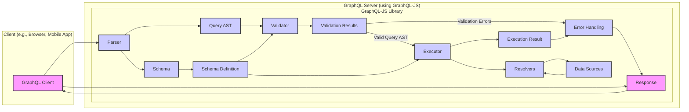

# Project Design Document: GraphQL-JS for Threat Modeling (Improved)

**Project:** GraphQL-JS

**Project Repository:** [https://github.com/graphql/graphql-js](https://github.com/graphql/graphql-js)

**Document Version:** 1.1

**Date:** October 26, 2023

**Author:** AI Software Architecture Expert

**Target Audience:** Security Engineers, Threat Modeling Team, Development Team, Security Auditors

## 1. Introduction

This document provides an enhanced design overview of the GraphQL-JS project, a foundational JavaScript library for implementing GraphQL.  It is designed to be used as the basis for a comprehensive threat modeling exercise. This document details the architecture, key components, data flow, and crucial security considerations of GraphQL-JS. The goal is to facilitate the identification, analysis, and mitigation of potential security vulnerabilities inherent in systems utilizing this library. This document will serve as the primary reference material for upcoming threat modeling sessions and security audits.

## 2. Project Overview

GraphQL-JS is a JavaScript library that serves as a reference implementation of the GraphQL specification. It provides the essential tools and logic for building GraphQL servers and clients within JavaScript environments, primarily Node.js and web browsers.  It is important to note that GraphQL-JS is **not a standalone server application**, but rather a library that empowers developers to create GraphQL functionality.  Key capabilities include:

*   **GraphQL Parsing:**  Converting GraphQL query and schema strings into Abstract Syntax Trees (ASTs).
*   **Schema Handling:** Defining, parsing, and validating GraphQL schemas.
*   **Query Validation:** Ensuring GraphQL queries are syntactically correct and conform to the defined schema.
*   **Query Execution:** Resolving GraphQL queries against a schema and provided data resolvers to fetch and return data.
*   **Schema Construction:** Programmatically building GraphQL schemas using JavaScript APIs.
*   **GraphQL Introspection Support:** Providing mechanisms for schema introspection, allowing clients to query the schema structure.

GraphQL-JS is a widely adopted library, forming the core of numerous popular GraphQL server frameworks and tools in the JavaScript ecosystem.  Therefore, a thorough understanding of its architecture and potential security vulnerabilities is paramount for securing applications built upon it.

## 3. System Architecture

The following diagram illustrates the high-level architecture of a typical GraphQL server system leveraging the GraphQL-JS library. It focuses on the internal components of GraphQL-JS and their interactions during a standard GraphQL request lifecycle.  External components like data sources and clients are shown to provide context.

## 4. Component Description

This section provides a detailed description of each component within the GraphQL-JS library, as illustrated in the architecture diagram. For each component, we will also highlight primary security concerns relevant for threat modeling.

*   **"Parser"**:
    *   **Functionality:**  Takes a GraphQL query string as input and transforms it into an Abstract Syntax Tree (AST). The AST is a structured, hierarchical representation of the query, facilitating further processing.
    *   **Input:** GraphQL query string (from client).
    *   **Output:** Query AST.
    *   **Primary Security Concerns:**
        *   **Denial of Service (DoS):**  Handling excessively complex or deeply nested queries that could consume excessive parsing resources, leading to DoS.
        *   **Input Injection (Indirect):** While the GraphQL-JS parser itself is robust against typical injection vectors *within* the GraphQL language, vulnerabilities in the *surrounding server code* that handles the raw query string before parsing could lead to injection issues.

*   **"Schema"**:
    *   **Functionality:**  Represents the GraphQL schema, defining the API's data structure, available queries, mutations, and subscriptions. Schemas are typically defined using GraphQL Schema Definition Language (SDL) or programmatically via GraphQL-JS APIs.
    *   **Input:** Schema Definition Language (SDL) string or programmatic schema definition.
    *   **Output:** Schema Definition object.
    *   **Primary Security Concerns:**
        *   **Information Disclosure:** Overly permissive schemas can inadvertently expose sensitive data or internal system details.
        *   **Introspection Abuse:**  Introspection queries against the schema can reveal the entire API structure, potentially aiding attackers in reconnaissance.
        *   **Authorization Bypass (Schema Level):**  Incorrectly defined schema directives or type definitions might unintentionally bypass intended authorization controls.

*   **"Schema Definition"**:
    *   **Functionality:**  The internal, structured representation of the GraphQL schema after parsing and processing. It contains all type definitions, directives, resolvers, and other schema-related metadata.
    *   **Input:** Output from the "Schema" component.
    *   **Output:** Structured schema definition object.
    *   **Primary Security Concerns:**
        *   **Schema Tampering:** If the schema definition is compromised or modified maliciously, it could lead to unexpected behavior, data corruption, or security vulnerabilities.
        *   **Integrity Issues:**  Ensuring the schema definition accurately reflects the intended API structure and security policies is crucial.

*   **"Query AST"**:
    *   **Functionality:**  The Abstract Syntax Tree representation of the parsed GraphQL query. This intermediate data structure is used by the validator and executor for subsequent processing.
    *   **Input:** Output from the "Parser" component.
    *   **Output:** Structured AST object representing the query.
    *   **Primary Security Concerns:**
        *   **AST Manipulation Vulnerabilities:**  Although less common, vulnerabilities in the validator or executor's handling of specific AST structures could potentially be exploited.
        *   **Complexity Exploitation:**  Maliciously crafted ASTs, even if syntactically valid, could be designed to overwhelm the validator or executor.

*   **"Validator"**:
    *   **Functionality:**  Takes the Query AST and the Schema Definition as input and validates the query against the schema. It checks for syntax correctness, semantic validity (e.g., field existence, argument types), and potentially custom validation rules.
    *   **Input:** Query AST, Schema Definition.
    *   **Output:** Validation Results (either "Valid Query AST" or "Validation Errors").
    *   **Primary Security Concerns:**
        *   **Validation Bypass:**  Flaws or loopholes in the validation logic could allow invalid or malicious queries to pass through, bypassing intended security checks.
        *   **Injection Vulnerabilities (Indirect):**  If validation logic is not robust, it might fail to detect certain types of injection attempts embedded within the query structure.
        *   **Denial of Service (DoS):**  Complex validation rules or inefficient validation algorithms could be exploited to cause DoS.

*   **"Validation Results"**:
    *   **Functionality:**  Indicates the outcome of the validation process. If validation fails, it contains a list of specific validation errors.
    *   **Input:** Output from the "Validator" component.
    *   **Output:** Boolean (valid/invalid) and potentially a list of error messages.
    *   **Primary Security Concerns:**
        *   **Information Leakage (Error Messages):**  Verbose or overly detailed validation error messages could inadvertently leak sensitive information about the schema or internal API structure to attackers.

*   **"Executor"**:
    *   **Functionality:**  Takes a valid Query AST, the Schema Definition, and Resolvers as input and executes the GraphQL query. It traverses the AST, invokes the appropriate resolvers for each field, and retrieves data from data sources.
    *   **Input:** Valid Query AST, Schema Definition, Resolvers.
    *   **Output:** Execution Result (data and/or errors).
    *   **Primary Security Concerns:**
        *   **Authorization Enforcement:**  Ensuring proper authorization checks are performed *during execution*, often within resolvers, to control data access and prevent unauthorized operations.
        *   **Resolver Vulnerabilities:**  Vulnerabilities within resolvers (e.g., SQL injection, NoSQL injection, command injection, insecure API calls, insufficient authorization checks) are a major security concern.
        *   **Denial of Service (DoS):**  Inefficient or resource-intensive resolvers can be exploited to cause DoS.
        *   **Data Leakage (Resolver Logic):**  Poorly written resolvers might inadvertently expose more data than intended or fail to properly sanitize output.

*   **"Resolvers"**:
    *   **Functionality:**  Functions associated with each field in the GraphQL schema. They are responsible for fetching the data for that field, often by interacting with backend data sources. Resolvers are the bridge between the GraphQL API and the underlying data layer.
    *   **Input:** Arguments from the GraphQL query, context (user information, etc.), field information.
    *   **Output:** Data for the requested field.
    *   **Primary Security Concerns:**
        *   **Injection Attacks (SQL, NoSQL, Command):**  Resolvers that directly construct database queries or system commands based on user-provided input are highly vulnerable to injection attacks.
        *   **Authorization Flaws:**  Insufficient or incorrect authorization checks within resolvers can lead to unauthorized data access or modification.
        *   **Performance Issues:**  Slow or inefficient resolvers can degrade performance and contribute to DoS vulnerabilities.
        *   **Data Validation and Sanitization:**  Resolvers should validate and sanitize data retrieved from data sources before returning it to the client to prevent data integrity issues or cross-site scripting (XSS) vulnerabilities in clients.

*   **"Data Sources"**:
    *   **Functionality:**  External systems where data is stored and retrieved from (e.g., databases, REST APIs, microservices, file systems). GraphQL-JS interacts with data sources indirectly through resolvers.
    *   **Input:** Requests from Resolvers.
    *   **Output:** Data requested by Resolvers.
    *   **Primary Security Concerns:**
        *   **Data Source Security:**  The security of the underlying data sources is paramount. GraphQL-JS relies on resolvers to interact securely with these sources.
        *   **Access Control:**  Ensuring that resolvers only access data sources with appropriate credentials and permissions is crucial.
        *   **Data Integrity:**  Protecting data sources from unauthorized modification or deletion is essential.

*   **"Execution Result"**:
    *   **Functionality:**  The outcome of the query execution process. It contains the requested data and any errors encountered during execution.
    *   **Input:** Output from the "Executor" component.
    *   **Output:** Structured data response and/or error information.
    *   **Primary Security Concerns:**
        *   **Error Handling and Information Disclosure:**  Execution errors should be handled gracefully and securely to avoid leaking sensitive information through error messages.
        *   **Data Sanitization:**  Ensuring that data in the execution result is properly sanitized and formatted to prevent client-side vulnerabilities.

*   **"Error Handling"**:
    *   **Functionality:**  Manages errors that occur during parsing, validation, or execution. It formats errors into a standard GraphQL error response structure, which is then sent back to the client.
    *   **Input:** Validation Errors, Execution Errors.
    *   **Output:** GraphQL error response.
    *   **Primary Security Concerns:**
        *   **Information Leakage (Error Responses):**  Overly detailed error responses can reveal sensitive information about the schema, internal application logic, or data. Error messages should be generic and safe for production environments.
        *   **Error Logging Security:**  Ensuring error logs do not contain sensitive data and are stored securely.

*   **"Response"**:
    *   **Functionality:**  The final GraphQL response sent to the client. It contains either the execution result (data) or error information in JSON format, adhering to the GraphQL specification.
    *   **Input:** Execution Result or Error Handling output.
    *   **Output:** GraphQL response (JSON format).
    *   **Primary Security Concerns:**
        *   **Data Exposure:**  Ensuring the response only contains data the client is authorized to access and that no unauthorized data is included.
        *   **Response Manipulation:**  Protecting the response from tampering or modification during transmission.

## 5. Data Flow

The typical data flow for processing a GraphQL query using GraphQL-JS is as follows:

1.  **Client Request:** A client application sends a GraphQL query string to the GraphQL server.
2.  **Parsing:** The **"Parser"** component within GraphQL-JS receives the query string.
3.  **AST Generation:** The **"Parser"** converts the query string into a **"Query AST"**.
4.  **Schema Loading:** The **"Schema"** component loads or constructs the **"Schema Definition"**.
5.  **Validation:** The **"Validator"** component takes the **"Query AST"** and **"Schema Definition"** and performs validation checks to ensure the query is valid against the schema.
6.  **Validation Outcome:** **"Validation Results"** are generated.
    *   **Validation Failure:** If validation fails, **"Validation Errors"** are passed to the **"Error Handling"** component.
    *   **Validation Success:** If validation succeeds, the **"Valid Query AST"** is passed to the **"Executor"** component.
7.  **Execution:** The **"Executor"** component receives the **"Valid Query AST"**, **"Schema Definition"**, and **"Resolvers"**.
8.  **Resolver Invocation:** The **"Executor"** traverses the AST and invokes the appropriate **"Resolvers"** for each field in the query.
9.  **Data Retrieval:** **"Resolvers"** interact with **"Data Sources"** to fetch the requested data.
10. **Result Construction:** The **"Executor"** constructs the **"Execution Result"** based on the data retrieved by resolvers.
11. **Response Preparation:** The **"Execution Result"** is used to form the final **"Response"**.  Execution errors are also handled by the **"Error Handling"** component at this stage.
12. **Error Formatting:** **"Error Handling"** formats any errors into a GraphQL error response structure.
13. **Client Response:** The **"Response"** (containing either data or errors) is sent back to the **"Client"**.

## 6. Technology Stack

*   **Programming Language:** JavaScript (ES6+ compliant)
*   **Runtime Environment:** Primarily Node.js, but also designed for compatibility with browser environments and other JavaScript runtimes.
*   **GraphQL Specification Compliance:** Implements the GraphQL specification (adhering to the latest version at the time of development and updates).
*   **Minimal External Dependencies:**  GraphQL-JS is designed with minimal external dependencies, focusing on core JavaScript functionalities to reduce the attack surface and dependency management overhead. (Refer to the `package.json` file in the official GitHub repository for a definitive and up-to-date list of dependencies).

## 7. Security Considerations (Pre-Threat Modeling - Categorized)

This section expands on the initial security considerations, categorizing them for better organization and to facilitate a more structured threat modeling process.

*   **Input Validation & Sanitization:**
    *   **Schema Validation:**  While GraphQL-JS validates queries against the schema, ensure the schema itself is designed with security in mind, limiting exposed fields and operations.
    *   **Resolver Input Validation:**  Resolvers must rigorously validate and sanitize all input data received from GraphQL queries *before* using it to interact with data sources or perform operations. This is crucial to prevent injection attacks.
    *   **Query Complexity Limits:** Implement mechanisms to limit query complexity (depth, breadth, aliases) to prevent DoS attacks through excessively resource-intensive queries.

*   **Authorization & Authentication:**
    *   **Authentication Layer:** GraphQL-JS itself does not handle authentication. Implement a robust authentication layer *outside* of GraphQL-JS to verify user identity before processing GraphQL requests.
    *   **Resolver-Level Authorization:** Implement fine-grained authorization checks *within resolvers* to control access to specific data and operations based on user roles and permissions.  Authorization should be enforced at the data level, not just at the GraphQL schema level.
    *   **Schema Directives for Authorization:** Consider using custom schema directives to declaratively define authorization rules within the schema, which can then be enforced during execution.

*   **Denial of Service (DoS) Prevention:**
    *   **Query Complexity Limits:** As mentioned above, enforce limits on query depth, breadth, and complexity.
    *   **Rate Limiting:** Implement rate limiting to restrict the number of requests from a single client or IP address within a given time frame.
    *   **Resolver Performance Monitoring:** Monitor resolver performance and optimize slow resolvers to prevent them from becoming DoS bottlenecks.
    *   **Resource Limits:** Configure server-side resource limits (CPU, memory) to prevent a single malicious query from consuming excessive resources and impacting other users.

*   **Information Disclosure Mitigation:**
    *   **Introspection Control:**  Disable GraphQL introspection in production environments or implement access controls to restrict who can perform introspection queries.
    *   **Error Handling Security:**  Configure error handling to produce generic error messages in production, avoiding verbose error details that could leak sensitive information. Log detailed errors securely for debugging purposes, but do not expose them to clients.
    *   **Schema Design (Principle of Least Privilege):** Design schemas to expose only the necessary data and operations, minimizing the potential for information leakage.

*   **Dependency Management & Security:**
    *   **Dependency Audits:** Regularly audit GraphQL-JS and its dependencies for known vulnerabilities.
    *   **Up-to-date Dependencies:** Keep GraphQL-JS and all its dependencies updated to the latest versions to patch known security vulnerabilities.
    *   **Minimal Dependencies:** The minimal dependency footprint of GraphQL-JS is a security advantage, reducing the overall attack surface.

*   **General Security Best Practices:**
    *   **Secure Communication (HTTPS):** Always use HTTPS to encrypt communication between clients and the GraphQL server to protect data in transit.
    *   **Security Headers:** Implement security headers (e.g., Content-Security-Policy, X-Frame-Options, Strict-Transport-Security) to enhance client-side security.
    *   **Regular Security Testing:** Conduct regular security testing, including penetration testing and vulnerability scanning, to identify and address potential security weaknesses.

## 8. Next Steps

This enhanced design document provides a solid foundation for proceeding with threat modeling. The following steps are recommended to effectively leverage this document for security analysis:

*   **Formal Threat Modeling Session:** Conduct a structured threat modeling session with security experts, developers, and stakeholders. Utilize methodologies such as STRIDE, PASTA, or others suitable for your organization. This document should be the primary reference during the session.
*   **Threat Identification & Documentation:** Systematically identify potential threats for each component and data flow described in this document. Document each identified threat, its potential impact, and likelihood.
*   **Risk Assessment & Prioritization:**  Assess the risk level (likelihood and impact) for each identified threat. Prioritize threats based on their risk level for mitigation efforts.
*   **Mitigation Strategy Development:**  Develop and document specific mitigation strategies for high and medium-risk threats. These strategies should be actionable and clearly assigned to responsible teams.
*   **Security Control Implementation:** Implement the defined mitigation strategies and security controls in the GraphQL server application and surrounding infrastructure.
*   **Security Validation & Testing:**  Perform thorough security testing (e.g., penetration testing, static and dynamic code analysis, security audits) to validate the effectiveness of implemented security controls and identify any residual vulnerabilities.
*   **Continuous Security Monitoring & Improvement:** Establish ongoing security monitoring and vulnerability management processes. Regularly review and update this design document and threat model as the project evolves and new threats emerge.

This document will be maintained and updated throughout the project lifecycle to reflect changes in architecture, functionality, and security landscape.