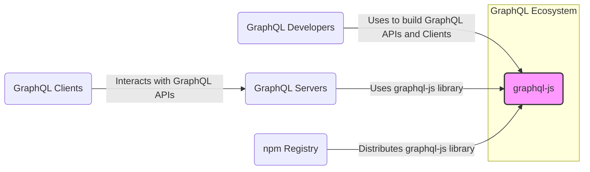
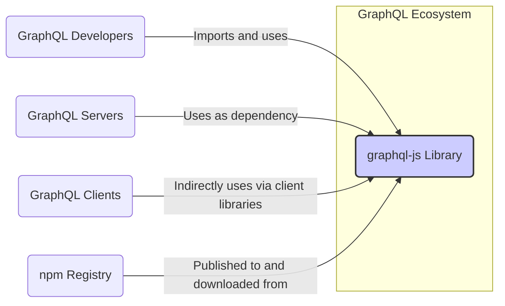
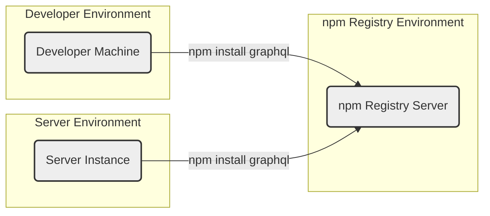
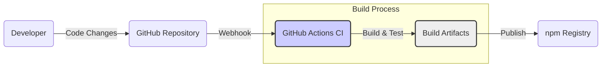

# BUSINESS POSTURE

This project, graphql-js, provides a JavaScript implementation of GraphQL, a query language for APIs and a runtime for fulfilling those queries with your existing data.

The primary business priority is to provide a robust, reliable, and performant reference implementation of the GraphQL specification in JavaScript. This enables developers to build GraphQL servers and clients in JavaScript environments, fostering the adoption and growth of the GraphQL ecosystem.

Key business goals include:
- Maintaining specification compliance to ensure interoperability within the GraphQL ecosystem.
- Providing a stable and well-documented API for developers to use.
- Ensuring high performance and efficiency for GraphQL operations.
- Fostering community contributions and maintaining an active project.

The most important business risks that need to be addressed are:
- Security vulnerabilities in graphql-js could have a wide-reaching impact, affecting numerous applications that depend on it. This could damage the reputation of GraphQL and the project itself.
- Performance bottlenecks or inefficiencies could limit the scalability and usability of GraphQL APIs built with graphql-js.
- Lack of maintenance or slow response to issues, especially security vulnerabilities, could deter developers from using graphql-js and GraphQL in general.
- Breaking changes or API instability could disrupt existing applications and increase the cost of adoption and maintenance.

# SECURITY POSTURE

Existing security controls:
- security control: Open Source Community Review - The project is open source, allowing for broad community review of the code, which can help identify potential security vulnerabilities. Implemented through GitHub repository and public access to code.
- security control: Unit and Integration Testing - The project likely has unit and integration tests to ensure the correctness and reliability of the code. This can indirectly contribute to security by reducing the likelihood of bugs that could be exploited. Implemented as part of the development process, details are in the repository's test suite.
- security control: Dependency Scanning - GitHub likely performs automated dependency scanning to identify known vulnerabilities in the project's dependencies. Implemented by GitHub Dependabot and security features.

Accepted risks:
- accepted risk: Reliance on Community for Security Fixes - As an open-source project, the project relies on the community to report and potentially contribute fixes for security vulnerabilities. Response time and availability of fixes can vary.
- accepted risk: Potential for Undiscovered Vulnerabilities - Like any software project, there is always a risk of undiscovered vulnerabilities that could be exploited.

Recommended security controls:
- security control: Static Application Security Testing (SAST) - Implement automated SAST tools in the CI/CD pipeline to identify potential security vulnerabilities in the code during development.
- security control: Dependency Vulnerability Scanning - Enhance dependency scanning to include more comprehensive vulnerability databases and automated alerts.
- security control: Regular Security Audits - Conduct periodic security audits by external security experts to identify and address potential vulnerabilities.
- security control: Security-Focused Code Reviews - Incorporate security considerations into code review processes, specifically looking for common vulnerability patterns.
- security control: Fuzzing - Implement fuzzing techniques to automatically test the GraphQL parser and execution engine for unexpected inputs and potential vulnerabilities.

Security requirements:
- Authentication:
    - Requirement: graphql-js itself does not handle authentication, but it should be designed to be easily integrated with authentication mechanisms implemented in applications using it.
    - Requirement: Provide clear guidance and examples in documentation on how to secure GraphQL APIs built with graphql-js, including authentication best practices.
- Authorization:
    - Requirement: graphql-js should provide mechanisms for implementing fine-grained authorization logic within GraphQL resolvers.
    - Requirement: Ensure that authorization decisions are consistently enforced throughout the GraphQL execution process.
    - Requirement: Provide clear documentation and examples on how to implement authorization in GraphQL APIs using graphql-js.
- Input Validation:
    - Requirement: graphql-js must strictly adhere to the GraphQL specification for query parsing and validation to prevent injection attacks and other input-related vulnerabilities.
    - Requirement: Provide mechanisms for developers to define and enforce schema-based validation rules to ensure data integrity and prevent unexpected behavior.
    - Requirement: Implement robust error handling for invalid inputs to avoid exposing sensitive information or causing unexpected application behavior.
- Cryptography:
    - Requirement: While graphql-js itself may not directly implement cryptographic functions, it should be designed to be compatible with and easily integrated with cryptographic libraries and best practices for securing sensitive data in GraphQL applications.
    - Requirement: Provide guidance and recommendations on how to use cryptography to protect sensitive data transmitted and processed by GraphQL APIs built with graphql-js.

# DESIGN

## C4 CONTEXT

Context Diagram Elements:

- Name: graphql-js
    - Type: System
    - Description: JavaScript implementation of the GraphQL specification. Provides core functionalities for parsing, validating, and executing GraphQL queries.
    - Responsibilities:
        - Parsing GraphQL queries and schemas.
        - Validating GraphQL queries against a schema.
        - Executing GraphQL queries against data resolvers.
        - Providing a JavaScript API for building GraphQL servers and clients.
    - Security controls:
        - security control: Input Validation - Implements GraphQL specification compliant parsing and validation to prevent malformed queries from causing issues.

- Name: GraphQL Developers
    - Type: User
    - Description: Software developers who use graphql-js to build GraphQL servers and clients.
    - Responsibilities:
        - Using graphql-js library to create GraphQL schemas, resolvers, and clients.
        - Implementing business logic and data access within GraphQL resolvers.
        - Securing GraphQL APIs built with graphql-js.
    - Security controls:
        - security control: Secure Development Practices - Developers are responsible for following secure coding practices when using graphql-js and building applications.

- Name: GraphQL Servers
    - Type: External System
    - Description: Servers that expose GraphQL APIs built using graphql-js. These servers handle incoming GraphQL requests, execute queries using graphql-js, and return responses.
    - Responsibilities:
        - Hosting and serving GraphQL APIs.
        - Handling client requests and responses.
        - Implementing authentication and authorization for GraphQL APIs.
        - Data fetching and processing based on GraphQL queries.
    - Security controls:
        - security control: Authentication - Implement authentication mechanisms to verify the identity of clients accessing the GraphQL API.
        - security control: Authorization - Implement authorization logic to control access to specific data and operations within the GraphQL API.
        - security control: Input Validation - Validate client requests and inputs to prevent injection attacks and other vulnerabilities.
        - security control: Rate Limiting - Implement rate limiting to protect against denial-of-service attacks.

- Name: GraphQL Clients
    - Type: External System
    - Description: Applications that consume GraphQL APIs. These clients send GraphQL queries to servers and process the responses.
    - Responsibilities:
        - Constructing and sending GraphQL queries to servers.
        - Processing and displaying data received from GraphQL APIs.
        - Handling user interactions and data presentation.
    - Security controls:
        - security control: Secure Communication - Use HTTPS to ensure secure communication between clients and servers.
        - security control: Input Validation - Validate data received from GraphQL APIs to prevent client-side vulnerabilities.

- Name: npm Registry
    - Type: External System
    - Description: Public registry for JavaScript packages. graphql-js library is published and distributed through npm.
    - Responsibilities:
        - Hosting and distributing JavaScript packages, including graphql-js.
        - Providing package management tools for developers.
    - Security controls:
        - security control: Package Integrity - npm provides mechanisms to ensure the integrity and authenticity of packages.
        - security control: Vulnerability Scanning - npm likely performs vulnerability scanning on packages hosted in the registry.

## C4 CONTAINER

Container Diagram Elements:

- Name: graphql-js Library
    - Type: Container
    - Description: A JavaScript library providing the core GraphQL functionalities. It is distributed as an npm package.
    - Responsibilities:
        - GraphQL Parsing: Parsing GraphQL query and schema strings into abstract syntax trees (ASTs).
        - GraphQL Validation: Validating GraphQL queries and schemas against the GraphQL specification and user-defined rules.
        - GraphQL Execution: Executing GraphQL queries by traversing the AST and invoking resolvers to fetch data.
        - GraphQL Type System: Providing classes and utilities for defining GraphQL schemas and types.
        - Error Handling: Providing mechanisms for handling and reporting GraphQL errors.
    - Security controls:
        - security control: Input Validation - Implements robust input validation during parsing and validation phases to prevent injection attacks and malformed queries.
        - security control: Error Handling - Implements secure error handling to avoid leaking sensitive information in error messages.

## DEPLOYMENT

graphql-js library itself is not deployed in a traditional sense like a web application. It is distributed as an npm package and used as a dependency in other JavaScript projects (GraphQL servers and clients). Therefore, the deployment context is primarily about how graphql-js is made available to developers and how it is used within their applications.

Deployment Architecture: npm Registry Distribution

Deployment Diagram Elements (npm Registry Distribution):

- Name: npm Registry Server
    - Type: Infrastructure
    - Description: Servers hosting the npm registry, responsible for storing and distributing npm packages, including graphql-js.
    - Responsibilities:
        - Storing and serving npm packages.
        - Managing package versions and metadata.
        - Handling package downloads and installations.
    - Security controls:
        - security control: Infrastructure Security - npm registry servers are secured by npm, Inc. following industry best practices.
        - security control: Package Integrity - npm ensures the integrity and authenticity of packages through checksums and signing.

- Name: Developer Machine
    - Type: Environment
    - Description: Developer's local machine where they develop GraphQL applications using graphql-js.
    - Responsibilities:
        - Development and testing of GraphQL applications.
        - Downloading and installing npm packages, including graphql-js.
        - Building and running GraphQL servers and clients locally.
    - Security controls:
        - security control: Local Security Practices - Developers are responsible for securing their development machines and following secure development practices.

- Name: Server Instance
    - Type: Environment
    - Description: Server environment where GraphQL servers built with graphql-js are deployed and running. This could be cloud instances, on-premises servers, or serverless environments.
    - Responsibilities:
        - Hosting and running GraphQL servers.
        - Serving GraphQL APIs to clients.
        - Providing runtime environment for graphql-js library.
    - Security controls:
        - security control: Server Hardening - Server instances should be hardened according to security best practices.
        - security control: Network Security - Network security controls (firewalls, network segmentation) should be in place to protect server instances.
        - security control: Runtime Environment Security - Ensure the runtime environment (Node.js, etc.) is secure and up-to-date.

## BUILD

Build Process Description:

1. Developer: Developers write code, make changes, and commit them to the GitHub repository.
2. GitHub Repository: The source code for graphql-js is hosted on GitHub.
3. GitHub Actions CI: Upon code changes (e.g., push, pull request), GitHub Actions CI is triggered via webhook.
4. Build & Test: GitHub Actions CI performs the following steps:
    - Checkout code from the GitHub repository.
    - Setup Node.js environment.
    - Install dependencies (npm install).
    - Run linters and code formatters.
    - Run static analysis security testing (SAST) tools.
    - Run unit and integration tests.
    - Build the library (e.g., compile TypeScript to JavaScript).
5. Build Artifacts: If the build and tests are successful, build artifacts are created, which include:
    - JavaScript library files.
    - Type definition files.
    - Documentation.
    - npm package manifest (package.json).
6. npm Registry: The build artifacts are published to the npm Registry, making the graphql-js library available for download and use by developers.

Build Security Controls:

- security control: Automated Build Process - Using GitHub Actions CI ensures a consistent and repeatable build process, reducing the risk of manual errors.
- security control: Source Code Management - GitHub provides version control and access control for the source code, protecting against unauthorized modifications.
- security control: Static Application Security Testing (SAST) - SAST tools integrated into the CI pipeline automatically scan the code for potential security vulnerabilities before publishing.
- security control: Linters and Code Formatters - Linters and code formatters help enforce code quality and consistency, indirectly contributing to security by reducing the likelihood of bugs.
- security control: Unit and Integration Tests - Automated tests ensure the correctness and reliability of the code, reducing the risk of bugs that could be exploited.
- security control: Dependency Scanning - CI pipeline can include dependency vulnerability scanning to identify and alert on vulnerable dependencies.
- security control: Secure Publishing - Publishing to npm registry should be done securely, using API keys or tokens managed securely in CI environment.

# RISK ASSESSMENT

Critical business process: Providing a secure, reliable, and performant JavaScript implementation of GraphQL for the global developer community. The integrity and availability of graphql-js are crucial for the GraphQL ecosystem.

Data we are trying to protect:
- Source Code: The source code of graphql-js is publicly available on GitHub, but we need to protect its integrity and prevent unauthorized modifications that could introduce vulnerabilities. Sensitivity: Public, Integrity is critical.
- Build Artifacts (npm package): The published npm package needs to be protected from tampering and unauthorized modifications to ensure users download a secure and legitimate version. Sensitivity: Public, Integrity is critical.
- Build Environment: The CI/CD environment needs to be secured to prevent supply chain attacks and ensure the integrity of the build process. Sensitivity: Confidential, Integrity is critical.

Data Sensitivity Levels:
- Public: Source code, build artifacts (npm package), documentation.
- Confidential: CI/CD environment secrets, API keys, build process configurations.

# QUESTIONS & ASSUMPTIONS

Questions:
- What specific SAST tools are currently used in the CI/CD pipeline for graphql-js?
- Are there regular security audits conducted for graphql-js? If so, what are the findings and remediation plans?
- What is the process for reporting and handling security vulnerabilities in graphql-js? Is there a security policy or contact information available?
- Are dependency vulnerability scans performed regularly, and what actions are taken when vulnerabilities are identified?
- What kind of fuzzing or dynamic testing is performed on graphql-js, if any?

Assumptions:
- BUSINESS POSTURE:
    - The primary goal of graphql-js is to be a reference implementation of the GraphQL specification in JavaScript.
    - Security, performance, and reliability are high priorities for the project.
    - The project aims to be actively maintained and responsive to community feedback and issues.
- SECURITY POSTURE:
    - The project benefits from open-source community review for security.
    - Basic security controls like unit tests and dependency scanning are in place.
    - There is an awareness of security risks and a desire to improve security posture.
- DESIGN:
    - The architecture is primarily focused on providing a library for developers to use in their own applications.
    - The deployment model is centered around distribution via npm registry.
    - The build process is automated using CI/CD and includes basic security checks.