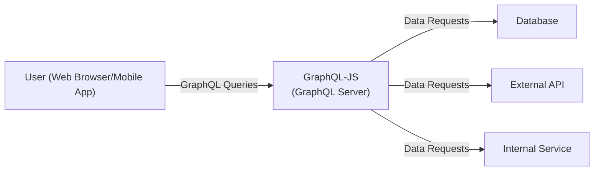
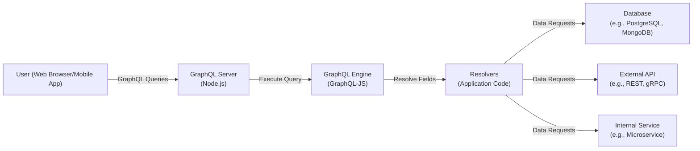
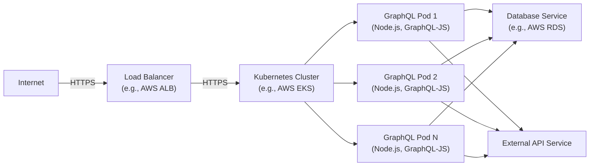
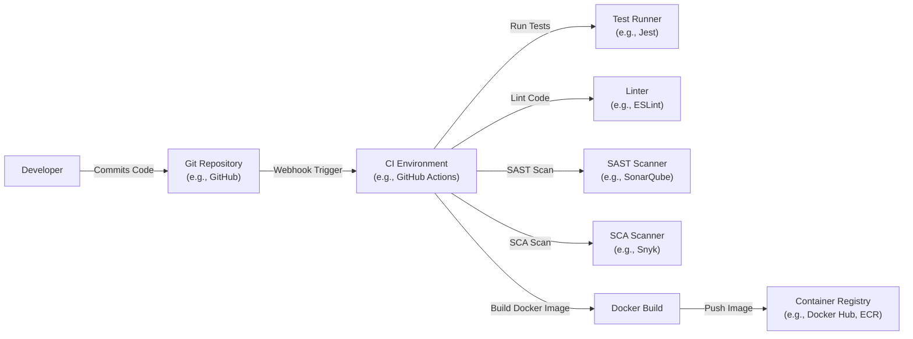

# BUSINESS POSTURE

Business Priorities and Goals:

*   Provide a robust and production-ready JavaScript implementation of the GraphQL specification.
*   Serve as the reference implementation for other GraphQL libraries and tools.
*   Maintain high performance and efficiency for executing GraphQL queries.
*   Offer a stable and well-documented API for developers.
*   Foster a strong community and ecosystem around GraphQL.
*   Enable developers to build flexible and efficient APIs.

Most Important Business Risks:

*   Vulnerabilities in the library that could lead to data breaches or denial-of-service attacks.
*   Performance bottlenecks that could impact the responsiveness of applications using the library.
*   Incompatibilities with other GraphQL tools or specifications that could hinder adoption.
*   Lack of community support or contributions that could slow down development and maintenance.
*   Complexity of codebase that can lead to bugs and security issues.

# SECURITY POSTURE

Existing Security Controls:

*   security control: Regular code reviews (mentioned throughout the repository's contribution guidelines and pull request process).
*   security control: Use of linters (ESLint) to enforce code style and identify potential issues (configured in `.eslintrc.js`).
*   security control: Automated tests to ensure code correctness and prevent regressions (present in the `__tests__` directories).
*   security control: Security Policy described in SECURITY.md file.
*   security control: Follows OWASP secure coding practices.

Accepted Risks:

*   accepted risk: The library relies on external dependencies, which may introduce vulnerabilities.
*   accepted risk: The library is complex and may contain undiscovered vulnerabilities.

Recommended Security Controls:

*   security control: Implement Static Application Security Testing (SAST) to automatically scan for vulnerabilities during the build process.
*   security control: Implement Software Composition Analysis (SCA) to identify and manage vulnerabilities in third-party dependencies.
*   security control: Conduct regular penetration testing to identify and address potential security weaknesses.
*   security control: Implement fuzz testing to identify edge cases and unexpected behavior.
*   security control: Implement a Content Security Policy (CSP) if the library is used in a web context.

Security Requirements:

*   Authentication: Not directly applicable to the core GraphQL execution engine, but relevant for applications built using the library. Authentication should be handled at the application layer, potentially using libraries like Passport.js or custom middleware.
*   Authorization: GraphQL-js provides mechanisms for implementing authorization logic within resolvers. This allows fine-grained control over access to data based on user roles or permissions. Authorization logic should be implemented within the application's business logic layer.
*   Input Validation: GraphQL's type system provides a basic level of input validation. However, custom validation logic should be implemented within resolvers to handle specific business rules and prevent malicious input. Libraries like `validator.js` can be used for common validation tasks.
*   Cryptography: Not directly applicable to the core GraphQL execution engine. Cryptographic operations (e.g., hashing passwords) should be handled at the application layer using appropriate libraries (e.g., `bcryptjs`). Data in transit should be protected using TLS/SSL.

# DESIGN

## C4 CONTEXT

C4 Context Element List:

*   Element:
    *   Name: User (Web Browser/Mobile App)
    *   Type: Person
    *   Description: Represents a user interacting with a GraphQL API built using GraphQL-js.
    *   Responsibilities: Sends GraphQL queries to the server, receives and displays data.
    *   Security controls: Implements browser-based security mechanisms (e.g., same-origin policy, cookies), uses HTTPS for communication.

*   Element:
    *   Name: GraphQL-JS (GraphQL Server)
    *   Type: Software System
    *   Description: The JavaScript implementation of the GraphQL specification.
    *   Responsibilities: Parses, validates, and executes GraphQL queries; fetches data from various sources; returns results to the user.
    *   Security controls: Input validation, authorization checks within resolvers, error handling.

*   Element:
    *   Name: Database
    *   Type: Software System
    *   Description: A database system used to store and retrieve data.
    *   Responsibilities: Stores application data, provides data access to GraphQL-js.
    *   Security controls: Database access controls, encryption at rest, regular backups.

*   Element:
    *   Name: External API
    *   Type: Software System
    *   Description: An external API that GraphQL-js interacts with to fetch data.
    *   Responsibilities: Provides specific data or functionality.
    *   Security controls: API keys, authentication, rate limiting.

*   Element:
    *   Name: Internal Service
    *   Type: Software System
    *   Description: An internal service that GraphQL-js interacts with to fetch data or perform operations.
    *   Responsibilities: Provides specific data or functionality within the organization's infrastructure.
    *   Security controls: Internal network security, service-to-service authentication.

## C4 CONTAINER

C4 Container Element List:

*   Element:
    *   Name: User (Web Browser/Mobile App)
    *   Type: Person
    *   Description: Represents a user interacting with a GraphQL API.
    *   Responsibilities: Sends GraphQL queries, receives and displays data.
    *   Security controls: Browser security mechanisms, HTTPS.

*   Element:
    *   Name: GraphQL Server (Node.js)
    *   Type: Container: Node.js
    *   Description: A Node.js server that hosts the GraphQL API.
    *   Responsibilities: Handles incoming HTTP requests, passes GraphQL queries to the GraphQL engine, returns responses.
    *   Security controls: Input validation, error handling, request logging.

*   Element:
    *   Name: GraphQL Engine (GraphQL-JS)
    *   Type: Container: JavaScript Library
    *   Description: The core GraphQL-js library.
    *   Responsibilities: Parses, validates, and executes GraphQL queries.
    *   Security controls: Type checking, query validation.

*   Element:
    *   Name: Resolvers (Application Code)
    *   Type: Container: JavaScript Code
    *   Description: Functions that fetch data for each field in a GraphQL query.
    *   Responsibilities: Retrieves data from databases, external APIs, or internal services.
    *   Security controls: Authorization checks, data sanitization.

*   Element:
    *   Name: Database (e.g., PostgreSQL, MongoDB)
    *   Type: Container: Database
    *   Description: A database system.
    *   Responsibilities: Stores and retrieves data.
    *   Security controls: Database access controls, encryption.

*   Element:
    *   Name: External API (e.g., REST, gRPC)
    *   Type: Container: External System
    *   Description: An external API.
    *   Responsibilities: Provides data or functionality.
    *   Security controls: API keys, authentication.

*   Element:
    *   Name: Internal Service (e.g., Microservice)
    *   Type: Container: Internal System
    *   Description: An internal service.
    *   Responsibilities: Provides data or functionality.
    *   Security controls: Internal network security, service-to-service authentication.

## DEPLOYMENT

Possible Deployment Solutions:

1.  Standalone Node.js server on a virtual machine (e.g., AWS EC2, Google Compute Engine).
2.  Containerized deployment using Docker and Kubernetes (e.g., AWS EKS, Google Kubernetes Engine).
3.  Serverless deployment using AWS Lambda, Google Cloud Functions, or Azure Functions.
4.  Platform-as-a-Service (PaaS) deployment using Heroku, Netlify, or Vercel.

Chosen Solution (Containerized Deployment with Docker and Kubernetes):

Deployment Element List:

*   Element:
    *   Name: Internet
    *   Type: External
    *   Description: The public internet.
    *   Responsibilities: Routes traffic to the load balancer.
    *   Security controls: Standard internet security protocols.

*   Element:
    *   Name: Load Balancer (e.g., AWS ALB)
    *   Type: Infrastructure Node
    *   Description: Distributes incoming traffic across multiple instances of the GraphQL server.
    *   Responsibilities: Load balancing, SSL termination.
    *   Security controls: SSL/TLS certificates, security groups.

*   Element:
    *   Name: Kubernetes Cluster (e.g., AWS EKS)
    *   Type: Infrastructure Node
    *   Description: A cluster of nodes managed by Kubernetes.
    *   Responsibilities: Orchestrates container deployment, scaling, and management.
    *   Security controls: Kubernetes RBAC, network policies, pod security policies.

*   Element:
    *   Name: GraphQL Pod 1/2/N (Node.js, GraphQL-JS)
    *   Type: Container Instance
    *   Description: Instances of the GraphQL server running within Kubernetes pods.
    *   Responsibilities: Handles GraphQL requests.
    *   Security controls: Container security best practices, resource limits.

*   Element:
    *   Name: Database Service (e.g., AWS RDS)
    *   Type: External System
    *   Description: A managed database service.
    *   Responsibilities: Provides database access.
    *   Security controls: Database security configurations, IAM roles.

*   Element:
    *   Name: External API Service
    *   Type: External System
    *   Description: An external API service.
    *   Responsibilities: Provides external API access.
    *   Security controls: API keys, authentication.

## BUILD

Build Process Description:

1.  Developer commits code to the Git repository (e.g., GitHub).
2.  A webhook triggers the CI environment (e.g., GitHub Actions).
3.  The CI environment runs automated tests using a test runner (e.g., Jest).
4.  The CI environment lints the code using a linter (e.g., ESLint).
5.  The CI environment performs a Static Application Security Testing (SAST) scan using a SAST scanner (e.g., SonarQube).
6.  The CI environment performs a Software Composition Analysis (SCA) scan using an SCA scanner (e.g., Snyk, Dependabot).
7.  If all checks pass, the CI environment builds a Docker image.
8.  The Docker image is pushed to a container registry (e.g., Docker Hub, Amazon ECR).

Security Controls:

*   security control: Automated tests ensure code correctness and prevent regressions.
*   security control: Linters enforce code style and identify potential issues.
*   security control: SAST scanners detect vulnerabilities in the application code.
*   security control: SCA scanners identify and manage vulnerabilities in third-party dependencies.
*   security control: Docker image signing ensures the integrity of the deployed image.
*   security control: Using minimal base images for Docker containers reduces the attack surface.

# RISK ASSESSMENT

Critical Business Processes:

*   Serving GraphQL queries reliably and efficiently.
*   Maintaining the integrity and confidentiality of data accessed through the API.
*   Providing a stable and secure platform for developers to build applications.

Data Sensitivity:

*   The sensitivity of the data handled by GraphQL-js depends on the specific application using it.
*   GraphQL-js itself does not store any data, but it acts as a gateway to data sources.
*   Data sensitivity can range from publicly available information to highly sensitive personal or financial data. The application using GraphQL-js is responsible for classifying and protecting data appropriately.

# QUESTIONS & ASSUMPTIONS

Questions:

*   What specific external APIs or internal services will GraphQL-js interact with?
*   What are the expected traffic patterns and performance requirements?
*   What is the organization's risk tolerance for vulnerabilities and downtime?
*   What are the specific data sensitivity levels for the applications using GraphQL-js?
*   Are there any existing security tools or processes that should be integrated with the build and deployment pipelines?

Assumptions:

*   BUSINESS POSTURE: The organization prioritizes security and is willing to invest in necessary security controls.
*   SECURITY POSTURE: The development team follows secure coding practices.
*   DESIGN: The deployment environment will be a Kubernetes cluster.
*   DESIGN: The build process will use GitHub Actions.
*   DESIGN: The database will be a managed service like AWS RDS.
*   DESIGN: External API access will require authentication.