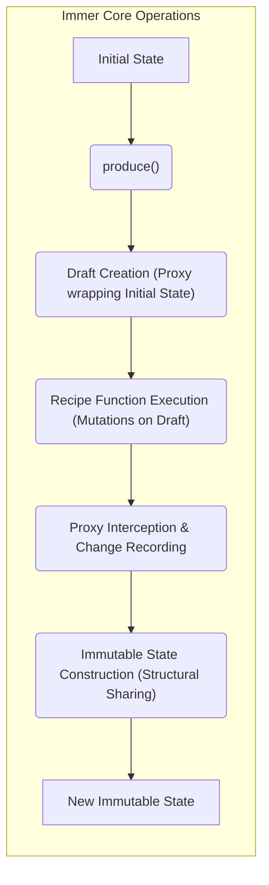
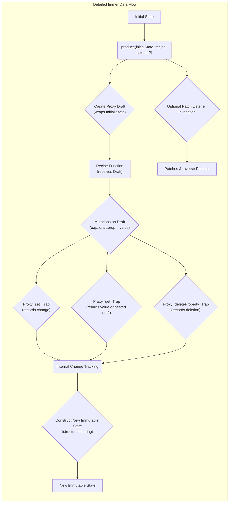

# Project Design Document: Immer

**Version:** 1.1
**Date:** October 26, 2023
**Author:** AI Software Architect

## 1. Introduction

This document provides an enhanced and more detailed design overview of the Immer library, a popular JavaScript library facilitating immutable state management with a focus on developer experience. This document aims to provide a comprehensive understanding of Immer's internal architecture, the lifecycle of state transformations, and the interactions between its core components. This detailed understanding is crucial for effective threat modeling to identify potential security vulnerabilities.

## 2. Goals

*   Provide a highly detailed and clear articulation of the Immer library's architecture and design principles.
*   Thoroughly identify and describe the key components within Immer and their specific interactions during state updates.
*   Elaborate on the complete data flow within the library, from initial state to the final immutable state.
*   Establish a robust foundation for identifying and analyzing potential security vulnerabilities during subsequent threat modeling exercises.

## 3. Architecture Overview

Immer's core innovation lies in enabling developers to work with immutable data by interacting with a mutable "draft" of the state. The `produce` function orchestrates this process. It creates a proxy-based draft from the initial state. A user-provided "recipe" function then directly modifies this draft as if it were a standard mutable JavaScript object. Under the hood, Immer intercepts these mutations via the proxy. Finally, `produce` efficiently generates a new, immutable state reflecting the changes made to the draft, leveraging structural sharing to minimize memory usage and maximize performance by reusing unchanged portions of the original state.

## 4. Detailed Design

### 4.1. `produce()` Function: The Orchestrator

*   **Purpose:** The primary and central function of the Immer library, responsible for managing the entire immutable update process.
*   **Input:**
    *   The initial state (any JavaScript value, typically an object or array).
    *   A mandatory "recipe" function. This function receives the mutable draft as its sole argument.
    *   An optional "patch listener" function. This function receives an array of "patches" (describing the changes) and the inverse patches.
*   **Process:**
    1. Receives the initial state and the recipe function.
    2. Invokes the draft creation mechanism.
    3. Executes the provided recipe function, passing the newly created draft as an argument.
    4. Monitors and records mutations performed within the recipe function via the proxy.
    5. Constructs the new immutable state based on the recorded changes, employing structural sharing.
    6. Optionally invokes the patch listener with details of the changes.
    7. Returns the newly generated immutable state.

### 4.2. Draft Creation: Proxy-Based Mutability Illusion

*   **Mechanism:** Immer creates a mutable-seeming draft by wrapping the initial state with a JavaScript `Proxy`.
*   **Purpose of Proxy:** The proxy intercepts all attempts to interact with the draft (reading properties, setting properties, deleting properties, etc.).
*   **Not a Deep Copy:** The draft is not a deep copy of the initial state initially. Copies are created on demand only when a part of the state is actually modified.
*   **Proxy Handlers:**  Specific handlers within the proxy (`get`, `set`, `deleteProperty`, etc.) are crucial for intercepting and recording mutations.

### 4.3. Proxy Interception and Change Recording: The Core Logic

*   **`get` Trap:** When a property is accessed on the draft, the `get` trap is triggered. Immer can then return the original value or a nested draft if the accessed property is an object or array.
*   **`set` Trap:** When a property is set on the draft, the `set` trap is triggered. Immer records this change. If the property being set is an object or array, it might be wrapped in another proxy to enable nested mutations.
*   **`deleteProperty` Trap:** When a property is deleted from the draft, the `deleteProperty` trap is triggered, and Immer records this deletion.
*   **Internal Change Tracking:** Immer maintains internal data structures to track which parts of the state have been modified.

### 4.4. Recipe Function Execution: Developer Interaction

*   **Context:** The recipe function is executed with the draft object as its `this` context (though this is generally not relied upon).
*   **Direct Mutation:** Developers interact with the draft as if it were a standard mutable object, using standard JavaScript assignment, array methods, etc.
*   **Immer's Role:** Immer's proxy mechanism ensures that these seemingly direct mutations are intercepted and recorded without modifying the original state.

### 4.5. Immutable State Construction: Efficiency through Structural Sharing

*   **Process:** After the recipe function completes, Immer uses the recorded changes to construct the new immutable state.
*   **Structural Sharing:**  A key optimization. Only the parts of the state tree that were actually modified are newly created. Unchanged parts of the original state are structurally shared (references are reused) in the new state.
*   **Immutability Enforcement:** The newly generated state is typically frozen (using `Object.freeze`) to enforce immutability and prevent accidental modifications.

### 4.6. Patch Listener: Observing Changes (Optional)

*   **Purpose:** Allows developers to observe the specific changes made during the `produce` operation.
*   **Patch Format:** Changes are represented as "patches," which describe the operation performed (add, replace, remove), the path to the changed value, and the new value (or the removed value).
*   **Inverse Patches:**  The patch listener also receives "inverse patches," which describe how to revert the changes. This is useful for implementing undo/redo functionality.

## 5. Key Components

*   **`produce()`:** The central function managing the immutable update process.
*   **Draft (Proxy Object):** A mutable-seeming proxy object wrapping the current state being modified. It intercepts operations and records changes.
*   **Proxy Handlers (`get`, `set`, `deleteProperty`, etc.):**  Specific methods within the JavaScript `Proxy` that intercept property access and modification attempts on the draft.
*   **Recipe Function:** The user-provided callback function where mutations to the draft are performed.
*   **Change Tracker (Internal):**  Internal data structures and logic responsible for recording and managing the modifications made to the draft.
*   **Immutable State Constructor:** The logic responsible for generating the new immutable state based on the tracked changes, implementing structural sharing for efficiency.
*   **Patches:** Data structures representing the specific changes made between the original and the new state.
*   **Inverse Patches:** Data structures representing the reverse operations of the patches.
*   **Patch Listener Function:** An optional callback function invoked with the patches and inverse patches after state generation.

## 6. Data Flow Diagram

## 7. Security Considerations (For Threat Modeling)

When considering Immer for threat modeling, focus on the following potential areas:

*   **Prototype Pollution via Draft:** Could a malicious recipe function manipulate the prototype chain of objects within the draft, potentially affecting other parts of the application or even built-in JavaScript objects? This requires careful scrutiny of how proxies interact with prototype lookups and modifications.
*   **Performance Exhaustion:**  Crafted inputs leading to extremely large or deeply nested state trees could cause excessive memory consumption or CPU usage during draft creation, mutation tracking, or new state generation, potentially leading to denial-of-service on the client-side.
*   **Unexpected Side Effects in Recipe:** While Immer aims to isolate mutations within the recipe, unintended side effects within the recipe function (e.g., modifying external variables, making API calls) could still occur and need to be considered.
*   **Bypassing Immutability Guarantees:**  While the generated state is frozen, are there any edge cases or vulnerabilities in Immer's proxy implementation that could allow direct modification of the underlying state or the frozen output?
*   **Information Disclosure via Patches:** If patch information is exposed or logged without proper sanitization, could it reveal sensitive information about the application's state or user actions?
*   **Resource Exhaustion due to Patch Generation:** Generating very large patch sets for complex changes could potentially consume significant resources.
*   **Vulnerabilities in Dependencies (Indirect):** Although Immer has minimal dependencies, any vulnerabilities in those dependencies (even transitive ones) could indirectly impact Immer's security. Dependency scanning is important.
*   **Incorrect Usage Leading to Unexpected State:** While not a direct vulnerability in Immer itself, incorrect usage patterns or misunderstandings of its behavior could lead to unexpected state updates or application logic errors that might have security implications.

## 8. Assumptions and Constraints

*   Immer operates within the standard JavaScript runtime environment (browser or Node.js).
*   Developers are expected to write their recipe functions with awareness of potential security implications, especially when dealing with untrusted input.
*   The security of the overall application using Immer depends on various other factors, including secure coding practices, input validation, and secure handling of external data. Immer is a component within a larger system.

## 9. Future Considerations

*   Continued performance optimizations, particularly for very large and complex state trees.
*   Exploring more advanced techniques for change tracking and structural sharing.
*   Potential enhancements to the patch mechanism for more granular or efficient change representation.
*   Further refinement of the API for improved developer experience and clarity.

This enhanced design document provides a more in-depth understanding of the Immer library's internal workings, making it a more effective resource for conducting thorough and targeted threat modeling activities. The detailed descriptions of components and data flow, along with specific security considerations, will aid in identifying and mitigating potential risks.
