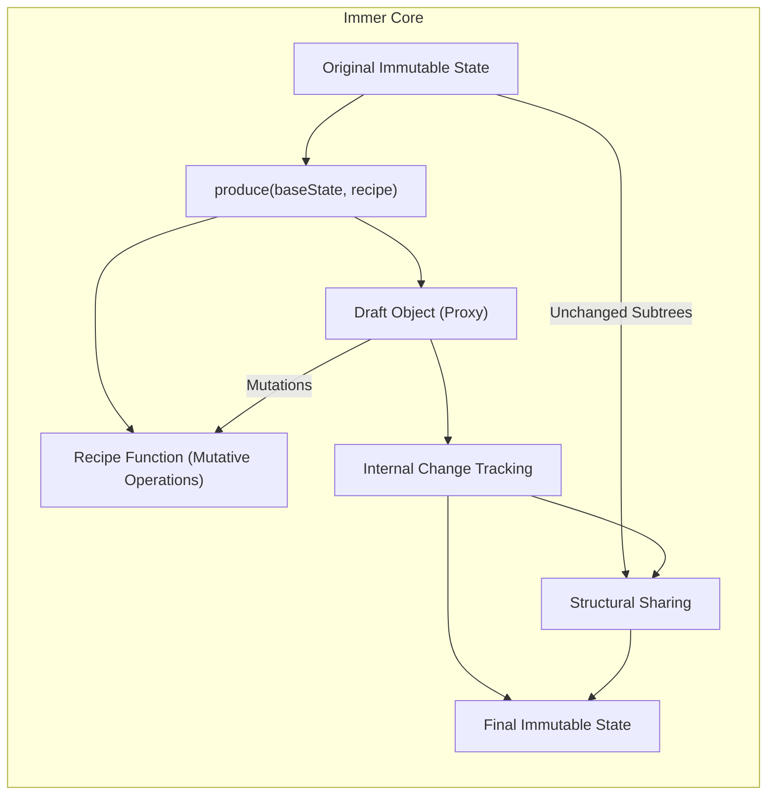

# Project Design Document: Immer

**Version:** 1.1
**Date:** October 26, 2023
**Author:** AI Software Architect

## 1. Introduction

This document provides an enhanced and detailed design overview of the Immer JavaScript library. It aims to clearly articulate the architecture, core mechanisms, and data flow of Immer, serving as a robust foundation for subsequent threat modeling activities. This document is intended for developers, security engineers, and anyone involved in the development, deployment, or security assessment of applications utilizing Immer. This version expands on the previous document with more technical detail and clarification.

## 2. Project Goals

The primary goal of Immer is to enable developers to work with immutable data structures in a convenient and performant manner, emulating mutable operations. This significantly simplifies state management, particularly in complex applications, by eliminating the need for manual deep cloning of objects and managing complex update logic.

Key objectives of Immer include:

* **Simplicity:** Offer an intuitive and developer-friendly API for updating immutable data, mirroring standard mutable JavaScript patterns.
* **Performance:** Minimize the performance overhead typically associated with immutable updates by leveraging structural sharing and efficient change tracking.
* **Developer Experience:** Enhance the developer experience by allowing developers to use familiar mutable coding styles while benefiting from the advantages of immutability.
* **Immutability Enforcement:** Ensure that the original state remains unchanged, guaranteeing data integrity and predictability.

## 3. System Architecture

Immer's core functionality revolves around the creation and manipulation of a "draft" object, which acts as a mutable proxy of the original immutable state. Modifications are applied to this draft, and Immer intelligently determines the changes required to produce a new immutable state.

Here's a more detailed architectural overview:



**Components:**

* **Original Immutable State:** The initial immutable data structure passed to the `produce` function. This serves as the baseline for the update operation.
* **`produce(baseState, recipe)`:** The central and primary function of Immer. It takes the base immutable state and a "recipe" function as its arguments. This function orchestrates the entire Immer process.
* **Draft Object (Proxy):** A mutable proxy object generated by Immer using JavaScript's `Proxy` API. This proxy wraps the original state and intercepts all property accesses and modifications within the recipe function. It provides the illusion of mutability.
* **Internal Change Tracking:** Immer maintains internal mechanisms to track all modifications made to the draft object through the proxy. This tracking is crucial for efficiently creating the new immutable state.
* **Recipe Function (Mutative Operations):** A function provided by the user. This function receives the draft object as its argument and performs modifications directly on it using standard mutable JavaScript syntax.
* **Final Immutable State:** The newly created immutable state produced by Immer after the recipe function has executed. This state reflects all the changes made to the draft. Immer ensures that this new state shares unchanged parts with the original state for optimal performance (structural sharing).
* **Structural Sharing:** A key optimization technique employed by Immer. When creating the new immutable state, Immer reuses unchanged portions of the original state's object graph, minimizing memory usage and improving performance.

## 4. Data Flow

The lifecycle of an Immer operation involves a detailed data flow, emphasizing change tracking and efficient state creation:

```mermaid
graph LR
    subgraph "Immer Data Flow"
        A["Initial Immutable State"]
        B["`produce()` Invocation"]
        C["Draft Proxy Creation & Linking to Original"]
        D["Recipe Execution (Mutations on Draft via Proxy)"]
        E["Proxy Intercepts Mutations & Records Changes"]
        F["Change Detection & Comparison"]
        G["New Immutable State Construction (with Structural Sharing)"]
        H["Return New Immutable State (or Original if no changes)"]
    end

    A --> B
    B --> C
    C --> D
    D --> E
    E --> F
    F -- "Changes Detected" --> G
    F -- "No Changes" --> H
    G --> H
    B -- "No Recipe Modifications" --> A
```

**Detailed Steps:**

1. **Initial Immutable State:** The application possesses an existing immutable state object.
2. **`produce()` Invocation:** The `produce()` function is called with the initial immutable state and the user-provided recipe function.
3. **Draft Proxy Creation & Linking to Original:** Immer creates a mutable proxy object (the draft) that mirrors the structure and values of the initial state. Crucially, this proxy maintains a link back to the original state, allowing Immer to track which parts have been modified.
4. **Recipe Execution (Mutations on Draft via Proxy):** The provided recipe function is executed. Inside this function, developers interact with the draft object as if it were a standard mutable object, performing modifications using familiar JavaScript syntax (e.g., assignment, array methods).
5. **Proxy Intercepts Mutations & Records Changes:**  As the recipe function executes, the `Proxy` object intercepts all property accesses and modifications on the draft. Immer's internal change tracking mechanisms record these modifications, noting which parts of the state have been altered.
6. **Change Detection & Comparison:** After the recipe function completes, Immer compares the recorded changes against the original state. This process determines which parts of the state tree need to be updated in the new immutable state.
7. **New Immutable State Construction (with Structural Sharing):** If changes were detected, Immer efficiently constructs a new immutable state object. It does this by creating new objects only for the parts of the state tree that were modified. Unchanged portions of the original state's object graph are directly referenced in the new state (structural sharing). This significantly improves performance and reduces memory allocation.
8. **Return New Immutable State (or Original if no changes):** The `produce()` function returns the newly created immutable state. If no modifications were made within the recipe function, Immer returns the original immutable state object, avoiding unnecessary object creation.

## 5. Key Components and Interactions

* **`produce()` Function:** The central orchestrator of Immer's functionality. It manages the creation of the draft, the execution of the recipe, change tracking, and the generation of the final immutable state.
* **Proxy Implementation (JavaScript `Proxy`):** Immer's core mechanism for enabling mutable-like operations on immutable data. The `Proxy` object intercepts interactions with the draft, allowing Immer to track changes without requiring explicit cloning by the user.
* **Internal Change Tracking Data Structures:** Immer utilizes internal data structures (not directly exposed in the API) to efficiently track modifications made to the draft. These structures are optimized for performance and minimal overhead.
* **Object Freezing (Deep Freeze):** The final output of the `produce()` function (the new immutable state) is deeply frozen using `Object.freeze()` (or a similar mechanism). This ensures that the returned object is truly immutable and cannot be modified further, enforcing data integrity.
* **Structural Sharing Logic:** The core algorithm within Immer that determines which parts of the original state can be reused when creating the new state. This is crucial for performance optimization.

## 6. Deployment Considerations

Immer is a client-side JavaScript library primarily intended for use within web browsers and Node.js environments. Its deployment is typically integrated into the build process of a larger application.

* **Browser Environment:** Immer is included as a dependency in front-end JavaScript projects. Build tools like Webpack, Parcel, or Rollup bundle Immer along with the application's code.
* **Node.js Environment:** Immer can be installed via npm or yarn and used in server-side JavaScript applications for managing application state or data transformations.

## 7. Key Security Considerations (Pre-Threat Modeling)

Understanding Immer's internal workings is crucial for identifying potential security implications in applications that utilize it. This section expands on the previous version with more specific concerns.

* **Prototype Pollution:** While Immer attempts to mitigate prototype pollution risks, it's essential to be cautious within the recipe function. Malicious or poorly written recipe functions could potentially exploit vulnerabilities by manipulating the prototype chain of objects within the Immer state. Careful code review of recipe functions is recommended.
* **Denial of Service (DoS) via Resource Exhaustion:**  Extremely large or deeply nested state objects, coupled with computationally intensive recipe functions, could potentially lead to performance bottlenecks or even DoS attacks by consuming excessive CPU or memory resources. Consider the potential impact of large state updates.
* **Dependency Security:**  The security of the Immer library itself is paramount. Regularly updating to the latest version is crucial to patch any known vulnerabilities within the library. Monitor security advisories related to Immer and its dependencies.
* **Complexity and Unintended Side Effects in Recipe Functions:** Overly complex or poorly understood recipe functions can introduce unexpected behavior and potential security vulnerabilities if they interact with external systems, browser APIs, or sensitive data in unforeseen ways. Keep recipe functions focused and well-defined.
* **Exposure of Draft Object (Less Likely but Possible):** While not a typical use case, if the draft object were somehow exposed outside the `produce` function's scope and directly modified after `produce` has completed, it could lead to unexpected state mutations and potential security issues. Ensure proper encapsulation and usage patterns.
* **Integer Overflow/Precision Issues (Edge Case):** In scenarios involving numerical computations within the recipe function, be mindful of potential integer overflow or precision issues if dealing with extremely large numbers. This is a general JavaScript concern but could be relevant within Immer's context.

## 8. Assumptions and Out of Scope

**Assumptions:**

* The underlying JavaScript runtime environment (browser or Node.js) is assumed to be functioning correctly and securely.
* User-provided recipe functions are intended to modify the state in a predictable and intended manner, adhering to secure coding practices.
* Standard security best practices are followed in the surrounding application code.

**Out of Scope:**

* Specific application logic built on top of Immer.
* Security of the hosting environment where the application is deployed (e.g., server security, network configurations).
* Network security considerations related to data transmission (e.g., TLS/SSL).
* Authentication and authorization mechanisms within the application.
* Vulnerabilities in the JavaScript `Proxy` implementation itself (considered part of the underlying runtime environment).

## 9. Future Considerations

* Potential performance optimizations for specific use cases (e.g., very large arrays).
* Exploration of new features or API enhancements to further improve developer experience.
* Continued monitoring of security best practices and potential vulnerabilities.

This enhanced document provides a more in-depth understanding of the Immer library's design and potential security considerations. The detailed information presented here will be invaluable for conducting a thorough threat model to identify potential security risks and develop appropriate mitigation strategies for applications utilizing Immer.
