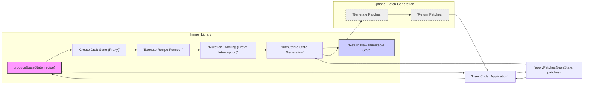

# Project Design Document: Immer (Improved)

## 1. Project Overview

Immer is a lightweight and performant JavaScript library designed to simplify working with immutable data structures. It achieves this by allowing developers to interact with a mutable "draft" of the state within a producer function. Immer then automatically generates a new, immutable state based on the mutations performed on the draft, efficiently sharing unchanged parts of the original state. This approach significantly reduces the boilerplate code associated with manual immutable updates, enhancing developer productivity and code maintainability, especially in complex state management scenarios.

The core innovation of Immer lies in its use of JavaScript Proxies. These proxies intercept all operations on the draft state within the producer function, meticulously tracking modifications.  This tracked information is then used to construct the final immutable state in an optimized manner.  Beyond basic immutable updates, Immer also offers features like patch generation, enabling advanced functionalities such as undo/redo mechanisms and efficient state serialization for persistence or network transfer.

This document provides an enhanced design overview of Immer, specifically tailored for threat modeling and security analysis. It delves into the architecture, components, data flow, and underlying technologies, with a stronger focus on identifying potential security considerations and attack surfaces.

## 2. System Architecture

Immer's architecture revolves around the `produce` function, which acts as the central orchestrator for immutable state updates. It takes an initial immutable state and a user-defined "recipe" function, returning a new immutable state reflecting the changes made within the recipe.  The internal workings rely heavily on Proxies to create and manage the mutable draft state.

### 2.1. Components

- **`produce(baseState, recipe)` (Producer Function):** The primary and most commonly used API entry point of Immer. It accepts the `baseState` (the initial immutable state, which can be any JavaScript object or array) and a `recipe` function. The `recipe` function encapsulates the state mutations.  This function is responsible for initiating the Immer process.
- **Draft State (Proxy):** A dynamically generated Proxy object. This Proxy wraps the `baseState` and acts as the mutable interface for the user within the `recipe` function.  Crucially, the draft state is *not* the actual state being mutated; it's an intermediary that allows Immer to track changes without directly altering the original `baseState`.
- **Base State (Immutable):** The original, immutable JavaScript object or array passed to the `produce` function. Immer guarantees that this `baseState` remains unchanged throughout the process, preserving immutability.
- **Recipe Function (Mutator):** A callback function provided by the user. It receives the `draftState` as its sole argument.  Within this function, developers write code as if they are directly mutating the `draftState`.  Immer intercepts these "mutations" via the Proxy.
- **Mutation Tracking (Proxy Interception & Recording):**  The core engine of Immer.  JavaScript Proxies are configured to intercept all property access (gets), property assignments (sets), deletions, and other mutation operations performed on the `draftState` within the `recipe` function. These operations are recorded internally by Immer, forming a log of changes.  This tracking is transparent to the user.
- **Immutable State Generation (Structural Sharing & Optimization):** After the `recipe` function completes execution, Immer analyzes the recorded mutations. It then constructs a *new* immutable state.  A key optimization is structural sharing: Immer reuses unchanged portions of the original `baseState` in the new state. This minimizes memory allocation and improves performance, especially for large state trees with localized changes.
- **Patches (Optional Change Sets):** Immer can optionally generate "patches" which are essentially a list of operations (like "replace", "add", "remove") that describe the exact differences between the `baseState` and the newly generated immutable state. These patches are useful for implementing features like undo/redo, time-travel debugging, or efficient state synchronization across networks.
- **`applyPatches(baseState, patches)` (Patch Application Function):** A utility function provided by Immer to apply a set of patches (generated by Immer or potentially from other sources) to a `baseState`. This function reconstructs a new state by applying the described changes.
- **Lower-Level API (`createDraft(baseState)`, `finishDraft(draftState)`):**  A less commonly used, more granular API for advanced use cases. `createDraft` manually creates a draft from a `baseState`, and `finishDraft` finalizes the draft and produces the immutable result. This API offers more control but is generally not needed for typical Immer usage.

### 2.2. Data Flow

The data flow within Immer, from input to output, follows these steps:

1. **Initialization:** User code calls `produce(baseState, recipe)`.
2. **Draft Creation:** Immer's `produce` function internally calls `createDraft(baseState)` to generate a `draftState`, which is a Proxy wrapping the `baseState`.
3. **Recipe Invocation:** Immer executes the user-provided `recipe` function, passing the `draftState` as an argument.
4. **Mutation Recording (Within Recipe):** Inside the `recipe` function, the user interacts with the `draftState` as if it were mutable.  Behind the scenes, the Proxy intercepts all mutation attempts and records them.  No actual mutation happens to the `baseState` at this stage.
5. **Immutable State Construction (Post-Recipe):** Once the `recipe` function returns, Immer's `produce` function calls `finishDraft(draftState)`. This function analyzes the recorded mutations and constructs a new immutable state.  Structural sharing is applied to maximize efficiency.
6. **Return New State:** The `produce` function returns the newly created immutable state to the user code.
7. **Optional Patch Generation (Concurrent with Step 5):** If patch generation is enabled (via options to `produce`), Immer generates patches during the immutable state construction process (step 5).
8. **Patch Application (Separate Flow):** User code can later use `applyPatches(baseState, patches)` to apply previously generated patches to a (potentially different) `baseState`, creating a new state reflecting the patch operations.

### 2.3. Architecture Diagram

## 3. Technologies Used

- **JavaScript (ECMAScript 6+):** Immer is implemented entirely in JavaScript and leverages modern ECMAScript features for optimal performance and code clarity.
- **Proxies (ES6 Feature):**  JavaScript Proxies are the cornerstone of Immer's functionality. They provide the mechanism for intercepting and tracking operations on the draft state, enabling non-destructive mutation recording.
- **`Object.is()` (ES6 Feature):** Used for precise value comparison, crucial for determining if a value has truly changed during mutation tracking and for efficient structural sharing.  `Object.is()` handles special cases like `NaN` and `-0` correctly, which is important for data integrity.
- **Immutability Principles & Data Structures:**  Internally, Immer employs techniques for efficient creation and manipulation of immutable data structures. This likely involves optimized object cloning and structural sharing algorithms to minimize overhead and maximize performance.
- **Minimal External Dependencies:** Immer is designed to be a zero-dependency library (or very close to it). This minimizes the risk of introducing vulnerabilities through third-party code and simplifies integration into projects.

## 4. Security Considerations

While Immer is a client-side JavaScript library focused on state management and does not directly handle network requests or external data in isolation, security considerations are still relevant for applications that utilize Immer.  The integrity and predictability of state management are fundamental to application security.

### 4.1. Potential Threats

- **Prototype Pollution (Indirect):** Although Immer itself is unlikely to directly introduce prototype pollution, vulnerabilities in Immer's (minimal) dependencies or even in the JavaScript engine itself could *indirectly* lead to prototype pollution. If prototype pollution occurs, it can have wide-ranging and unpredictable consequences in JavaScript applications, potentially leading to security breaches. Mitigation involves diligent dependency management and staying updated with JavaScript engine security patches.
- **Denial of Service (DoS) via Computational Complexity:** In scenarios involving extremely large and deeply nested state objects combined with complex and computationally intensive mutation recipes, Immer's processing could become resource-intensive.  This could lead to performance degradation or even DoS, especially in resource-constrained environments (e.g., client-side browsers on low-powered devices).  This is more of a usage concern than a direct Immer vulnerability, but applications should be tested for performance under realistic load and state sizes. Mitigation includes limiting state size, optimizing recipe functions, and performance testing.
- **Logic Bugs in Immer (State Corruption):**  Bugs in Immer's core logic, particularly within the Proxy handling, mutation tracking, or immutable state generation algorithms, could lead to unexpected state changes or data corruption. While Immer is well-tested and has a strong community, software bugs are always a possibility. Such bugs could have security implications if they result in incorrect application behavior in security-sensitive contexts (e.g., financial transactions, access control). Mitigation relies on thorough testing, community scrutiny, and prompt patching of reported issues.
- **Information Disclosure via Patches (Misuse):** If patches generated by Immer are used for communication (e.g., sending state updates to a server or between application components) or storage, there is a potential risk of information disclosure if patches are not handled securely.  For example, if patches are exposed to untrusted clients or stored insecurely, sensitive information about the application's state changes could be revealed. Mitigation involves careful handling of patches, avoiding exposure to untrusted parties, and potentially encrypting or sanitizing patches if they contain sensitive data.
- **Data Integrity Issues via Patch Tampering (Misuse):** If patches are used for communication or storage and are susceptible to tampering, malicious actors could modify patches to alter the application state in unintended ways when these tampered patches are applied using `applyPatches`. This could lead to data corruption or unexpected application behavior. Mitigation involves ensuring the integrity of patches during transmission and storage, potentially using digital signatures or checksums.
- **Supply Chain Attacks (Dependency Risk):** Although Immer has minimal dependencies, the risk of supply chain attacks is a general concern for any software dependency. If Immer's dependencies (or even Immer itself if compromised) were to be maliciously altered, it could introduce vulnerabilities into applications using Immer. Mitigation involves using reputable package registries, verifying package integrity (e.g., using checksums), and staying informed about security advisories.
- **Abuse of User-Provided Recipe Function (Indirect):** While not a vulnerability in Immer itself, a poorly written or malicious user-provided `recipe` function could indirectly introduce security issues. For example, a recipe function could contain code that performs unintended side effects, leaks sensitive information, or introduces vulnerabilities into the application's state management logic.  Mitigation involves careful code review of recipe functions, adhering to the principle of least privilege within recipes, and ensuring recipe functions are well-tested and do not introduce unintended side effects.

### 4.2. Attack Surfaces

- **Immer Public API (`produce`, `applyPatches`, `createDraft`, `finishDraft`):** The public API functions of Immer are the primary attack surface. Vulnerabilities in the implementation of these functions, especially in the Proxy handling and state manipulation logic, could be exploited.  `produce` and `applyPatches` are particularly critical as they are the main entry points for state updates and patch application.
- **Internal Proxy Mechanism & Mutation Tracking Logic:** The core logic of Immer relies heavily on JavaScript Proxies and its internal mutation tracking algorithms.  Any vulnerabilities or unexpected behavior in the Proxy implementation itself (within the JavaScript engine) or in Immer's mutation tracking logic could be exploited.  This is a complex area to analyze due to the intricacies of Proxy behavior.
- **Patch Generation and Application Logic:** The algorithms for generating and applying patches represent another attack surface. Bugs or vulnerabilities in patch generation could lead to incorrect or malicious patches being created. Similarly, vulnerabilities in `applyPatches` could allow for the application of malicious patches that corrupt state or introduce vulnerabilities.
- **User-Provided Recipe Function (Indirect Attack Surface):** While not directly Immer's code, the user-provided `recipe` function acts as an *indirect* attack surface.  Malicious or poorly written recipe functions could be crafted to exploit vulnerabilities in the application's state management logic or introduce unintended side effects.  This highlights the importance of secure coding practices in user-provided code that interacts with Immer.

### 4.3. Security Best Practices (for Users of Immer)

Users of Immer should adopt the following security best practices when integrating Immer into their applications:

- **Input Validation and Sanitization (State Data):**  Always validate and sanitize any data that is incorporated into the application state managed by Immer, especially if this data originates from user input or external sources. This helps prevent injection attacks and ensures data integrity within the state.
- **Secure Handling of Patches (If Used):** If patches are used for communication or storage, handle them with appropriate security measures.
    - **Encryption:** Encrypt patches if they contain sensitive information and are transmitted over insecure channels or stored in potentially insecure locations.
    - **Integrity Checks:** Implement mechanisms to verify the integrity of patches, such as digital signatures or checksums, to detect and prevent tampering.
    - **Access Control:** Restrict access to patches to authorized components or users to prevent unauthorized information disclosure or manipulation.
- **Regularly Update Dependencies (Including Immer):** Keep Immer and all other project dependencies up to date to benefit from security patches and bug fixes. Monitor security advisories for Immer and its dependencies.
- **Performance Monitoring and Testing:** Monitor the performance of Immer in your application, especially with large state objects and complex recipes. Conduct performance testing to identify potential DoS vulnerabilities related to computational complexity. Implement safeguards if necessary, such as limiting state size or complexity.
- **Code Reviews and Security Audits:** Conduct thorough code reviews and security audits of code that uses Immer, particularly in security-sensitive parts of the application. Pay special attention to recipe functions and how state is manipulated.
- **Principle of Least Privilege in Recipe Functions:**  Adhere to the principle of least privilege when writing recipe functions. Only perform necessary mutations and avoid unnecessary or overly complex logic within recipes. This reduces the potential attack surface and makes code easier to review and understand.
- **Security Testing (Including Fuzzing):**  Incorporate security testing into your development process, including fuzzing, to identify potential vulnerabilities in your application's state management logic and how it interacts with Immer.
- **Consider Subresource Integrity (SRI) for CDN Delivery:** If Immer is delivered via a CDN, use Subresource Integrity (SRI) to ensure that the Immer library loaded by the browser has not been tampered with.

By carefully considering these security aspects and implementing the recommended best practices, developers can effectively utilize Immer while mitigating potential security risks in their applications. This enhanced design document provides a more comprehensive foundation for threat modeling and security analysis of projects using the Immer library.