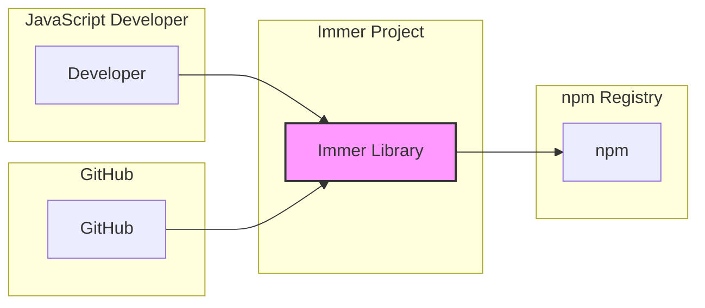
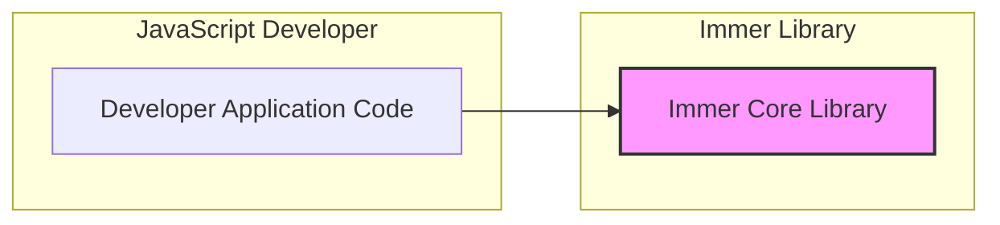
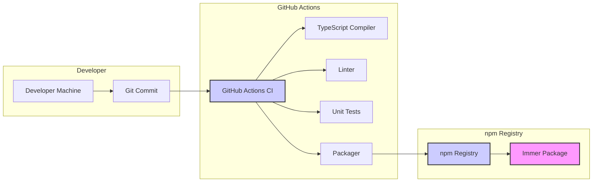

# BUSINESS POSTURE

The Immer project is a JavaScript library that simplifies working with immutable data. Its primary goal is to enhance developer productivity and code maintainability by providing a more convenient and less error-prone way to manage immutable state in JavaScript applications.

* Business priorities:
  * Developer Experience: Make immutable state management easier and more intuitive for JavaScript developers.
  * Performance: Ensure the library is performant and does not introduce significant overhead to applications using it.
  * Reliability: Provide a stable and well-tested library that developers can depend on.
  * Community Adoption: Encourage widespread adoption within the JavaScript development community.

* Business goals:
  * Increase developer productivity by reducing boilerplate code for immutable updates.
  * Improve code readability and maintainability by simplifying immutable state logic.
  * Minimize errors related to mutable operations on immutable data.
  * Grow the user base and community around the Immer library.

* Most important business risks:
  * Security vulnerabilities in the library could impact applications that depend on it.
  * Performance issues could deter adoption or cause problems in production applications.
  * Bugs or instability could lead to developer frustration and decreased adoption.
  * Lack of community support or maintenance could lead to the library becoming outdated or unusable.

# SECURITY POSTURE

The Immer project is an open-source JavaScript library. As such, its security posture relies heavily on community review, secure development practices, and the broader JavaScript ecosystem security.

* Security controls:
  * security control: Open Source Code: The source code is publicly available on GitHub, allowing for community review and scrutiny. (Implemented: GitHub Repository)
  * security control: Unit Tests: The project includes unit tests to verify the correctness of the code and prevent regressions. (Implemented: Test suite in the repository)
  * security control: Linting: Code linting is likely used to enforce code style and catch potential errors. (Likely Implemented: Configuration files in the repository, CI pipeline)
  * security control: GitHub Security Features: GitHub provides features like Dependabot for dependency vulnerability scanning. (Implemented: GitHub platform features)

* Accepted risks:
  * accepted risk: Dependency Vulnerabilities: As a JavaScript library, Immer depends on other packages, which may have vulnerabilities.
  * accepted risk: Open Source Security Model: Reliance on community contributions and reviews for security.
  * accepted risk: Supply Chain Risks: Risks associated with the npm registry and the build/publish process.

* Recommended security controls:
  * security control: Dependency Scanning: Implement automated dependency scanning to identify and address vulnerabilities in third-party dependencies.
  * security control: Software Composition Analysis (SCA): Regularly perform SCA to identify known vulnerabilities in the library's codebase and dependencies.
  * security control: Security Audits: For critical releases or to increase confidence, consider periodic security audits by external security experts.
  * security control: Secure Development Practices Documentation: Document secure coding practices followed in the project.

* Security requirements:
  * Authentication: Not applicable. Immer is a client-side library and does not handle user authentication.
  * Authorization: Not applicable. Immer does not manage access control or authorization.
  * Input Validation: Important for the Immer API to prevent unexpected behavior or vulnerabilities due to malformed input. Input validation should be implemented within the library's core functions to ensure robustness.
  * Cryptography: Not directly applicable. Immer does not handle sensitive data or cryptographic operations. However, if future features involve data handling, appropriate cryptographic measures should be considered.

# DESIGN

The Immer project is a JavaScript library designed to be included in other JavaScript projects. Its design focuses on providing a clear and efficient API for developers to work with immutable data structures.

## C4 CONTEXT



* C4 Context Elements:
  *   * Name: JavaScript Developer
    *   * Type: Person
    *   * Description: Developers who use the Immer library in their JavaScript projects to manage immutable state.
    *   * Responsibilities: Integrate Immer into their projects, use the Immer API to create and update immutable data.
    *   * Security controls: Developers are responsible for securely using Immer within their applications and following secure coding practices in their own projects.
  *   * Name: Immer Library
    *   * Type: Software System
    *   * Description: The Immer JavaScript library itself, providing API for immutable data management.
    *   * Responsibilities: Provide a robust, performant, and secure API for immutable data operations. Ensure no vulnerabilities are present in the library code.
    *   * Security controls: Input validation within the API, secure coding practices during development, dependency scanning, community review of code.
  *   * Name: npm Registry
    *   * Type: Software System
    *   * Description: The npm public registry where the Immer library is published and distributed.
    *   * Responsibilities: Host and distribute the Immer package. Ensure the integrity and availability of packages.
    *   * Security controls: npm registry security measures, package signing (if implemented by Immer), vulnerability scanning of packages in the registry.
  *   * Name: GitHub
    *   * Type: Software System
    *   * Description: The code repository hosting the Immer project source code, issue tracking, and collaboration platform.
    *   * Responsibilities: Provide a platform for code hosting, version control, issue tracking, and community collaboration for the Immer project.
    *   * Security controls: GitHub's security features, access control for repository contributors, security scanning features provided by GitHub.

## C4 CONTAINER



* C4 Container Elements:
  *   * Name: Immer Core Library
    *   * Type: Library
    *   * Description: The core JavaScript library providing the Immer API and implementation for immutable data management. This is the main container of the Immer project.
    *   * Responsibilities: Implement the core Immer API, efficiently manage immutable data structures, provide a stable and performant library.
    *   * Security controls: Input validation within the API, secure coding practices, unit testing, linting, dependency scanning, SCA.
  *   * Name: Developer Application Code
    *   * Type: Application
    *   * Description: JavaScript applications developed by developers that integrate and use the Immer library.
    *   * Responsibilities: Utilize the Immer library correctly, handle application-specific logic and data, ensure overall application security.
    *   * Security controls: Secure coding practices in the application code, proper use of Immer API, application-level security measures (authentication, authorization, etc.).

## DEPLOYMENT

Immer is not deployed as a standalone application but is distributed as a library via the npm registry. The "deployment" in this context refers to the distribution of the library to developers for use in their projects.

```mermaid
flowchart LR
    subgraph "Developer Machine"
        DM[Developer Machine]
        subgraph "Node.js Environment"
            DA[Developer Application]
            IL[Immer Library (npm_modules)]
        end
        DM -->|npm install| N
        DA --> IL
    end
    subgraph "npm Registry"
        N[npm Registry]
    end

    style IL fill:#f9f,stroke:#333,stroke-width:2px
    style N fill:#ccf,stroke:#333,stroke-width:2px
```

* Deployment Elements:
  *   * Name: npm Registry
    *   * Type: Infrastructure
    *   * Description: The npm public registry infrastructure that hosts and serves JavaScript packages, including Immer.
    *   * Responsibilities: Store and distribute npm packages, ensure package availability and integrity.
    *   * Security controls: npm registry security infrastructure, package integrity checks, potential vulnerability scanning.
  *   * Name: Developer Machine
    *   * Type: Infrastructure
    *   * Description: The local development environment of a JavaScript developer, including their machine, Node.js environment, and project setup.
    *   * Responsibilities: Host the developer's application code and installed npm packages, provide an environment for development and testing.
    *   * Security controls: Developer machine security practices, operating system and software security, local development environment security.
  *   * Name: Developer Application (npm_modules)
    *   * Type: Container (Logical)
    *   * Description: Represents the developer's JavaScript application code along with the installed Immer library and other dependencies within the `node_modules` directory.
    *   * Responsibilities: Execute the developer's application code, utilize the Immer library for immutable state management.
    *   * Security controls: Application-level security controls, secure coding practices in the application, proper use of Immer API.
  *   * Name: Immer Library (npm_modules)
    *   * Type: Container (Logical)
    *   * Description: The Immer library installed as a dependency within the `node_modules` directory of a developer's project.
    *   * Responsibilities: Provide the Immer API to the developer's application at runtime.
    *   * Security controls: Security controls implemented within the Immer library itself (input validation, secure coding, etc.).

## BUILD

The build process for Immer involves compiling the TypeScript code, running tests, linting, and packaging the library for publication to npm.



* Build Elements:
  *   * Name: Developer Machine
    *   * Type: Infrastructure
    *   * Description: The developer's local machine where code changes are made and committed.
    *   * Responsibilities: Code development, local testing, committing code changes.
    *   * Security controls: Developer machine security practices, code review before commit.
  *   * Name: Git Commit
    *   * Type: Process
    *   * Description: The process of committing code changes to the Git repository.
    *   * Responsibilities: Version control, tracking code changes.
    *   * Security controls: Code review process, branch protection policies in Git.
  *   * Name: GitHub Actions CI
    *   * Type: Build System
    *   * Description: GitHub Actions is used for continuous integration, automating the build, test, and publish process.
    *   * Responsibilities: Automate build, test, linting, and publishing of the Immer library.
    *   * Security controls: Secure configuration of GitHub Actions workflows, access control to workflows, dependency scanning in CI pipeline.
  *   * Name: TypeScript Compiler
    *   * Type: Build Tool
    *   * Description: The TypeScript compiler that compiles TypeScript code to JavaScript.
    *   * Responsibilities: Transpile TypeScript code.
    *   * Security controls: Using a trusted and updated TypeScript compiler version.
  *   * Name: Linter
    *   * Type: Build Tool
    *   * Description: Code linter to enforce code style and identify potential code quality issues.
    *   * Responsibilities: Code quality checks, style enforcement.
    *   * Security controls: Properly configured linter rules to catch potential security issues or bad practices.
  *   * Name: Unit Tests
    *   * Type: Build Tool
    *   * Description: Unit tests to verify the functionality of the Immer library.
    *   * Responsibilities: Ensure code correctness and prevent regressions.
    *   * Security controls: Comprehensive unit tests covering various scenarios, including edge cases and potential security-relevant areas.
  *   * Name: Packager
    *   * Type: Build Tool
    *   * Description: Tooling to package the library for distribution (e.g., creating npm package).
    *   * Responsibilities: Package the library in the correct format for npm.
    *   * Security controls: Ensure the packaging process does not introduce vulnerabilities, package integrity checks.
  *   * Name: npm Registry
    *   * Type: Distribution System
    *   * Description: The npm registry where the Immer package is published.
    *   * Responsibilities: Host and distribute the Immer package.
    *   * Security controls: npm registry security measures, package signing (if implemented), vulnerability scanning.
  *   * Name: Immer Package
    *   * Type: Artifact
    *   * Description: The packaged Immer library published to the npm registry.
    *   * Responsibilities: Provide the distributable artifact of the Immer library.
    *   * Security controls: Package integrity (e.g., checksums), vulnerability scanning of the published package.

# RISK ASSESSMENT

* Critical business process:
  * Development of JavaScript applications that rely on efficient and reliable immutable state management.
  * Distribution of the Immer library to the JavaScript developer community.

* Data we are trying to protect:
  * Source code of the Immer library (intellectual property, prevent tampering).
  * Integrity of the Immer package published to npm (prevent supply chain attacks).
  * Indirectly, the security and stability of applications that depend on Immer.

* Data sensitivity:
  * Immer source code: Publicly available, but integrity is important.
  * Immer npm package: Publicly available, integrity is critical to prevent supply chain attacks.
  * Data handled by applications using Immer: Sensitivity depends on the application itself, Immer itself does not handle sensitive application data directly.

# QUESTIONS & ASSUMPTIONS

* Questions:
  * Are there any specific security incidents or concerns related to Immer or similar libraries that are driving this threat modeling exercise?
  * What is the risk appetite of the organization using Immer? Is it a startup or a large enterprise? (Assuming a general assessment for a broad audience).
  * Are there any specific compliance requirements that need to be considered for libraries used in projects?

* Assumptions:
  * The primary concern is the security of applications that *use* Immer, and ensuring Immer itself does not introduce vulnerabilities.
  * The target audience for this document is developers and security professionals interested in understanding the security aspects of using Immer.
  * Immer is intended for use in client-side JavaScript applications and does not directly handle server-side or backend security concerns.
  * The focus is on the open-source nature of Immer and the associated security considerations.