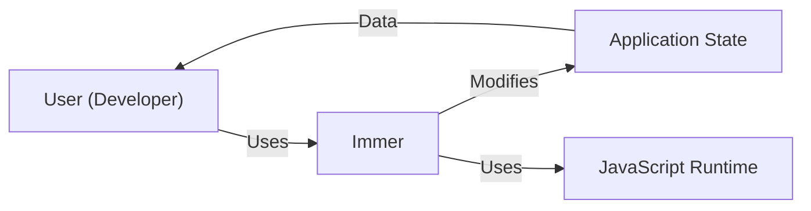
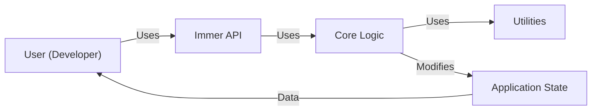
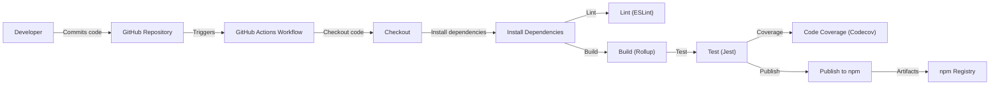

# BUSINESS POSTURE

Immer is a tiny package that allows you to work with immutable state in a more convenient way. It is based on the copy-on-write mechanism. Immer is focused on simplifying the development of applications that manage immutable data structures, primarily within the JavaScript ecosystem.

Priorities and Goals:

*   Simplify immutable state management: Reduce the complexity and boilerplate code associated with updating immutable data structures.
*   Improve developer experience: Provide a more intuitive and convenient API for working with immutable state.
*   Enhance performance: Optimize the process of updating immutable data structures to minimize performance overhead.
*   Maintain compatibility: Ensure compatibility with various JavaScript environments and frameworks.
*   Ensure correctness: Guarantee that state updates are handled correctly and predictably, preventing common errors associated with mutability.
*   Community adoption and growth: Encourage widespread adoption of the library within the JavaScript community.

Business Risks:

*   Incorrect state updates: Bugs in Immer could lead to incorrect state updates, causing application malfunctions or data corruption.
*   Performance bottlenecks: Inefficient implementation of Immer's core logic could lead to performance issues in applications that heavily rely on it.
*   Compatibility issues: Changes in JavaScript environments or frameworks could break Immer's functionality, requiring updates and potentially causing disruptions for users.
*   Security vulnerabilities: Although primarily focused on state management, vulnerabilities in Immer could potentially be exploited by attackers, especially if used in security-sensitive contexts.
*   Lack of adoption: If Immer fails to gain sufficient traction within the community, its long-term maintenance and support may become unsustainable.
*   Competition: Other libraries offering similar functionality could overshadow Immer, reducing its adoption and impact.

# SECURITY POSTURE

*   security control: The project uses GitHub's built-in security features, such as code scanning and dependency analysis. Described in repository settings and workflows.
*   security control: The project has a security policy that describes how to report vulnerabilities. Described in SECURITY.md file.
*   security control: The project uses automated tests to ensure the correctness of the code. Described in package.json and workflows.
*   security control: The project uses linters to enforce code style and identify potential errors. Described in .eslintrc.js file.
*   security control: The project uses a code coverage tool to measure the effectiveness of the tests. Described in package.json and workflows.
*   security control: The project uses a static analysis tool to identify potential security vulnerabilities. Described in package.json and workflows.
*   accepted risk: The project does not currently have a dedicated security review process.
*   accepted risk: The project does not currently have a fuzzing setup.

Recommended Security Controls:

*   security control: Implement a regular security review process, including manual code review and penetration testing.
*   security control: Integrate fuzzing into the testing process to identify potential vulnerabilities.
*   security control: Implement regular security training for contributors.

Security Requirements:

*   Authentication: Not directly applicable to Immer, as it is a library for state management, not an application with user authentication.
*   Authorization: Not directly applicable to Immer.
*   Input Validation: Immer should validate its input to ensure that it is of the expected type and structure. This can help prevent errors and potential vulnerabilities.
*   Cryptography: Not directly applicable to Immer, as it does not handle sensitive data or cryptographic operations. However, if Immer is used in an application that requires cryptography, it should be used in a way that does not compromise the security of the cryptographic operations.

# DESIGN

## C4 CONTEXT

*   User (Developer):
    *   Name: User (Developer)
    *   Type: Person
    *   Description: A developer who uses Immer to manage application state.
    *   Responsibilities: Integrates Immer into their application, writes code that interacts with Immer's API.
    *   Security controls: Follows secure coding practices, keeps their development environment secure.
*   Immer:
    *   Name: Immer
    *   Type: Library
    *   Description: A library for managing immutable state in JavaScript.
    *   Responsibilities: Provides an API for creating and updating immutable data structures, ensures that state updates are performed correctly and efficiently.
    *   Security controls: Input validation, regular security reviews, automated testing, static analysis.
*   Application State:
    *   Name: Application State
    *   Type: Data
    *   Description: The data that represents the current state of the application.
    *   Responsibilities: Stores the application's data, provides access to the data for reading and updating.
    *   Security controls: Depends on the application using Immer.
*   JavaScript Runtime:
    *   Name: JavaScript Runtime
    *   Type: Environment
    *   Description: The environment in which the JavaScript code runs (e.g., browser, Node.js).
    *   Responsibilities: Executes the JavaScript code, provides access to system resources.
    *   Security controls: Browser security features, Node.js security features, regular updates.

## C4 CONTAINER

*   User (Developer):
    *   Name: User (Developer)
    *   Type: Person
    *   Description: A developer who uses Immer to manage application state.
    *   Responsibilities: Integrates Immer into their application, writes code that interacts with Immer's API.
    *   Security controls: Follows secure coding practices, keeps their development environment secure.
*   Immer API:
    *   Name: Immer API
    *   Type: API
    *   Description: The public interface of the Immer library.
    *   Responsibilities: Provides functions for creating producers and applying patches.
    *   Security controls: Input validation.
*   Core Logic:
    *   Name: Core Logic
    *   Type: Component
    *   Description: The core implementation of Immer's functionality.
    *   Responsibilities: Implements the copy-on-write mechanism, handles state updates, manages drafts.
    *   Security controls: Internal consistency checks.
*   Utilities:
    *   Name: Utilities
    *   Type: Component
    *   Description: Helper functions used by the core logic.
    *   Responsibilities: Provides common functionality, such as type checking and object manipulation.
    *   Security controls: Input validation.
*   Application State:
    *   Name: Application State
    *   Type: Data
    *   Description: The data that represents the current state of the application.
    *   Responsibilities: Stores the application's data, provides access to the data for reading and updating.
    *   Security controls: Depends on the application using Immer.

## DEPLOYMENT

Immer is a JavaScript library and is typically distributed via npm (Node Package Manager). Deployment, in this context, refers to how Immer is integrated into a project and made available to the runtime environment.

Possible deployment solutions:

1.  Direct npm install and bundling: The most common approach. Immer is installed as a project dependency, and a bundler (like Webpack, Rollup, or Parcel) includes it in the application's JavaScript bundle.
2.  CDN: Immer can be included directly from a CDN (Content Delivery Network) in browser environments, although this is less common for libraries managed through npm.
3.  Server-side rendering (SSR): In SSR scenarios, Immer is used on the server to manage state before rendering the initial HTML.

Chosen solution (Direct npm install and bundling):

*   Developer Machine:
    *   Name: Developer Machine
    *   Type: Environment
    *   Description: The developer's local machine where the code is written and built.
    *   Responsibilities: Hosts the development environment, including the code editor, build tools, and package manager.
    *   Security controls: Secure coding practices, up-to-date software, firewall, antivirus.
*   node_modules:
    *   Name: node_modules
    *   Type: Directory
    *   Description: A directory containing the project's installed dependencies, including Immer.
    *   Responsibilities: Stores the downloaded package files.
    *   Security controls: Dependency analysis, regular updates.
*   Bundler (Webpack, Rollup, etc.):
    *   Name: Bundler (Webpack, Rollup, etc.)
    *   Type: Tool
    *   Description: A tool that combines the project's code and dependencies into a single bundle.
    *   Responsibilities: Processes the code, resolves dependencies, creates the final bundle.
    *   Security controls: Secure configuration, regular updates.
*   Application Bundle:
    *   Name: Application Bundle
    *   Type: File
    *   Description: The final JavaScript file that contains the application code and its dependencies, including Immer.
    *   Responsibilities: Contains the executable code for the application.
    *   Security controls: Code minification, obfuscation (optional).
*   Server/CDN:
    *   Name: Server/CDN
    *   Type: Infrastructure
    *   Description: The server or CDN that hosts the application bundle.
    *   Responsibilities: Stores the application bundle, serves it to users.
    *   Security controls: HTTPS, firewall, regular security updates.
*   User's Browser:
    *   Name: User's Browser
    *   Type: Environment
    *   Description: The user's web browser.
    *   Responsibilities: Downloads and executes the application bundle.
    *   Security controls: Browser security features, regular updates.
*   Application using Immer:
    *   Name: Application using Immer
    *   Type: Application
    *   Description: The running application that uses Immer to manage its state.
    *   Responsibilities: Provides the application's functionality to the user.
    *   Security controls: Depends on the application's specific security requirements.

## BUILD

Immer's build process involves several steps, from compiling the source code to running tests and publishing the package to npm.

*   Developer:
    *   Name: Developer
    *   Type: Person
    *   Description: A developer contributing to the Immer project.
    *   Responsibilities: Writes code, submits pull requests.
    *   Security controls: Follows secure coding practices, keeps their development environment secure.
*   GitHub Repository:
    *   Name: GitHub Repository
    *   Type: Repository
    *   Description: The Git repository hosted on GitHub.
    *   Responsibilities: Stores the source code, tracks changes, manages pull requests.
    *   Security controls: GitHub's built-in security features, branch protection rules.
*   GitHub Actions Workflow:
    *   Name: GitHub Actions Workflow
    *   Type: Automation
    *   Description: The automated workflow defined in the repository.
    *   Responsibilities: Executes the build, test, and publish steps.
    *   Security controls: Secure configuration, limited access.
*   Checkout:
    *   Name: Checkout
    *   Type: Step
    *   Description: Checks out the source code from the repository.
    *   Responsibilities: Retrieves the latest code.
    *   Security controls: Uses secure Git protocols.
*   Install Dependencies:
    *   Name: Install Dependencies
    *   Type: Step
    *   Description: Installs the project's dependencies using npm.
    *   Responsibilities: Downloads and installs the required packages.
    *   Security controls: Dependency analysis, uses a package-lock.json file.
*   Lint (ESLint):
    *   Name: Lint (ESLint)
    *   Type: Step
    *   Description: Runs ESLint to enforce code style and identify potential errors.
    *   Responsibilities: Checks the code for style violations and potential bugs.
    *   Security controls: Uses a predefined ESLint configuration.
*   Build (Rollup):
    *   Name: Build (Rollup)
    *   Type: Step
    *   Description: Builds the library using Rollup.
    *   Responsibilities: Compiles the source code into different formats (e.g., CommonJS, ES modules).
    *   Security controls: Secure Rollup configuration.
*   Test (Jest):
    *   Name: Test (Jest)
    *   Type: Step
    *   Description: Runs the unit tests using Jest.
    *   Responsibilities: Executes the tests, reports the results.
    *   Security controls: Comprehensive test suite.
*   Code Coverage (Codecov):
    *   Name: Code Coverage (Codecov)
    *   Type: Step
    *   Description: Measures the code coverage of the tests using Codecov.
    *   Responsibilities: Generates coverage reports, uploads them to Codecov.
    *   Security controls: Uses a secure Codecov token.
*   Publish to npm:
    *   Name: Publish to npm
    *   Type: Step
    *   Description: Publishes the package to the npm registry.
    *   Responsibilities: Uploads the built artifacts to npm.
    *   Security controls: Uses a secure npm token, two-factor authentication.
*   npm Registry:
    *   Name: npm Registry
    *   Type: Registry
    *   Description: The public registry for npm packages.
    *   Responsibilities: Stores the published packages, makes them available for download.
    *   Security controls: npm's security features, regular security audits.

# RISK ASSESSMENT

*   Critical business process we are trying to protect: The core functionality of Immer is to provide a reliable and efficient way to manage immutable state. We are trying to protect the integrity and correctness of state updates in applications that use Immer.
*   Data we are trying to protect and what is their sensitivity?: Immer itself does not handle sensitive data directly. It operates on application state, and the sensitivity of that data depends entirely on the application using Immer. If an application uses Immer to manage sensitive data (e.g., personal information, financial data), then that data would be considered sensitive. However, Immer's role is simply to manage the state, not to provide security for the data itself. The application is responsible for implementing appropriate security measures to protect the data.

# QUESTIONS & ASSUMPTIONS

*   Questions:
    *   Are there any specific performance benchmarks or targets that Immer needs to meet?
    *   Are there any specific JavaScript environments or frameworks that Immer needs to be particularly optimized for?
    *   Are there any plans to extend Immer's functionality beyond its current scope?
    *   What is the process for handling breaking changes and major version updates?
*   Assumptions:
    *   Business Posture: We assume that the primary goal is to provide a stable and reliable library for immutable state management, prioritizing correctness and ease of use over adding new features.
    *   Security Posture: We assume that the current security measures (code scanning, dependency analysis, automated tests, linters) are sufficient for the current risk level, but acknowledge the need for a more formal security review process and fuzzing in the future.
    *   Design: We assume that the current design is modular and well-structured, allowing for future extensions and modifications without significant refactoring. We also assume that the use of Rollup and Jest is appropriate for the project's build and testing needs.