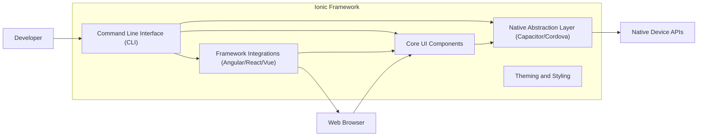
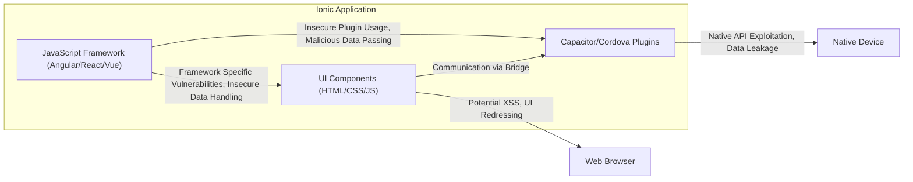
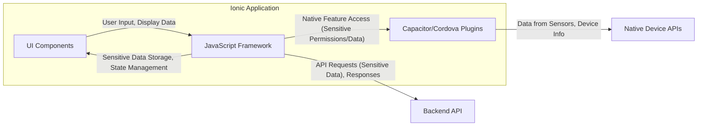

## Project Design Document: Ionic Framework for Threat Modeling (Improved)

**1. Introduction**

This document provides an enhanced architectural overview of the Ionic Framework, an open-source UI toolkit for building performant, high-quality mobile and desktop apps using web technologies (HTML, CSS, and JavaScript/TypeScript). This document is specifically designed to facilitate thorough threat modeling activities by clearly outlining the key components, data flows, interactions, and potential attack surfaces within the framework and the applications built using it. Understanding these aspects is crucial for identifying and mitigating potential security vulnerabilities.

**2. Project Overview**

The Ionic Framework aims to streamline cross-platform application development by providing a reusable set of UI components, developer tools, and services. It leverages established web standards and integrates seamlessly with popular JavaScript frameworks like Angular, React, and Vue, allowing developers to write code once and deploy it across multiple platforms (iOS, Android, web, and desktop). This unified approach, while efficient, introduces unique security considerations that need careful examination during threat modeling.

**3. Architectural Overview**

The Ionic Framework's architecture can be viewed as a layered system, each layer presenting distinct security implications:

*   **Core UI Components:**
    *   A library of pre-built, platform-aware UI elements (buttons, lists, modals, etc.) constructed using standard web technologies (HTML, CSS, JavaScript/TypeScript).
    *   These components aim for a consistent user experience across platforms but rely on the underlying rendering engine (browser or native web view), which can introduce platform-specific vulnerabilities.
    *   Potential attack surfaces include XSS vulnerabilities within component logic or styling and reliance on secure handling of user input.
*   **Native Abstraction Layer (Capacitor/Cordova):**
    *   This layer acts as a bridge, enabling Ionic applications to access native device functionalities (camera, geolocation, sensors) through JavaScript APIs.
    *   Capacitor is the recommended modern approach, offering better control and security compared to the legacy Cordova.
    *   Threats here involve vulnerabilities in the plugins themselves, insecure communication between the web view and native code, and potential exposure of sensitive native APIs.
*   **Command Line Interface (CLI):**
    *   A vital tool for developers, the CLI manages project creation, building, testing, and deployment.
    *   It interacts with the developer's local environment, package managers (npm/yarn), and potentially remote repositories or services.
    *   Security concerns include supply chain attacks through compromised dependencies, vulnerabilities in the CLI itself, and the secure handling of developer credentials.
*   **Framework Integrations (Angular, React, Vue):**
    *   Ionic is designed to work with these frameworks, which handle application logic, data management, and routing.
    *   Security vulnerabilities within the chosen framework can directly impact the security of the Ionic application.
    *   Threat modeling must consider the specific security best practices and potential weaknesses of the integrated framework.
*   **Theming and Styling:**
    *   Mechanisms for customizing the application's visual appearance using CSS and theming variables.
    *   While primarily aesthetic, insecure CSS or theming configurations could potentially be exploited for visual spoofing or information disclosure.

**4. Key Components and Their Interactions (Focus on Attack Surfaces)**

*   **Core UI Components:**
    *   Rendered within a web view, making them susceptible to standard web vulnerabilities like XSS if user-provided data is not properly sanitized before being displayed.
    *   Interactions with the JavaScript framework can introduce vulnerabilities if data binding mechanisms are not handled securely.
    *   Custom components developed by the application developer can also introduce vulnerabilities if not implemented with security in mind.
*   **Native Abstraction Layer (Capacitor/Cordova):**
    *   Communication between the JavaScript layer and native code through plugins is a critical point. Malicious plugins or vulnerabilities in existing plugins can grant access to sensitive device features or compromise the application's integrity.
    *   Insecurely configured plugins or improper handling of data passed to native APIs can create vulnerabilities.
    *   The security of this layer heavily relies on the security of the underlying native platform.
*   **Command Line Interface (CLI):**
    *   The CLI's access to the local file system and network makes it a potential target. Compromised dependencies pulled during the build process can inject malicious code.
    *   Storing sensitive credentials or API keys within the project or accessible by the CLI poses a significant risk.
    *   Vulnerabilities in the CLI itself could allow attackers to manipulate the build process.
*   **Framework Integrations (Angular, React, Vue):**
    *   Security best practices for the chosen framework must be followed diligently. Vulnerabilities in the framework or its ecosystem can be exploited in the Ionic application.
    *   Improperly implemented routing, state management, or data handling within the framework can introduce security flaws.
*   **Theming and Styling:**
    *   While less critical, malicious CSS could potentially be used for UI redressing attacks or to leak information.
    *   Insecurely managed theming variables could expose sensitive information.

**5. Data Flow (Identifying Sensitive Data and Potential Leaks)**

Understanding how data flows within an Ionic application is crucial for identifying potential data breaches and vulnerabilities:

*   **Internal Application Data Flow:**
    *   Data managed by the chosen JavaScript framework, potentially including user input, application state, and configuration.
    *   Sensitive data stored in the application's memory or local storage needs careful protection.
    *   Potential threats include unauthorized access to in-memory data or insecure storage of sensitive information.
*   **Communication with Backend Services:**
    *   Data exchanged with backend APIs, potentially including user credentials, personal information, and application-specific data.
    *   Secure communication protocols (HTTPS) and proper authentication/authorization mechanisms are essential.
    *   Vulnerabilities include man-in-the-middle attacks, insecure API endpoints, and insufficient authentication.
*   **Interaction with Native Device Features:**
    *   Data passed to and received from native device APIs through Capacitor/Cordova plugins.
    *   This can include sensitive data like location, camera access, and contacts.
    *   Threats involve unauthorized access to native features, data leakage through insecure plugins, and improper handling of permissions.
*   **Build and Deployment Process:**
    *   Data flowing through the build pipeline, including source code, dependencies, and configuration files.
    *   Exposure of sensitive information during the build process or through insecure deployment practices is a risk.

**6. Security Considerations (Detailed Potential Threats)**

This section expands on potential security concerns, providing more specific examples of threats:

*   **Client-Side Security:**
    *   **Cross-Site Scripting (XSS):** Malicious scripts injected through user input or vulnerable dependencies can steal user data, manipulate the UI, or perform actions on behalf of the user. *Threat Example: An attacker injects a script into a comment field that steals session cookies.*
    *   **Insecure Data Storage:** Storing sensitive data like API keys or user tokens in `localStorage` or IndexedDB without proper encryption makes it vulnerable to theft. *Threat Example: A malicious app on the same device reads the `localStorage` of the Ionic app to steal an API key.*
    *   **Insecure Communication:** Using HTTP instead of HTTPS for API calls exposes data in transit to eavesdropping and manipulation. *Threat Example: An attacker intercepts network traffic and steals user credentials being sent to the backend.*
    *   **Dependency Vulnerabilities:** Using outdated or vulnerable third-party libraries can introduce known security flaws. *Threat Example: A vulnerable version of a UI component library allows an attacker to trigger a denial-of-service attack.*
*   **Native Integration Security:**
    *   **Plugin Vulnerabilities:** Security flaws in Capacitor/Cordova plugins can allow attackers to access native device features without proper authorization. *Threat Example: A vulnerable camera plugin allows an attacker to remotely access the device's camera.*
    *   **Insecure Plugin Usage:** Improperly using plugin APIs, such as not validating data passed to native functions, can create vulnerabilities. *Threat Example: Passing unsanitized user input to a file system plugin allows an attacker to access arbitrary files.*
    *   **Platform-Specific Security Issues:**  Understanding and adhering to the security models of iOS and Android is crucial. Misconfigurations or bypassing platform security features can lead to vulnerabilities. *Threat Example: Improperly configured intent filters on Android expose sensitive application functionality.*
*   **Build and Deployment Security:**
    *   **Supply Chain Attacks:** Compromised dependencies in `package.json` can inject malicious code into the application during the build process. *Threat Example: A malicious dependency steals environment variables containing API keys.*
    *   **Insecure Build Processes:** Vulnerabilities in the build pipeline or the tools used can allow attackers to inject malicious code. *Threat Example: A compromised build server injects malware into the application package.*
    *   **Exposure of Secrets:** Storing API keys, database credentials, or other sensitive information directly in the codebase or build scripts is a major security risk. *Threat Example: Hardcoded API keys are discovered in the public repository.*
*   **Authentication and Authorization:**
    *   **Insecure Authentication:** Weak or improperly implemented authentication mechanisms can allow unauthorized access. *Threat Example: Using easily guessable default credentials or not implementing proper password hashing.*
    *   **Broken Authorization:** Failing to properly authorize user actions can allow users to access resources they shouldn't. *Threat Example: A user can access another user's data by manipulating URL parameters.*
*   **Data Validation and Sanitization:**
    *   **Injection Attacks:** Failing to validate and sanitize user input can lead to injection attacks like SQL injection or command injection if the application interacts with a backend. *Threat Example: Unsanitized user input is used in a database query, allowing an attacker to execute arbitrary SQL commands.*

**7. Deployment Model (Impact on Attack Surface)**

The chosen deployment model significantly impacts the application's attack surface:

*   **Web Applications:** Exposed to typical web vulnerabilities and browser-based attacks. Security relies heavily on web server configuration and browser security features.
*   **Native Mobile Applications:**  Subject to mobile-specific threats, including reverse engineering, malware injection, and vulnerabilities in the underlying operating system. App store security measures play a role.
*   **Desktop Applications:**  Similar to native mobile applications but with a different set of platform-specific security considerations.
*   **Progressive Web Apps (PWAs):**  Combine aspects of web and native apps, inheriting security considerations from both. Service worker security is a key area.

**8. Assumptions and Constraints**

*   This document assumes a foundational understanding of web and mobile application development principles.
*   The primary focus is on the security aspects of the Ionic Framework and applications built with it. Backend service security is considered an external dependency but its interaction points are highlighted.
*   The document assumes the use of Capacitor as the primary native abstraction layer but acknowledges the existence of Cordova and its associated security implications.
*   Security best practices within individual Ionic applications are the ultimate responsibility of the application developers. This document aims to provide the architectural context for those practices.

**9. Future Considerations**

*   Detailed threat modeling exercises focusing on specific components and data flows.
*   Security audits of commonly used Capacitor/Cordova plugins.
*   Analysis of the security implications of different state management and routing strategies within Ionic applications.
*   Development of secure coding guidelines specifically for Ionic development.

This improved design document provides a more detailed and security-focused overview of the Ionic Framework, making it a more effective tool for conducting thorough threat modeling activities. By explicitly highlighting potential attack surfaces and linking them to specific threats, this document empowers security professionals to proactively identify and mitigate risks in Ionic-based applications.