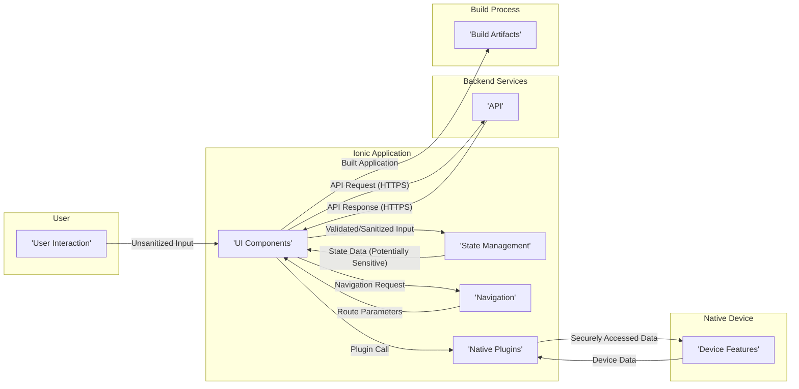

# Project Design Document: Ionic Framework (Improved for Threat Modeling)

**Version:** 1.1
**Date:** October 26, 2023
**Prepared By:** Gemini (AI Architect)

## 1. Introduction

This document provides an enhanced architectural design of the Ionic Framework, an open-source UI toolkit for building performant, high-quality mobile and web apps using web technologies like HTML, CSS, and JavaScript. This revised document is specifically tailored to facilitate comprehensive threat modeling activities, providing more granular details about the framework's components, interactions, and data flow with a security-focused lens.

### 1.1. Purpose

The primary purpose of this document is to provide a detailed and security-focused understanding of the Ionic Framework's architecture for thorough security analysis and threat modeling. It meticulously outlines the key components, their interactions, and the data flow within the framework, highlighting potential security implications at each stage. This document will serve as a robust foundation for identifying a wider range of potential security vulnerabilities and designing more effective mitigation strategies.

### 1.2. Scope

This document covers the core architectural components of the Ionic Framework as represented in the provided GitHub repository (https://github.com/ionic-team/ionic-framework). It maintains a focus on the framework itself and its primary functionalities, with expanded detail relevant to security considerations, including:

*   Core UI components and their potential for client-side vulnerabilities.
*   Navigation and routing mechanisms and associated security risks.
*   State management patterns and potential data exposure points.
*   Integration with native device features via plugins and their security implications.
*   The build and deployment process, highlighting supply chain security aspects.

This document continues to *not* cover:

*   Specific application code built using Ionic (implementation-specific vulnerabilities).
*   Backend services or APIs that an Ionic application might interact with (focus remains on the framework itself).
*   Detailed implementation specifics of individual components (focus is on architectural security aspects).
*   Third-party libraries and frameworks used within applications built with Ionic, unless they are integral to the core Ionic Framework's functionality and security posture.

### 1.3. Target Audience

This document is primarily intended for:

*   Security architects and engineers responsible for in-depth threat modeling, security assessments, and penetration testing of systems built using the Ionic Framework.
*   Software architects and developers requiring a detailed understanding of the Ionic Framework's architecture with a strong emphasis on security considerations.
*   DevSecOps engineers involved in securing the build, deployment, and runtime environments of Ionic applications.

## 2. System Overview

The Ionic Framework empowers developers to build cross-platform applications leveraging web technologies. It offers a rich set of UI components, development tools, and integration services. Fundamentally, an Ionic application is a web application that can operate within a standard web browser or be encapsulated within a native container (using technologies like Cordova or Capacitor) to access native device capabilities. This dual nature introduces unique security considerations.

### 2.1. Key Characteristics

*   **Open Source:** The framework's transparency allows for community scrutiny but also potential exposure of vulnerabilities if not properly managed.
*   **Component-Based Architecture:** While promoting modularity, the security of individual components and their interactions is crucial.
*   **Cross-Platform:**  The need to function across diverse platforms introduces complexities in managing platform-specific security requirements.
*   **Web Standards:**  Reliance on web standards means inheriting the security challenges inherent in web technologies (e.g., XSS, CSRF).
*   **Native Access:**  Bridging the gap to native functionalities through plugins introduces a significant attack surface if plugins are vulnerable.
*   **Theming:** While primarily aesthetic, theming mechanisms might inadvertently expose sensitive information if not implemented carefully.

## 3. Architectural Design

The Ionic Framework's architecture comprises several interconnected components, each with its own security profile:

*   **Ionic CLI (Command Line Interface):**  The primary tool for development workflows, its security is vital to prevent malicious code injection during development and build processes.
*   **Core Framework:** The foundation of Ionic applications, its security is paramount for the overall application security.
    *   **UI Components:**  Potential for DOM-based XSS vulnerabilities if not used correctly.
    *   **Navigation:**  Improperly secured navigation can lead to unauthorized access to application sections.
    *   **State Management:**  Sensitive data stored in the state needs careful handling to prevent exposure.
    *   **Theming Engine:**  While seemingly benign, vulnerabilities here could lead to visual spoofing or information leakage.
*   **Native Plugins (Cordova/Capacitor):**  A critical bridge to native functionalities, representing a significant attack surface if plugins are vulnerable or permissions are misconfigured.
*   **Build Process:**  A crucial stage where vulnerabilities can be introduced if the process is not secured (supply chain attacks).
*   **Deployed Application:** The runtime environment where security measures are actively enforced or potentially bypassed.
*   **Development Environment:**  The security of developer machines and tooling is essential to prevent the introduction of vulnerabilities early in the development lifecycle.
*   **Third-Party Libraries:**  Dependencies can introduce vulnerabilities if not regularly updated and vetted.

### 3.1. Component Interaction Diagram

```mermaid
graph LR
    subgraph "Development Environment"
        A["'Developer'"]
    end
    subgraph "Ionic CLI"
        B["'Ionic CLI'"]
    end
    subgraph "Core Framework"
        C["'UI Components'"]
        D["'Navigation'"]
        E["'State Management'"]
        F["'Theming Engine'"]
    end
    subgraph "Native Plugins (Cordova/Capacitor)"
        G["'Plugin Interface'"]
        H["'Native Device Features'"]
    end
    subgraph "Build Process"
        I["'Webpack/Bundler'"]
        J["'Cordova/Capacitor CLI'"]
        K["'Platform SDKs (iOS, Android)'"]
    end
    subgraph "Deployed Application"
        L["'Web Browser'"]
        M["'Mobile Device (iOS/Android)'"]
    end
    subgraph "Third-Party Libraries"
        N["'External Libraries'"]
    end

    A --> B
    B --> C
    B --> D
    B --> E
    B --> F
    B --> I
    B --> J

    C --> N
    D --> C
    E --> C

    C --> G
    D --> G
    E --> G

    G --> H

    I --> C
    I --> D
    I --> E
    I --> F
    I --> N

    J --> I
    J --> K

    K --> M

    L <-- I
    M <-- J
```

### 3.2. Component Descriptions (Security Focused)

*   **Ionic CLI:**  Requires secure installation and dependency management to prevent malicious packages. Its commands can execute scripts, posing a risk if compromised.
*   **UI Components:**  Developers must use components correctly to avoid introducing DOM-based XSS vulnerabilities. Input sanitization and secure coding practices are crucial.
*   **Navigation:**  Authentication and authorization checks must be implemented at navigation boundaries to prevent unauthorized access to application views. Deep linking vulnerabilities should be considered.
*   **State Management:**  Sensitive data within the state should be encrypted or protected from unauthorized access. Consider the persistence and scope of state data.
*   **Theming Engine:**  Ensure that theming mechanisms do not inadvertently expose sensitive information or allow for visual spoofing attacks.
*   **Native Plugins:**  Plugins should be carefully vetted for vulnerabilities and only necessary permissions should be granted. Communication between the webview and native code needs to be secure.
*   **Webpack/Bundler:**  Configuration needs to be secure to prevent the inclusion of malicious code or the exposure of sensitive source code.
*   **Cordova/Capacitor CLI:**  Secure management of platform projects and plugin installations is essential. Platform-specific build configurations need review for security settings.
*   **Platform SDKs (iOS, Android):**  Utilizing the SDKs securely involves adhering to platform security best practices and keeping the SDKs updated.
*   **Web Browser:**  Security relies on the browser's security model, but developers must still mitigate client-side vulnerabilities.
*   **Mobile Device (iOS/Android):**  Security depends on the device's operating system security, but the application must also implement its own security measures.
*   **External Libraries:**  Regularly audit and update third-party libraries to patch known vulnerabilities. Implement Software Composition Analysis (SCA).

## 4. Data Flow

The movement and transformation of data within an Ionic application present various security considerations:

*   **User Input:**  A primary entry point for attacks. Input validation and sanitization are crucial to prevent injection attacks (XSS, SQL Injection if passed to backend).
*   **Application State:**  Sensitive data within the state needs protection against unauthorized access, modification, or leakage. Consider encryption at rest and in transit (within the application).
*   **API Communication:**  All communication with backend services must be secured using HTTPS. Implement proper authentication and authorization mechanisms. Protect against API-specific attacks (e.g., injection, broken authentication).
*   **Native Device Data:**  Access to native device features and data requires careful permission management and secure handling of sensitive information (e.g., geolocation, camera data).
*   **Build Artifacts:**  The integrity and confidentiality of build artifacts must be maintained to prevent tampering or the introduction of malicious code.

### 4.1. Data Flow Diagram (Security Focused)



### 4.2. Data Flow Descriptions (Security Focused)

*   **User Interaction to Application State:**  Untrusted user input needs rigorous validation and sanitization within UI components before being stored in the application state to prevent XSS and other injection attacks.
*   **Application State to UI Components:**  Ensure that sensitive data displayed in UI components is properly encoded to prevent information leakage or manipulation.
*   **Navigation:**  Verify user authorization before allowing navigation to sensitive parts of the application. Protect route parameters from manipulation.
*   **Native Plugin Interaction:**  Securely manage permissions requested by plugins. Validate data received from native device features to prevent unexpected behavior or vulnerabilities.
*   **API Communication:**  Enforce HTTPS for all API communication. Implement robust authentication (e.g., OAuth 2.0, JWT) and authorization mechanisms. Protect against common API vulnerabilities.
*   **Build Process:**  Secure the build environment to prevent the injection of malicious code into build artifacts. Implement integrity checks for dependencies and build outputs.

## 5. Security Considerations (Detailed for Threat Modeling)

This section expands on the initial security considerations, providing more specific examples and categorizing threats for a more structured threat modeling process.

*   **Client-Side Security:**
    *   **Cross-Site Scripting (XSS):**  Ensure proper input sanitization and output encoding in UI components to prevent injection of malicious scripts.
    *   **DOM-based XSS:**  Avoid using `innerHTML` or other potentially dangerous DOM manipulation methods with untrusted data.
    *   **Cross-Site Request Forgery (CSRF):** Implement anti-CSRF tokens for sensitive actions.
    *   **Local Storage/Session Storage Security:**  Avoid storing sensitive information in local or session storage without proper encryption.
    *   **Man-in-the-Browser Attacks:**  Consider the risk of browser extensions or malware injecting malicious code.
*   **Third-Party Dependencies:**
    *   **Known Vulnerabilities:** Regularly scan dependencies for known vulnerabilities using tools like npm audit or yarn audit.
    *   **Malicious Packages:**  Be cautious of typosquatting or malicious packages. Verify the integrity of dependencies.
    *   **Supply Chain Attacks:**  Secure the dependency management process and consider using dependency pinning.
*   **Native Plugin Security:**
    *   **Plugin Vulnerabilities:**  Thoroughly vet plugins for known vulnerabilities before integration.
    *   **Excessive Permissions:**  Only grant plugins the necessary permissions.
    *   **Insecure Communication:**  Ensure secure communication between the webview and native plugin code.
    *   **Data Leakage:**  Prevent plugins from unintentionally exposing sensitive device data.
*   **Build Pipeline Security:**
    *   **Compromised Build Servers:**  Secure build servers and restrict access.
    *   **Malicious Code Injection:**  Implement measures to prevent the injection of malicious code during the build process.
    *   **Exposure of Secrets:**  Avoid storing sensitive credentials directly in the codebase or build scripts. Use secure secret management solutions.
*   **Data Storage:**
    *   **Insecure Local Storage:**  Encrypt sensitive data stored locally on the device.
    *   **Data at Rest:**  Consider platform-specific secure storage options.
    *   **Data in Transit (within the app):**  Encrypt sensitive data passed between components if necessary.
*   **Communication Security:**
    *   **Insecure HTTP:**  Enforce HTTPS for all communication with backend services.
    *   **Certificate Pinning:**  Consider certificate pinning for enhanced security against MITM attacks.
    *   **API Security:**  Implement proper authentication, authorization, and rate limiting for backend APIs.
*   **Authentication and Authorization:**
    *   **Weak Authentication:**  Use strong password policies and multi-factor authentication where appropriate.
    *   **Broken Authorization:**  Implement proper access controls to prevent unauthorized access to resources.
    *   **Session Management:**  Securely manage user sessions and prevent session hijacking.
*   **Platform-Specific Security:**
    *   **iOS Security Considerations:**  Address iOS-specific security features and vulnerabilities (e.g., App Transport Security).
    *   **Android Security Considerations:**  Address Android-specific security features and vulnerabilities (e.g., permission model).
    *   **Web Security Considerations:**  Adhere to general web security best practices.

## 6. Deployment Model (Security Implications)

The chosen deployment model significantly impacts the security considerations:

*   **Native Mobile Applications (iOS/Android):**
    *   **App Store Security:**  Reliance on app store vetting processes for initial security checks.
    *   **Device Security:**  Leveraging platform security features like sandboxing and permissions.
    *   **Local Data Storage:**  Opportunities for secure local storage using platform-specific APIs.
    *   **Offline Functionality:**  Potential risks associated with storing sensitive data for offline access.
*   **Progressive Web Apps (PWAs):**
    *   **Web Browser Security:**  Reliance on the browser's security model.
    *   **Service Worker Security:**  Secure implementation of service workers to prevent interception and manipulation.
    *   **HTTPS Requirement:**  PWAs require HTTPS, providing a baseline level of security.
    *   **Limited Native Access:**  Reduced attack surface compared to native apps due to limited access to native features.
*   **Desktop Applications (via Electron or similar):**
    *   **Bundled Node.js Environment:**  Introduces potential vulnerabilities from the Node.js ecosystem.
    *   **Operating System Security:**  Security depends on the underlying operating system.
    *   **Distribution Challenges:**  Secure distribution mechanisms are crucial.

## 7. Technologies Used

*   **Core Languages:** HTML, CSS, JavaScript/TypeScript (Potential for client-side vulnerabilities)
*   **Framework:** Ionic Framework (Core architecture and component security)
*   **Native Bridges:** Cordova or Capacitor (Plugin security and native API access)
*   **Bundler:** Webpack (typically) (Build process security)
*   **Package Manager:** npm or yarn (Dependency management security)
*   **Platform SDKs:** iOS SDK, Android SDK (Platform-specific security considerations)

## 8. Diagrams

The provided component interaction and data flow diagrams offer a visual representation of the system's architecture and data movement, crucial for understanding potential attack vectors and vulnerabilities. The security-focused annotations in the data flow diagram highlight critical areas for security considerations.

## 9. Conclusion

This enhanced document provides a more detailed and security-focused understanding of the Ionic Framework's architecture, specifically designed to facilitate comprehensive threat modeling. By outlining the key components, their interactions, and the flow of data with security implications highlighted, this document serves as a robust foundation for identifying a wider range of potential security threats and developing more effective mitigation strategies. This detailed analysis will enable a more thorough and targeted threat modeling process, leading to more secure applications built with the Ionic Framework.