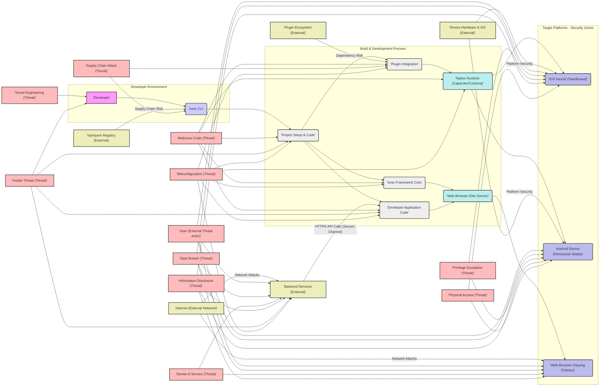

# Project Design Document: Enhanced Ionic Framework for Threat Modeling

## 1. Introduction

This document provides an enhanced design overview of the Ionic Framework, an open-source mobile and web application development framework. Building upon the initial design document, this version is specifically refined to serve as a robust foundation for threat modeling activities. It delves deeper into the system architecture, key components, data flow, and technologies, with a stronger emphasis on security considerations. The goal is to provide security professionals, developers, and stakeholders with a comprehensive understanding of the Ionic Framework's internal workings and potential security vulnerabilities, enabling effective risk assessment and mitigation strategies for applications built using this framework.

## 2. System Overview

The Ionic Framework remains a platform-agnostic framework designed for building hybrid mobile applications and Progressive Web Applications (PWAs). Its core strength lies in leveraging web technologies (HTML, CSS, JavaScript/TypeScript) to create cross-platform user interfaces. This document further emphasizes the security implications inherent in this architecture, particularly concerning the bridge between web technologies and native device functionalities.

**Key Features and Functionalities (Security-Relevant Highlights):**

*   **Cross-Platform Development (Security Boundary):** While offering convenience, the cross-platform nature introduces a security boundary between the web view and the native platform, requiring careful management of permissions and data exchange.
*   **Web Standards Based (Common Web Vulnerabilities):**  Reliance on web standards means Ionic applications are susceptible to common web vulnerabilities like XSS, CSRF, and injection attacks if not properly secured.
*   **UI Components (Potential UI Redress):**  While providing pre-built components, developers must ensure proper handling of user input and output within these components to prevent UI redress or clickjacking vulnerabilities.
*   **Native Device Access (Permission Management):** Access to native device features via plugins necessitates a robust permission model and careful consideration of plugin trustworthiness and security implications.
*   **Command-Line Interface (CLI) (Development Environment Security):** The Ionic CLI, while streamlining development, can introduce security risks if the development environment itself is compromised or if insecure dependencies are introduced during project setup.
*   **Theming and Customization (CSS Injection):**  Customization through theming requires careful handling of CSS to prevent CSS injection vulnerabilities that could alter the application's appearance or behavior maliciously.
*   **Performance Optimization (Security vs. Performance Trade-offs):** Performance optimizations should not compromise security. Caching strategies, for example, must be implemented securely to avoid exposing sensitive data.

**Target Platforms (Security Variations):**

*   iOS (Stricter App Store Security, Sandboxing)
*   Android (More Permissive, Broader Device Range, Fragmentation)
*   Web Browsers (Varying Security Policies, Browser-Specific Vulnerabilities)
*   Electron (Desktop Environment Security Considerations, OS-Level Access)

**Core Components (High-Level - Security Perspective):**

*   **Ionic CLI (Development Toolchain Security):**  Potential point of entry for supply chain attacks or compromised development environments.
*   **Ionic Framework Core (Web Application Security):**  Subject to typical web application vulnerabilities, requires secure coding practices.
*   **Native Runtime (Capacitor or Cordova) (Native Bridge Security):**  Critical security boundary, responsible for permission management and secure communication with native APIs.
*   **Plugins (Native Extension Security):**  Third-party code with potential vulnerabilities, requires careful vetting and permission control.
*   **Developer Application Code (Application Logic Security):**  Primary responsibility for developers to implement secure application logic, authentication, authorization, and data handling.

## 3. Architecture Diagram (Enhanced for Security Context)

**Diagram Enhancements and Security Context:**

*   **Security Zones:** Target platforms are now labeled with security context (Sandboxed iOS, Permission Model Android, Varying Policies Web Browser).
*   **External Entities:**  Diagram explicitly includes external entities like Backend Services, Plugin Ecosystem, npm/yarn Registry, Device Hardware/OS, and the Internet, highlighting external dependencies and threat vectors.
*   **Threat Actors and Threats:**  "User" is represented as a potential threat actor. Common threats like Malicious Code, Data Breach, Privilege Escalation, Denial of Service, Information Disclosure, Supply Chain Attack, Social Engineering, Physical Access, Insider Threat, and Misconfiguration are explicitly linked to relevant components, providing a visual starting point for threat modeling.
*   **Secure Communication:** HTTPS API calls are explicitly marked as a "Secure Channel."
*   **Risk Indicators:** "Dependency Risk" and "Supply Chain Risk" labels highlight potential vulnerabilities associated with external dependencies.
*   **Data Flow Emphasis:** Dashed red lines visually emphasize the data flow paths, which are critical areas for security analysis. Blue lines highlight plugin communication paths.

## 4. Data Flow (Detailed Security Perspective)

This section expands on the data flow, focusing on security implications at each stage:

*   **Development Time Data Flow (Security Risks):**
    *   **Developer Code Creation (Source Code Vulnerabilities):** Developers can introduce vulnerabilities through insecure coding practices (e.g., hardcoded credentials, SQL injection flaws, XSS vulnerabilities). Secure code reviews and static analysis are crucial.
    *   **Ionic CLI Interactions (CLI Tool Security, Supply Chain):**  The Ionic CLI itself could be compromised or rely on vulnerable dependencies from `npm/yarn`. Using verified CLI versions and secure dependency management is essential. Project configuration files can also contain sensitive information if not handled carefully.
    *   **Dependency Management (Dependency Vulnerabilities, Supply Chain Attacks):** `npm` and `yarn` introduce supply chain risks. Malicious packages or compromised registries can inject vulnerabilities into the project. Dependency scanning and using lock files are important mitigations.
    *   **Build Process (Build Pipeline Security, Artifact Integrity):** The build process must be secure to prevent tampering with the application artifacts. A compromised build pipeline can inject malicious code. Code signing and build artifact verification are necessary.

*   **Runtime Data Flow (Application Execution - Security Critical Paths):**
    *   **Application Startup (Initialization Security):** Application initialization should be secure, avoiding loading of malicious configurations or code. Secure bootstrapping processes are important.
    *   **UI Rendering (XSS, UI Redress):**  Dynamic UI rendering must be carefully handled to prevent XSS vulnerabilities. Input sanitization and secure templating are crucial. UI components should be used securely to avoid UI redress attacks.
    *   **User Input (Input Validation, Injection Attacks):** All user input must be rigorously validated and sanitized on both the client and server-side to prevent injection attacks (XSS, SQL injection, command injection).
    *   **Data Handling (Data Security at Rest and in Transit):**
        *   **Local Storage (Insecure Storage):** `localStorage` and similar browser storage mechanisms are inherently insecure for sensitive data. Consider using secure storage options provided by Capacitor/Cordova plugins or native APIs, with encryption at rest.
        *   **Device Sensors and Features (Permission Abuse, Data Leakage):** Access to device sensors and features via plugins requires careful permission management. Overly broad permissions can lead to privilege escalation or data leakage. Data accessed from sensors should be treated as potentially sensitive.
        *   **Backend APIs (API Security, Authentication, Authorization):** Communication with backend APIs must be secured using HTTPS. APIs should implement robust authentication and authorization mechanisms to prevent unauthorized access and data breaches. API endpoints should be protected against common web attacks (e.g., injection, broken authentication).
        *   **Application State Management (State Management Security):** Application state management should be implemented securely, avoiding storing sensitive data in easily accessible or unencrypted state. State management libraries should be used securely to prevent state manipulation vulnerabilities.
    *   **Network Communication (Man-in-the-Middle Attacks, Data Interception):** All network communication, especially with backend servers, must be encrypted using HTTPS to prevent man-in-the-middle attacks and data interception. Certificate pinning can enhance security.
    *   **Plugin Communication (Native Bridge Security, Plugin Vulnerabilities):** Communication between the web view and native runtime via plugins is a critical security boundary. Plugin vulnerabilities or insecure plugin interfaces can be exploited to gain native-level access or compromise device security. Plugin vetting and secure plugin usage are essential.

## 5. Component Breakdown (Detailed Security Analysis)

This section provides a more detailed breakdown of each component, focusing on security aspects and potential vulnerabilities:

*   **Ionic CLI (Command-Line Interface) - Security Considerations:**
    *   **Dependency Management Security:** Relies on `npm/yarn` for dependency management, inheriting supply chain risks.
        *   **Mitigation:** Use `npm audit` or `yarn audit`, lock files (`package-lock.json`, `yarn.lock`), and consider dependency scanning tools.
    *   **Plugin Management Security:**  Manages plugins, potentially introducing vulnerable or malicious plugins.
        *   **Mitigation:** Vet plugins before installation, use plugins from reputable sources, and regularly update plugins.
    *   **Project Generation Security:** Project templates could contain vulnerabilities or insecure configurations.
        *   **Mitigation:** Review generated project code and configurations for security best practices.
    *   **Build Process Security:**  Build scripts and processes could be manipulated to inject malicious code.
        *   **Mitigation:** Secure the build environment, use version control for build scripts, and implement build artifact verification.
    *   **Credential Management:**  May handle API keys or deployment credentials.
        *   **Mitigation:** Avoid storing credentials directly in code or configuration files. Use environment variables or secure credential management systems.

*   **Ionic Framework Core - Security Considerations:**
    *   **Web Component Security (XSS Vulnerabilities):**  UI components, if not used correctly, can be susceptible to XSS vulnerabilities.
        *   **Mitigation:** Follow Ionic's secure coding guidelines, sanitize user input when rendering UI components, and use secure templating practices.
    *   **Navigation and Routing Security (Authorization Bypass):**  Improperly configured navigation and routing can lead to authorization bypass vulnerabilities.
        *   **Mitigation:** Implement robust authorization checks at each route and navigation point.
    *   **Theming and Styling Security (CSS Injection):**  Custom theming and styling can introduce CSS injection vulnerabilities.
        *   **Mitigation:** Sanitize CSS input and follow secure CSS coding practices.
    *   **State Management Security (Data Exposure):**  If using built-in or external state management, ensure sensitive data is not exposed or stored insecurely in the state.
        *   **Mitigation:** Encrypt sensitive data in state if necessary, and follow secure state management patterns.

*   **Native Runtime (Capacitor or Cordova) - Security Considerations (Critical Security Boundary):**
    *   **Plugin Security (Plugin Vulnerabilities, Malicious Plugins):** Plugins are third-party code and can contain vulnerabilities or be intentionally malicious.
        *   **Mitigation:** Thoroughly vet plugins before use, use plugins from trusted sources, review plugin code if possible, and regularly update plugins. Implement a plugin security policy.
    *   **Native API Access Control (Permission Management, Privilege Escalation):**  The native runtime controls access to native device APIs. Improper permission management can lead to privilege escalation.
        *   **Mitigation:** Implement the principle of least privilege for plugin permissions. Request only necessary permissions. Review and understand plugin permission requests. Use Capacitor's permission API for fine-grained control.
    *   **Native Bridge Security (Communication Channel Security):** The communication channel between the web view and native code must be secure to prevent injection or tampering.
        *   **Mitigation:** Capacitor and Cordova implement security measures for the native bridge. Keep the native runtime updated to benefit from security patches.
    *   **Application Packaging Security (Code Signing, Tamper Detection):**  The native runtime packages the web application into native app bundles. Secure packaging and code signing are essential to prevent tampering.
        *   **Mitigation:** Implement proper code signing for iOS and Android applications. Consider using tamper detection mechanisms.

*   **Plugins (Native Functionality Access) - Security Considerations (Third-Party Code Risk):**
    *   **Plugin Vulnerabilities (Code Defects, Outdated Dependencies):** Plugins can contain code defects or rely on outdated and vulnerable dependencies.
        *   **Mitigation:** Regularly update plugins, use vulnerability scanning tools on plugin dependencies, and consider contributing to or forking and maintaining critical plugins.
    *   **Malicious Plugins (Backdoors, Data Exfiltration):**  Malicious plugins can be intentionally designed to compromise device security or exfiltrate data.
        *   **Mitigation:**  Thoroughly vet plugins, use plugins from reputable developers or organizations, and review plugin code if possible before installation.
    *   **Excessive Permissions (Overly Broad Access):** Plugins may request excessive permissions that are not necessary for their functionality, increasing the attack surface.
        *   **Mitigation:** Review plugin permission requests carefully and grant only necessary permissions. Use Capacitor's permission API to manage permissions at runtime.
    *   **Data Handling Security (Insecure Data Storage, Data Transmission):** Plugins may handle sensitive data insecurely, storing it unencrypted or transmitting it over insecure channels.
        *   **Mitigation:**  Review plugin code for secure data handling practices. If necessary, implement additional security measures around plugin data handling.

*   **Developer Application Code - Security Considerations (Developer Responsibility):**
    *   **Application Logic Vulnerabilities (Business Logic Flaws, Authorization Issues):**  Vulnerabilities in application logic can lead to authorization bypass, data breaches, or other security issues.
        *   **Mitigation:** Implement secure coding practices, perform thorough code reviews, and conduct security testing of application logic.
    *   **Data Handling Vulnerabilities (Insecure Data Storage, Data Leakage):**  Improper data handling can lead to data breaches or data leakage.
        *   **Mitigation:** Implement secure data storage mechanisms (e.g., encrypted storage), sanitize data before display, and follow data minimization principles.
    *   **Authentication and Authorization Vulnerabilities (Broken Authentication, Broken Access Control):**  Weak or improperly implemented authentication and authorization mechanisms are common vulnerabilities.
        *   **Mitigation:** Implement robust authentication and authorization using established security protocols (e.g., OAuth 2.0, JWT). Follow secure authentication and authorization best practices.
    *   **Client-Side Security Vulnerabilities (XSS, CSRF, Clickjacking):**  Client-side code is susceptible to common web vulnerabilities.
        *   **Mitigation:** Implement robust XSS prevention measures (input sanitization, output encoding, Content Security Policy), CSRF protection (anti-CSRF tokens), and clickjacking prevention (X-Frame-Options header).
    *   **Dependency Management (Client-Side Dependencies):** Client-side JavaScript dependencies can also introduce vulnerabilities.
        *   **Mitigation:** Manage client-side dependencies securely, use `npm audit` or `yarn audit`, and regularly update dependencies.

## 6. Technologies Used (Security Implications)

*   **Programming Languages:**
    *   **TypeScript (Type Safety, Reduced Error Potential):** TypeScript's type system can help reduce certain types of programming errors that could lead to vulnerabilities.
    *   **JavaScript (Web Browser Execution, Client-Side Security Risks):** JavaScript's execution in web browsers introduces client-side security risks like XSS.
    *   **HTML (Markup Language, XSS Vector):** HTML can be a vector for XSS vulnerabilities if not handled securely.
    *   **CSS (Styling Language, CSS Injection):** CSS can be a vector for CSS injection vulnerabilities.

*   **Frameworks and Libraries:**
    *   **Angular/React/Vue (Framework Security, Dependency Security):** The chosen JavaScript framework itself can have security vulnerabilities, and its dependencies also introduce supply chain risks. Framework updates and dependency management are crucial.
    *   **Web Components (Component Security, Potential for Reusable Vulnerabilities):** Web components, while promoting reusability, can also propagate vulnerabilities if a component is insecure.
    *   **RxJS/State Management Libraries (State Management Security):** State management libraries need to be used securely to avoid exposing sensitive data in the application state.

*   **Native Runtime Environments:**
    *   **Capacitor (Modern Security Features, Official Support):** Capacitor is the officially recommended runtime and incorporates modern security features.
    *   **Cordova (Legacy, Mature Plugin Ecosystem, Potential Legacy Vulnerabilities):** Cordova has a mature plugin ecosystem but may also have legacy vulnerabilities.

*   **Build Tools and Package Managers:**
    *   **Node.js (JavaScript Runtime, Development Environment Security):** Node.js itself needs to be kept secure, and the development environment should be protected.
    *   **npm/yarn (Package Management, Supply Chain Risk):** npm and yarn introduce supply chain risks.
    *   **Webpack/Rollup (Module Bundlers, Build Process Security):** Module bundlers are part of the build process and need to be used securely.
    *   **TypeScript Compiler (Code Compilation, Potential Compiler Vulnerabilities):** The TypeScript compiler itself could theoretically have vulnerabilities, although less likely.
    *   **Native platform SDKs (Platform Security, SDK Vulnerabilities):** Native platform SDKs (Xcode, Android SDK) also need to be kept updated and secure.

*   **Testing Frameworks:**
    *   **Unit/Integration/E2E Testing (Security Testing Integration):** Testing frameworks should be used to incorporate security testing into the development lifecycle.

*   **Security Technologies (Implicitly Used):**
    *   **HTTPS/TLS/SSL (Secure Communication):** Essential for securing network communication.
    *   **Content Security Policy (CSP) (XSS Mitigation):**  A crucial browser security mechanism for mitigating XSS.
    *   **HTTP Security Headers (Various Security Mitigations):** Headers like `X-Frame-Options`, `Strict-Transport-Security`, `X-Content-Type-Options` are important for web application security.
    *   **Code Signing (Application Integrity):** Essential for mobile application integrity and authenticity.
    *   **Encryption (Data at Rest and in Transit):** Encryption technologies should be used to protect sensitive data.
    *   **Authentication and Authorization Protocols (User Security):** Protocols like OAuth 2.0 and JWT are used for secure authentication and authorization.

## 7. Security Considerations (Detailed Threat Landscape)

This section expands on security considerations, providing a more detailed threat landscape for Ionic Framework applications:

*   **Client-Side Security Threats:**
    *   **Cross-Site Scripting (XSS):** Injection of malicious scripts into the web view, leading to data theft, session hijacking, or defacement.
        *   **Mitigation:** Input sanitization, output encoding, Content Security Policy (CSP), secure templating.
    *   **Insecure Data Storage:** Storing sensitive data in `localStorage`, cookies, or unencrypted IndexedDB, making it vulnerable to local access or malware.
        *   **Mitigation:** Use secure storage plugins (Capacitor/Cordova), encrypt sensitive data at rest, consider using native secure storage mechanisms.
    *   **Client-Side Logic Tampering:**  Manipulation of client-side JavaScript code to bypass security checks or alter application behavior.
        *   **Mitigation:** Implement critical security logic on the server-side, use code obfuscation (limited effectiveness), and implement tamper detection mechanisms.
    *   **Dependency Vulnerabilities:** Vulnerabilities in third-party JavaScript libraries and frameworks used in the application.
        *   **Mitigation:** Regular dependency updates, vulnerability scanning tools (`npm audit`, `yarn audit`), dependency lock files, and consider using Software Composition Analysis (SCA) tools.
    *   **UI Redress/Clickjacking:**  Tricking users into clicking on malicious links or performing unintended actions by overlaying UI elements.
        *   **Mitigation:** X-Frame-Options header, Content Security Policy (frame-ancestors directive), and UI design best practices to prevent clickjacking.
    *   **Cross-Site Request Forgery (CSRF):**  Exploiting authenticated user sessions to perform unauthorized actions on behalf of the user.
        *   **Mitigation:** Anti-CSRF tokens, SameSite cookies, and proper session management.

*   **Native Plugin Security Threats:**
    *   **Plugin Vulnerabilities:** Security flaws in native plugin code that can be exploited to gain native-level access or compromise device security.
        *   **Mitigation:** Plugin vetting, using reputable plugins, regular plugin updates, and vulnerability scanning of plugin dependencies.
    *   **Malicious Plugins:** Plugins intentionally designed to be malicious, containing backdoors, spyware, or data exfiltration capabilities.
        *   **Mitigation:** Thorough plugin vetting, code review of plugins if possible, and using plugins from trusted sources.
    *   **Native API Misuse:**  Improper or insecure use of native device APIs through plugins, leading to permission bypass, data leakage, or device compromise.
        *   **Mitigation:** Secure coding practices in plugin development, principle of least privilege for plugin permissions, and careful review of plugin API usage.
    *   **Plugin Permission Abuse:** Plugins requesting excessive or unnecessary permissions, increasing the application's attack surface.
        *   **Mitigation:** Review plugin permission requests carefully, grant only necessary permissions, and use Capacitor's permission API for runtime permission management.

*   **Network Security Threats:**
    *   **Man-in-the-Middle (MITM) Attacks:** Interception of network communication between the application and backend servers, allowing attackers to eavesdrop on or modify data in transit.
        *   **Mitigation:** Enforce HTTPS for all network communication, implement certificate pinning, and use secure network configurations.
    *   **API Security Vulnerabilities:** Vulnerabilities in backend APIs that the Ionic application interacts with, such as injection flaws, broken authentication, or broken authorization.
        *   **Mitigation:** Secure API design and development practices, input validation, output encoding, robust authentication and authorization mechanisms, and regular API security testing.
    *   **Denial of Service (DoS) Attacks:** Overwhelming the application or backend servers with requests, making them unavailable to legitimate users.
        *   **Mitigation:** Rate limiting, input validation, robust infrastructure, and DDoS mitigation services.
    *   **Data Injection Attacks (SQL Injection, Command Injection):** Injecting malicious code into backend systems through application inputs, leading to data breaches or system compromise.
        *   **Mitigation:** Input validation, parameterized queries, output encoding, and principle of least privilege for database access.

*   **Authentication and Authorization Threats:**
    *   **Broken Authentication:** Weak or improperly implemented authentication mechanisms, allowing attackers to bypass authentication or impersonate users.
        *   **Mitigation:** Use strong authentication protocols (OAuth 2.0, JWT), multi-factor authentication (MFA), secure password storage (hashing and salting), and proper session management.
    *   **Broken Access Control:**  Authorization flaws that allow users to access resources or perform actions they are not authorized to, leading to data breaches or privilege escalation.
        *   **Mitigation:** Implement robust authorization mechanisms, principle of least privilege, role-based access control (RBAC), and regular authorization testing.
    *   **Session Hijacking:** Stealing or compromising user session identifiers to gain unauthorized access to user accounts.
        *   **Mitigation:** Secure session management, HTTP-only and secure cookies, session timeouts, and session invalidation on logout.

*   **Build and Deployment Security Threats:**
    *   **Compromised Build Pipeline:**  Attackers compromising the build pipeline to inject malicious code into the application during the build process.
        *   **Mitigation:** Secure build environment, access control for build systems, code integrity checks, and build artifact verification.
    *   **Insecure Deployment:**  Deploying applications to insecure environments or using insecure deployment practices, exposing the application to vulnerabilities.
        *   **Mitigation:** Secure deployment environments, secure deployment processes, and regular security audits of deployment configurations.
    *   **Supply Chain Attacks (Development Toolchain):**  Compromise of development tools or dependencies used in the Ionic development process, leading to the injection of malicious code.
        *   **Mitigation:** Secure development environments, dependency scanning, dependency lock files, and using verified and trusted development tools.

## 8. Conclusion

This enhanced design document provides a more in-depth and security-focused overview of the Ionic Framework. By detailing the architecture, data flow, component breakdown, technologies, and a comprehensive threat landscape, it aims to equip security professionals and developers with the necessary information to conduct thorough threat modeling and implement effective security measures for Ionic applications. This document serves as a critical resource for proactively identifying and mitigating security risks throughout the Ionic application development lifecycle, ultimately contributing to the creation of more secure and resilient mobile and web applications. The detailed threat landscape in particular is designed to be directly used as input for structured threat modeling exercises, such as using methodologies like STRIDE or PASTA, to systematically analyze and address potential security vulnerabilities.