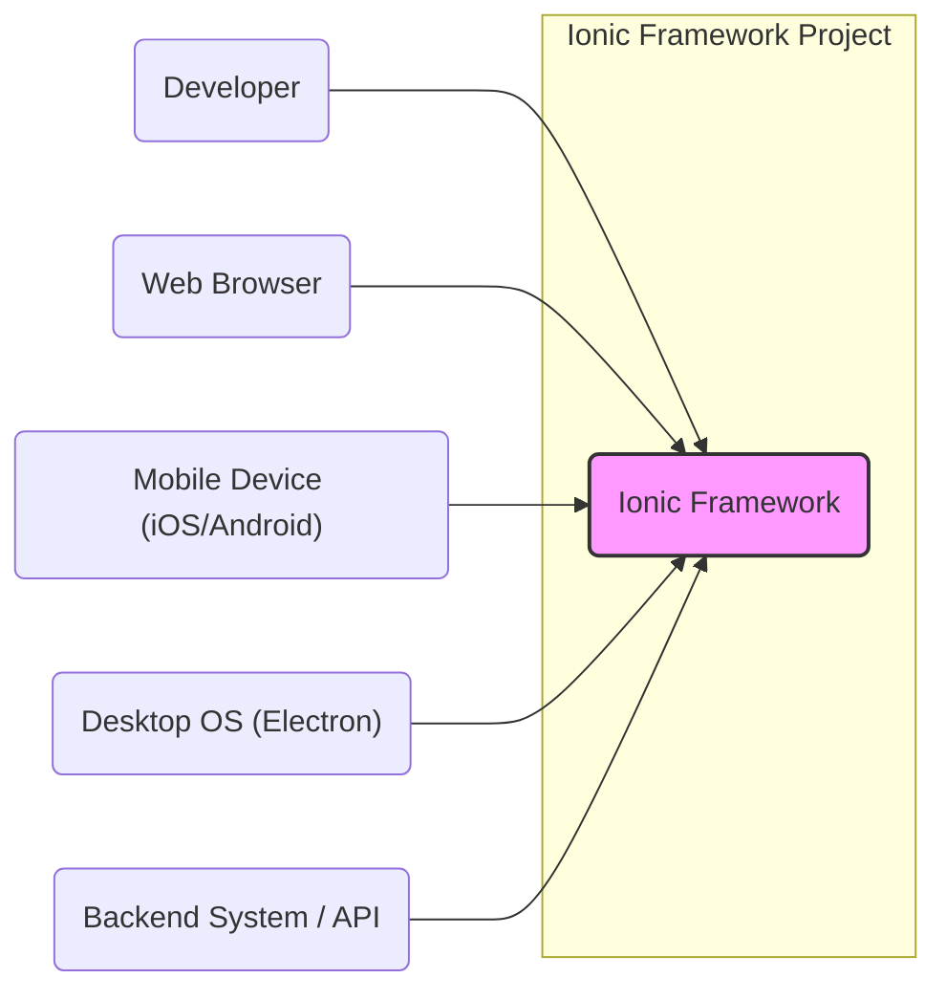
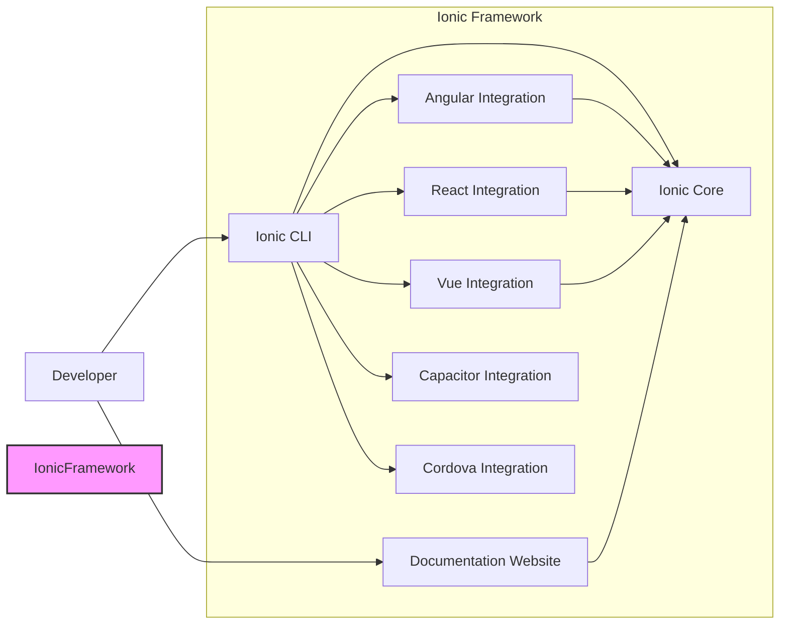
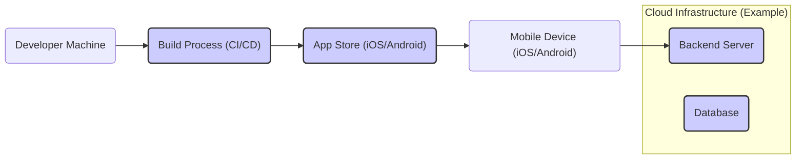
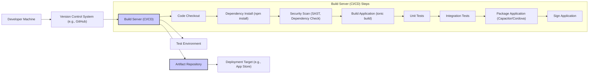

# BUSINESS POSTURE

The Ionic Framework project aims to provide a free, open-source UI toolkit for developers to build cross-platform mobile, web, and desktop applications using web technologies. The primary business priority is to empower developers to create high-quality applications efficiently and effectively, reducing development time and costs by enabling code reuse across different platforms. The project's success is tied to its adoption by the developer community and its ability to remain a leading choice for cross-platform development.

Key business goals include:

- Growing the Ionic developer community and increasing framework adoption.
- Maintaining and improving the quality, performance, and features of the framework.
- Ensuring compatibility and ease of integration with various web technologies and platforms.
- Providing comprehensive documentation and support to developers.
- Fostering a sustainable open-source ecosystem around the framework.

Major business risks to address:

- Security vulnerabilities in the framework could damage its reputation and deter adoption.
- Lack of timely security updates and patches could expose applications built with Ionic to risks.
- Performance issues or limitations could lead developers to choose alternative frameworks.
- Insufficient documentation or community support could hinder developer adoption and satisfaction.
- Changes in underlying web technologies or platform requirements could render the framework obsolete if not adapted quickly.

# SECURITY POSTURE

Existing security controls:

- security control: Open Source Code - The framework is open source, allowing for community review and identification of potential vulnerabilities. Implemented in: GitHub repository.
- security control: Regular Updates - The Ionic team actively maintains the framework and releases updates, including security patches. Described in: Release notes and changelogs in the repository and on the Ionic website.
- security control: Community Support - A large and active community contributes to identifying and reporting potential security issues. Implemented in: GitHub issues, forums, and community channels.
- security control: Dependency Management - The project uses standard dependency management tools (npm) which allows for tracking and updating dependencies, including security updates for those dependencies. Implemented in: `package.json` and build process.

Accepted risks:

- accepted risk: Reliance on Third-Party Libraries - The framework depends on numerous third-party libraries, which may introduce vulnerabilities. Mitigation: Dependency updates and security scanning.
- accepted risk: Misuse by Developers - Developers may misuse the framework or introduce vulnerabilities in their applications built with Ionic. Mitigation: Documentation, best practices, and security guidelines.
- accepted risk: Client-Side Security - As a front-end framework, Ionic applications are inherently client-side, meaning sensitive logic or data handling on the client-side carries inherent risks. Mitigation: Emphasize backend security and secure API design.

Recommended security controls:

- security control: Automated Security Scanning - Implement automated security scanning (SAST/DAST) in the CI/CD pipeline for the framework itself to identify potential vulnerabilities early in the development process.
- security control: Security Audits - Conduct regular security audits of the framework code by external security experts to identify and address potential weaknesses.
- security control: Vulnerability Disclosure Program - Establish a clear vulnerability disclosure program to encourage responsible reporting of security issues by the community.
- security control: Secure Coding Guidelines - Publish and promote secure coding guidelines for developers using Ionic to build applications, focusing on common web application security vulnerabilities.

Security requirements:

- Authentication:
  - Applications built with Ionic will typically handle authentication on the backend. The framework itself should not enforce or dictate specific authentication mechanisms but should be compatible with standard web authentication patterns (e.g., OAuth 2.0, JWT).
  - Security Requirement: Ensure compatibility with common authentication flows and libraries used in web development.
- Authorization:
  - Authorization logic should primarily reside on the backend. Ionic applications should be able to securely communicate user roles and permissions obtained from the backend to control access to features and data within the application UI.
  - Security Requirement: Provide guidance and best practices for integrating backend authorization with Ionic applications.
- Input Validation:
  - Ionic framework components should be designed to prevent common input validation vulnerabilities (e.g., XSS).
  - Security Requirement: Framework components must sanitize and encode user inputs to prevent XSS attacks.
  - Security Requirement: Provide clear documentation and examples on how developers should perform input validation in their Ionic applications, especially when interacting with external APIs or handling user-generated content.
- Cryptography:
  - The framework itself may not directly implement cryptographic functions, but applications built with Ionic might need to use cryptography for data protection.
  - Security Requirement: Ensure compatibility with standard web cryptography APIs and libraries.
  - Security Requirement: Provide guidance on secure storage of sensitive data within Ionic applications, recommending best practices like using secure storage mechanisms provided by the underlying platforms or secure backend services.

# DESIGN

## C4 CONTEXT

Context Diagram Elements:

- Element:
  - Name: Developer
  - Type: Person
  - Description: Software developers who use Ionic Framework to build applications.
  - Responsibilities: Develop mobile, web, and desktop applications using Ionic Framework. Configure and customize the framework for specific project needs.
  - Security controls: Secure development practices, code reviews, and adherence to secure coding guidelines when using the framework.

- Element:
  - Name: Ionic Framework
  - Type: Software System
  - Description: An open-source UI toolkit for building cross-platform applications using web technologies.
  - Responsibilities: Provide UI components, tools, and services for building application interfaces. Enable cross-platform compatibility for applications.
  - Security controls: Input sanitization within components, regular security updates, and adherence to secure development lifecycle.

- Element:
  - Name: Web Browser
  - Type: Software System
  - Description: Standard web browsers (Chrome, Firefox, Safari, Edge) used to access Ionic web applications.
  - Responsibilities: Render and execute web applications built with Ionic Framework. Provide a user interface for interacting with web applications.
  - Security controls: Browser security features (e.g., Content Security Policy, Same-Origin Policy), user authentication and session management handled by the web application.

- Element:
  - Name: Mobile Device (iOS/Android)
  - Type: Software System
  - Description: Mobile devices running iOS or Android operating systems, used to run Ionic mobile applications (typically packaged using Capacitor or Cordova).
  - Responsibilities: Execute native mobile applications built with Ionic Framework. Provide access to device features and APIs.
  - Security controls: Operating system security features, application sandboxing, permissions management, secure storage mechanisms provided by the mobile platform.

- Element:
  - Name: Desktop App (Electron)
  - Type: Software System
  - Description: Desktop operating systems (Windows, macOS, Linux) running Ionic desktop applications packaged with Electron.
  - Responsibilities: Execute desktop applications built with Ionic Framework. Provide access to desktop OS features and APIs.
  - Security controls: Operating system security features, application sandboxing provided by Electron, secure storage mechanisms provided by the desktop platform.

- Element:
  - Name: Backend System / API
  - Type: Software System
  - Description: Backend servers and APIs that Ionic applications interact with to fetch data, perform business logic, and manage user accounts.
  - Responsibilities: Provide data and services to Ionic applications. Handle authentication, authorization, and data storage.
  - Security controls: Server-side security controls (authentication, authorization, input validation, secure data storage, API security), secure communication protocols (HTTPS).

## C4 CONTAINER

Container Diagram Elements:

- Element:
  - Name: Ionic Core
  - Type: Library
  - Description: The core library of UI components, utilities, and services that form the foundation of the Ionic Framework. Written in TypeScript and distributed as npm packages.
  - Responsibilities: Provide reusable UI components (buttons, lists, modals, etc.), handle cross-platform UI rendering, manage application state, and provide utilities for common tasks.
  - Security controls: Input sanitization within components, regular security updates, and adherence to secure development lifecycle.

- Element:
  - Name: Angular Integration
  - Type: Library
  - Description:  Provides Angular-specific bindings and integrations for Ionic Core components, allowing developers to use Ionic within Angular applications. Distributed as npm packages.
  - Responsibilities: Bridge Ionic Core components with Angular's component model, provide Angular directives and services for Ionic features.
  - Security controls: Inherits security controls from Ionic Core and Angular framework. Follows Angular security best practices.

- Element:
  - Name: React Integration
  - Type: Library
  - Description: Provides React-specific bindings and integrations for Ionic Core components, allowing developers to use Ionic within React applications. Distributed as npm packages.
  - Responsibilities: Bridge Ionic Core components with React's component model, provide React components and hooks for Ionic features.
  - Security controls: Inherits security controls from Ionic Core and React framework. Follows React security best practices.

- Element:
  - Name: Vue Integration
  - Type: Library
  - Description: Provides Vue-specific bindings and integrations for Ionic Core components, allowing developers to use Ionic within Vue applications. Distributed as npm packages.
  - Responsibilities: Bridge Ionic Core components with Vue's component model, provide Vue components and composition functions for Ionic features.
  - Security controls: Inherits security controls from Ionic Core and Vue framework. Follows Vue security best practices.

- Element:
  - Name: Ionic CLI
  - Type: Application
  - Description: Command-line interface tool for creating, building, testing, and deploying Ionic applications. Written in Node.js and distributed via npm.
  - Responsibilities: Project scaffolding, development server, build and packaging for different platforms, integration with Capacitor and Cordova.
  - Security controls: Secure handling of developer credentials (if any), secure updates of CLI itself, and secure execution of build scripts.

- Element:
  - Name: Documentation Website
  - Type: Web Application
  - Description: Website hosting the official documentation for Ionic Framework, including guides, API references, and tutorials.
  - Responsibilities: Provide comprehensive documentation for developers, showcase framework features, and facilitate learning and adoption.
  - Security controls: Standard web application security controls (HTTPS, input validation, authorization for admin functions, protection against common web vulnerabilities).

- Element:
  - Name: Capacitor Integration
  - Type: Library/Plugin
  - Description: Provides integration with Capacitor, Ionic's recommended native runtime for deploying web apps to native mobile and desktop platforms. Distributed as npm packages and plugins.
  - Responsibilities: Enable access to native device features and APIs within Ionic applications, package web applications as native apps.
  - Security controls: Relies on Capacitor's security model, plugin security reviews, and adherence to platform security guidelines.

- Element:
  - Name: Cordova Integration
  - Type: Library/Plugin
  - Description: Provides integration with Apache Cordova, an alternative native runtime for deploying web apps to native mobile platforms. Distributed as npm packages and plugins.
  - Responsibilities: Enable access to native device features and APIs within Ionic applications, package web applications as native apps (legacy option).
  - Security controls: Relies on Cordova's security model, plugin security reviews, and adherence to platform security guidelines.

## DEPLOYMENT

Ionic Framework itself is not deployed as a running application. Instead, applications built with Ionic are deployed. A typical deployment scenario for an Ionic mobile application using Capacitor is described below:

Deployment Architecture: Mobile App Deployment (Capacitor)

Deployment Diagram Elements:

- Element:
  - Name: Developer Machine
  - Type: Infrastructure
  - Description: Developer's local computer used for writing code, testing, and initiating the build process.
  - Responsibilities: Code development, local testing, version control, and triggering builds.
  - Security controls: Developer workstation security practices, code repository access controls, and secure development environment.

- Element:
  - Name: Build Process (CI/CD)
  - Type: Infrastructure
  - Description: Automated build pipeline (e.g., GitHub Actions, Jenkins) that compiles the Ionic application, packages it for target platforms, and potentially deploys it to app stores.
  - Responsibilities: Automated building, testing, packaging, and deployment of the Ionic application.
  - Security controls: Secure CI/CD pipeline configuration, access controls to build systems, secure storage of build artifacts, and security scanning during the build process.

- Element:
  - Name: App Store (iOS/Android)
  - Type: Infrastructure
  - Description: Apple App Store and Google Play Store, platforms for distributing mobile applications to end-users.
  - Responsibilities: Application distribution, app updates, and user reviews.
  - Security controls: App store security reviews, code signing, and platform security features.

- Element:
  - Name: Mobile Device (iOS/Android)
  - Type: Infrastructure
  - Description: End-user mobile devices running the deployed Ionic application.
  - Responsibilities: Running the Ionic application, providing user interface, and interacting with backend services.
  - Security controls: Operating system security features, application sandboxing, permissions management, and secure storage mechanisms on the mobile device.

- Element:
  - Name: Backend Server
  - Type: Infrastructure
  - Description: Server infrastructure hosting the backend API services that the Ionic application communicates with.
  - Responsibilities: Providing data and services to the Ionic application, handling business logic, authentication, and data storage.
  - Security controls: Server-side security controls (firewalls, intrusion detection, access controls, regular security patching), secure API design, and secure data storage.

- Element:
  - Name: Database
  - Type: Infrastructure
  - Description: Database system used by the backend server to store application data.
  - Responsibilities: Persistent data storage, data retrieval, and data management.
  - Security controls: Database security controls (access controls, encryption at rest and in transit, regular backups, and security monitoring).

## BUILD

Build Process Diagram:

Build Process Description and Security Controls:

- Developer Machine:
  - Description: Developer's local machine where code is written and changes are committed.
  - Security controls: Local workstation security, code signing keys (if applicable) should be securely stored and managed.

- Version Control System (VCS) (e.g., GitHub):
  - Description: Central repository for source code, tracking changes and enabling collaboration.
  - Security controls: Access controls (authentication and authorization), branch protection, audit logs, and secure communication (HTTPS, SSH).

- Build Server (CI/CD):
  - Description: Automated system for building, testing, and packaging the application.
  - Security controls:
    - security control: Secure Pipeline Configuration:  CI/CD pipeline configuration should be securely managed and auditable.
    - security control: Access Control: Access to the build server and pipeline should be restricted to authorized personnel.
    - security control: Secret Management: Secure storage and handling of secrets (API keys, signing certificates) used in the build process.
    - security control: Isolated Build Environment: Use isolated and ephemeral build environments to prevent contamination and ensure build reproducibility.
    - security control: Build Artifact Integrity: Verify the integrity of build artifacts using checksums or digital signatures.

- Code Checkout:
  - Description: Retrieving the latest source code from the VCS.
  - Security controls: Authenticated access to VCS, secure communication protocols.

- Dependency Install (npm install):
  - Description: Installing project dependencies from package registries (npm).
  - Security controls:
    - security control: Dependency Scanning: Use dependency scanning tools to identify known vulnerabilities in third-party libraries.
    - security control: Package Integrity Checks: Verify the integrity of downloaded packages using checksums or signatures.
    - security control: Private Registry (Optional): Use a private npm registry to control and curate dependencies.

- Security Scan (SAST, Dependency Check):
  - Description: Performing static application security testing (SAST) and dependency vulnerability checks.
  - Security controls: SAST tools to identify code-level vulnerabilities, dependency check tools to identify vulnerable dependencies.

- Build Application (ionic build):
  - Description: Compiling and building the Ionic application for target platforms.
  - Security controls: Secure build scripts, minimizing build dependencies, and ensuring build process integrity.

- Unit Tests & Integration Tests:
  - Description: Running automated unit and integration tests to verify code functionality and catch regressions.
  - Security controls: Secure test environments, test data management, and test code reviews.

- Package Application (Capacitor/Cordova):
  - Description: Packaging the built application into platform-specific packages (e.g., APK, IPA).
  - Security controls: Secure packaging process, ensuring no malicious code is injected during packaging.

- Sign Application:
  - Description: Digitally signing the application package for distribution in app stores.
  - Security controls: Secure storage and management of signing certificates and keys, secure signing process.

- Artifact Repository:
  - Description: Storage for build artifacts (application packages, etc.).
  - Security controls: Access controls, secure storage, and integrity checks for stored artifacts.

- Deployment Target (e.g., App Store):
  - Description: Platform where the application is deployed (e.g., App Store, Play Store, web server).
  - Security controls: Platform-specific security controls, secure deployment process, and application updates.

# RISK ASSESSMENT

Critical business processes we are trying to protect:

- Application functionality and availability: Ensuring that applications built with Ionic Framework function correctly and are available to end-users is critical for businesses relying on these applications.
- Developer trust and adoption: Maintaining the trust of developers in the Ionic Framework is crucial for its continued adoption and success. Security vulnerabilities or a perception of insecurity can severely damage this trust.
- Brand reputation: Security incidents related to Ionic Framework or applications built with it can negatively impact the brand reputation of both the Ionic project and businesses using it.

Data we are trying to protect and their sensitivity (in context of applications built with Ionic):

- User data: Applications built with Ionic may handle various types of user data, including personal information, credentials, financial data, and usage data. The sensitivity of this data depends on the application's purpose and regulatory requirements (e.g., GDPR, HIPAA).
- Application code and intellectual property: The source code of applications built with Ionic, as well as the framework itself, represents intellectual property and business value. Protecting this code from unauthorized access and modification is important.
- Backend system data: Ionic applications often interact with backend systems that store and process sensitive data. Protecting this backend data is crucial, even though it's not directly part of the Ionic Framework itself.
- Build and deployment infrastructure: Securing the build and deployment infrastructure is important to prevent supply chain attacks and ensure the integrity of deployed applications.

# QUESTIONS & ASSUMPTIONS

Questions:

- What is the target risk appetite for projects built with Ionic Framework? (This will influence the level of security controls recommended and implemented in applications).
- Are there specific industry compliance requirements (e.g., HIPAA, PCI DSS) that applications built with Ionic Framework need to adhere to? (This will dictate specific security requirements).
- What is the process for reporting and handling security vulnerabilities found in the Ionic Framework itself or in applications built with it? (Understanding the vulnerability management process is important for ongoing security).
- Are there any specific security features or functionalities planned for future releases of Ionic Framework? (Knowing the roadmap can help anticipate future security improvements).

Assumptions:

- BUSINESS POSTURE: The primary business goal is to provide a secure and reliable framework that developers can confidently use to build cross-platform applications. Security is a high priority for the Ionic project.
- SECURITY POSTURE: While Ionic Framework provides UI components and tools, the ultimate security of applications built with it depends on developers following secure coding practices and implementing appropriate security controls in their applications and backend systems. The Ionic team is committed to addressing security vulnerabilities in the framework itself.
- DESIGN: The design assumes a typical web application architecture where Ionic applications act as front-ends communicating with backend APIs. Deployment scenarios include web, mobile (using Capacitor/Cordova), and desktop (using Electron). The build process involves standard web development tools and CI/CD practices.