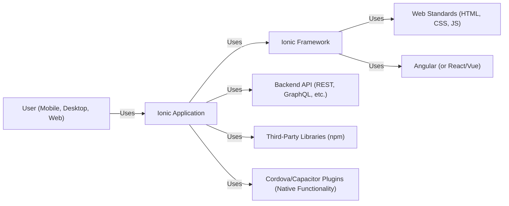
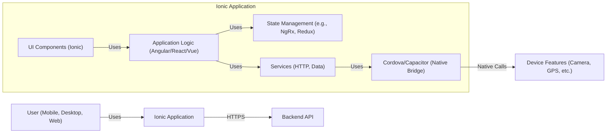
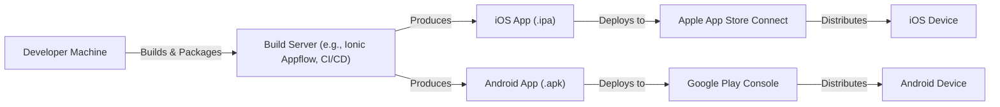
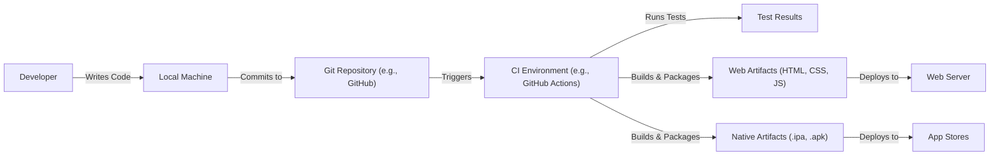

Okay, let's create a design document for the Ionic Framework based on the provided GitHub repository.

# BUSINESS POSTURE

Ionic Framework is a mature open-source project, likely aiming for broad adoption and a strong community.  The primary business goals appear to be:

*   Provide a robust and versatile framework for building cross-platform mobile, desktop, and web applications.
*   Maintain a large and active open-source community.
*   Offer a positive developer experience to encourage adoption and contribution.
*   Enable developers to build high-quality applications quickly and efficiently.
*   Potentially monetize through related services or premium offerings (not directly evident in the core framework, but a common strategy).

Based on these goals, the most important business risks are:

*   Security vulnerabilities in the framework that could compromise applications built with it. This would damage reputation and trust.
*   Inability to keep up with the rapidly evolving mobile and web ecosystem (new OS versions, browser changes, etc.).
*   Loss of community engagement and contributions.
*   Competition from other cross-platform frameworks.
*   Failure to provide adequate documentation and support, hindering developer adoption.

# SECURITY POSTURE

The Ionic Framework repository and associated documentation reveal the following security controls and accepted risks:

*   security control: Regular updates and releases to address bug fixes and security patches. (Evidenced by the release cadence on GitHub).
*   security control: Use of automated testing, including unit and end-to-end tests. (Visible in the repository structure and CI workflows).
*   security control: Code linting and static analysis. (Implied by the presence of configuration files for tools like ESLint).
*   security control: Documentation that encourages secure coding practices (though this needs further review to assess its comprehensiveness).
*   security control: Dependency management using npm, with potential for vulnerability scanning using npm audit or similar tools.
*   security control: Use of TypeScript, which offers some inherent type safety benefits over plain JavaScript.
*   accepted risk: Reliance on third-party libraries and components (inherent in any framework).  Vulnerabilities in these dependencies could impact Ionic applications.
*   accepted risk: The framework itself is a large and complex codebase, increasing the potential attack surface.
*   accepted risk: Developers using the framework may introduce their own security vulnerabilities in their application code. Ionic can provide tools and guidance, but ultimately application security is the developer's responsibility.

Recommended Security Controls (High Priority):

*   Implement a comprehensive Security Development Lifecycle (SDL) process, including threat modeling, security code reviews, and penetration testing.
*   Integrate automated security scanning tools into the CI/CD pipeline (e.g., SAST, DAST, SCA).
*   Provide more explicit and detailed security guidance in the official documentation, covering common web and mobile vulnerabilities (e.g., XSS, CSRF, injection, insecure storage, etc.).
*   Establish a clear vulnerability disclosure program to encourage responsible reporting of security issues.
*   Consider offering security-focused training or workshops for Ionic developers.

Security Requirements:

*   Authentication: Ionic itself doesn't handle authentication directly. It's a UI framework.  Applications built with Ionic will need to implement appropriate authentication mechanisms based on their specific needs (e.g., OAuth 2.0, OpenID Connect, custom backend authentication).
*   Authorization: Similar to authentication, authorization is the responsibility of the application built using Ionic. The framework should provide mechanisms to integrate with authorization systems (e.g., handling tokens, roles, permissions).
*   Input Validation: Ionic components should perform basic input validation to prevent common web vulnerabilities like XSS.  However, applications must also implement server-side input validation for any data received from the client.
*   Cryptography: Ionic itself doesn't provide cryptographic primitives. Applications needing encryption or hashing should use appropriate Web Crypto API or native platform APIs. Ionic should provide guidance on securely storing sensitive data (e.g., using platform-specific secure storage mechanisms).

# DESIGN

## C4 CONTEXT

Element Descriptions:

*   Element:
    *   Name: User (Mobile, Desktop, Web)
    *   Type: Person
    *   Description: End-users interacting with applications built using the Ionic Framework.
    *   Responsibilities: Interacting with the application's user interface.
    *   Security controls: None (client-side security is limited).

*   Element:
    *   Name: Ionic Application
    *   Type: Software System
    *   Description: A cross-platform application built using the Ionic Framework.
    *   Responsibilities: Providing application-specific functionality to the user.
    *   Security controls: Input validation, authentication, authorization, secure communication with backend services, secure storage of sensitive data.

*   Element:
    *   Name: Ionic Framework
    *   Type: Software System
    *   Description: The open-source framework for building cross-platform applications.
    *   Responsibilities: Providing UI components, build tools, and platform integration.
    *   Security controls: Regular security updates, code linting, automated testing, secure coding practices (in the framework itself).

*   Element:
    *   Name: Backend API (REST, GraphQL, etc.)
    *   Type: Software System
    *   Description: Backend services providing data and business logic to the Ionic application.
    *   Responsibilities: Handling data storage, processing, and authentication/authorization.
    *   Security controls: Robust authentication and authorization, input validation, secure coding practices, protection against common web vulnerabilities.

*   Element:
    *   Name: Third-Party Libraries (npm)
    *   Type: Software System
    *   Description: External libraries used by the Ionic application and the framework itself.
    *   Responsibilities: Providing specific functionality not included in the core framework.
    *   Security controls: Dependency vulnerability scanning, regular updates.

*   Element:
    *   Name: Cordova/Capacitor Plugins (Native Functionality)
    *   Type: Software System
    *   Description: Plugins that provide access to native device features (camera, GPS, etc.).
    *   Responsibilities: Bridging the gap between the web application and the native platform.
    *   Security controls: Secure use of native APIs, permission handling.

*   Element:
    *   Name: Web Standards (HTML, CSS, JS)
    *   Type: Technology
    *   Description: The fundamental web technologies used by Ionic.
    *   Responsibilities: Rendering the user interface and handling user interactions.
    *   Security controls: Browser security mechanisms, adherence to web security best practices.

*   Element:
    *   Name: Angular (or React/Vue)
    *   Type: Technology
    *   Description: The underlying JavaScript framework used by Ionic (default is Angular).
    *   Responsibilities: Managing application state, data binding, and component rendering.
    *   Security controls: Security features of the chosen framework (e.g., Angular's built-in XSS protection).

## C4 CONTAINER

Element Descriptions:

*   Element:
    *   Name: User (Mobile, Desktop, Web)
    *   Type: Person
    *   Description: End-users interacting with the Ionic application.
    *   Responsibilities: Interacting with the application's user interface.
    *   Security controls: None (client-side security is limited).

*   Element:
    *   Name: Ionic Application
    *   Type: Software System
    *   Description: The running instance of the application built with Ionic.
    *   Responsibilities: Providing application-specific functionality.
    *   Security controls: Input validation, authentication, authorization, secure communication, secure storage.

*   Element:
    *   Name: Backend API
    *   Type: Software System
    *   Description: The backend server providing data and services.
    *   Responsibilities: Data storage, processing, authentication/authorization.
    *   Security controls: Robust authentication/authorization, input validation, secure coding practices.

*   Element:
    *   Name: UI Components (Ionic)
    *   Type: Container (UI)
    *   Description: Ionic's pre-built UI components (buttons, lists, forms, etc.).
    *   Responsibilities: Rendering the user interface.
    *   Security controls: Basic input validation, XSS prevention (within the components themselves).

*   Element:
    *   Name: Application Logic (Angular/React/Vue)
    *   Type: Container (Code)
    *   Description: The application's core business logic, implemented using the chosen framework.
    *   Responsibilities: Handling user interactions, managing data, and coordinating with services.
    *   Security controls: Input validation, authentication/authorization logic, secure coding practices.

*   Element:
    *   Name: State Management (e.g., NgRx, Redux)
    *   Type: Container (Code)
    *   Description: Library for managing application state.
    *   Responsibilities: Providing a predictable way to manage data flow within the application.
    *   Security controls: Secure handling of sensitive data within the state.

*   Element:
    *   Name: Services (HTTP, Data)
    *   Type: Container (Code)
    *   Description: Services for interacting with backend APIs and managing data.
    *   Responsibilities: Making HTTP requests, handling data transformations, and interacting with native features.
    *   Security controls: Secure communication (HTTPS), input validation, secure handling of API responses.

*   Element:
    *   Name: Cordova/Capacitor (Native Bridge)
    *   Type: Container (Code)
    *   Description: The bridge between the web application and native device features.
    *   Responsibilities: Providing access to native APIs.
    *   Security controls: Secure use of native APIs, permission handling.

*   Element:
    *   Name: Device Features (Camera, GPS, etc.)
    *   Type: Container (Native)
    *   Description: Native device features accessed through Cordova/Capacitor plugins.
    *   Responsibilities: Providing access to device hardware and functionality.
    *   Security controls: Operating system security mechanisms, permission requests.

## DEPLOYMENT

Ionic applications can be deployed to various environments:

1.  **Web (PWA):** Deployed to a standard web server (e.g., Apache, Nginx, Netlify, Vercel).
2.  **Mobile (iOS/Android):** Packaged as native apps and deployed through the respective app stores (Apple App Store, Google Play Store).
3.  **Desktop (Electron):** Packaged as desktop applications for Windows, macOS, and Linux.

We'll describe the **Mobile (iOS/Android)** deployment in detail:

Element Descriptions:

*   Element:
    *   Name: Developer Machine
    *   Type: Infrastructure Node
    *   Description: The developer's local workstation.
    *   Responsibilities: Writing code, running local builds, and initiating deployments.
    *   Security controls: Secure development environment, code signing.

*   Element:
    *   Name: Build Server (e.g., Ionic Appflow, CI/CD)
    *   Type: Infrastructure Node
    *   Description: A server that automates the build and packaging process.
    *   Responsibilities: Building the application, running tests, creating native app packages.
    *   Security controls: Secure build environment, access control, code signing.

*   Element:
    *   Name: iOS App (.ipa)
    *   Type: Artifact
    *   Description: The iOS application package.
    *   Responsibilities: Containing the compiled application code and resources.
    *   Security controls: Code signing, encryption (if enabled).

*   Element:
    *   Name: Android App (.apk)
    *   Type: Artifact
    *   Description: The Android application package.
    *   Responsibilities: Containing the compiled application code and resources.
    *   Security controls: Code signing, encryption (if enabled).

*   Element:
    *   Name: Apple App Store Connect
    *   Type: Platform
    *   Description: Apple's platform for managing and distributing iOS apps.
    *   Responsibilities: App review, distribution, and management.
    *   Security controls: Apple's security review process.

*   Element:
    *   Name: Google Play Console
    *   Type: Platform
    *   Description: Google's platform for managing and distributing Android apps.
    *   Responsibilities: App review, distribution, and management.
    *   Security controls: Google's security review process.

*   Element:
    *   Name: iOS Device
    *   Type: Device
    *   Description: An end-user's iOS device.
    *   Responsibilities: Running the Ionic application.
    *   Security controls: Operating system security mechanisms.

*   Element:
    *   Name: Android Device
    *   Type: Device
    *   Description: An end-user's Android device.
    *   Responsibilities: Running the Ionic application.
    *   Security controls: Operating system security mechanisms.

## BUILD

The Ionic build process typically involves the following steps:

1.  **Development:** Developers write code using the Ionic CLI, framework components, and other tools.
2.  **Transpilation/Compilation:** TypeScript code is transpiled to JavaScript, and framework-specific code (e.g., Angular) is compiled.
3.  **Bundling:** JavaScript, CSS, and other assets are bundled into optimized files for deployment.
4.  **Packaging (for native apps):** The web assets are packaged with a native wrapper (Cordova or Capacitor) to create an .ipa (iOS) or .apk (Android) file.
5.  **Code Signing (for native apps):** The app packages are digitally signed to verify their authenticity and integrity.

Security Controls in the Build Process:

*   **Source Code Management (Git):** Version control and access control to the codebase.
*   **CI/CD Pipeline (GitHub Actions, etc.):** Automation of the build, test, and deployment process.
*   **Dependency Management (npm):** Managing external libraries and their versions.
*   **Vulnerability Scanning (npm audit, etc.):** Scanning dependencies for known vulnerabilities.
*   **Static Code Analysis (ESLint, etc.):** Identifying potential code quality and security issues.
*   **Unit and End-to-End Testing:** Automated testing to ensure code functionality and prevent regressions.
*   **Code Signing (for native apps):** Verifying the authenticity and integrity of the app packages.
*   **Secure Build Environment:** Protecting the build server from unauthorized access and tampering.

# RISK ASSESSMENT

*   **Critical Business Processes:**
    *   Application development and deployment using the Ionic Framework.
    *   Maintaining a healthy and active open-source community.
    *   Providing a secure and reliable platform for building cross-platform applications.

*   **Data to Protect:**
    *   **Source code of the Ionic Framework:** Sensitivity: Medium (publicly available, but integrity is important).
    *   **User data within applications built with Ionic:** Sensitivity: Varies greatly depending on the application.  Could range from non-sensitive to highly sensitive (PII, financial data, health data, etc.). This is primarily the responsibility of applications built *using* Ionic.
    *   **Credentials and API keys used during the build and deployment process:** Sensitivity: High.
    *   **Community data (user accounts, forum posts, etc.):** Sensitivity: Medium.

# QUESTIONS & ASSUMPTIONS

*   **Questions:**
    *   What specific security certifications or compliance requirements are relevant to Ionic or applications built with it (e.g., HIPAA, GDPR, PCI DSS)? This depends on the *use* of Ionic, not Ionic itself.
    *   What is the current process for handling security vulnerabilities reported by the community or discovered internally?
    *   Are there any existing security audits or penetration test reports for the Ionic Framework?
    *   What level of support is provided for older versions of the framework, particularly regarding security patches?

*   **Assumptions:**
    *   **Business Posture:** Ionic aims for wide adoption and a strong community, with a focus on developer experience and ease of use.
    *   **Security Posture:** The project has some basic security controls in place, but there's room for improvement, particularly in terms of a formal SDL and comprehensive security documentation.
    *   **Design:** The design assumptions are based on the typical usage of Ionic for building hybrid mobile applications, with a focus on web technologies and native platform integration through Cordova/Capacitor. The backend is assumed to be a separate system, and the application architecture follows common patterns for single-page applications (SPAs).