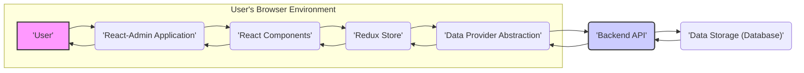

# Project Design Document: React-Admin Application Framework

**Version:** 1.1
**Date:** October 26, 2023
**Author:** AI Software Architect

## 1. Introduction

This document provides a detailed architectural design of the react-admin framework, an open-source React framework used for building browser-based administration user interfaces. This document is specifically created to facilitate threat modeling activities. It details the key components, data flows, and interactions within a typical react-admin application, highlighting potential security considerations.

## 2. Project Overview

React-admin simplifies the development of admin interfaces for REST or GraphQL APIs. It offers pre-built, customizable components and abstractions for common admin tasks such as listing, creating, editing, and deleting data. Developers tailor react-admin to their specific backend data structures and business logic. The framework primarily operates on the client-side, interacting with a remote backend API.

## 3. Architecture Overview

A react-admin application runs within a user's web browser and communicates with a backend API to manage data.

*   **User:** The individual interacting with the admin interface through a web browser.
*   **React-Admin Application:** The core JavaScript application built using the react-admin framework, running in the user's browser.
*   **React Components:** The building blocks of the user interface, encompassing both components provided by react-admin and custom-developed components.
*   **Redux Store:** A centralized state container managing the application's data, including data fetched from the backend and UI state.
*   **Data Provider Abstraction:** An interface and set of implementations responsible for abstracting communication with the backend API, hiding the specifics of the API protocol.
*   **Backend API:** A server-side application that exposes endpoints for data manipulation and business logic, often implemented as a REST or GraphQL API.
*   **Data Storage (Database):** The persistent storage system where the application's data resides.

## 4. Key Components

This section elaborates on the primary components of a react-admin application.

*   **Core React-Admin Library:**
    *   Provides the foundational structure and pre-built components for admin interfaces.
    *   Handles routing, application layout, and utilities for data fetching and manipulation.
    *   Offers ready-to-use components for common admin views like lists, forms for creation and editing, and filtering mechanisms.
*   **React Components:**
    *   **Layout Structure:** Components like `Admin`, `Layout`, and `Menu` define the overall structure and navigation of the application.
    *   **Resource Management:** Components associated with specific data entities, such as `List`, `Edit`, and `Create`, define how these entities are presented and managed.
    *   **Data Presentation:** Components like `TextField`, `DateField`, and `ReferenceField` are used to display data within lists and forms.
    *   **User Input:** Components such as `TextInput`, `SelectInput`, and `ReferenceInput` enable users to input and select data in forms.
    *   **Data Filtering:** Components that allow users to filter data displayed in lists.
    *   **Custom UI Elements:** Developers can create and integrate their own React components to extend or customize the framework's functionality.
*   **Redux Store:**
    *   Serves as the single source of truth for the application's state.
    *   Stores data fetched from the backend, loading indicators, and various user interface states.
    *   State updates are managed through reducers that respond to dispatched actions.
    *   Middleware, such as `redux-saga` or `redux-thunk`, handles asynchronous operations like API calls.
*   **Data Provider:**
    *   Acts as an abstraction layer for interacting with the backend API.
    *   Shields the application from the specific details of the API implementation (e.g., REST endpoints, GraphQL queries).
    *   Provides a consistent interface for data fetching, creation, updating, and deletion operations.
    *   Common data providers are available for standard REST API conventions.
    *   Developers can implement custom data providers for unique API requirements or protocols.
*   **Authentication Provider (Optional but Recommended):**
    *   Manages user authentication and session handling.
    *   Integrates with the backend's authentication system to verify user credentials.
    *   Determines if a user is authenticated and typically stores authentication tokens or session information.
    *   React-admin provides an interface for implementing custom authentication logic.
*   **Authorization Logic:**
    *   Enforces access control by determining what actions a user is permitted to perform on specific data resources.
    *   Can be implemented within the Authentication Provider, within individual React components, or through custom logic that interacts with backend authorization rules.
    *   Often relies on user roles, permissions, or access control lists fetched from the backend API.
*   **i18n Provider (Optional):**
    *   Handles internationalization (i18n) and localization (l10n) of the application's user interface.
    *   Provides translations for static text and potentially data content based on the user's locale.

## 5. Data Flow

The following describes the typical flow of data within a react-admin application.

### 5.1. Application Initialization and Data Fetching

1. The user accesses the react-admin application via a web browser.
2. React-admin initializes, and the main layout and initial components are rendered.
3. Resource components, based on the current route, may dispatch actions to fetch initial data required for the view (e.g., fetching a list of users).
4. These actions are intercepted by Redux middleware (e.g., a saga or thunk).
5. The middleware utilizes the configured Data Provider to make an API request to the Backend API.
6. The Backend API processes the request, potentially querying the Data Storage.
7. The Backend API responds with the requested data.
8. The Data Provider receives the response and dispatches a Redux action containing the data.
9. Reducers in the Redux store update the application state with the received data.
10. React components that are connected to the Redux store re-render to display the fetched data.

### 5.2. User Interaction (e.g., Viewing a Detailed Record)

1. The user navigates to a view displaying the details of a specific record.
2. The corresponding React component (e.g., an `Edit` component) is rendered.
3. The component dispatches an action to fetch the details of the specific record, typically including the record's identifier.
4. The Data Provider makes an API call to the Backend API, requesting the specific record.
5. The Backend API retrieves the record from the Data Storage.
6. The Backend API sends the record data back to the Data Provider.
7. The Data Provider updates the Redux store with the record details.
8. The React component re-renders, displaying the detailed information.

### 5.3. User Action (e.g., Updating a Record)

1. The user interacts with an edit form to modify a record's data.
2. Upon form submission, an action is dispatched to update the record, including the record's identifier and the modified data.
3. The Data Provider sends an API request (e.g., a PUT or PATCH request) to the Backend API with the updated data.
4. The Backend API validates the data, updates the record in the Data Storage, and may perform business logic.
5. The Backend API returns a success response (and potentially the updated record).
6. The Data Provider updates the Redux store, potentially triggering a re-render of the relevant components or a navigation to another view.

## 6. Security Considerations

Security is a critical aspect of any application built with react-admin. Here are key considerations for threat modeling:

*   **Authentication and Authorization:**
    *   **Threat:** Unauthorized access to data and functionalities.
    *   **Mitigation:** Implement robust authentication on the Backend API and integrate it with react-admin's Authentication Provider. Ensure proper authorization checks on the backend to control access based on user roles and permissions. Validate JWT tokens if used.
*   **Cross-Site Scripting (XSS):**
    *   **Threat:** Malicious scripts injected into the UI, potentially stealing user data or performing actions on their behalf.
    *   **Mitigation:**  Sanitize user inputs both on the frontend (though react-admin and React provide some protection) and rigorously on the Backend API before storing and displaying data. Utilize Content Security Policy (CSP) headers.
*   **Cross-Site Request Forgery (CSRF):**
    *   **Threat:**  Unauthorized actions performed on behalf of an authenticated user.
    *   **Mitigation:** Implement CSRF protection mechanisms, such as synchronizer tokens, on the Backend API and ensure the frontend correctly includes these tokens in requests.
*   **Data Validation and Input Sanitization:**
    *   **Threat:**  Data corruption, injection attacks (e.g., SQL injection if the backend is vulnerable), and application errors due to invalid data.
    *   **Mitigation:** Implement strict data validation on both the frontend (using react-admin's form validation) and, critically, on the Backend API. Sanitize all user inputs before processing them.
*   **API Security:**
    *   **Threat:** Vulnerabilities in the Backend API can be exploited to gain unauthorized access or manipulate data.
    *   **Mitigation:** Secure the Backend API using industry best practices, including authentication, authorization, rate limiting, input validation, and protection against common web vulnerabilities (e.g., OWASP Top Ten).
*   **Dependency Vulnerabilities:**
    *   **Threat:**  Security flaws in third-party libraries used by react-admin and the application.
    *   **Mitigation:** Regularly audit and update dependencies to patch known vulnerabilities. Utilize tools like `npm audit` or `yarn audit`.
*   **Sensitive Data Handling:**
    *   **Threat:** Exposure of sensitive information (e.g., passwords, API keys).
    *   **Mitigation:** Avoid storing sensitive data in the frontend if possible. If necessary, handle it securely (e.g., using HTTPS, encrypting local storage). Never expose sensitive information in the Redux store unnecessarily.
*   **Transport Layer Security (TLS/SSL):**
    *   **Threat:**  Data transmitted between the browser and the Backend API can be intercepted.
    *   **Mitigation:**  Enforce HTTPS to encrypt all communication between the frontend and the backend.
*   **Rate Limiting:**
    *   **Threat:** Denial-of-service attacks by overwhelming the Backend API with requests.
    *   **Mitigation:** Implement rate limiting on the Backend API to restrict the number of requests from a single source within a given timeframe.

## 7. Deployment Model

React-admin applications are typically deployed as static assets that are served to the user's browser. The application then interacts with a separately deployed Backend API.

*   **Frontend Deployment:**
    *   The react-admin application is built into static HTML, CSS, and JavaScript files using tools like `create-react-app` or similar build processes.
    *   These static assets can be hosted on various platforms:
        *   **Static Site Hosting:** Services like Netlify, Vercel, GitHub Pages, AWS S3 with CloudFront.
        *   **Content Delivery Networks (CDNs):** For improved performance and scalability.
        *   **Traditional Web Servers:** Like Nginx or Apache.
*   **Backend API Deployment:**
    *   The deployment method depends on the chosen backend technology stack. Common options include:
        *   **Cloud Platforms:** AWS (EC2, ECS, Lambda), Azure (Virtual Machines, App Service, Functions), GCP (Compute Engine, App Engine, Cloud Functions).
        *   **Containerization:** Using Docker and orchestration platforms like Kubernetes.
        *   **Serverless Functions:** For event-driven APIs.
        *   **Traditional Servers:** Physical or virtual machines.

## 8. Technology Stack

A standard react-admin application leverages the following technologies:

*   **Frontend:**
    *   **React:** The core JavaScript library for building the user interface.
    *   **Redux:** For managing application state.
    *   **react-router-dom:** For handling client-side routing and navigation.
    *   **Material UI (MUI) (Default):** A library of pre-built React components following Material Design principles. Can be customized or replaced.
    *   **JavaScript (ES6+):** The primary programming language.
    *   **HTML5:** For structuring the content.
    *   **CSS (or CSS-in-JS):** For styling the application.
    *   **npm or Yarn:** Package managers for managing dependencies.
    *   **Webpack, Parcel, or similar:** Module bundlers for packaging the application.
*   **Backend:** (Technology is variable and depends on the API implementation)
    *   Examples include Node.js with Express, Python with Django or Flask, Java with Spring Boot, Ruby on Rails, etc.
    *   Database systems like PostgreSQL, MySQL, MongoDB, or others.

## 9. Assumptions and Constraints

*   A separate, functional Backend API is a prerequisite for the react-admin application.
*   This design document primarily focuses on the client-side architecture of the react-admin application.
*   The specific implementation details of the Backend API are considered out of scope for this document.
*   While Material UI is the default, the design assumes the possibility of customization or replacement of UI components.

## 10. Future Considerations

*   **Real-time Data Updates:** Integration with technologies like WebSockets or Server-Sent Events for real-time data synchronization.
*   **Offline Capabilities:** Implementing features for offline data access and synchronization using technologies like service workers and local storage/IndexedDB.
*   **Advanced Authorization Models:** Exploring more sophisticated permission management systems and access control mechanisms.
*   **Performance Optimization:** Strategies for optimizing the performance of the frontend application, especially when dealing with large datasets or complex UI interactions.
*   **Improved Testing Strategies:** Implementing comprehensive unit, integration, and end-to-end testing strategies.

This improved design document provides a more detailed and security-focused overview of the react-admin framework's architecture, making it a more robust foundation for subsequent threat modeling activities.
