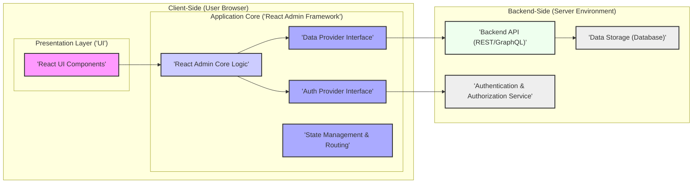

# Project Design Document: React Admin for Threat Modeling (Improved)

## 1. Project Overview

*   **Project Name:** React Admin
*   **Project Link:** [https://github.com/marmelab/react-admin](https://github.com/marmelab/react-admin)
*   **Purpose of this Document:** This document serves as a design specification for threat modeling the React Admin project. It outlines the architecture, components, data flows, and security considerations to facilitate the identification and mitigation of potential threats.
*   **Project Goal and Description:** React Admin is a frontend framework designed to accelerate the development of admin interfaces. It leverages React, Material UI, and `react-final-form` to provide reusable components and abstractions for common admin tasks like data management (CRUD operations). It connects to backend APIs (REST, GraphQL, etc.) through a flexible data provider system.
*   **Target Audience:** Developers, Security Engineers, and Architects involved in building and securing applications using React Admin.
*   **Key Features (Relevant to Security Threat Modeling):**
    *   **Pluggable Data Providers:**  Abstracts backend API interactions, making it crucial to analyze different provider implementations for potential vulnerabilities. This is a primary interface for data manipulation and a key area for threat assessment.
    *   **Authentication and Authorization Flexibility:** Supports various authentication and authorization strategies via Auth Providers. The security posture is heavily dependent on the chosen and implemented providers. This is a critical control point for access management.
    *   **Form Handling with `react-final-form`:**  Manages form state and validation. Client-side validation is present, but backend validation is essential for security. Form inputs are potential injection points.
    *   **Customizable UI Components:** Allows developers to extend and modify the UI. Custom components can introduce vulnerabilities if not developed securely. UI rendering and user interactions are attack surfaces.
    *   **Client-Side Rendering (CSR):**  The application logic and rendering occur in the user's browser. This impacts where security controls can be enforced and necessitates careful handling of sensitive data in the frontend. Client-side logic and data handling are important to consider for client-side attacks.
    *   **Routing and Navigation:** Manages application navigation. Routing configurations and access control within routes are relevant for authorization and access paths.

## 2. Architecture Overview

React Admin's architecture is centered around a client-side application interacting with a backend API. The key layers are:

*   **Presentation Layer (React UI):**  The user interface layer, built using React and Material UI components. Responsible for rendering data and handling user interactions.
*   **Application Core (React Admin Framework):**  Provides the core logic, including routing, state management, data fetching orchestration, and provider interfaces. Acts as the intermediary between the UI and data/auth providers.
*   **Provider Layer (Data & Auth Providers):**  Abstraction layer for backend communication. Data Providers handle data retrieval and manipulation, while Auth Providers manage authentication and authorization. This layer defines the interaction with external systems.
*   **Backend API Layer (External Backend):**  The external API (REST, GraphQL, or other) that serves data and handles business logic. React Admin relies on this for persistence and server-side operations.

Here is a refined architecture diagram emphasizing data flow and security boundaries:



### Component Descriptions (for Threat Modeling):

*   **React UI Components:**  Components rendering the UI. Threat areas include XSS vulnerabilities through rendering user-controlled data, and client-side logic flaws.
*   **React Admin Core Logic:**  Framework managing application flow. Threat areas include routing misconfigurations, state management vulnerabilities (though less common in React itself), and improper handling of provider interfaces.
*   **Data Provider Interface:**  Defines the contract for data interaction. Threat areas are primarily related to how implementations of this interface interact with the backend API, potentially introducing injection vulnerabilities or data leaks.
*   **Auth Provider Interface:** Defines the contract for authentication and authorization. Threat areas are focused on the security of implementations, including authentication bypass, authorization flaws, and session management issues.
*   **State Management & Routing:** Manages application state and navigation. While less direct security threats, misconfigurations in routing can lead to unauthorized access paths.
*   **Backend API (REST/GraphQL):**  The external API. This is a major threat surface. Common API vulnerabilities (injection, broken authentication, broken authorization, etc.) are relevant here.
*   **Data Storage (Database):**  Persistent data storage. Threats include data breaches, data integrity issues, and access control vulnerabilities at the database level.
*   **Authentication & Authorization Service:**  Service responsible for user authentication and authorization decisions. Critical for overall security. Vulnerabilities here can lead to complete system compromise.

## 3. Detailed Component Design (Security Focused)

### 3.1. Frontend (React Application) - Attack Surface: Client-Side Attacks

*   **Components (Security Perspective):**
    *   **View Components (List, Show, Edit, Create):**  Primary components for displaying and manipulating data. Vulnerable to XSS if data is not properly sanitized before rendering. Also, client-side logic flaws in data handling can be exploited.
    *   **Form Components (Inputs, Selects, etc.):**  Input points for user data. Client-side validation can be bypassed, and these components are entry points for potentially malicious input that could be sent to the backend.
    *   **Custom Components:**  Introduce the highest risk if not developed with security in mind. Can be vulnerable to XSS, logic flaws, and data leaks if not carefully reviewed.
    *   **Routing Components:** Define application navigation. Misconfigured routes or lack of authorization checks on routes can lead to unauthorized access to functionalities.

*   **Data Flow (Frontend Security Perspective):**
    1.  **User Input:** User provides input through UI components (forms, interactions). *Threat: Malicious input, XSS payloads.*
    2.  **Client-Side Validation:** Input is validated client-side (using `react-final-form` validators). *Threat: Client-side validation bypass.*
    3.  **API Request via Data Provider:** Validated (client-side) data is sent to the backend API through the Data Provider. *Threat: Data manipulation in transit (if not HTTPS), injection vulnerabilities if Data Provider logic is flawed.*
    4.  **Data Rendering:** Data received from the backend is rendered in UI components. *Threat: XSS if backend data is not properly sanitized or if frontend rendering logic is vulnerable.*
    5.  **State Management:** Application state is managed client-side. *Threat: Sensitive data in client-side state could be exposed if the client is compromised (though less of a direct vulnerability in React's state management itself, more about what data is stored and how it's handled).*

*   **Security Considerations (Frontend Specific):**
    *   **XSS Prevention:**  Strictly sanitize all user-provided data and data received from the backend before rendering in the UI. Use React's built-in escaping mechanisms and consider Content Security Policy (CSP).
    *   **CSRF Protection:**  While primarily a backend concern, ensure the backend API implements CSRF protection, and the frontend is configured to work with it (e.g., sending CSRF tokens if required).
    *   **Client-Side Validation as a Usability Feature, Not Security:**  Never rely solely on client-side validation for security. Always perform robust validation on the backend.
    *   **Secure Handling of Sensitive Data:** Avoid storing sensitive data in client-side code or local storage if possible. If necessary, encrypt it and manage access carefully. Consider using short-lived tokens and minimizing the amount of sensitive data exposed client-side.
    *   **Dependency Management:** Regularly audit and update npm dependencies to address known vulnerabilities. Use tools like `npm audit` or `yarn audit`.
    *   **Code Review for Custom Components:**  Thoroughly review custom React components for security vulnerabilities, especially XSS and logic flaws.

### 3.2. Backend Interaction (API Client - Data Provider & Auth Provider) - Attack Surface: API Communication

*   **Communication Protocols:**  HTTPS must be enforced for all communication with the backend API to protect data in transit.
*   **API Endpoints:**  Analyze all API endpoints used by React Admin for potential vulnerabilities. Pay special attention to endpoints handling data creation, update, and deletion.
*   **Security Considerations (Backend Interaction Specific):**
    *   **API Security Best Practices:**  The backend API must adhere to API security best practices (authentication, authorization, input validation, output encoding, rate limiting, logging, monitoring). React Admin's security is directly dependent on the backend API's security.
    *   **Authentication Method Security:**  Evaluate the security of the chosen authentication method (JWT, OAuth 2.0, Session-based). Ensure proper implementation and secure token/session management.
    *   **Authorization Enforcement:**  Verify that authorization is correctly enforced on the backend API for all actions. Ensure that users can only access data and functionalities they are authorized for.
    *   **Injection Vulnerabilities in API Requests:**  Review how Data Providers construct API requests. Ensure that user input is properly sanitized or parameterized to prevent injection attacks (SQL, NoSQL, Command Injection) on the backend.
    *   **Rate Limiting and DoS Protection:**  Backend API must implement rate limiting and DoS protection to prevent abuse and ensure availability. This protects the React Admin application indirectly by ensuring the backend remains available.
    *   **Error Handling Security:**  Ensure backend API error responses do not leak sensitive information. Handle errors gracefully and log them securely on the server-side.

### 3.3. Data Providers - Attack Surface: Data Handling & Backend Integration

*   **Types of Data Providers (Security Implications):**
    *   **REST Data Providers:**  Common and well-understood. Security depends on proper REST API security. Potential for injection vulnerabilities if request construction is flawed.
    *   **GraphQL Data Providers:**  GraphQL introduces its own set of security considerations (complexity attacks, introspection vulnerabilities, authorization at the field level). Ensure the GraphQL API is secured and the Data Provider interacts with it securely.
    *   **Custom Data Providers:**  Require careful security review as they are bespoke implementations. Potential for vulnerabilities depends entirely on the custom code.

*   **Data Handling and Storage (Provider Level):**
    *   **Client-Side Caching (Security Risk):**  If Data Providers implement client-side caching, assess the risk of caching sensitive data in the browser. Implement appropriate cache control mechanisms and consider the sensitivity of cached data.
    *   **Data Transformation (Security Risk):**  Data transformation logic within Data Providers should be reviewed for potential vulnerabilities. Ensure transformations are secure and do not introduce data manipulation or leakage issues.

*   **Security Considerations (Data Provider Specific):**
    *   **Data Injection via Provider Logic:**  Specifically analyze Data Provider code for vulnerabilities that could lead to injection attacks on the backend.
    *   **Data Exposure through Caching:**  Carefully evaluate the security implications of client-side caching in Data Providers, especially for sensitive data.
    *   **Third-Party Provider Security:**  If using third-party Data Providers, assess their security posture and ensure they are well-maintained and from reputable sources. Custom Data Providers require rigorous security testing.

### 3.4. Authentication and Authorization - Attack Surface: Access Control

*   **Authentication Methods (Security Analysis):**
    *   **JWT (JSON Web Tokens):**  Analyze JWT implementation for secure key management, token validation, and protection against replay attacks. Ensure tokens are short-lived and securely stored client-side.
    *   **OAuth 2.0:**  Evaluate the OAuth 2.0 flow for security vulnerabilities (redirect URI validation, client secret management, token handling). Ensure proper scope management and consent mechanisms.
    *   **Session-Based Authentication:**  Assess session management security (session ID generation, session fixation, session hijacking protection, session timeout). Ensure secure cookie attributes (HttpOnly, Secure, SameSite).

*   **Authorization Mechanisms (Security Analysis):**
    *   **RBAC (Role-Based Access Control):**  Verify that roles and permissions are correctly defined and enforced. Ensure that role assignments are secure and that there are no privilege escalation vulnerabilities.
    *   **ABAC (Attribute-Based Access Control):**  If using ABAC, analyze the attribute evaluation logic for security flaws. Ensure that attribute sources are trusted and that policies are correctly enforced.
    *   **Policy-Based Access Control:**  Review the policy definitions and enforcement mechanisms for security vulnerabilities. Ensure policies are comprehensive and correctly applied.

*   **Security Considerations (Authentication & Authorization Specific):**
    *   **Authentication Bypass Vulnerabilities:**  Thoroughly test the Auth Provider implementation for authentication bypass vulnerabilities.
    *   **Authorization Failures (Privilege Escalation):**  Test authorization logic to ensure users cannot access resources or functionalities they are not authorized to access. Test for both horizontal and vertical privilege escalation.
    *   **Session Management Vulnerabilities:**  Assess session management implementation for weaknesses (session fixation, session hijacking, weak session IDs).
    *   **Credential Security:**  Ensure passwords and other credentials are not stored or transmitted insecurely. Enforce strong password policies and consider multi-factor authentication (MFA).
    *   **Logout Security:**  Verify that logout functionality properly invalidates user sessions and prevents unauthorized access after logout.

## 4. Data Flow Diagrams (Improved for Threat Modeling)

### 4.1. Authentication Flow (JWT Example) - Threat Points Highlighted

```mermaid
sequenceDiagram
    participant "User (Browser)" as User
    participant "React Admin Frontend" as Frontend
    participant "Auth Provider" as AuthProvider
    participant "Backend API" as BackendAPI
    participant "Authentication Service" as AuthService

    User->Frontend: User Login Request (Username/Password)
    Frontend->AuthProvider: login(username, password)
    AuthProvider->BackendAPI: POST /auth/login (Username/Password)
    BackendAPI->AuthService: Verify Credentials
    AuthService-->BackendAPI: Authentication Result
    BackendAPI-->AuthProvider: JWT Token (on success) / Error (on failure)
    AuthProvider-->Frontend: Success/Failure
    alt Login Success
        Frontend->AuthProvider: setToken(JWT Token)
        AuthProvider->Frontend: Token Stored (e.g., localStorage)  // **Threat: Token Storage - XSS can steal token**
    end

    Note over Frontend,AuthProvider: **Threat Point: Credential Transmission (HTTPS Required)**
    Note over AuthProvider,BackendAPI: **Threat Point: API Authentication Endpoint - Brute Force, Injection**
    Note over BackendAPI,AuthService: **Threat Point: Authentication Logic - Bypass, Weak Crypto**
    Note over BackendAPI,AuthProvider: **Threat Point: Token Issuance - Weak Secrets, Algorithm Issues**
    Note over AuthProvider,Frontend: **Threat Point: Token Handling - XSS, Insecure Storage**


    style User fill:#f9f,stroke:#333,stroke-width:2px
    style Frontend fill:#ccf,stroke:#333,stroke-width:2px
    style AuthProvider fill:#aaf,stroke:#333,stroke-width:2px
    style BackendAPI fill:#efe,stroke:#333,stroke-width:2px
    style AuthService fill:#eee,stroke:#333,stroke-width:2px

    linkStyle 0,1,2,3,4,5,6,7,8,9,10 stroke:#333,stroke-width:1px;
```

### 4.2. Data Fetching Flow (List View) - Threat Points Highlighted

```mermaid
sequenceDiagram
    participant "User (Browser)" as User
    participant "React Admin Frontend" as Frontend
    participant "Data Provider" as DataProvider
    participant "Backend API" as BackendAPI
    participant "Database" as Database

    User->Frontend: Request List View (e.g., /posts)
    Frontend->DataProvider: getList('posts', { filter, sort, pagination })
    DataProvider->BackendAPI: GET /posts?filter=...&sort=...&page=...&perPage=... (with Auth Token if needed) // **Threat: Parameter Tampering, Injection via Filters**
    BackendAPI->Database: Query Database for 'posts' data // **Threat: SQL Injection if Backend Vulnerable**
    Database-->BackendAPI: 'posts' data
    BackendAPI-->DataProvider: 'posts' data (JSON response) // **Threat: Data Leakage in Response**
    DataProvider-->Frontend: 'posts' data (transformed if needed)
    Frontend-->User: Display List of 'posts' // **Threat: XSS if Data Not Sanitized**

    Note over Frontend,DataProvider: **Threat Point: Data Request Construction - Injection, Parameter Manipulation**
    Note over DataProvider,BackendAPI: **Threat Point: API Request - Injection, Authorization Bypass**
    Note over BackendAPI,Database: **Threat Point: Database Query - SQL/NoSQL Injection**
    Note over BackendAPI,DataProvider: **Threat Point: API Response - Data Leakage, Insecure Data Transfer (No HTTPS)**
    Note over DataProvider,Frontend: **Threat Point: Data Transformation - Logic Flaws, Data Corruption**
    Note over Frontend,User: **Threat Point: Data Rendering - XSS**


    style User fill:#f9f,stroke:#333,stroke-width:2px
    style Frontend fill:#ccf,stroke:#333,stroke-width:2px
    style DataProvider fill:#aaf,stroke:#333,stroke-width:2px
    style BackendAPI fill:#efe,stroke:#333,stroke-width:2px
    style Database fill:#eee,stroke:#333,stroke-width:2px

    linkStyle 0,1,2,3,4,5,6,7 stroke:#333,stroke-width:1px;
```

## 5. Security Considerations Summary (Categorized for Threat Modeling)

This summary categorizes security considerations to align with common threat modeling frameworks (like STRIDE implicitly):

*   **Spoofing (Authentication):**
    *   Authentication Bypass vulnerabilities in Auth Provider.
    *   Weak or compromised authentication credentials.
    *   Session hijacking or fixation attacks.

*   **Tampering (Integrity):**
    *   Data injection vulnerabilities (SQL, NoSQL, Command Injection) through Data Provider logic or backend API.
    *   Data manipulation in transit (if HTTPS is not used).
    *   CSRF vulnerabilities leading to unauthorized state changes.
    *   Data corruption due to flaws in Data Provider transformation logic.

*   **Repudiation (Non-Repudiation):**
    *   Insufficient logging and auditing of security-relevant events (authentication, authorization, data access).
    *   Lack of traceability of user actions.

*   **Information Disclosure (Confidentiality):**
    *   XSS vulnerabilities leading to data theft.
    *   Data leakage in API responses or error messages.
    *   Exposure of sensitive data in client-side code or caching.
    *   Insecure storage of authentication tokens client-side.
    *   Database breaches exposing sensitive data.

*   **Denial of Service (Availability):**
    *   Lack of API rate limiting and DoS protection on the backend.
    *   Client-side DoS vulnerabilities (though less common in React Admin itself, more related to backend availability).

*   **Elevation of Privilege (Authorization):**
    *   Authorization failures in Auth Provider or backend API leading to unauthorized access.
    *   Horizontal or vertical privilege escalation vulnerabilities.
    *   Bypass of role-based or attribute-based access controls.
    *   Routing misconfigurations allowing access to restricted functionalities.

This improved design document provides a more detailed and security-focused analysis of React Admin, making it more effective for threat modeling exercises. By understanding these potential threats, developers and security teams can implement appropriate security controls and mitigations to build more secure React Admin applications. Remember to tailor the threat model to the specific implementation details of your React Admin application and its backend API.