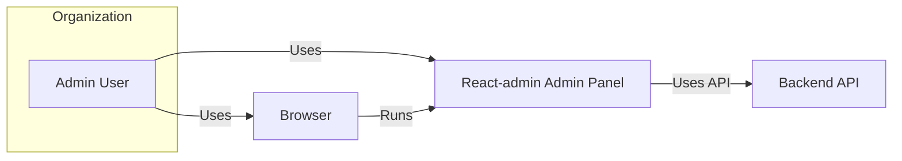
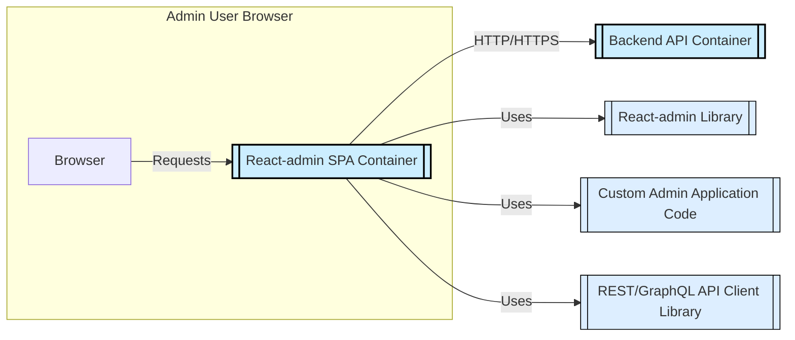
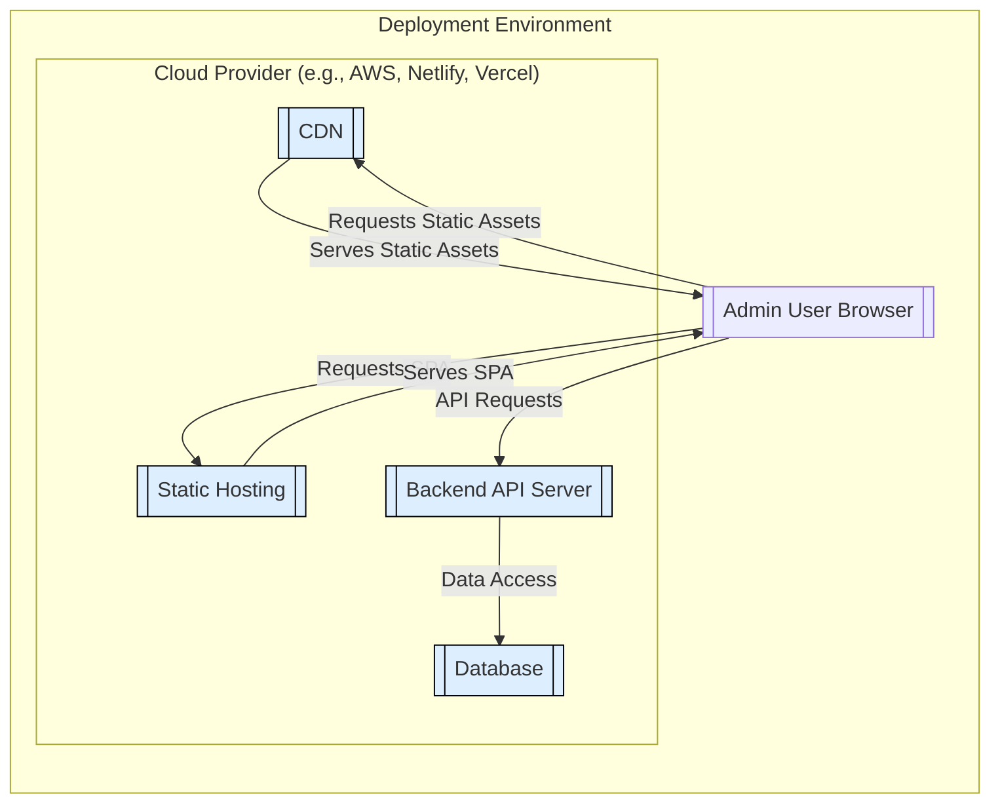
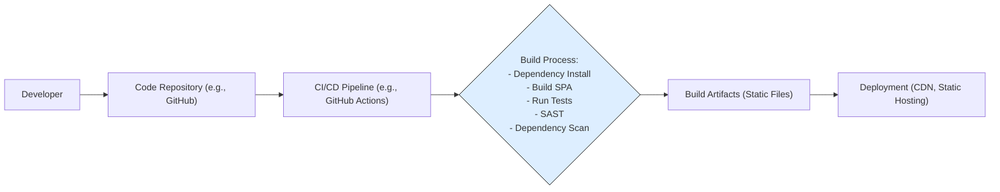

# BUSINESS POSTURE

- Business Priorities and Goals:
  - Rapid development of admin interfaces for business applications.
  - Streamline data management and operational tasks through user-friendly admin panels.
  - Reduce development time and costs associated with building admin interfaces from scratch.
  - Enable faster iteration and updates to admin functionalities.
- Business Risks:
  - Data breaches through vulnerabilities in the admin panel, leading to exposure of sensitive business information.
  - Unauthorized access to critical business data and functionalities via compromised admin accounts or security flaws.
  - Availability disruptions of the admin panel, impacting business operations that rely on it for data management and system administration.
  - Supply chain risks associated with open-source dependencies used in react-admin, potentially introducing vulnerabilities.
  - Misconfiguration of the admin panel or its underlying infrastructure leading to security weaknesses.

# SECURITY POSTURE

- Existing Security Controls:
  - security control: Open-source project with public code repository, allowing for community review and scrutiny. (Location: GitHub repository)
  - security control: Dependency management using npm or yarn, enabling tracking and updating of project dependencies. (Location: package.json, yarn.lock / package-lock.json)
  - security control: Active community and issue tracking system for reporting and addressing bugs and potential security vulnerabilities. (Location: GitHub issues)
- Accepted Risks:
  - accepted risk: Reliance on third-party open-source libraries, which may contain undiscovered vulnerabilities.
  - accepted risk: Potential for security vulnerabilities within the react-admin framework itself, requiring community effort and maintainer response for remediation.
- Recommended Security Controls:
  - security control: Implement automated dependency scanning to identify and address known vulnerabilities in project dependencies.
  - security control: Integrate Static Application Security Testing (SAST) tools into the development pipeline to detect potential security flaws in custom admin application code.
  - security control: Conduct regular penetration testing on deployed admin panels to proactively identify and remediate security vulnerabilities in a live environment.
  - security control: Implement a robust Content Security Policy (CSP) to mitigate risks of cross-site scripting (XSS) attacks.
  - security control: Enforce security best practices in the development and configuration of the backend API that react-admin interacts with.
- Security Requirements:
  - Authentication:
    - Requirement: Implement secure authentication mechanisms to verify the identity of admin users accessing the panel.
    - Requirement: Support integration with existing organizational identity providers (e.g., OAuth 2.0, SAML) for centralized user management.
    - Requirement: Enforce strong password policies and multi-factor authentication (MFA) where applicable.
  - Authorization:
    - Requirement: Implement role-based access control (RBAC) to restrict user access to specific features and data based on their roles and responsibilities.
    - Requirement: Define granular permissions for different administrative tasks and data entities.
    - Requirement: Regularly review and update user roles and permissions to maintain least privilege access.
  - Input Validation:
    - Requirement: Implement comprehensive input validation on both the client-side (react-admin) and server-side (backend API) to prevent injection attacks (e.g., SQL injection, XSS).
    - Requirement: Sanitize user inputs before displaying them in the admin interface to prevent XSS vulnerabilities.
    - Requirement: Validate data formats and types to ensure data integrity and prevent unexpected application behavior.
  - Cryptography:
    - Requirement: Utilize HTTPS for all communication between the admin panel (browser) and the backend API to encrypt data in transit.
    - Requirement: Securely store sensitive data at rest in the backend database, employing encryption where necessary.
    - Requirement: Handle sensitive data in memory securely and avoid storing sensitive information in browser local storage or cookies if possible, or encrypt if necessary.

# DESIGN

## C4 CONTEXT

- Context Diagram Elements:
  - - Name: Admin User
    - Type: Person
    - Description: Authorized personnel who manage the application and data through the admin panel.
    - Responsibilities: Managing application data, configuring system settings, monitoring system status, user management.
    - Security controls: Strong authentication, multi-factor authentication, role-based access control, audit logging of admin actions.
  - - Name: React-admin Admin Panel
    - Type: Software System
    - Description: Frontend application built using react-admin framework, providing a user interface for administrative tasks.
    - Responsibilities: Presenting data to admin users, providing UI for data manipulation, interacting with the Backend API, handling user authentication and authorization (client-side).
    - Security controls: Input validation (client-side), Content Security Policy (CSP), secure session management, protection against XSS and CSRF attacks, regular security updates of react-admin framework and dependencies.
  - - Name: Backend API
    - Type: Software System
    - Description: REST or GraphQL API that provides data and business logic for the admin panel.
    - Responsibilities: Data storage and retrieval, business logic execution, data validation and sanitization, authentication and authorization (server-side), API access control.
    - Security controls: API authentication and authorization, input validation (server-side), secure data storage and encryption, rate limiting, protection against injection attacks, regular security updates of API framework and dependencies.
  - - Name: Browser
    - Type: Software System
    - Description: Web browser used by admin users to access and interact with the React-admin Admin Panel.
    - Responsibilities: Rendering the admin panel UI, executing JavaScript code, communicating with the Backend API.
    - Security controls: Browser security features (e.g., sandboxing, same-origin policy), user awareness of browser security best practices, ensuring browser is up-to-date with security patches.

## C4 CONTAINER

- Container Diagram Elements:
  - - Name: React-admin SPA Container
    - Type: Container - Single Page Application
    - Description:  A single-page application built using React and react-admin, running in the user's browser. It encompasses all the frontend code, including the react-admin library, custom application logic, and API client.
    - Responsibilities: Rendering the user interface, managing user interactions, client-side routing, making API calls to the Backend API, client-side input validation, handling user authentication tokens (in browser memory or secure cookies).
    - Security controls: Content Security Policy (CSP), input validation, secure session management (using HTTP-only cookies or local storage with care), protection against XSS and CSRF, regular updates of dependencies, secure coding practices in custom code.
  - - Name: Backend API Container
    - Type: Container - Web Application
    - Description:  A web application server hosting the REST or GraphQL API that serves data and performs business logic for the admin panel. This could be implemented using various technologies like Node.js, Python (Django/Flask), Java (Spring), etc.
    - Responsibilities: Handling API requests from the React-admin SPA, data access and manipulation, business logic execution, server-side authentication and authorization, input validation, data sanitization, logging and monitoring.
    - Security controls: API authentication and authorization mechanisms (e.g., OAuth 2.0, JWT), input validation, secure database access, protection against injection attacks (SQL injection, command injection), rate limiting, security audits, regular security updates of server-side framework and dependencies, secure logging and monitoring.
  - - Name: React-admin Library
    - Type: Library
    - Description: The core react-admin JavaScript library providing components and functionalities for building admin interfaces.
    - Responsibilities: Providing UI components, data provider abstraction, routing, form handling, and other admin panel functionalities.
    - Security controls: Security vulnerabilities are addressed by the open-source community and maintainers, regular updates to the library should be applied.
  - - Name: Custom Admin Application Code
    - Type: Code
    - Description:  The application-specific JavaScript/React code developed to customize and extend the react-admin framework for specific business needs. This includes custom components, data providers, and business logic within the admin panel.
    - Responsibilities: Implementing application-specific features, customizing UI, integrating with specific backend API endpoints.
    - Security controls: Secure coding practices, input validation, SAST analysis, code reviews, adherence to security guidelines.
  - - Name: REST/GraphQL API Client Library
    - Type: Library
    - Description: A JavaScript library used to make HTTP requests to the Backend API (e.g., `fetch`, `axios`, `graphql-request`).
    - Responsibilities: Handling API communication, request and response serialization/deserialization.
    - Security controls: Ensure the library is up-to-date and free from known vulnerabilities.

## DEPLOYMENT

- Deployment Diagram Elements:
  - - Name: CDN
    - Type: Infrastructure - Content Delivery Network
    - Description: A network of geographically distributed servers that cache static assets (JavaScript, CSS, images) of the React-admin SPA to improve performance and reduce latency for users.
    - Responsibilities: Caching and serving static content, improving application load times, reducing load on origin server.
    - Security controls: DDoS protection, secure configuration of CDN settings, HTTPS delivery, access control to CDN configuration.
  - - Name: Static Hosting
    - Type: Infrastructure - Static Website Hosting
    - Description:  A service for hosting static files, used to serve the React-admin SPA. Examples include AWS S3, Netlify, Vercel, GitHub Pages.
    - Responsibilities: Hosting and serving the static files of the React-admin application, handling initial requests for the SPA.
    - Security controls: Access control to hosting configuration, secure configuration of hosting settings, HTTPS delivery, ensuring integrity of hosted files.
  - - Name: Backend API Server
    - Type: Infrastructure - Application Server
    - Description:  Server(s) hosting the Backend API application. This could be running on cloud infrastructure (e.g., AWS EC2, Google Compute Engine, Azure VMs) or serverless platforms (e.g., AWS Lambda, Google Cloud Functions, Azure Functions).
    - Responsibilities: Running the Backend API application, processing API requests, interacting with the database.
    - Security controls: Server hardening, network security (firewalls, security groups), intrusion detection/prevention systems, regular security patching, access control to server infrastructure, secure configuration of application server.
  - - Name: Database
    - Type: Infrastructure - Database Server
    - Description:  Database system used by the Backend API to store and retrieve data. This could be a relational database (e.g., PostgreSQL, MySQL) or a NoSQL database (e.g., MongoDB, DynamoDB).
    - Responsibilities: Storing application data, ensuring data persistence, providing data access to the Backend API.
    - Security controls: Database access control, database encryption at rest and in transit, regular database backups, database security hardening, monitoring database activity, patching database software.
  - - Name: Admin User Browser
    - Type: Client Application
    - Description: Web browser used by admin users to access the React-admin Admin Panel.
    - Responsibilities: Rendering and executing the React-admin SPA, communicating with CDN, Static Hosting and Backend API Server.
    - Security controls: User education on browser security best practices, ensuring users use up-to-date and secure browsers.

## BUILD

- Build Process Description:
  - The build process starts with a developer committing code changes to a code repository, such as GitHub.
  - A CI/CD pipeline is triggered upon code changes (e.g., push, pull request). This pipeline is typically defined using tools like GitHub Actions, Jenkins, or GitLab CI.
  - The CI/CD pipeline executes a series of build steps:
    - Dependency Installation: Install project dependencies using a package manager like npm or yarn.
    - Build SPA: Build the React-admin Single Page Application, compiling code, bundling assets, and optimizing for production.
    - Run Tests: Execute automated tests (unit tests, integration tests) to ensure code quality and functionality.
    - SAST (Static Application Security Testing): Perform static code analysis to identify potential security vulnerabilities in the codebase.
    - Dependency Scan: Scan project dependencies for known security vulnerabilities.
  - Upon successful completion of the build process, build artifacts are generated. These artifacts typically consist of static files (HTML, CSS, JavaScript, images) for the React-admin SPA.
  - The build artifacts are then deployed to the target deployment environment, such as a CDN and static hosting service, making the updated admin panel accessible to users.
- Build Process Security Controls:
  - security control: Code Review Process: Implement mandatory code reviews for all code changes before merging to the main branch to identify potential security flaws and ensure code quality. (Location: GitHub Pull Requests)
  - security control: Automated Build Process: Utilize a CI/CD pipeline to automate the build and deployment process, reducing manual errors and ensuring consistency. (Location: CI/CD configuration files, e.g., GitHub Actions workflows)
  - security control: Dependency Vulnerability Scanning: Integrate dependency scanning tools into the CI/CD pipeline to automatically detect and report vulnerabilities in project dependencies. (Location: CI/CD pipeline scripts, dependency scanning tool reports)
  - security control: SAST Integration: Integrate Static Application Security Testing (SAST) tools into the CI/CD pipeline to automatically analyze the codebase for security vulnerabilities during the build process. (Location: CI/CD pipeline scripts, SAST tool reports)
  - security control: Secure Build Environment: Ensure the CI/CD build environment is secure and hardened to prevent unauthorized access and tampering. (Location: CI/CD infrastructure security configurations)
  - security control: Artifact Integrity Checks: Implement checks to ensure the integrity of build artifacts before deployment, preventing tampering or corruption during the build and deployment process. (Location: CI/CD pipeline scripts, artifact signing or checksum verification)
  - security control: Access Control to Build System: Restrict access to the CI/CD system and build configurations to authorized personnel only. (Location: CI/CD platform access control settings)

# RISK ASSESSMENT

- Critical Business Processes:
  - Management of core business data (e.g., customer data, product information, financial records).
  - User and access management for the application and related systems.
  - System configuration and settings management.
  - Monitoring and auditing of system activities.
  - Reporting and analytics based on business data.
- Data Sensitivity:
  - The sensitivity of data managed through the admin panel is highly dependent on the specific application. It can range from low sensitivity (publicly available information) to high sensitivity (personally identifiable information (PII), financial data, confidential business data).
  - Classify data based on sensitivity levels (e.g., public, internal, confidential, restricted) and apply appropriate security controls accordingly.
  - Consider regulatory compliance requirements (e.g., GDPR, HIPAA, PCI DSS) based on the type of data being managed.

# QUESTIONS & ASSUMPTIONS

- Questions:
  - What specific type of data will be managed and accessed through the react-admin based admin panel?
  - What are the organization's specific security policies and compliance requirements?
  - What is the intended deployment environment for the admin panel and backend API (cloud provider, on-premises, hybrid)?
  - What authentication and authorization mechanisms are currently in place or planned for the backend API?
  - What is the expected user base and their roles and responsibilities within the admin panel?
  - Are there any existing security tools or processes already in place within the organization that should be integrated with the admin panel?
- Assumptions:
  - Assumption: The react-admin based admin panel will be used to manage sensitive business data and critical business processes.
  - Assumption: Security is a significant concern for the organization deploying the admin panel.
  - Assumption: The backend API is a separate system and its security is also a critical consideration.
  - Assumption: The deployment environment will likely involve cloud infrastructure and static hosting for the frontend.
  - Assumption: The organization has or will implement a CI/CD pipeline for building and deploying the admin panel.