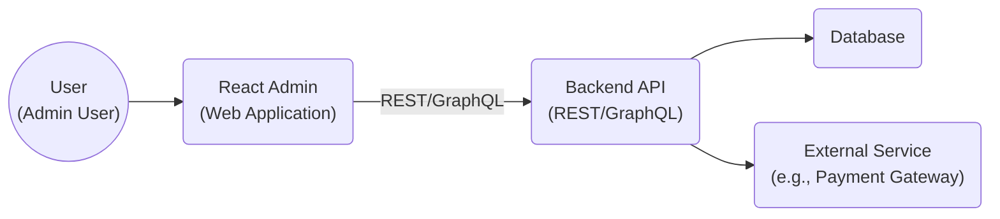
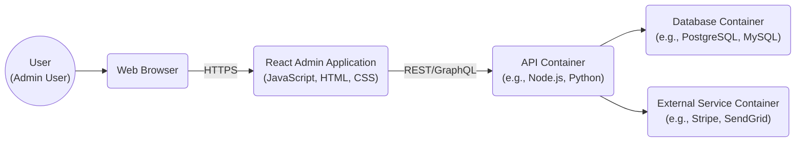
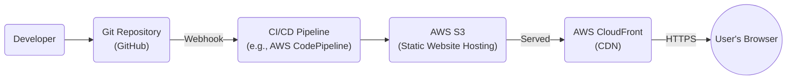
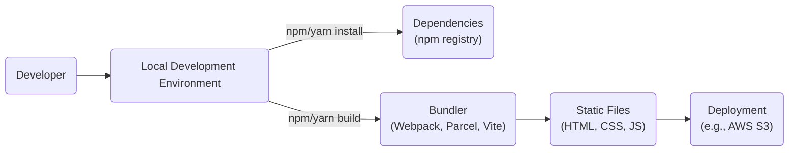

Okay, let's create a design document for the `react-admin` project.

# BUSINESS POSTURE

React-admin is an open-source framework for building administration interfaces on top of REST/GraphQL APIs.  It's designed for rapid development and customization.  Given its nature as a frontend framework, the business priorities likely revolve around:

*   Priorities:
    *   Developer Productivity: Enable developers to quickly build functional and aesthetically pleasing admin panels.
    *   Customizability: Allow extensive customization to fit specific business needs and branding.
    *   Maintainability:  Provide a clear and well-documented structure for long-term maintenance and updates.
    *   Community Support: Foster a strong community to provide support, contribute features, and ensure longevity.
    *   Integration Flexibility: Support a wide range of backend APIs and data formats.
    *   Performance: Ensure the framework itself doesn't introduce performance bottlenecks.

*   Goals:
    *   Become a leading choice for building admin interfaces in the React ecosystem.
    *   Reduce development time and cost for businesses needing admin panels.
    *   Provide a robust and reliable solution for managing data and users.

*   Business Risks:
    *   Security Vulnerabilities:  Since it handles potentially sensitive data and user interactions, vulnerabilities in react-admin could expose backend systems to attacks. This is the most critical risk.
    *   Dependency Risks: Reliance on third-party libraries introduces the risk of vulnerabilities or breaking changes in those dependencies.
    *   Lack of Adoption: If the framework fails to gain sufficient adoption, it may become difficult to maintain and support.
    *   Competition:  Other frameworks or custom solutions could offer better features or performance, leading to a loss of users.
    *   Data Breaches: Improperly configured or customized implementations could lead to data breaches.
    *   Compliance Violations:  If used in regulated industries, failure to meet compliance requirements (e.g., GDPR, HIPAA) could result in legal and financial penalties.

# SECURITY POSTURE

React-admin, being a frontend framework, relies heavily on the security of the backend API it interacts with. However, it also has its own security considerations.

*   Existing Security Controls:
    *   security control: Input Sanitization: React itself provides some protection against Cross-Site Scripting (XSS) by escaping output by default. React-admin likely builds upon this. (Implemented in: React core, and potentially in custom components within react-admin).
    *   security control: Authentication Handling: React-admin provides mechanisms for handling authentication, but the actual implementation details depend on the chosen authentication provider. (Described in: React-admin documentation, implemented in user's application code).
    *   security control: Authorization Handling: Similar to authentication, react-admin offers building blocks for authorization, but the specific implementation is left to the developer. (Described in: React-admin documentation, implemented in user's application code).
    *   security control: Dependency Management: The project uses package managers (npm/yarn) which allow for tracking and updating dependencies. (Implemented in: package.json, package-lock.json or yarn.lock).
    *   security control: Regular Updates: The maintainers of react-admin regularly release updates, including security patches. (Described in: GitHub releases, changelog).

*   Accepted Risks:
    *   accepted risk: Backend API Security: React-admin inherently trusts the backend API to handle sensitive operations and data securely.  Any vulnerabilities in the API are outside the direct control of react-admin.
    *   accepted risk: Customization Risks:  The high degree of customization allows developers to introduce security vulnerabilities if they are not careful.
    *   accepted risk: Third-Party Component Risks:  The use of third-party components (e.g., for rich text editing) introduces the risk of vulnerabilities in those components.

*   Recommended Security Controls:
    *   security control: Content Security Policy (CSP):  Implementing a strict CSP can mitigate the impact of XSS vulnerabilities.
    *   security control: HTTP Security Headers:  Setting appropriate HTTP security headers (e.g., HSTS, X-Frame-Options, X-Content-Type-Options) can enhance security.
    *   security control: Regular Security Audits:  Conducting regular security audits, both manual and automated, can help identify and address vulnerabilities.
    *   security control: Input Validation (Client-Side): While server-side validation is crucial, adding client-side validation in react-admin can improve user experience and provide an additional layer of defense.
    *   security control: Automated Security Scanning: Integrate SAST (Static Application Security Testing) and DAST (Dynamic Application Security Testing) tools into the development and deployment pipeline.

*   Security Requirements:
    *   Authentication:
        *   The system MUST support secure authentication mechanisms (e.g., OAuth 2.0, OpenID Connect).
        *   The system MUST NOT store passwords in plain text.
        *   The system SHOULD support multi-factor authentication (MFA).
    *   Authorization:
        *   The system MUST implement role-based access control (RBAC) or attribute-based access control (ABAC).
        *   The system MUST enforce the principle of least privilege.
        *   The system MUST prevent unauthorized access to data and functionality.
    *   Input Validation:
        *   The system MUST validate all user inputs on the server-side.
        *   The system SHOULD validate user inputs on the client-side for improved user experience.
        *   The system MUST sanitize all user inputs to prevent XSS attacks.
    *   Cryptography:
        *   The system MUST use strong, industry-standard cryptographic algorithms.
        *   The system MUST securely store and manage cryptographic keys.
        *   The system MUST use HTTPS for all communication.

# DESIGN

## C4 CONTEXT

*   Elements:
    *   User:
        *   Name: User
        *   Type: Person
        *   Description: A person who interacts with the React Admin application to manage data and perform administrative tasks.
        *   Responsibilities: Authenticate, view data, modify data, perform administrative actions.
        *   Security controls: Authentication, Authorization.
    *   React Admin:
        *   Name: React Admin
        *   Type: Web Application
        *   Description: The frontend application built using the react-admin framework.
        *   Responsibilities: Display data, handle user input, communicate with the backend API.
        *   Security controls: Input Sanitization, Authentication Handling, Authorization Handling.
    *   Backend API:
        *   Name: Backend API
        *   Type: API
        *   Description: The backend API that provides data and functionality to the React Admin application.
        *   Responsibilities: Handle data requests, enforce business logic, interact with the database and external services.
        *   Security controls: Authentication, Authorization, Input Validation, Rate Limiting, Data Encryption.
    *   Database:
        *   Name: Database
        *   Type: Database
        *   Description: The database that stores the application data.
        *   Responsibilities: Store data, retrieve data, ensure data integrity.
        *   Security controls: Access Control, Encryption at Rest, Auditing.
    *   External Service:
        *   Name: External Service
        *   Type: External System
        *   Description: Any external service that the backend API interacts with (e.g., payment gateway, email service).
        *   Responsibilities: Varies depending on the service.
        *   Security controls: Depends on the specific service; typically involves API keys, authentication, and encryption.

## C4 CONTAINER

*   Elements:
    *   User:
        *   Name: User
        *   Type: Person
        *   Description: A person who interacts with the React Admin application to manage data and perform administrative tasks.
        *   Responsibilities: Authenticate, view data, modify data, perform administrative actions.
        *   Security controls: Authentication, Authorization.
    *   Web Browser:
        *   Name: Web Browser
        *   Type: Software Application
        *   Description: The user's web browser, which renders the React Admin application.
        *   Responsibilities: Render HTML, execute JavaScript, handle user interaction.
        *   Security controls: Browser security features (e.g., same-origin policy, CSP).
    *   React Admin Application:
        *   Name: React Admin Application
        *   Type: Web Application
        *   Description: The frontend application built using the react-admin framework, running within the web browser.
        *   Responsibilities: Display data, handle user input, communicate with the backend API.
        *   Security controls: Input Sanitization, Authentication Handling, Authorization Handling.
    *   API Container:
        *   Name: API Container
        *   Type: Container
        *   Description: The container that hosts the backend API.
        *   Responsibilities: Handle data requests, enforce business logic, interact with the database and external services.
        *   Security controls: Authentication, Authorization, Input Validation, Rate Limiting, Data Encryption.
    *   Database Container:
        *   Name: Database Container
        *   Type: Container
        *   Description: The container that hosts the database.
        *   Responsibilities: Store data, retrieve data, ensure data integrity.
        *   Security controls: Access Control, Encryption at Rest, Auditing.
    *   External Service Container:
        *   Name: External Service Container
        *   Type: Container
        *   Description: The container that hosts the external service.
        *   Responsibilities: Varies depending on the service.
        *   Security controls: Depends on the specific service; typically involves API keys, authentication, and encryption.

## DEPLOYMENT

React-admin applications, being frontend applications, are typically deployed as static files (HTML, CSS, JavaScript) to a web server or CDN.  The backend API and database are deployed separately.

*   Possible Deployment Solutions:
    *   Static Web Hosting (e.g., AWS S3 + CloudFront, Netlify, Vercel, GitHub Pages): This is the most common approach for deploying React applications.
    *   Traditional Web Server (e.g., Apache, Nginx):  The application files can be served from a traditional web server.
    *   Containerized Deployment (e.g., Docker, Kubernetes): While less common for purely frontend applications, it's possible to containerize the application for deployment.

*   Chosen Solution: Static Web Hosting (AWS S3 + CloudFront)

*   Elements:
    *   Developer:
        *   Name: Developer
        *   Type: Person
        *   Description: The developer who writes and commits code.
        *   Responsibilities: Write code, commit changes, trigger builds.
        *   Security controls: Code review, secure coding practices.
    *   Git Repository:
        *   Name: Git Repository
        *   Type: Version Control System
        *   Description: The repository that stores the application code (e.g., GitHub, GitLab, Bitbucket).
        *   Responsibilities: Store code, track changes, manage versions.
        *   Security controls: Access control, branch protection rules.
    *   CI/CD Pipeline:
        *   Name: CI/CD Pipeline
        *   Type: Automation Tool
        *   Description: The pipeline that automates the build, test, and deployment process (e.g., AWS CodePipeline, Jenkins, CircleCI).
        *   Responsibilities: Build the application, run tests, deploy to S3.
        *   Security controls: Secure configuration, access control, vulnerability scanning.
    *   AWS S3:
        *   Name: AWS S3
        *   Type: Object Storage Service
        *   Description: Amazon S3 bucket configured for static website hosting.
        *   Responsibilities: Store the application files, serve them to users.
        *   Security controls: Bucket policies, access control lists, encryption at rest.
    *   AWS CloudFront:
        *   Name: AWS CloudFront
        *   Type: Content Delivery Network (CDN)
        *   Description: Amazon CloudFront distribution that caches and delivers the application files from S3.
        *   Responsibilities: Cache content, improve performance, reduce latency.
        *   Security controls: HTTPS, WAF integration, access logs.
    * User's Browser:
        *   Name: User's Browser
        *   Type: Web Browser
        *   Description: Web browser used by user.
        *   Responsibilities: Display web content.
        *   Security controls: Browser security features (e.g., same-origin policy, CSP).

## BUILD

The build process for a React-admin application typically involves using a package manager (npm or yarn) and a bundler (e.g., Webpack, Parcel, Vite).

* Build process description:
    1.  Developer writes code on their local machine.
    2.  Dependencies are installed using npm or yarn, fetching packages from the npm registry.
    3.  The `npm run build` or `yarn build` command is executed, which triggers the bundler.
    4.  The bundler (Webpack, Parcel, Vite, etc.) processes the code, resolves dependencies, and generates optimized static files (HTML, CSS, JavaScript).
    5.  These static files are then deployed to the target environment (e.g., AWS S3).

* Security Controls in Build Process:
    *   Dependency Management: Using package-lock.json or yarn.lock ensures consistent and reproducible builds, reducing the risk of unexpected dependency changes.
    *   Vulnerability Scanning: Tools like `npm audit` or `yarn audit` can be integrated into the build process to scan for known vulnerabilities in dependencies.
    *   Static Code Analysis: Linters (e.g., ESLint) and static analysis tools can be used to identify potential code quality and security issues.
    *   Code Signing: While less common for frontend applications, code signing can be used to verify the integrity of the build artifacts.
    *   Supply Chain Security: Using tools like Snyk or Dependabot can help monitor and manage dependencies, alerting on known vulnerabilities.

# RISK ASSESSMENT

*   Critical Business Processes:
    *   Data Management: The primary business process is the management of data through the admin interface. This includes viewing, creating, updating, and deleting data.
    *   User Management: Managing user accounts, roles, and permissions is also a critical process.
    *   Workflow Automation: Any automated workflows or processes configured within the admin panel are also critical.

*   Data Sensitivity:
    *   The sensitivity of the data handled by react-admin depends entirely on the specific application and the backend API it connects to.
    *   Data could range from non-sensitive (e.g., public product catalogs) to highly sensitive (e.g., personal information, financial data, healthcare records).
    *   Examples:
        *   Low Sensitivity: Product names, descriptions, and prices in a public e-commerce catalog.
        *   Medium Sensitivity: User email addresses, usernames, and roles.
        *   High Sensitivity: Personally Identifiable Information (PII), financial transactions, medical records.

# QUESTIONS & ASSUMPTIONS

*   Questions:
    *   What specific backend API technology is being used (REST, GraphQL, specific framework)?
    *   What authentication and authorization mechanisms are implemented in the backend API?
    *   What types of data will be managed through the react-admin interface?
    *   Are there any specific compliance requirements (e.g., GDPR, HIPAA)?
    *   What is the expected user base and traffic volume?
    *   What is the existing security infrastructure and tooling?
    *   Are there any existing security policies or guidelines?

*   Assumptions:
    *   BUSINESS POSTURE: The organization has a moderate risk appetite, balancing rapid development with security concerns.
    *   SECURITY POSTURE: The backend API is responsible for the majority of security enforcement.  The react-admin application is primarily a presentation layer.
    *   DESIGN: The application will be deployed using a standard static web hosting approach. The backend API and database are deployed and managed separately. The build process uses standard tools like npm and Webpack.