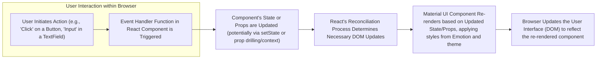
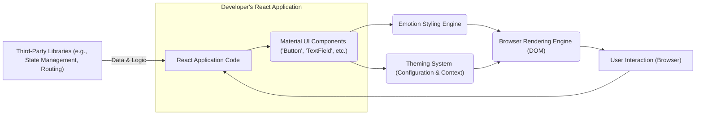
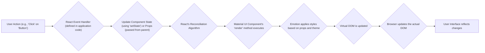

## Project Design Document: Material UI Library for Threat Modeling (Improved)

**1. Introduction**

This document provides an enhanced architectural overview and detailed descriptions of key components within the Material UI library (https://github.com/mui-org/material-ui). This improved document is specifically designed to facilitate comprehensive threat modeling activities. It clearly defines the system's boundaries, elucidates critical interactions, and traces data flows to enable the identification of potential security vulnerabilities.

**2. Goals and Objectives of Material UI**

*   To offer a rich collection of accessible and customizable React UI components adhering to the Material Design specification.
*   To boost developer efficiency by providing pre-built, rigorously tested, and reusable UI elements.
*   To guarantee consistent cross-browser compatibility and responsive behavior across various devices.
*   To implement a versatile theming system that supports consistent branding and extensive customization.
*   To maintain a high standard of performance and ensure adherence to accessibility best practices.

**3. Architectural Overview**

Material UI operates exclusively on the client-side within React applications. It does not possess its own backend infrastructure. Instead, it integrates seamlessly into React projects, rendering UI elements directly within the user's web browser. The fundamental architecture is built upon a component-based paradigm, where individual UI elements are constructed as self-contained, reusable React components.

*   **Client-Side Rendering Focus:** All rendering operations and interactive logic are executed within the user's web browser.
*   **Modular Component Structure:** The library comprises a wide array of individual UI components, such as "Button", "TextField", and "Dialog".
*   **Core React Dependency:** Material UI is built upon the foundational React library and leverages its core principles, including JSX, component lifecycle, and state management.
*   **Integrated Styling Solution (Emotion):** Material UI employs a sophisticated styling solution, currently Emotion, to apply CSS styles to its components in an efficient and maintainable manner.
*   **Flexible Theming Capabilities:** A powerful theming system empowers developers to customize the visual appearance of components, ensuring brand consistency and design flexibility.

**4. Key Components**

*   **Core UI Components:**
    *   **Basic Elements:**  Includes fundamental UI building blocks like "Button", "Typography", "Icon", and "Image" components.
    *   **Input Mechanisms:**  Encompasses components for user input, such as "TextField", "Checkbox", "Radio", and "Select" components.
    *   **Navigation Structures:**  Provides components for application navigation, including "AppBar", "Drawer", and "BottomNavigation".
    *   **Layout Primitives:**  Offers components for structuring the user interface, such as "Grid" and "Container".
    *   **Data Presentation:**  Includes components for displaying data, like "List", "Table", and "Card".
    *   **User Feedback:**  Provides components for communicating feedback to the user, such as "Snackbar" and "Dialog".
*   **Styling Engine (Emotion):**
    *   Manages the application of CSS styles to Material UI components.
    *   Facilitates dynamic styling based on component properties (props) and theme configurations.
    *   Supports various styling approaches, including styled components and CSS-in-JS.
*   **Theming System:**
    *   Offers a structured way to define and manage global styles, including colors, typography settings, and spacing units.
    *   Enables the creation of custom themes to align with specific application branding guidelines.
    *   Leverages React's Context API to provide theme values throughout the component tree.
*   **Iconography:**
    *   Provides a curated collection of pre-built icons for common UI elements.
    *   Allows developers to integrate custom icon sets.
*   **Responsive Grid System:**
    *   Implements a flexible and responsive grid layout system for arranging components effectively across different screen sizes.
*   **Utility Functions and React Hooks:**
    *   Includes a set of helper functions and custom React hooks to address common development tasks, such as managing focus states, implementing transitions, and enhancing accessibility.

**5. Data Flow**

The data flow within an application utilizing Material UI adheres to React's principle of unidirectional data flow.

*   **User Interaction:** A user interacts with a Material UI component displayed in the web browser.
*   **Event Handling:** A designated React event handler function associated with the interacted component is executed.
*   **State/Props Update:** The event handler may trigger an update to the component's internal state (using `setState`) or initiate a change in props passed down from a parent component.
*   **Re-rendering:** React's reconciliation algorithm efficiently compares the previous and current virtual DOM to identify the minimal set of changes required.
*   **Material UI Rendering:** The Material UI component re-renders, incorporating the updated state and props. The Emotion styling engine applies the relevant CSS styles based on the component's configuration and the active theme.
*   **Browser Update:** The web browser updates the Document Object Model (DOM) to reflect the changes rendered by the Material UI component, visually updating the user interface.

**6. External Interactions**

Material UI interacts with several external entities during its lifecycle and usage:

*   **Fundamental Dependency on React:** Material UI is inherently dependent on the React library for its core functionality and component model. It relies on React's APIs and lifecycle methods.
*   **Web Browser Environment:** The target execution environment for Material UI is the user's web browser. Compatibility across different browsers and versions is a key consideration. Material UI interacts with browser APIs for rendering, event handling, and accessing device capabilities.
*   **Integration with Developer's Application Code:** Developers integrate Material UI components into their own React applications. This involves passing data as props to Material UI components and handling events emitted by them. The security of the application logic surrounding Material UI is crucial.
*   **Interaction with Third-Party Libraries:** Developers frequently integrate Material UI with other JavaScript libraries for tasks such as:
    *   **State Management:** Libraries like Redux, Zustand, or Recoil might manage application state that is then used to drive Material UI components.
    *   **Routing:** Libraries like React Router are used for navigation between different views or pages within the application, often involving Material UI navigation components.
    *   **Data Fetching:** Libraries like Axios or Fetch API are used to retrieve data from backend services, which is then displayed using Material UI components.
*   **Content Delivery Networks (CDNs):** While not the typical installation method, some developers might load Material UI's CSS or JavaScript assets from CDNs. The security of these CDNs is a factor to consider.
*   **Package Managers (npm, yarn, pnpm):** Developers use package managers to install and manage Material UI as a project dependency. The security of the package registry and the integrity of the downloaded packages are important.

**7. Security Considerations (Detailed for Threat Modeling)**

This section provides a more detailed breakdown of potential security concerns relevant to Material UI, categorized for better organization during threat modeling.

*   **Client-Side Cross-Site Scripting (XSS) Vulnerabilities:**
    *   **Unsafe Rendering of User-Provided Content:** If user-supplied data is directly rendered within Material UI components without proper sanitization, it can lead to XSS attacks. For example, displaying unsanitized HTML within a "Typography" component.
    *   **Vulnerabilities in Custom Component Implementations:** Developers using Material UI might introduce XSS vulnerabilities in their own custom components that utilize Material UI elements if input handling is not secure.
    *   **Potential for DOM-based XSS:**  Manipulating the DOM based on URL fragments or other client-side data without proper validation can lead to DOM-based XSS.
*   **Supply Chain Security Risks:**
    *   **Compromised Dependencies:**  A vulnerability in a direct or transitive dependency of Material UI could introduce security flaws. Regularly auditing and updating dependencies is crucial.
    *   **Malicious Packages:**  The risk of installing a compromised or malicious version of the Material UI package from the package registry. Using integrity checks (like `integrity` attributes in `package-lock.json`) can mitigate this.
*   **Client-Side Denial of Service (DoS):**
    *   **Resource Exhaustion through Complex Components:** Rendering a large number of complex Material UI components or deeply nested structures could potentially overload the client's browser, leading to a DoS.
    *   **Performance Issues Leading to DoS:** Inefficient use of Material UI features or excessive re-renders could degrade performance and make the application unresponsive.
*   **Data Injection Vulnerabilities (Indirect):**
    *   **Improper Input Handling in Forms:** If Material UI input components are used to collect user data that is subsequently used in backend queries (e.g., SQL injection) or other sensitive operations, vulnerabilities can arise in the application logic surrounding Material UI. Material UI itself doesn't directly cause this, but its use necessitates secure input handling.
*   **Accessibility Issues as Security Weaknesses:**
    *   **Information Disclosure:**  Poorly implemented accessibility features might inadvertently reveal information to unauthorized users or create unintended access points.
    *   **Usability Issues Leading to Errors:**  Accessibility issues can make it difficult for users to interact with the application correctly, potentially leading to errors or unintended actions.
*   **Client-Side Data Security:**
    *   **Exposure of Sensitive Data in the DOM:**  Care must be taken to avoid rendering sensitive information directly into the DOM if it's not necessary.
    *   **Insecure Storage of Data:**  If Material UI components are used to display or handle sensitive data that is then stored client-side (e.g., in local storage), appropriate security measures must be taken.
*   **Risks from Third-Party Integrations:**
    *   **Vulnerabilities in Integrated Libraries:** Security flaws in third-party libraries used alongside Material UI could create vulnerabilities in the overall application.
    *   **Insecure Communication with External Services:** If Material UI components are involved in communicating with external services, secure communication protocols (HTTPS) and proper authentication/authorization mechanisms are essential.

**8. Diagrams**

**8.1. High-Level Architecture Diagram (Improved)**

**8.2. Detailed Data Flow Diagram**

**9. Conclusion**

This enhanced design document provides a more comprehensive understanding of the Material UI library's architecture, key components, and data flow, specifically tailored for threat modeling. The detailed security considerations offer a solid foundation for identifying and mitigating potential vulnerabilities in applications utilizing Material UI. By carefully considering these aspects, developers can build more robust and secure user interfaces.
