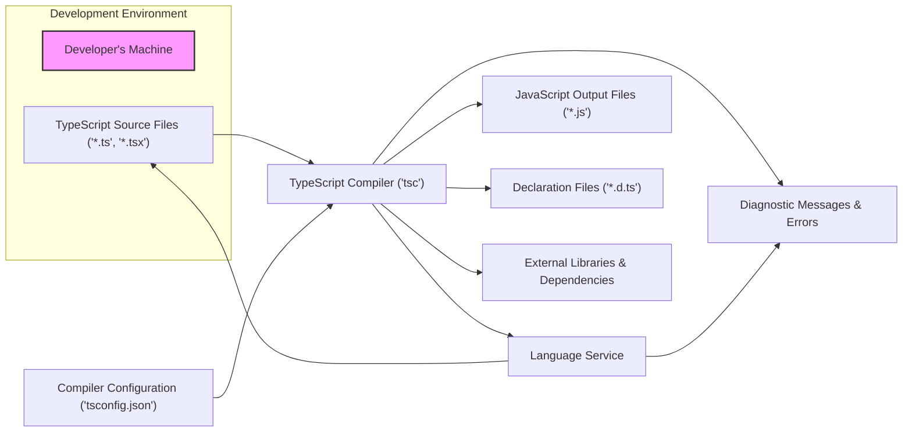
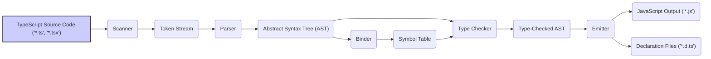

## Project Design Document: TypeScript Compiler (Improved)

**1. Introduction**

This document provides a refined high-level architectural design of the TypeScript compiler project, based on its GitHub repository: [https://github.com/microsoft/typescript](https://github.com/microsoft/typescript). This iteration aims to offer a more detailed understanding of the system's components, data flow, and technologies, serving as a robust foundation for subsequent threat modeling activities. The focus is on clarity, accuracy, and completeness to facilitate a thorough security analysis.

**2. Goals and Objectives**

The core goals driving the TypeScript project are:

*   To enable developers to write well-structured and maintainable JavaScript code by providing a superset of JavaScript with optional static typing.
*   To compile TypeScript code into clean, readable JavaScript that can run in any JavaScript environment.
*   To offer a rich and productive development experience through features like intelligent code completion, comprehensive refactoring capabilities, and proactive error detection within Integrated Development Environments (IDEs).
*   To ensure platform independence, allowing TypeScript development and compilation across various operating systems and environments.
*   To facilitate the adoption of modern JavaScript features while maintaining compatibility with existing JavaScript codebases.

**3. High-Level Architecture**

The TypeScript compiler system comprises the following interconnected components:

*   **Development Environment:**  Represents the developer's local machine where code is authored and the compiler is executed.
    *   **TypeScript Source Files ('\*.ts', '\*.tsx'):** The input source code written in TypeScript syntax.
*   **Compiler Configuration ('tsconfig.json'):** A JSON file that dictates compiler options, including target ECMAScript version, module system, and type checking strictness.
*   **TypeScript Compiler ('tsc'):** The central processing unit responsible for transforming TypeScript code into JavaScript. It orchestrates parsing, type checking, and code generation.
*   **Language Service:**  An internal API exposed by the compiler, providing rich editor features. It operates on the source code in the background, offering real-time feedback and assistance.
*   **JavaScript Output Files ('\*.js'):** The result of the compilation process, intended for execution in JavaScript runtimes (browsers, Node.js).
*   **Declaration Files ('\*.d.ts'):**  Files that describe the type information of TypeScript or JavaScript code, enabling type checking and interoperability.
*   **Diagnostic Messages & Errors:**  Feedback generated by the compiler indicating syntax errors, type mismatches, or other issues in the code.
*   **External Libraries & Dependencies:**  External codebases (JavaScript or TypeScript) that the project depends on, influencing the compilation and type checking process.

**4. Key Components and Modules (Detailed)**

The TypeScript compiler's internal architecture is further broken down into these crucial modules:

*   **Scanner (Lexical Analyzer):**
    *   **Functionality:** Reads the input TypeScript source files character by character and groups them into a stream of tokens. Tokens represent the basic building blocks of the language (keywords, identifiers, operators, literals).
    *   **Responsibility:**  Identifies and categorizes these tokens, discarding whitespace and comments (unless configured otherwise).
*   **Parser (Syntactic Analyzer):**
    *   **Functionality:** Takes the stream of tokens from the scanner and constructs an Abstract Syntax Tree (AST). The AST represents the hierarchical structure of the code, reflecting its grammatical rules.
    *   **Responsibility:** Ensures the code adheres to the TypeScript language syntax and reports syntax errors if violations are found.
*   **Binder (Symbol Resolution):**
    *   **Functionality:** Traverses the AST and establishes relationships between identifiers (names) and their corresponding declarations (where they are defined). This process is called symbol resolution.
    *   **Responsibility:** Manages scopes and namespaces, ensuring that references to variables, functions, and types are correctly linked to their definitions.
*   **Type Checker (Semantic Analyzer):**
    *   **Functionality:** The core of TypeScript's static typing system. It analyzes the AST, using the symbol table created by the binder, to verify that the types used in the code are consistent and adhere to the defined type annotations and rules. It also performs type inference where types are not explicitly specified.
    *   **Responsibility:** Detects type errors, such as assigning a value of the wrong type to a variable, calling a function with incorrect arguments, or accessing non-existent properties.
*   **Emitter (Code Generator):**
    *   **Functionality:** Takes the type-checked AST and generates the corresponding JavaScript code. It applies transformations based on the compiler options specified in `tsconfig.json`, such as targeting a specific ECMAScript version.
    *   **Responsibility:**  Produces the final JavaScript output, including any necessary polyfills or helper functions. It is also responsible for generating declaration files (`.d.ts`) based on the TypeScript code.
*   **Language Service Interface (API):**
    *   **Functionality:** Provides a programmatic interface that IDEs, build tools, and other development tools can use to interact with the TypeScript compiler's core functionalities.
    *   **Responsibility:**  Offers features like code completion (IntelliSense), signature help, go-to-definition, find all references, refactoring (rename, extract method, etc.), and real-time error reporting.
*   **Command-Line Interface (CLI - `tsc`):**
    *   **Functionality:** The primary way developers interact with the TypeScript compiler directly. It accepts command-line arguments specifying input files, compiler options, and output directories.
    *   **Responsibility:** Parses command-line arguments, loads the `tsconfig.json` file (if present), orchestrates the compilation process, and reports any errors or warnings.
*   **Configuration File Parser:**
    *   **Functionality:** Reads and interprets the `tsconfig.json` file, which defines the project's compilation settings.
    *   **Responsibility:**  Extracts compiler options, included/excluded files, and project references, influencing how the compiler operates.
*   **Module Resolver:**
    *   **Functionality:**  Locates and loads module dependencies based on `import` and `require` statements in the code. It follows specific module resolution strategies (e.g., Node.js module resolution, Classic resolution).
    *   **Responsibility:**  Ensures that module dependencies are correctly located and made available to the compiler for type checking and code generation.
*   **Incremental Build System:**
    *   **Functionality:** Optimizes the compilation process by only recompiling files that have changed since the last successful compilation.
    *   **Responsibility:** Tracks file dependencies, timestamps, and the structure of the project to determine which files need to be reprocessed, significantly speeding up subsequent builds.

**5. Data Flow (Detailed)**

The flow of data through the TypeScript compilation process is as follows:

*   **TypeScript Source Code ('\*.ts', '\*.tsx'):** The initial input – the TypeScript files to be compiled.
*   **Scanner:** Transforms the source code into a stream of individual tokens.
*   **Token Stream:** A sequence of categorized lexical units representing the code.
*   **Parser:** Organizes the tokens into a hierarchical Abstract Syntax Tree, reflecting the code's structure.
*   **Abstract Syntax Tree (AST):** A tree-like representation of the code's syntax.
*   **Binder:** Connects identifiers in the AST to their declarations, creating a symbol table.
*   **Symbol Table:** A data structure storing information about declared entities (variables, functions, types).
*   **Type Checker:** Analyzes the AST using the symbol table to perform static type analysis and identify type errors.
*   **Type-Checked AST:** The AST enriched with type information after the type checking phase.
*   **Emitter:** Generates JavaScript code and declaration files based on the type-checked AST and compiler options.
*   **JavaScript Output ('\*.js'):** The compiled JavaScript code ready for execution.
*   **Declaration Files ('\*.d.ts'):** Files containing type declarations for the TypeScript code.

**6. Technology Stack**

The TypeScript project leverages the following technologies:

*   **Primary Language:** TypeScript (the compiler is self-hosted, meaning it's written in TypeScript).
*   **Build Environment & Tools:**
    *   Node.js:  Used as the runtime environment for building and running the compiler.
    *   npm (Node Package Manager) or yarn:  Used for managing project dependencies and distributing the compiler.
    *   gulp:  A JavaScript toolkit used for automating build processes, such as compiling, testing, and packaging.
*   **Testing Infrastructure:**
    *   Mocha: A JavaScript test framework for running test suites.
    *   Chai: An assertion library used in conjunction with Mocha for writing expressive tests.
    *   อื่น ๆ testing utilities: Various other utilities and libraries might be used for specific testing needs.
*   **Version Control:** Git (hosted on GitHub).
*   **Integrated Development Environments (IDEs):** While not part of the compiler itself, its development is heavily intertwined with IDEs like Visual Studio Code, which provides first-class TypeScript support.

**7. Deployment Model**

The TypeScript compiler is primarily distributed and used in the following ways:

*   **npm Package Distribution:** The compiler is published as an npm package (`typescript`), allowing developers to install it globally or as a project-specific dependency using npm or yarn.
*   **Command-Line Tool (`tsc`):** After installation via npm, the `tsc` command-line tool becomes available, enabling developers to compile TypeScript files from their terminal.
*   **Language Service Integration:** The TypeScript language service is integrated into various code editors and IDEs (e.g., Visual Studio Code, Sublime Text, Atom, JetBrains IDEs) through plugins or built-in support, providing real-time type checking and code intelligence features.
*   **Build Pipelines:** The `tsc` command is commonly incorporated into build pipelines (using tools like Webpack, Parcel, or esbuild) to automatically compile TypeScript code as part of the software development lifecycle.

**8. Security Considerations (Pre-Threat Modeling - Enhanced)**

Prior to a formal threat modeling exercise, it's crucial to consider these potential security aspects:

*   **Malicious Input Handling (Code Injection):**
    *   **Threat:**  Attackers could craft malicious TypeScript code designed to exploit vulnerabilities in the compiler's parsing or type checking stages, potentially leading to arbitrary code execution during compilation.
    *   **Example:**  Exploiting a buffer overflow in the parser by providing an excessively long identifier.
*   **Supply Chain Security (Dependency Vulnerabilities):**
    *   **Threat:** The compiler relies on various npm packages for its build process. Compromised or vulnerable dependencies could introduce security risks into the compiler itself.
    *   **Example:** A vulnerable version of a build tool being used, allowing an attacker to inject malicious code during the build process.
*   **Denial of Service (DoS):**
    *   **Threat:**   специально crafted TypeScript code could cause the compiler to consume excessive CPU or memory resources, leading to a denial of service.
    *   **Example:**  Extremely complex type definitions that overwhelm the type checker.
*   **Information Disclosure:**
    *   **Threat:** The compiler might inadvertently expose sensitive information through error messages, debug logs, or the generated JavaScript code.
    *   **Example:**  Error messages revealing internal file paths or configuration details.
*   **Build Process Integrity:**
    *   **Threat:**  Compromising the build environment or pipeline could allow attackers to inject malicious code into the distributed compiler binaries.
    *   **Example:**  An attacker gaining access to the build server and modifying the compiler source code before release.
*   **Regular Expression Denial of Service (ReDoS):**
    *   **Threat:** If the compiler uses regular expressions for parsing or analysis, carefully crafted input could cause these regexes to take an excessively long time to process, leading to a DoS.
*   **Type System Exploits:**
    *   **Threat:**  Sophisticated attackers might find ways to exploit the intricacies of the TypeScript type system to bypass security checks or introduce unexpected behavior in the compiled JavaScript.

**9. Assumptions and Constraints**

*   This document provides a high-level overview and focuses on the core compilation pipeline. Deeper internal implementation details of specific modules are not exhaustively covered.
*   The architecture described reflects the current understanding of the project based on its public repository. Internal structures and processes may evolve.
*   The security considerations outlined are preliminary and serve as a starting point for a more comprehensive threat modeling exercise.
*   The document assumes a general understanding of software development concepts and the role of a compiler.

**10. Out of Scope**

This document explicitly excludes:

*   Detailed design specifications for individual TypeScript language features.
*   In-depth implementation details of specific compiler modules or algorithms.
*   The architectural design of the TypeScript website, documentation, or related tooling.
*   The specifics of how IDE plugins integrate with the TypeScript language service.
*   A complete and formal security threat model (this document is a precursor to that).

This improved design document aims to provide a more comprehensive and detailed understanding of the TypeScript compiler's architecture, enhancing its value as a foundation for thorough threat modeling and security analysis.
