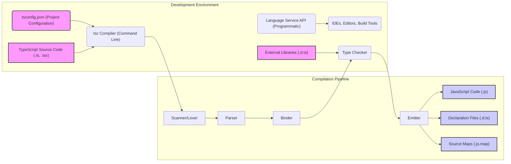

# Project Design Document: TypeScript Compiler (Improved)

**Project Name:** TypeScript Compiler

**Project Repository:** [https://github.com/microsoft/typescript](https://github.com/microsoft/typescript)

**Document Version:** 1.1
**Date:** 2023-10-27
**Author:** AI Expert

## 1. Project Overview

### 1.1. Project Description

TypeScript is a strongly-typed, object-oriented, compiled language developed by Microsoft. It is designed as a superset of JavaScript, adding optional static typing to enable large-scale JavaScript application development. The TypeScript compiler (`tsc`) is the cornerstone of the project, responsible for transpiling TypeScript code into standard JavaScript that can run across various JavaScript environments, including browsers and Node.js. TypeScript aims to enhance developer productivity, code maintainability, and scalability by providing features like static typing, classes, interfaces, modules, and rich tooling support.

### 1.2. Project Goals

*   **Elevate JavaScript Development:** To provide a language that addresses the challenges of large JavaScript projects by introducing static typing and modern programming paradigms.
*   **Maintain JavaScript Compatibility and Interoperability:** Ensure seamless integration with existing JavaScript code and libraries. TypeScript should be a gradual adoption language, where JavaScript code is valid TypeScript.
*   **Enhance Code Quality and Reliability:** Improve code robustness and reduce runtime errors through static type checking and early error detection during development.
*   **Enable Superior Tooling and Developer Experience:** Offer a rich ecosystem of development tools, including IDE support with features like intelligent code completion, refactoring, and comprehensive type checking.
*   **Evolve in Alignment with ECMAScript Standards:** Continuously adopt and integrate new ECMAScript features, ensuring TypeScript remains a modern and relevant language.
*   **Performance and Efficiency:** Maintain and improve the performance of the compiler and the generated JavaScript code.

### 1.3. Target Users

*   **Frontend Web Developers:** Building complex web applications using frameworks like React, Angular, Vue.js, and others.
*   **Backend Node.js Developers:** Developing server-side applications and APIs using Node.js.
*   **Full-Stack Developers:** Working across both frontend and backend technologies using JavaScript/TypeScript.
*   **Mobile App Developers (using frameworks like React Native or Ionic):** Building cross-platform mobile applications.
*   **Library and Framework Authors:** Creating reusable JavaScript/TypeScript libraries and frameworks, benefiting from type definitions and improved API design.
*   **Enterprise Software Development Teams:** Organizations building large, mission-critical applications where code maintainability and scalability are paramount.
*   **Tooling and IDE Vendors:** Companies and individuals developing development tools that integrate with TypeScript, such as IDEs, code editors, linters, and build systems.

## 2. System Architecture

### 2.1. High-Level Architecture

The TypeScript system is architected around the central `tsc` compiler and the Language Service API. The `tsc` compiler is a command-line tool that performs batch compilation of TypeScript files. The Language Service API provides a set of interfaces for integrating TypeScript language features into development tools, enabling features like code completion, diagnostics, and refactoring in real-time.

**Components in High-Level Architecture:**

*   **TypeScript Source Code (.ts, .tsx):** The input to the compiler, containing TypeScript code adhering to the language syntax and semantics.
*   **tsconfig.json (Project Configuration):** A JSON file that configures the TypeScript compiler options, including target ECMAScript version, module system, output directory, and project-specific settings.
*   **tsc Compiler (Command Line):** The primary executable for the TypeScript compiler, invoked from the command line to perform batch compilation of TypeScript projects.
*   **Scanner/Lexer:** The initial stage of the compilation pipeline, responsible for tokenizing the input TypeScript source code into a stream of lexical tokens.
*   **Parser:** Takes the token stream from the Scanner and constructs an Abstract Syntax Tree (AST), representing the hierarchical structure of the TypeScript code.
*   **Binder:** Performs semantic analysis, resolving symbols (identifiers) to their declarations, managing scopes, and establishing semantic relationships within the AST.
*   **Type Checker:** The core component responsible for enforcing TypeScript's static type system. It analyzes the AST, symbol table, and type annotations to verify type correctness and identify type errors. It also incorporates type inference to deduce types where they are not explicitly declared.
*   **Emitter:** Generates the output artifacts of the compilation process, including JavaScript code, declaration files, and source maps, based on the type-checked AST and compiler options.
*   **JavaScript Code (.js):** The primary output of the compiler, representing the transpiled JavaScript code that can be executed in JavaScript runtimes.
*   **Declaration Files (.d.ts):** Output files containing type declarations for TypeScript code. These files describe the public API of TypeScript modules and are used for type checking in other TypeScript projects or JavaScript projects consuming TypeScript libraries.
*   **Source Maps (.js.map):** Output files that map the generated JavaScript code back to the original TypeScript source code, enabling effective debugging in browser developer tools and other debuggers.
*   **Language Service API (Programmatic):** A programmatic interface that exposes the TypeScript language processing capabilities for integration into IDEs, editors, and build tools. It provides functionalities for code completion, diagnostics, refactoring, navigation, and more.
*   **IDEs, Editors, Build Tools:** Development tools that leverage the Language Service API to provide rich TypeScript support, enhancing the developer experience. Examples include Visual Studio Code, Sublime Text, Atom, WebStorm, and build tools like Webpack and Rollup.
*   **External Libraries (.d.ts):** Declaration files for external JavaScript libraries, allowing TypeScript projects to consume and type-check against these libraries. These are often obtained from DefinitelyTyped or provided by library authors.

### 2.2. Component-Level Architecture

This section provides a more detailed breakdown of the key components within the compilation process and the Language Service.

#### 2.2.1. Scanner/Lexer (Lexical Analysis)

*   **Detailed Functionality:**
    *   Reads the input TypeScript source code character by character.
    *   Identifies and groups characters into tokens based on lexical rules of TypeScript.
    *   Handles whitespace, comments, and preprocessor directives.
    *   Categorizes tokens into types like keywords, identifiers, operators, literals (numeric, string, boolean), punctuation, etc.
    *   Performs basic error detection for lexical errors (e.g., invalid characters).
*   **Input:** TypeScript source code (text).
*   **Output:** Stream of tokens.
*   **Example Tokens:**
    *   `KeywordToken: ClassKeyword` (for `class`)
    *   `IdentifierToken: Identifier("MyClass")` (for `MyClass`)
    *   `PunctuationToken: OpenBraceToken` (for `{`)
    *   `IdentifierToken: Identifier("console")` (for `console`)
    *   `PunctuationToken: DotToken` (for `.`)
    *   `IdentifierToken: Identifier("log")` (for `log`)
    *   `PunctuationToken: OpenParenToken` (for `(`)
    *   `StringLiteralToken: StringLiteral('"Hello"')` (for `"Hello"`)
    *   `PunctuationToken: CloseParenToken` (for `)`)
    *   `PunctuationToken: SemicolonToken` (for `;`)
    *   `PunctuationToken: CloseBraceToken` (for `}`)

#### 2.2.2. Parser (Syntactic Analysis)

*   **Detailed Functionality:**
    *   Consumes the stream of tokens from the Scanner.
    *   Applies grammar rules of TypeScript to organize tokens into a hierarchical Abstract Syntax Tree (AST).
    *   Represents the syntactic structure of the code, showing relationships between language constructs.
    *   Detects syntax errors (e.g., misplaced tokens, invalid grammar).
    *   AST nodes represent statements, expressions, declarations, clauses, etc. (e.g., `ClassDeclaration`, `FunctionDeclaration`, `VariableStatement`, `IfStatement`, `BinaryExpression`).
*   **Input:** Stream of tokens.
*   **Output:** Abstract Syntax Tree (AST).
*   **AST Node Examples:**
    *   `ClassDeclarationNode`: Represents a class definition, containing children nodes for class members (properties, methods, constructors).
    *   `FunctionDeclarationNode`: Represents a function definition, containing children for parameters, body, and return type.
    *   `VariableStatementNode`: Represents a variable declaration, containing children for variable declarations and their initializers.

#### 2.2.3. Binder (Semantic Analysis - Symbol Resolution and Scope)

*   **Detailed Functionality:**
    *   Traverses the AST and performs semantic analysis.
    *   **Symbol Resolution:**  Connects identifiers (names) in the code to their declarations (definitions). Creates symbol table to store information about declared entities (variables, functions, classes, interfaces, modules).
    *   **Scope Management:**  Establishes and manages scopes (lexical environments) to determine the visibility and accessibility of symbols. Handles block scoping, function scoping, module scoping.
    *   **Namespace and Module Resolution:** Resolves module imports and namespace references.
    *   **Initial Type Inference:** Performs basic type inference in simple cases, like inferring types of variables initialized with literals.
*   **Input:** Abstract Syntax Tree (AST).
*   **Output:** Symbol table, annotated AST with symbol information (symbol links to AST nodes).

#### 2.2.4. Type Checker (Semantic Analysis - Type System Enforcement)

*   **Detailed Functionality:**
    *   The core of TypeScript's static typing system.
    *   Performs in-depth type checking based on the AST, symbol table, type annotations, and external declaration files.
    *   **Type Compatibility and Assignability:** Checks if types are compatible in assignments, function calls, and operations.
    *   **Interface and Class Implementation Checks:** Verifies that classes correctly implement interfaces and inherit from base classes according to type rules.
    *   **Generic Type Handling:** Instantiates generic types, checks type constraints, and performs type inference for generic parameters.
    *   **Control Flow Analysis:** Analyzes code paths to refine types based on conditions (e.g., type narrowing after type guards).
    *   **Error Reporting (Diagnostics):** Identifies and reports type errors, including type mismatches, missing properties, incorrect function signatures, and more. Provides detailed error messages with location information.
*   **Input:** Annotated AST with symbol information, external declaration files (.d.ts).
*   **Output:** Type-checked AST, list of type errors (Diagnostics).

#### 2.2.5. Emitter (Code Generation)

*   **Detailed Functionality:**
    *   Traverses the type-checked AST and generates output files.
    *   **JavaScript Code Generation:** Translates the TypeScript AST into equivalent JavaScript code.
        *   Handles language features like classes, interfaces, modules, enums, and type annotations, transpiling them to compatible JavaScript constructs based on the configured target ECMAScript version.
        *   Optimizes generated code where possible.
    *   **Declaration File (.d.ts) Generation:** Creates declaration files that describe the types and structure of the TypeScript code.
        *   Extracts type information from the AST and generates `.d.ts` files that define interfaces, classes, functions, variables, and modules for external consumption.
    *   **Source Map (.js.map) Generation:** Generates source maps that link the generated JavaScript code back to the original TypeScript source code.
        *   Records mappings between lines and columns in the generated JavaScript and the original TypeScript, enabling debugging.
*   **Input:** Type-checked AST, compiler options from `tsconfig.json`.
*   **Output:** JavaScript code (.js), declaration files (.d.ts), source maps (.js.map).

#### 2.2.6. Language Service (Tooling API)

*   **Detailed Functionality:**
    *   Provides a programmatic API for IDEs, editors, and build tools to interact with the TypeScript language.
    *   **Incremental Compilation:** Efficiently re-compiles only changed files, improving performance in development environments.
    *   **Code Completion (IntelliSense):** Provides context-aware code completion suggestions based on types, scope, and available symbols.
    *   **Syntax and Semantic Highlighting:** Enables syntax and semantic highlighting in code editors for improved readability.
    *   **Go-to-Definition and Find All References:** Supports navigation to symbol definitions and finding all usages of a symbol within the project.
    *   **Refactoring Operations:** Offers refactoring capabilities like rename symbol, extract method, extract interface, and more, ensuring type safety during refactoring.
    *   **Diagnostics (Error Reporting):** Provides real-time error and warning reporting in the editor as code is being written.
    *   **Formatting and Code Style:** Supports code formatting and enforcing code style rules.
    *   **Signature Help and Quick Info:** Displays function signatures and type information on hover.
    *   **Project Management:** Manages TypeScript projects, handles project configuration (`tsconfig.json`), and resolves module dependencies.
*   **Input:** TypeScript source code, project configuration, user actions in IDE/Editor (keystrokes, mouse events, commands).
*   **Output:** Language service operation results (code completions, diagnostics, refactored code, navigation information, etc.), communicated back to the IDE/Editor.

## 3. Data Flow (Compilation Process)

The data flow within the TypeScript compilation process is sequential, moving through the stages of lexical analysis, syntactic analysis, semantic analysis, and code generation.

1.  **TypeScript Source Code Input:** The process begins with TypeScript source files (`.ts`, `.tsx`) and the project configuration file (`tsconfig.json`).
2.  **Scanner/Lexer (Tokenization):** The Scanner reads the source code and generates a stream of tokens.
    *   *Input:* TypeScript source code (text).
    *   *Output:* Stream of tokens.
3.  **Parser (AST Construction):** The Parser consumes the token stream and builds an Abstract Syntax Tree (AST).
    *   *Input:* Stream of tokens.
    *   *Output:* Abstract Syntax Tree (AST).
4.  **Binder (Symbol Resolution and Scope):** The Binder analyzes the AST, resolves symbols, and manages scopes, annotating the AST with symbol information.
    *   *Input:* Abstract Syntax Tree (AST).
    *   *Output:* Annotated AST with symbol information, Symbol Table.
5.  **Type Checker (Type System Enforcement):** The Type Checker performs static type checking on the annotated AST, using type annotations and external declaration files.
    *   *Input:* Annotated AST with symbol information, external declaration files (.d.ts).
    *   *Output:* Type-checked AST, Diagnostics (errors and warnings).
6.  **Emitter (Code Generation):** The Emitter traverses the type-checked AST and generates output files based on compiler options.
    *   *Input:* Type-checked AST, compiler options.
    *   *Output:* JavaScript code (.js), Declaration files (.d.ts), Source maps (.js.map).
7.  **Output Artifacts:** The final output consists of JavaScript files, declaration files, and source maps, ready for execution or further processing.

## 4. Technologies Used

*   **Primary Programming Language:**
    *   TypeScript: The TypeScript compiler is primarily written in TypeScript itself, demonstrating self-hosting. This allows for leveraging TypeScript's features for compiler development and ensures the compiler is a valid TypeScript program.
*   **Runtime Environment:**
    *   Node.js: The `tsc` compiler and the Language Service are designed to run on Node.js. Node.js provides the necessary runtime environment for executing the TypeScript compiler and its associated tools.
*   **Build System and Tools:**
    *   `npm` (Node Package Manager): Used for dependency management, running build scripts, and managing project dependencies.
    *   Custom Build Scripts (likely using Node.js scripts within `package.json`):  The repository likely uses custom scripts for building the compiler, running tests, and packaging releases. (Further investigation of `package.json` and build scripts in the repository is recommended for a precise list).
*   **Testing Frameworks:**
    *   Mocha: A popular JavaScript testing framework, likely used for unit and integration testing of the compiler components.
    *   Chai: An assertion library often used with Mocha for writing expressive test assertions.
    *   Sinon.js: A mocking and stubbing library, potentially used for isolating units during testing and simulating dependencies.
    *   (Further investigation of the `test` directory and test scripts in the repository is needed for a definitive list of testing frameworks and libraries).
*   **Version Control:**
    *   Git: Used for source code management and version control, hosted on GitHub.

## 5. Security Considerations (Detailed)

This section expands on the initial security considerations, providing more specific threat scenarios and potential mitigation strategies for the TypeScript compiler project.

*   **Input Validation Vulnerabilities (Malicious Source Code Injection):**
    *   **Threat Scenario:** An attacker could craft maliciously formed TypeScript source code designed to exploit vulnerabilities in the Scanner, Parser, or Type Checker. This could potentially lead to:
        *   **Denial of Service (DoS):** Causing the compiler to crash or consume excessive resources (CPU, memory) by providing input that triggers infinite loops, stack overflows, or excessive processing.
        *   **Code Injection (Unlikely in Compiler itself, but potential for downstream effects):** While direct code injection into the compiler's execution environment is less likely, vulnerabilities could lead to the generation of unexpected or insecure JavaScript code in specific edge cases, which could be exploited in the runtime environment where the generated JavaScript is executed.
    *   **Mitigation Strategies:**
        *   **Robust Input Validation and Sanitization:** Implement rigorous input validation at each stage of the compilation pipeline (Scanner, Parser, Type Checker).
        *   **Fuzzing and Negative Testing:** Employ fuzzing techniques and extensive negative testing with malformed and edge-case inputs to identify and fix potential parsing and type checking vulnerabilities.
        *   **Resource Limits and Timeouts:** Implement resource limits (memory, CPU) and timeouts within compiler operations to prevent DoS attacks caused by excessively complex or malicious input.
        *   **Code Review and Static Analysis:** Conduct thorough code reviews and utilize static analysis tools to identify potential vulnerabilities in parsing logic and input handling.

*   **Compiler Logic Vulnerabilities (Type System and Emitter Bugs):**
    *   **Threat Scenario:** Bugs in the Type Checker or Emitter could lead to:
        *   **Type System Bypass:**  Circumventing the type system, allowing code with type errors to be compiled without warnings or errors. This could undermine the benefits of TypeScript's static typing and lead to runtime errors in the generated JavaScript.
        *   **Incorrect Code Generation:** Generating incorrect or insecure JavaScript code due to flaws in the Emitter's logic. This could introduce vulnerabilities in applications compiled with TypeScript.
    *   **Mitigation Strategies:**
        *   **Rigorous Testing (Unit, Integration, End-to-End):** Implement comprehensive testing, including unit tests for individual components (Type Checker, Emitter), integration tests for interactions between components, and end-to-end tests for the entire compilation pipeline.
        *   **Property-Based Testing:** Utilize property-based testing techniques to automatically generate a wide range of test cases and verify invariants of the type system and code generation.
        *   **Code Review and Formal Verification (where applicable):** Conduct thorough code reviews, especially for complex logic in the Type Checker and Emitter. Explore opportunities for formal verification techniques to mathematically prove the correctness of critical compiler components.
        *   **Security Audits:** Conduct periodic security audits of the compiler codebase by internal or external security experts to identify potential vulnerabilities.

*   **Dependency Vulnerabilities (Third-Party Libraries):**
    *   **Threat Scenario:** The TypeScript compiler and its build process rely on external Node.js modules and libraries. Vulnerabilities in these dependencies could introduce security risks.
        *   **Supply Chain Attacks:** Compromised dependencies could be injected with malicious code, potentially affecting the compiler's functionality or the security of the generated JavaScript.
    *   **Mitigation Strategies:**
        *   **Dependency Scanning and Management:** Regularly scan dependencies for known vulnerabilities using vulnerability scanning tools (e.g., `npm audit`, Snyk, OWASP Dependency-Check).
        *   **Dependency Pinning and Lock Files:** Use dependency pinning and lock files (`package-lock.json`) to ensure consistent dependency versions and prevent unexpected updates that might introduce vulnerabilities.
        *   **Secure Software Supply Chain Practices:** Follow secure software supply chain practices, including verifying the integrity of downloaded dependencies (e.g., using checksums or signatures).
        *   **Regular Dependency Updates and Audits:** Keep dependencies up-to-date with security patches and conduct regular security audits of the dependency tree.

*   **Language Service API Security (Tooling Integration):**
    *   **Threat Scenario:** The Language Service API is used by IDEs and editors, which might process code from various sources, including potentially untrusted projects.
        *   **Code Execution Vulnerabilities in Language Service:** Vulnerabilities in the Language Service API could be exploited if it processes maliciously crafted code or project configurations, potentially leading to code execution within the IDE/editor process.
        *   **Information Disclosure:**  Vulnerabilities could potentially allow an attacker to extract sensitive information from the development environment through the Language Service API.
    *   **Mitigation Strategies:**
        *   **API Security Review:** Conduct a thorough security review of the Language Service API to identify potential vulnerabilities related to input handling, code execution, and information disclosure.
        *   **Input Sanitization and Validation in Language Service:** Implement robust input sanitization and validation for all data processed by the Language Service API, especially when handling project configurations and user-provided code.
        *   **Principle of Least Privilege:** Design the Language Service API with the principle of least privilege in mind, limiting its access to system resources and sensitive data.
        *   **Sandboxing or Isolation (Consideration):** Explore sandboxing or isolation techniques for the Language Service process to limit the impact of potential vulnerabilities.

*   **Denial of Service (DoS) Attacks (Resource Exhaustion):**
    *   **Threat Scenario:** Maliciously crafted TypeScript code or project configurations could be designed to cause excessive resource consumption in the compiler, leading to DoS.
        *   **Memory Exhaustion:** Input that causes the compiler to allocate excessive memory, leading to crashes or performance degradation.
        *   **CPU Overload:** Input that triggers computationally expensive operations in the compiler, causing CPU overload and slow compilation times.
    *   **Mitigation Strategies:**
        *   **Resource Limits and Timeouts (as mentioned earlier):** Implement resource limits (memory, CPU) and timeouts for compiler operations, especially in parsing and type checking.
        *   **Algorithmic Complexity Analysis:** Analyze the algorithmic complexity of compiler components (Parser, Type Checker) to identify potential bottlenecks and areas where malicious input could cause excessive resource consumption.
        *   **Rate Limiting (for Language Service API):** Consider rate limiting for the Language Service API to prevent abuse and DoS attacks through excessive API requests.

This expanded security considerations section provides a more detailed starting point for a comprehensive threat model and risk assessment for the TypeScript compiler project. Further steps would involve:

1.  **Threat Modeling Workshop:** Conduct a threat modeling workshop with security experts and TypeScript developers to systematically identify and analyze potential threats.
2.  **Vulnerability Assessment and Penetration Testing:** Perform vulnerability assessments and penetration testing to identify and validate potential vulnerabilities in the compiler and Language Service.
3.  **Security Monitoring and Incident Response:** Implement security monitoring and incident response processes to detect and respond to security incidents related to the TypeScript compiler project.
4.  **Continuous Security Improvement:** Integrate security considerations into the entire software development lifecycle and continuously improve the security posture of the TypeScript compiler project.