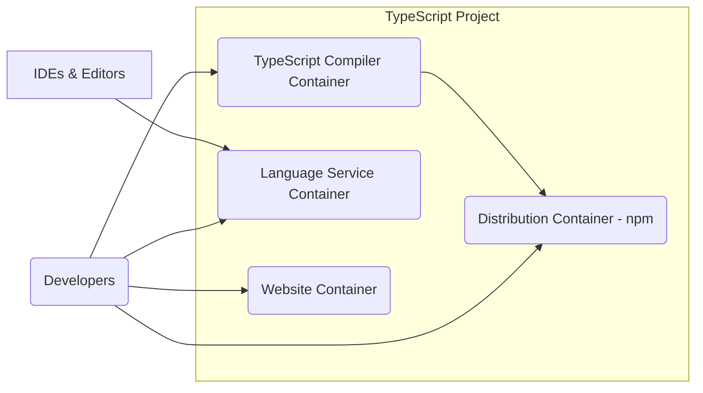
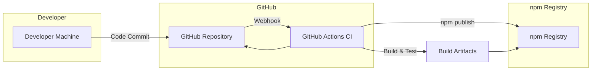

# BUSINESS POSTURE

The TypeScript project aims to enhance JavaScript development by providing a statically typed superset of JavaScript. It is designed to improve code quality, developer productivity, and maintainability of large JavaScript projects. TypeScript enables developers to catch errors early in the development cycle, improve code readability, and facilitate better collaboration.

Business Priorities:
- Enhance developer productivity and efficiency in JavaScript development.
- Improve the quality and maintainability of JavaScript codebases.
- Ensure seamless interoperability with existing JavaScript ecosystems and libraries.
- Promote wider adoption of TypeScript within the JavaScript development community.
- Maintain and evolve the TypeScript language and compiler to meet the changing needs of developers.

Business Risks:
- Adoption risk: If developers do not widely adopt TypeScript, the project may fail to achieve its goals.
- Security vulnerabilities in the TypeScript compiler or language service could negatively impact projects using TypeScript.
- Compatibility issues with existing JavaScript libraries or runtimes could hinder adoption and create friction for developers.
- Performance overhead introduced by the TypeScript compiler or runtime type checking could be a concern for some applications.
- Community fragmentation if the TypeScript project diverges significantly from JavaScript standards or community expectations.

# SECURITY POSTURE

Existing Security Controls:
- security control: Code hosted on GitHub, leveraging GitHub's security features for repository access control and vulnerability scanning. (Implemented: GitHub repository settings)
- security control: Open source project with public code review process, allowing community scrutiny for potential security issues. (Implemented: GitHub pull requests and issue tracking)
- security control: Usage of standard build tools and package management (npm) which have their own security considerations and best practices. (Implemented: package.json, build scripts)
- security control: Regular updates and maintenance of the TypeScript compiler and related tools, addressing reported security vulnerabilities. (Implemented: GitHub releases, issue tracking)
- accepted risk: Reliance on community contributions for security vulnerability identification and patching.
- accepted risk: Potential for supply chain vulnerabilities through dependencies in build and development tools.

Recommended Security Controls:
- security control: Implement automated Static Application Security Testing (SAST) tools in the CI/CD pipeline to detect potential vulnerabilities in the TypeScript compiler code.
- security control: Conduct regular security audits and penetration testing of the TypeScript compiler and related infrastructure.
- security control: Establish a clear vulnerability disclosure and response process for security issues reported by the community.
- security control: Implement Software Composition Analysis (SCA) to manage and monitor dependencies for known vulnerabilities.
- security control: Enforce code signing for published npm packages to ensure integrity and authenticity.

Security Requirements:
- Authentication: Not directly applicable to the TypeScript language or compiler itself. Authentication is relevant for access to the GitHub repository and related infrastructure, which is managed by GitHub and Microsoft.
- Authorization: Access to the TypeScript GitHub repository and related resources should be based on the principle of least privilege. Contribution and commit access should be carefully managed.
- Input Validation: The TypeScript compiler must perform robust input validation to prevent malicious code injection or denial-of-service attacks through crafted TypeScript code or compiler options. This is critical to ensure the compiler itself is secure and doesn't introduce vulnerabilities into compiled JavaScript code.
- Cryptography: Cryptography is not a core requirement for the TypeScript language or compiler itself. However, if TypeScript or related tools handle sensitive data (e.g., during build processes or in future features), appropriate cryptographic measures should be implemented. For now, focus on secure communication channels (HTTPS) for distribution and updates.

# DESIGN

## C4 CONTEXT

```mermaid
graph LR
    subgraph "TypeScript Project"
        TS(TypeScript Compiler)
    end
    Developers(Developers)
    JSRuntime[JavaScript Runtimes (Browsers, Node.js)]
    BuildTools[Build Tools (Webpack, Babel, esbuild)]
    IDEs[IDEs & Editors (VS Code, Sublime Text)]
    PackageManagers[Package Managers (npm, yarn, pnpm)]

    Developers --> TS
    TS --> JSRuntime
    TS --> BuildTools
    TS --> IDEs
    TS --> PackageManagers
    JSRuntime --> Developers
    BuildTools --> Developers
    IDEs --> Developers
    PackageManagers --> Developers
```

Context Diagram Elements:

- Element:
    - Name: Developers
    - Type: Person
    - Description: Software developers who use TypeScript to build applications.
    - Responsibilities: Write TypeScript code, use TypeScript compiler to transpile to JavaScript, integrate TypeScript into their development workflows.
    - Security controls: Follow secure coding practices, manage their development environments securely.

- Element:
    - Name: TypeScript Compiler
    - Type: Software System
    - Description: The core component of the TypeScript project, responsible for transpiling TypeScript code into JavaScript.
    - Responsibilities: Parse TypeScript code, perform type checking, transpile to JavaScript, provide language service features for IDEs.
    - Security controls: Input validation of TypeScript code, secure coding practices in compiler development, vulnerability scanning, secure build process.

- Element:
    - Name: JavaScript Runtimes (Browsers, Node.js)
    - Type: Software System
    - Description: Environments where the generated JavaScript code is executed.
    - Responsibilities: Execute JavaScript code, provide runtime APIs, interact with the operating system and hardware.
    - Security controls: Runtime environment security controls (browser security model, Node.js security best practices).

- Element:
    - Name: Build Tools (Webpack, Babel, esbuild)
    - Type: Software System
    - Description: Tools used to bundle, optimize, and further process the JavaScript output from the TypeScript compiler.
    - Responsibilities: Bundle JavaScript modules, perform code transformations, optimize code for deployment.
    - Security controls: Dependency management, secure configuration of build tools, vulnerability scanning of build tool dependencies.

- Element:
    - Name: IDEs & Editors (VS Code, Sublime Text)
    - Type: Software System
    - Description: Integrated Development Environments and code editors that provide TypeScript language support, leveraging the TypeScript Language Service.
    - Responsibilities: Provide code completion, error checking, refactoring, and debugging features for TypeScript developers.
    - Security controls: IDE security features, secure plugin management, secure communication with Language Service.

- Element:
    - Name: Package Managers (npm, yarn, pnpm)
    - Type: Software System
    - Description: Tools used to manage TypeScript and JavaScript dependencies, including installing the TypeScript compiler itself.
    - Responsibilities: Package installation, dependency resolution, package publishing.
    - Security controls: Package integrity checks, vulnerability scanning of dependencies, secure package publishing practices.

## C4 CONTAINER



Container Diagram Elements:

- Element:
    - Name: TypeScript Compiler Container
    - Type: Container - Executable
    - Description: Command-line interface (CLI) executable responsible for transpiling TypeScript code to JavaScript.
    - Responsibilities: Command-line argument parsing, TypeScript parsing, type checking, JavaScript code generation, emitting output files.
    - Security controls: Input validation of command-line arguments and TypeScript code, secure coding practices, SAST in build process.

- Element:
    - Name: Language Service Container
    - Type: Container - Library/Service
    - Description: Provides language intelligence features to IDEs and other tools, such as code completion, error checking, and refactoring.
    - Responsibilities: Expose APIs for code analysis, provide semantic information about TypeScript code, support IDE features.
    - Security controls: Secure API design, input validation of requests from IDEs, protection against denial-of-service attacks.

- Element:
    - Name: Website Container
    - Type: Container - Web Application
    - Description: The TypeScript website (typescriptlang.org) providing documentation, downloads, and community resources.
    - Responsibilities: Serve documentation, host playground, provide download links for TypeScript compiler, manage blog and community forums.
    - Security controls: Web application security best practices, HTTPS, input validation on website forms, protection against common web vulnerabilities (XSS, CSRF).

- Element:
    - Name: Distribution Container - npm
    - Type: Container - Package Registry
    - Description: npm registry where the TypeScript compiler and related packages are published and distributed.
    - Responsibilities: Host TypeScript packages, manage package versions, provide download access to packages.
    - Security controls: Package signing, vulnerability scanning of published packages, secure access control for publishing. (Note: npm registry security is primarily managed by npm, Inc., but TypeScript project is responsible for secure publishing practices).

## DEPLOYMENT

Deployment Architecture: npm Package Distribution

```mermaid
graph LR
    subgraph "Developer Workstation"
        Developer[Developer Machine]
        npmClient[npm Client]
    end
    subgraph "npm Registry"
        npmRegistryServer[npm Registry Server]
        PackageStorage[Package Storage]
    end
    subgraph "Build Infrastructure"
        BuildServer[Build Server (GitHub Actions)]
    end

    Developer --> npmClient
    npmClient -- "npm install typescript" --> npmRegistryServer
    npmRegistryServer --> PackageStorage
    BuildServer -- "npm publish" --> npmRegistryServer
    PackageStorage --> npmRegistryServer
```

Deployment Diagram Elements (npm Package Distribution):

- Element:
    - Name: Developer Machine
    - Type: Infrastructure - Workstation
    - Description: Developer's local computer used for development and installing TypeScript.
    - Responsibilities: Running npm client, installing and using TypeScript compiler, developing TypeScript code.
    - Security controls: Workstation security best practices, operating system security, antivirus software.

- Element:
    - Name: npm Client
    - Type: Software - Package Manager Client
    - Description: npm command-line tool used by developers to interact with the npm registry.
    - Responsibilities: Package installation, dependency management, interacting with npm registry API.
    - Security controls: HTTPS communication with npm registry, package integrity checks (checksums).

- Element:
    - Name: npm Registry Server
    - Type: Infrastructure - Server
    - Description: npm registry server managed by npm, Inc., hosting TypeScript packages.
    - Responsibilities: Package hosting, user authentication (for publishing), package metadata management, download serving.
    - Security controls: npm registry security controls (authentication, authorization, infrastructure security, vulnerability scanning).

- Element:
    - Name: Package Storage
    - Type: Infrastructure - Storage
    - Description: Storage backend for npm registry, holding package files.
    - Responsibilities: Secure storage of npm packages, providing access to packages for download.
    - Security controls: Access control, data encryption at rest, backup and recovery.

- Element:
    - Name: Build Server (GitHub Actions)
    - Type: Infrastructure - CI Server
    - Description: GitHub Actions environment used to build, test, and publish the TypeScript compiler.
    - Responsibilities: Automated build process, running tests, publishing packages to npm registry.
    - Security controls: Secure CI/CD pipeline, access control to CI environment, secrets management, secure publishing credentials.

## BUILD



Build Process:

1. Developer commits code changes to the GitHub Repository.
2. GitHub triggers a webhook to GitHub Actions upon code changes (e.g., push, pull request merge).
3. GitHub Actions CI pipeline is initiated.
4. GitHub Actions checks out the code from the GitHub Repository.
5. GitHub Actions performs build steps:
    - Install dependencies.
    - Compile TypeScript code.
    - Run unit tests and integration tests.
    - Perform static analysis and linting.
    - Potentially run SAST scanners.
6. If all checks pass, GitHub Actions builds release artifacts (npm packages).
7. GitHub Actions authenticates to npm registry using securely stored credentials.
8. GitHub Actions publishes the build artifacts (TypeScript packages) to the npm registry.

Build Security Controls:
- security control: Secure GitHub repository with access control and branch protection. (Implemented: GitHub repository settings)
- security control: Use of GitHub Actions for automated and reproducible builds. (Implemented: GitHub Actions workflows)
- security control: Secrets management in GitHub Actions to securely store npm publishing credentials. (Implemented: GitHub Actions secrets)
- security control: Automated testing (unit tests, integration tests) to ensure code quality and prevent regressions. (Implemented: Test suites in the repository, executed in CI)
- security control: Static analysis and linting tools to identify potential code quality and security issues. (Implemented: Linters and static analyzers in the build pipeline)
- security control: (Recommended) Integrate SAST tools into the build pipeline to automatically detect potential security vulnerabilities in the code.
- security control: (Recommended) Software Composition Analysis (SCA) to scan dependencies for known vulnerabilities during the build process.
- security control: (Recommended) Code signing of npm packages before publishing to ensure integrity and authenticity.

# RISK ASSESSMENT

Critical Business Processes:
- Providing a reliable and secure TypeScript compiler and language service to the developer community.
- Maintaining the integrity and availability of the TypeScript npm packages.
- Ensuring the ongoing development and evolution of the TypeScript language.

Data to Protect:
- TypeScript source code: Intellectual property, vulnerabilities in source code could lead to compiler vulnerabilities. Sensitivity: High.
- Build artifacts (npm packages): Integrity and authenticity are crucial to prevent supply chain attacks. Sensitivity: High.
- Website content and documentation: Publicly available, but integrity and availability are important for user trust. Sensitivity: Medium.
- Developer credentials and secrets used in the build and publishing process: Confidentiality is critical to prevent unauthorized package publishing or access to internal systems. Sensitivity: High.

Data Sensitivity:
- TypeScript source code: Highly sensitive (Intellectual Property, potential vulnerabilities).
- Build artifacts (npm packages): Highly sensitive (Integrity, supply chain security).
- Website content: Medium sensitivity (Public information, brand reputation).
- Developer credentials/secrets: Highly sensitive (Confidentiality, access control).

# QUESTIONS & ASSUMPTIONS

Questions:
- What SAST and SCA tools are currently used in the TypeScript build pipeline, if any?
- Is code signing currently implemented for published npm packages?
- What is the vulnerability disclosure and response process for TypeScript?
- Are regular security audits or penetration testing conducted on the TypeScript compiler and infrastructure?
- What specific input validation measures are in place within the TypeScript compiler to prevent malicious code injection or denial-of-service attacks?

Assumptions:
- The TypeScript project prioritizes the security and reliability of the compiler and language service.
- Secure coding practices are followed by the TypeScript development team.
- Standard security measures are in place for the GitHub repository and related infrastructure.
- The npm registry is considered a trusted platform for package distribution, and the project relies on npm's security measures to some extent.
- The primary deployment method for the TypeScript compiler is through npm packages.